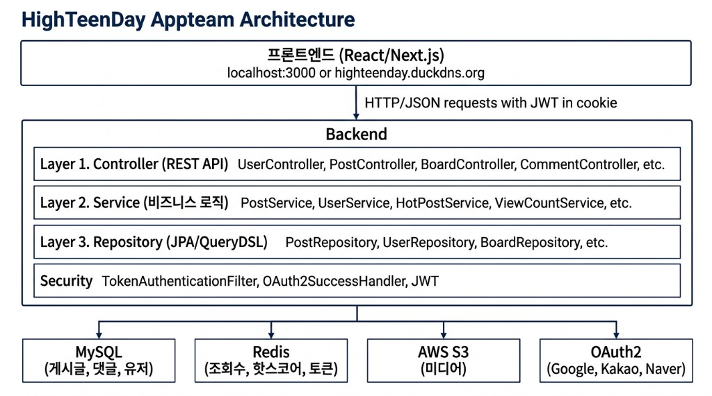
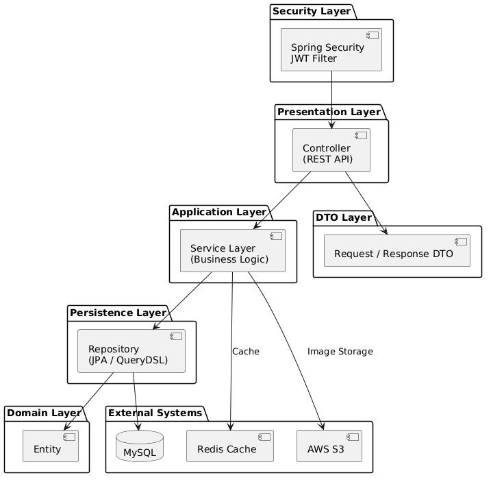
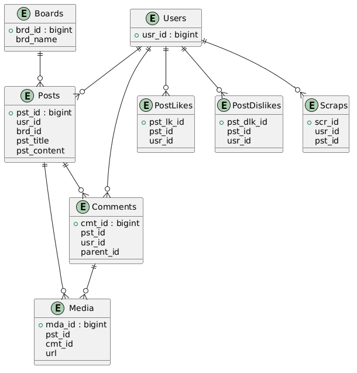
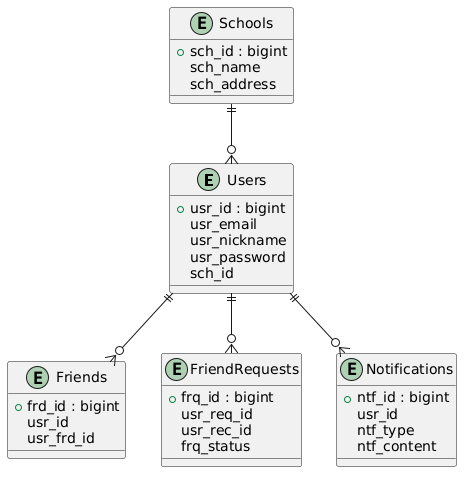
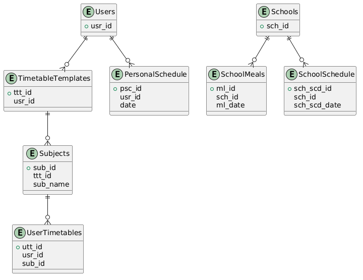
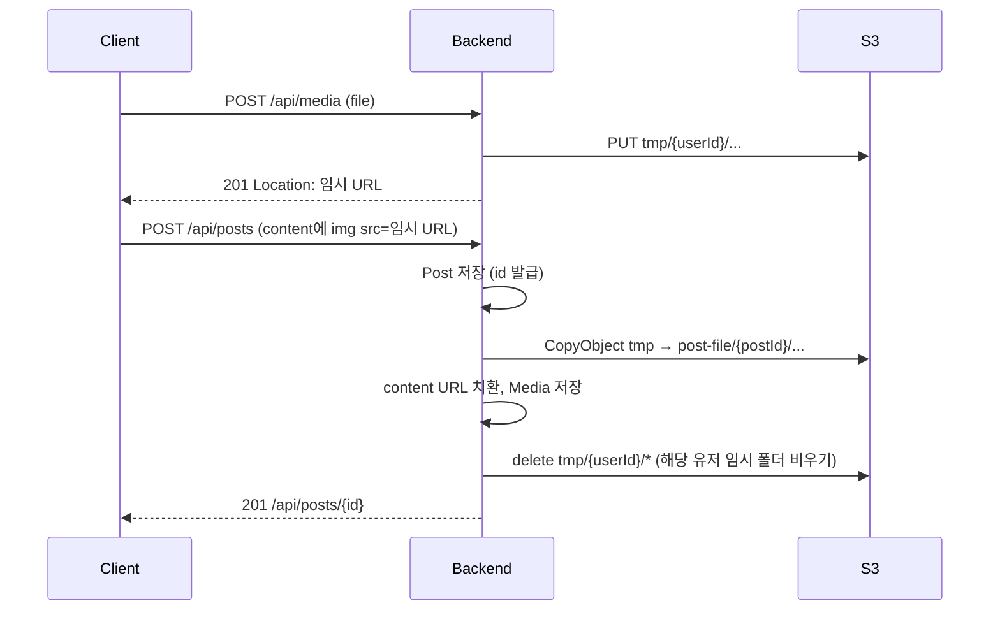

# HighTeenDay Backend

10대 학생들을 위한 익명 커뮤니티 플랫폼의 백엔드 서버입니다.  
게시판, 댓글, 좋아요, 친구, 시간표, 급식 조회, 핫게시글 랭킹 등 학교생활에 필요한 기능을 제공합니다.

---

## 기술 스택

| 분류 | 기술 |
|------|------|
| Framework | Spring Boot 3.4, Java 17 |
| ORM / Query | Spring Data JPA, QueryDSL 5.0 |
| DB | MySQL 8 |
| Cache | Redis (Spring Data Redis) |
| Auth | OAuth2 (Google, Kakao, Naver) + JWT |
| Storage | AWS S3 |
| Load Test | k6 |
| Docs | Springdoc OpenAPI (Swagger UI) |
| CI/CD | GitHub Actions → EC2 (PM2) |

---

## 아키텍처

### 시스템 아키텍처



### 배포 아키텍처

```
[Client]
   │ HTTPS
   ▼
[EC2 (Ubuntu)]
   ├─ PM2 → java -jar highteenday-backend.jar  (프로세스 관리 / 자동 재시작)
   ├─ MySQL 8 (로컬)
   └─ Redis (로컬)
         │
         ▼
      [AWS S3]  (이미지 / 미디어 파일)
```

- `application.properties`는 `.gitignore` 처리되어 서버에만 존재
- PM2가 프로세스 관리 및 자동 재시작 담당

### 백엔드 레이어 아키텍처



---

## 데이터 설계 (ERD)

### Post Domain

게시글, 댓글, 반응(좋아요/싫어요), 스크랩, 미디어를 포함하는 핵심 도메인입니다.



- `Post`에 `likeCount`, `viewCount`, `commentCount`를 비정규화하여 목록 조회 시 JOIN 제거
- `Post.nickname`을 비정규화하여 User 테이블 JOIN 없이 작성자 표시
- `Comment`는 `parent_id` 자기참조로 대댓글 구현
- `BaseEntity`의 `is_valid` 컬럼으로 Soft Delete 구현

### User / Friend Domain

소셜 로그인 기반 사용자와 친구 관계를 관리합니다.



- OAuth2 Provider(Google, Kakao, Naver) + Role(GUEST, USER) 구분
- `FriendRequests`의 `frq_status`로 요청/수락/거절 상태 관리
- `Token` 엔티티로 Refresh Token 관리, Access Token은 HttpOnly Cookie로 전달

### School Domain

학교, 급식, 시간표 관련 데이터를 관리합니다.



- 급식 데이터는 매월 말일 스케줄러로 NEIS API에서 자동 수집
- 시간표는 사용자별 템플릿 → 과목 → 요일/교시 매핑 구조

---

## 핵심 기능

### OAuth2 소셜 로그인

Google, Kakao, Naver 3사 OAuth2 로그인을 지원합니다.

```
1. /oauth2/authorization/{provider} → OAuth2 인증 페이지 리다이렉트
2. 콜백 → CustomOAuth2UserService.loadUser()
3. 신규 유저: ROLE_GUEST → /register 리다이렉트
   기존 유저: ROLE_USER → Access/Refresh Token 발급
4. Access Token → HttpOnly Cookie (SameSite=None, Secure)
5. 이후 요청: TokenAuthenticationFilter가 쿠키에서 JWT 추출 → SecurityContext 설정
```

자세한 내용:https://janghyeok.tistory.com/39

### 게시글 조회 (Redis 조회수 캐싱)

조회수를 DB에 바로 반영하면 인기 게시글에 write 부하가 집중되므로, Redis를 버퍼로 활용합니다.

```
사용자 조회 → Redis SETNX viewed:{postId}:{userId} (중복 방지, 1h TTL)
           → Redis INCR post:views:{postId}

ViewCountScheduler (60초 주기)
           → KEYS post:views:* 스캔
           → DB에 누적값 일괄 UPDATE
           → Redis 키 삭제
```

### 게시글 작성 (S3 이미지 업로드)

게시글 **생성 API는 이미지 파일을 받지 않습니다.** 클라이언트는 먼저 이미지를 업로드해 URL을 받은 뒤, HTML 본문(``)에 넣어 `POST /api/posts`로 보냅니다. 서버는 저장된 본문에서 이미지 URL을 파싱해 **임시 객체를 영구 경로로 복사**하고, 본문 문자열의 URL을 치환합니다.

#### API 역할

| 단계 | 메서드 · 경로 | 설명 |
|------|----------------|------|
| ① 이미지 업로드 | `POST /api/media` (multipart) | S3 `tmp/{userId}/{UUID}-{파일명}` 에 저장, 응답 **`Location`** 에 임시 URL |
| ② 게시글 작성 | `POST /api/posts` (JSON) | `title`, `content`(HTML) 만 전달 — 본문 안에 ①의 URL 포함 |

#### 엔드투엔드 흐름



#### 서버 처리 순서 (`PostMediaService`)

1. **Jsoup**으로 `content` 내 모든 `` URL 수집  
2. 각 URL에 대해 **같은 버킷 내 `CopyObject`**: 임시 키 → `post-file/{postId}/` 아래 영구 키  
3. 복사된 객체 메타로 **`medias` 행** 생성 후 게시글과 연결  
4. 본문 문자열에서 **임시 URL → 영구 URL** 치환 후 `Post.content` 갱신  
5. 해당 유저 **`tmp/{userId}/` 접두 객체 일괄 삭제**

#### S3 키 규칙 (요약)

| 구분 | 키 패턴 |
|------|---------|
| 임시 업로드 | `tmp/{userId}/{UUID}-{원본파일명}` |
| 게시글 확정 | `post-file/{postId}/` + (임시 키에서 `tmp` 접두 제거 후 경로) |

#### 게시글 수정 시

- 신규 본문·기존 본문에서 각각 img URL 목록을 뽑아 **추가분만** `CopyObject` + Media  
- **기존에만 있던 URL**은 S3 객체 삭제  
- 이미지가 하나도 없는 수정이면 본문만 갱신

### 핫게시글 시스템

Redis Sorted Set 기반 실시간 인기 게시글 랭킹 시스템입니다.

스코어 계산 방식은 용도에 따라 두 가지로 나뉩니다.

**최신 핫게시글** (`calculateRecentHotScore`)
```
score = sign × log₁₀(max(|weighted_sum|, 1))
weighted_sum = 5×좋아요 − 1×싫어요 + 2×스크랩 + 3×댓글 + 1×조회수
```

**일간 핫게시글** (`calculateDailyHotScore`) — 시간 감쇠 적용
```
score = sign × log₁₀(max(|weighted_sum|, 1)) / (경과시간 + 2)^1.5
weighted_sum = 5×좋아요 − 2×싫어요 + 2×스크랩 + 3×댓글 + 1×조회수
```

- **로그 스케일**: 좋아요 0→10의 영향이 10→100보다 크게 반영되어 초기 반응이 중요
- **시간 감쇠**: 오래된 글일수록 점수가 낮아져 최신 글 우대
- **일간 핫게시글**: 상위 10개 노출 (좋아요 ≥ 10 필터)
- **Redis ZSET**: `ZREVRANGE`로 O(log N + K) 시간에 상위 K개 조회
- **스케줄러**: 1분 주기로 전체 게시글 스코어 갱신

---

## ⚡ 트러블슈팅

### 좋아요/싫어요 카운트 동시성 문제

#### 📌 문제
게시글 조회 성능을 위해 like/dislike 수를 비정규화 컬럼으로 관리하던 중,
동시 요청 환경에서 데이터 정합성이 깨지는 문제가 발생했다.

- 100명의 유저가 동시에 좋아요/싫어요 요청
- 실제 데이터와 카운트 값 불일치 (drift 발생)

---

#### 🧩 원인
여러 트랜잭션이 동시에 동일 row를 읽고 업데이트하면서 **lost update** 발생

---

#### 🔧 해결 시도 및 결과

| 방식 | 정합성 | 실패율 | 처리량 | p95 |
|------|--------|--------|--------|------|
| 락 없음 | ❌ | 1.68% | **205/s** | 579ms |
| 낙관적 락 | ✅ | ❌ 79% | 81/s | 1.3s |
| 비관적 락 | ✅ | ✅ 0% | 68/s | 951ms |

- 낙관적 락: 정합성은 유지되나 충돌 시 실패율 급증 → 재시도 필요
- 비관적 락: 정합성 완벽하지만 처리량 감소 및 응답 지연

---

#### 🎯 최종 선택
락을 적용하지 않는 방식 선택 (성능 우선)

- 좋아요/싫어요는 강한 정합성이 필수적인 데이터가 아님
- 일부 오차는 허용 가능
- 주기적 동기화(sync)로 정합성 보완

---

#### 🚀 개선 방향
- 낙관적 락 + retry 전략
- Redis 기반 캐싱 후 비동기 반영 (eventual consistency)

자세한 내용:https://janghyeok.tistory.com/38

---

##  성능 개선 경험

단순 CRUD 수준을 넘어, 실제 서비스 상황을 가정하고 트래픽을 발생시켜 병목을 분석하여 성능을 개선했습니다. 
k6를 활용한 부하 테스트 기반으로 개선 전후를 검증했습니다.

---

### 1. N+1 문제 해결

#### 📌 문제
게시글 10개 조회 시 작성자 닉네임, 게시판 ID를 가져오기 위해 `User`, `Board` 테이블을 각각 지연 로딩 → 페이지당 최대 20번 추가 쿼리 발생

#### 🔧 해결
Fetch Join을 적용하여 단일 쿼리로 조회

#### 📊 결과
| 지표 | 개선 전 | 개선 후 | 개선율 |
|------|--------|--------|--------|
| P95 | 119ms | 73ms | ⬇️ 38% |
| 평균 | 28ms | 17ms | ⬇️ 39% |
| 처리량 | 1982 req/s | 2160 req/s | ⬆️ 9% |

#### ⚖️ Trade-off
- 1:N 관계에서 데이터 중복으로 메모리 사용량 증가 가능

자세한 내용:https://janghyeok.tistory.com/31

---

### 2. 인덱싱 최적화


#### 2-1. 특정 게시판의 삭제되지 않은 게시글 최신순 조회
#### 📌 문제
정렬 + 필터 조건(ex: brd_id=1 && is_valid=1 && created_at DESC)에서 인덱스를 활용하지 못해 FileSort 발생 
→ 불필요한 정렬 비용 증가 + 응답속도 저하

#### 🔧 해결
-(brd_id, is_valid, pst_id) 복합 인덱스 추가
- 복합 인덱스는 brd_id, is_valid, pst_id 순서로 구성하여
정렬과 필터 조건 모두에서 효율적으로 사용 가능

=>id 기준 내림차순 정렬 시 FileSort 발생과 모든 행을 순회하며 is_valid로 필터링하는 비용을 제거


#### 📊 결과
| 지표 | 인덱스 없음 | 인덱스 적용 | 개선율 |
|------|------------|------------|--------|
| avg | 99ms | 78ms | ⬇️ 21% |
| P95 | 421ms | 314ms | ⬇️ 25% |
| 처리량 | 1275 req/s | 1429 req/s | ⬆️ 12% |

#### 💡 인사이트
- 정렬 컬럼까지 포함된 복합 인덱스가 성능에 큰 영향
- 복합 인덱스는 prefix 특성을 가지므로 
(brd_id), (brd_id, is_valid), (brd_id, is_valid, pst_id) 조건에서 모두 활용 가능
- 복합 인덱스의 prefix 특성으로 기존 단일 인덱스(brd_id)를 대체할 수 있으나,
  쿼리 패턴에 따라 유지 여부를 판단해야 함


#### ⚖️ Trade-off
- 인덱스 증가로 쓰기 성능 저하 및 저장 공간 증가

자세한 내용:https://janghyeok.tistory.com/32

---

### 2-2. 좋아요/조회수 정렬 성능 개선

#### 📌 문제
랜덤 페이지로 인한 OFFSET방식 + 좋아요순 조회순 정렬 조합으로 인해 
대용량 데이터에서 Full Scan 발생 → 응답 30초 이상되는 문제 발생

#### 🔧 해결
like_count, view_count 에도 복합 인덱스 추가.

#### 📊 결과
| 지표 | 개선 전 | 개선 후 |
|------|--------|--------|
| avg | 15s+ | 2.2s |
| P95 | 30s+ | 5.7s |

#### 💡 인사이트
- OFFSET 방식 + 정렬 + 대용량 데이터 조합은 최악의 성능을 초래하며,
적절한 인덱스 없이는 실서비스 운영이 사실상 불가능.

#### ⚖️ Trade-off
- like_count, view_count는 자주 갱신되는 컬럼이므로,
인덱스 추가 시 매번 인덱스도 갱신 → 쓰기 성능 및 I/O 증가
- 그러나 인덱스 없이는 대용량 랜덤 페이지 조회 시 서비스 마비 수준의 성능 저하 발생

---

### 3. 커서 기반 페이징

#### 📌 문제
OFFSET 기반 페이징은 페이지가 뒤로 갈수록 성능 저하

#### 🔧 해결
id 기반 커서 페이징 적용

#### 📊 결과
| 지표 | 기존 | 커서 |
|------|------|------|
| avg | 42ms | 11ms |
| P95 | 212ms | 32ms |


#### 💡 인사이트
- OFFSET 방식은 처음부터 원하는 데이터가 있는 위치까지 모든 행을 스캔하고,
앞쪽의 불필요한 행을 버리는 비효율이 발생함

#### ⚖️ Trade-off
- 특정 페이지로 직접 이동 불가

=> 이전/다음 페이지 조회의 경우엔 커서, 그 외에는 오프셋 방식을 혼합하여 사용.

#### ⚠️ 한계
- 커서 + 오프셋 혼합 사용 시, 뒤쪽 페이지에서 오프셋 요청이 들어오면 여전히 수만~수십만 건 데이터 스캔 발생
- 실제 사용자가 이런 뒤 페이지를 조회할 가능성은 낮아 현재 하이브리드 방식 유지
- 다만, 악의적 트래픽 공격이 들어오면 심각한 성능 문제가 발생할 수 있음


자세한 내용:https://janghyeok.tistory.com/35

---

### 4. 캐싱 전략 적용

#### 📌 문제
게시판 목록 + 게시글 목록 + total count 조회시 반복 쿼리로 병목 발생 

#### 🔧 해결
Redis 기반 캐싱 적용
- 게시판 목록
- 게시글 목록
- total count

#### 📊 결과
| 단계 | avg | P95 |
|------|-----|-----|
| 캐싱 없음 | 2.22s | 5.72s |
| 게시판 목록+게시글목록만 캐싱 | 1.63s | 3.57s |
| count도 캐싱 | 19ms | 96ms |

#### 💡 인사이트
- count 쿼리가 주요 병목 지점
-예상과는 다르게 게시글 목록에 대한 캐싱보다 집계함수인 count에 대한 캐싱이 더 극적인 성능개선을 보임.

#### ⚖️ Trade-off
데이터 정합성 문제 
- 게시글 생성/수정/삭제 시 Redis도 함께 업데이트해야 하므로 쓰기 비용 및 구현 복잡도 증가

=> 그러나 대용량 트래픽 환경에서 서비스 안정성을 위해, 자주 조회되는 데이터에 대해 캐싱 적용 결정


자세한 내용:https://janghyeok.tistory.com/36

---

## API 엔드포인트

| 도메인 | 경로 | 주요 기능 |
|--------|------|-----------|
| 인증 | `/api/user/*` | OAuth2 로그인, 회원가입, 프로필 수정 |
| 게시판 | `/api/boards` | 게시판 목록 |
| 게시글 목록 | `/api/boards/{boardId}/posts` | 페이징 조회 (캐시, 커서, 정렬) |
| 게시글 | `/api/posts` | CRUD, 검색 |
| 댓글 | `/api/posts/{postId}/comments` | CRUD (대댓글 지원) |
| 반응 | `/api/posts/{postId}/like, dislike` | 좋아요/싫어요 토글 |
| 스크랩 | `/api/posts/{postId}/scraps` | 스크랩 토글 |
| 핫게시글 | `/api/hotposts/daily` | 일간 인기글 TOP 10 |
| 마이페이지 | `/api/mypage/*` | 내 글, 댓글, 스크랩 |
| 친구 | `/api/friends/*` | 친구 요청/수락/차단 |
| 학교 | `/api/schools/*` | 학교 검색, 급식 조회 |
| 시간표 | `/api/timetableTemplates/*` | 시간표 템플릿 CRUD |
| 미디어 | `/api/media` | 이미지 업로드 (S3) |

---

## 실행 방법

### 필요 환경
- Java 17+
- MySQL 8
- Redis

### 실행

```bash
./gradlew build
java -jar build/libs/highteenday-backend-0.0.1-SNAPSHOT.jar
```

### 부하 테스트

```bash
k6 run load-tests/k6-board-posts.js
```

### 환경 설정

`src/main/resources/application.properties`에 아래 항목을 설정합니다.

```properties
spring.datasource.url=jdbc:mysql://localhost:3306/highteenday
spring.datasource.username=
spring.datasource.password=

spring.data.redis.host=localhost
spring.data.redis.port=6379

jwt.secret=
jwt.access-token-expiration=
jwt.refresh-token-expiration=

spring.security.oauth2.client.registration.google.client-id=
spring.security.oauth2.client.registration.google.client-secret=

cloud.aws.s3.bucket=
cloud.aws.credentials.access-key=
cloud.aws.credentials.secret-key=
cloud.aws.region.static=
```
