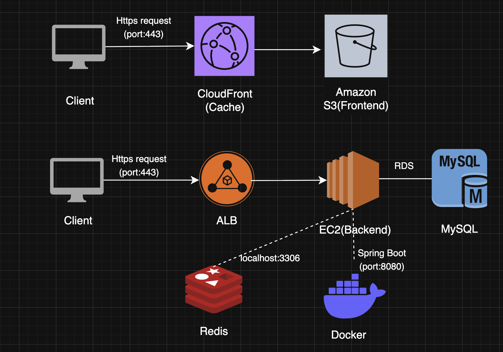
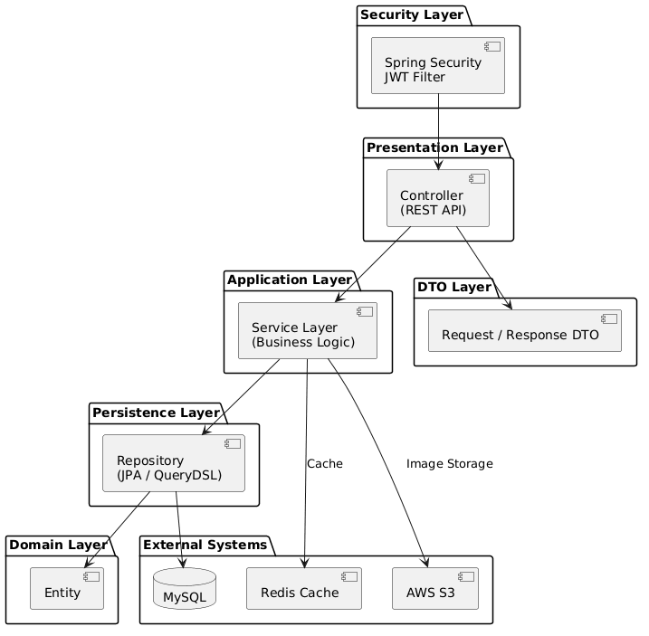
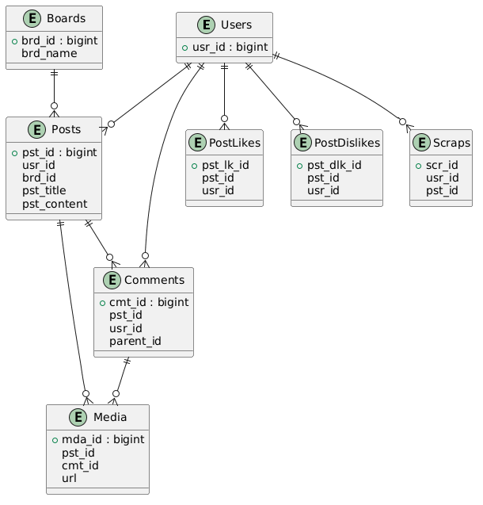
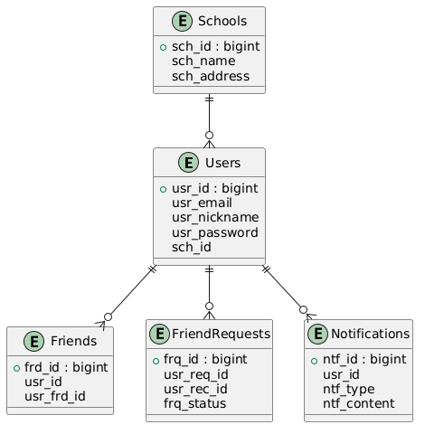
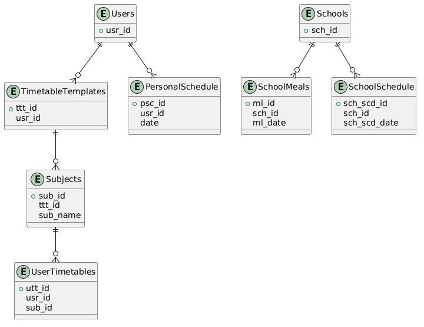
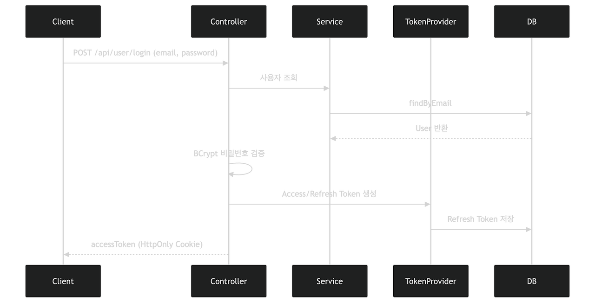
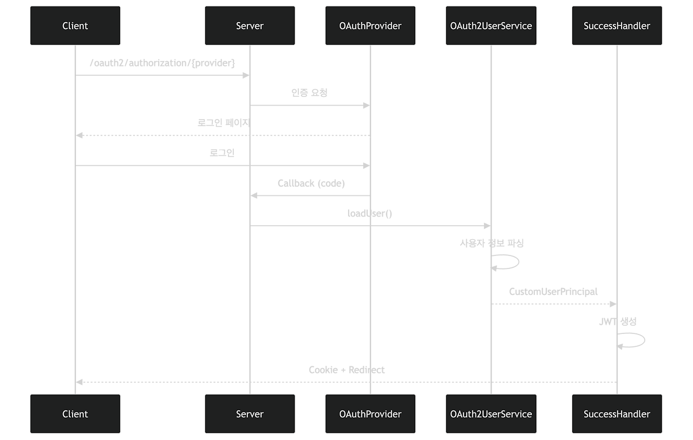
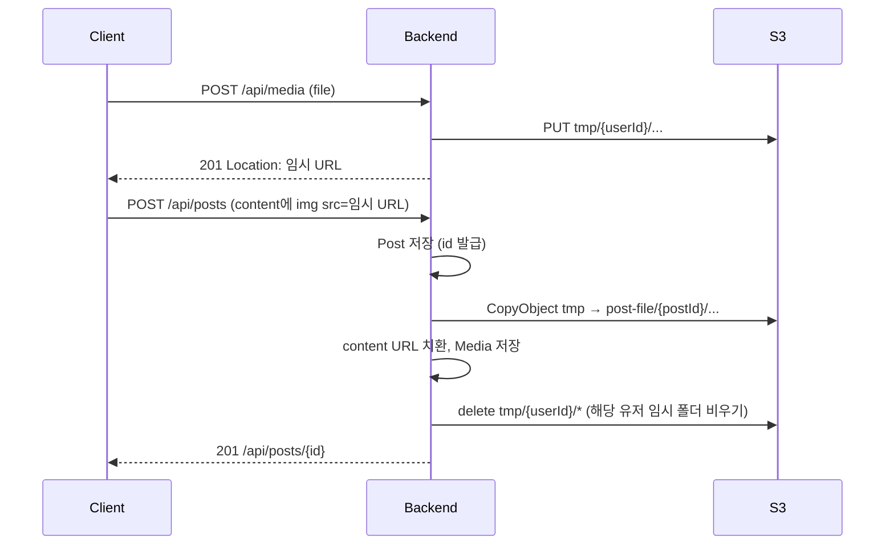

# HighTeenDay Backend

하이틴데이는 고등학생을 위한 익명 커뮤니티 플랫폼입니다.

학교에서 무슨 일이 일어나고 있는지,  
어떤 이슈가 돌고 있는지 빠르게 알 수 있는 방법은 거의 없습니다.  
또한 익명으로 자유롭게 의견을 나눌 수 있는 공간도 부족합니다.

하이틴데이는 이러한 문제를 해결하기 위해 만들어졌습니다.

사용자는 익명으로 글을 작성하고 반응을 남기며,  
핫게시글 시스템을 통해 지금 가장 뜨거운 이슈를 실시간으로 확인할 수 있습니다.  
또한 관심 있는 사용자와 연결되어 대화를 이어갈 수 있습니다.

단순한 게시판이 아닌,  
학생들 사이에서 실제로 정보가 흐르고 이슈가 형성되는 구조를 목표로 합니다.

---

## 문서 안내

이 README는 프로젝트의 진입점입니다. 처음 접하는 개발자는 아래 순서로 읽으면 됩니다.

| 목적 | 문서 |
|------|------|
| **로컬에서 바로 실행해보기** | [docs/00-quickstart.md](docs/00-quickstart.md) — 클론부터 첫 로그인까지 |
| **코드베이스 전체 이해** | [docs/INDEX.md](docs/INDEX.md) — 온보딩 문서 체계의 목차 (아키텍처, 도메인별 심층, 운영, ADR) |
| **알려진 결함·문서-코드 불일치** | [docs/KNOWN-ISSUES.md](docs/KNOWN-ISSUES.md) — 코드를 읽고 확인한 결함의 단일 목록 |
| **성능 테스트·병목 분석** | [performance/README.md](performance/README.md) — k6 부하 테스트와 자체 측정 시스템 |
| **DB 스키마 변경 방법** | [docs/MIGRATION.md](docs/MIGRATION.md) — Flyway 마이그레이션 절차 |

모든 온보딩 문서는 실제 코드를 읽고 검증한 내용만 담으며, 문서와 코드가 어긋나는 부분은
본문에 숨기지 않고 KNOWN-ISSUES에 번호(KI-nn)로 기록하는 규칙을 따릅니다.

---

## 주요 기능

| 기능 | 설명 |
|------|------|
| 익명 게시판 | 게시글 작성·수정·삭제, 댓글·대댓글, 좋아요·싫어요, 스크랩 |
| 소셜 로그인 | Google OAuth2 + JWT (Access/Refresh Token) — Kakao/Naver는 엔드포인트만 준비된 상태 |
| 핫게시글 랭킹 | Redis Sorted Set 기반 일간 인기글 랭킹 |
| 친구 | 친구 요청·수락·거절·차단 |
| 학교 정보 | 급식 조회 (NEIS API), 시간표 템플릿 관리 |
| 이미지 업로드 | S3 기반 이미지 업로드 (임시 저장 → 게시글 확정 시 영구 이동) |
| 단체 채팅 | STOMP WebSocket 기반 채팅 (1:1, 그룹, 학교/학년 단위) |

---

## 기술 스택

| 분류 | 기술 |
|------|------|
| Framework | Spring Boot 3.4, Java 17 |
| ORM / Query | Spring Data JPA, QueryDSL 5.0 |
| DB | MySQL 8 |
| DB Migration | Flyway (`src/main/resources/db/migration/`) |
| Cache | Redis (Spring Data Redis) |
| Auth | OAuth2 (Google) + JWT |
| Storage | AWS S3 |
| Load Test | k6 + 자체 측정 시스템 ([performance/](performance/README.md)) |
| Observability | Spring Actuator + Micrometer → Prometheus/Grafana |
| Docs | Springdoc OpenAPI (Swagger UI) |
| CI/CD | GitHub Actions → ECR → EC2 (Docker Compose) |

---

## 아키텍처

### 전체 아키텍처



#### S3 + CloudFront
- 정적 파일 CDN 배포
- 빠른 응답 + HTTPS 지원

#### ALB
- HTTPS 처리 및 로드밸런싱
- 확장성 확보

#### Docker
- 환경 일관성
- 롤백 용이

#### CI/CD

git push → GitHub Actions → Docker 이미지 빌드 → ECR push → EC2에서 `docker compose up`
(`.github/workflows/deploy.yml`)

### 백엔드 레이어 아키텍처



이 프로젝트는 전통적인 계층형 아키텍처를 기반으로 구성하되,
Redis, S3 같은 외부 인프라에 서비스 로직이 직접 결합되지 않도록
일부 영역에 Port/Adapter 패턴을 적용했습니다.

- Controller → 요청/응답 처리
- Service → 비즈니스 로직 및 트랜잭션 관리
- Domain → Entity / Repository / Value Object / Port 인터페이스
- Infrastructure → Redis, S3, QueryDSL 구현 (Adapter)

예를 들어 조회수 버퍼는 `domain/port/ViewCountStorePort` 인터페이스를
`infrastructure/redis/RedisViewCountStore`가 구현하는 구조라,
서비스 계층은 Redis라는 구현 기술을 알지 못합니다.

조회수 캐싱, 핫게시글 랭킹, 토큰 관리처럼
트래픽과 성능 영향을 크게 받는 기능들을
가용성과 성능을 우선하는 방향으로 설계했습니다.

자세한 구조는 [docs/02-architecture.md](docs/02-architecture.md) 참고.

### Event-driven architecture

댓글 생성, 좋아요, 스크랩 등의 행동 이후 발생하는 부가 작업은
Spring Event 기반으로 분리했습니다.

예:
- 댓글 생성 → 알림 생성
- 댓글/좋아요/스크랩 → 핫게시글 점수 갱신

`@TransactionalEventListener(AFTER_COMMIT)`을 사용하여
원본 트랜잭션이 성공적으로 커밋된 이후에만 후속 작업이 실행되도록 구성했습니다.

이를 통해:
- 댓글 서비스가 알림 시스템에 직접 의존하지 않음
- 부가 기능 실패가 핵심 기능 rollback으로 이어지지 않음
- 새로운 부가 기능 추가 시 결합도 증가 방지

구조를 얻을 수 있었습니다.

이벤트 7종의 전수 목록은 [docs/crosscutting/transactions-events.md](docs/crosscutting/transactions-events.md) 참고.

---

## 데이터 설계 (ERD)

스키마는 Flyway 마이그레이션(`src/main/resources/db/migration/`)이 소유합니다.
엔티티를 수정해도 컬럼이 자동으로 생기지 않으며, 변경 절차는 [docs/MIGRATION.md](docs/MIGRATION.md)를 따릅니다.

### Post Domain

게시글, 댓글, 반응(좋아요/싫어요), 스크랩, 미디어를 포함하는 핵심 도메인입니다.



- `Post`에 `likeCount`, `viewCount`, `commentCount`를 비정규화하여 목록 조회 시 JOIN 제거
- `Post.nickname`을 비정규화하여 User 테이블 JOIN 없이 작성자 표시
- `Comment`는 `parent_id` 자기참조로 대댓글 구현
- `BaseEntity`의 `is_valid` 컬럼으로 Soft Delete 구현
- `scraps`는 `UNIQUE(USR_id, PST_id)` 제약으로 동시 토글의 중복 행 생성을 DB 레벨에서 차단

### User / Friend Domain

소셜 로그인 기반 사용자와 친구 관계를 관리합니다.



- OAuth2 Provider(Google) 기반 사용자 등록
- `FriendRequests`의 `frq_status`로 요청/수락/거절 상태 관리 — 처리된 요청은 soft delete로 이력 보존
- `Token` 엔티티(`tokens` 테이블)로 Refresh Token 관리, Access Token은 HttpOnly Cookie로 전달

### School Domain

학교, 급식, 시간표 관련 데이터를 관리합니다.



- 급식 데이터는 매월 1일 00:00 스케줄러가 NEIS API에서 당월 데이터를 수집 (`schedulers/SchoolMealScheduler`)
- 시간표는 사용자별 템플릿 → 과목 → 요일/교시 매핑 구조

상세 데이터 모델과 명명 규칙: [docs/05-data-model.md](docs/05-data-model.md)

---

## 핵심 기능

### 인증 / 인가 (OAuth2 + JWT)

Google OAuth2 로그인과 이메일/비밀번호 일반 로그인을 지원합니다.

#### 일반로그인 흐름


```
POST /api/user/login

→ 이메일 + 비밀번호 검증 (BCrypt)

→ CustomUserPrincipal 생성

→ JWT 발급 (accessToken HttpOnly 쿠키)
```

#### 소셜로그인

```
→ OAuth2 인증 서버 리다이렉트

→ 콜백 (/oauth2/login/code/{provider}) → CustomOAuth2UserService.loadUser()
   신규 사용자는 여기서 자동 등록되고 principal에 isNewUser 플래그가 실린다

→ OAuth2SuccessHandler → JWT 발급
   isNewUser면 {frontend}/welcome, 기존 사용자면 {frontend}로 리다이렉트
```

필터체인

```
요청 → [TokenExceptionFilter]
         → [TokenAuthenticationFilter]  ← 쿠키에서 JWT 추출 → SecurityContext 설정
            → [ExceptionTranslationFilter]
               → Controller
```

#### 토큰 구조

| | Access Token | Refresh Token |
|---|---|---|
| 유효기간 | 30분 | 7일 |
| 쿠키 Path | `/` | `/api/token/refresh` |
| 저장 위치 | Cookie only | Cookie + DB (`tokens` 테이블) + Redis 캐시 |
| 서명 알고리즘 | HMAC-SHA512 |  HMAC-SHA512 |

- JWT Payload: `sub`(이메일), `role`, `name`, `provider`
- Access Token 만료 시 → `POST /api/token/refresh` 호출 → 두 토큰 모두 재발급 (Token Rotation)
- DB에 저장된 Refresh Token이 없으면 재발급 거부 (강제 로그아웃 지원)

#### 쿠키 설정 (Prod)

```
HttpOnly; Secure; SameSite=None; Domain=.highteenday.org
```

#### Role

| Role | 설명 |
|---|---|
| `ROLE_USER` | 일반 인증 사용자 |
| `ROLE_ADMIN` | 관리자 (enum에 정의되어 있으나 현재 부여 경로 없음) |
| `ROLE_GUEST` | 과거 신규 OAuth2 사용자 표식 — `isNewUser` 플래그로 대체되어 현재 사용 경로 없음 |

인증 전 구간 상세: [docs/domains/auth.md](docs/domains/auth.md), 엔드포인트×인가 전수 표: [docs/crosscutting/security.md](docs/crosscutting/security.md)

자세한 내용: https://janghyeok.tistory.com/39

### 게시글 조회 (Redis 조회수 캐싱)

조회수를 DB에 바로 반영하면 인기 게시글에 write 부하가 집중되므로, Redis를 버퍼로 활용합니다.

```
사용자 조회 → Redis SETNX viewed:{postId}:{userId} (중복 방지, 1h TTL)
           → Redis INCR post:views:{postId}

ViewCountScheduler (60초 주기, fixedDelay)
           → KEYS post:views:* 로 대기 중인 카운터 키 목록 조회
           → 키마다 GETDEL로 값을 꺼내며 삭제
           → 게시글별로 DB에 누적값 UPDATE + 핫스코어 갱신
```

Redis 장애 시에도 조회 자체는 동작하도록 `@ResilientRedis` AOP로 감싸 실패를 격리합니다.
설계 배경: [docs/adr/adr-002-viewcount-redis-buffer.md](docs/adr/adr-002-viewcount-redis-buffer.md)

### 게시글 작성 (S3 이미지 업로드)

게시글 **생성 API는 이미지 파일을 받지 않습니다.** 클라이언트는 먼저 이미지를 업로드해 URL을 받은 뒤, HTML 본문(``)에 넣어 `POST /api/posts`로 보냅니다. 서버는 저장된 본문에서 이미지 URL을 파싱해 **임시 객체를 영구 경로로 복사**하고, 본문 문자열의 URL을 치환합니다.

#### API 역할

| 단계 | 메서드 · 경로 | 설명 |
|------|----------------|------|
| ① 이미지 업로드 | `POST /api/media` (multipart) | S3 `tmp/{userId}/{UUID}-{파일명}` 에 저장, 응답 **`Location`** 에 임시 URL |
| ② 게시글 작성 | `POST /api/posts` (JSON) | `title`, `content`(HTML) 만 전달 — 본문 안에 ①의 URL 포함 |

#### 엔드투엔드 흐름


```mermaid
sequenceDiagram
    participant C as Client
    participant API as Backend
    participant S3 as S3

    C->>API: POST /api/media (file)
    API->>S3: PUT tmp/{userId}/...
    API-->>C: 201 Location: 임시 URL

    C->>API: POST /api/posts (content에 img src=임시 URL)
    API->>API: Post 저장 (id 발급)
    API->>S3: CopyObject tmp → post-file/{postId}/...
    API->>API: content URL 치환, Media 저장
    API->>S3: delete tmp/{userId}/* (해당 유저 임시 폴더 비우기)
    API-->>C: 201 /api/posts/{id}
```

#### 서버 처리 순서 (`MediaProcessingService`)

1. **Jsoup**으로 `content` 내 모든 `` URL 수집  
2. 각 URL에 대해 **같은 버킷 내 `CopyObject`**: 임시 키 → `post-file/{postId}/` 아래 영구 키  
3. 복사된 객체 메타로 **`medias` 행** 생성 후 게시글과 연결  
4. 본문 문자열에서 **임시 URL → 영구 URL** 치환 후 `Post.content` 갱신  
5. 해당 유저 **`tmp/{userId}/` 접두 객체 일괄 삭제**

#### S3 키 규칙 (요약)

| 구분 | 키 패턴 |
|------|---------|
| 임시 업로드 | `tmp/{userId}/{UUID}-{원본파일명}` |
| 게시글 확정 | `post-file/{postId}/` + (임시 키에서 `tmp` 접두 제거 후 경로) |

#### 게시글 수정 시

- 신규 본문·기존 본문에서 각각 img URL 목록을 뽑아 **추가분만** `CopyObject` + Media  
- **기존에만 있던 URL**은 S3 객체 삭제  
- 이미지가 하나도 없는 수정이면 본문만 갱신

설계 배경: [docs/adr/adr-004-s3-tmp-promote.md](docs/adr/adr-004-s3-tmp-promote.md)

### 핫게시글 시스템

Redis Sorted Set 기반 일간 인기 게시글 랭킹 시스템입니다.

스코어 산식은 두 가지가 정의되어 있고, 현재 서비스 경로에서 사용되는 것은 **일간 핫게시글**입니다.

**일간 핫게시글** (`calculateDailyHotScore`) — 시간 감쇠 적용
```
score = sign × log₁₀(max(|weighted_sum|, 1)) / (경과시간 + 2)^1.5
weighted_sum = 5×좋아요 − 2×싫어요 + 2×스크랩 + 3×댓글 + 1×조회수
```

**최신 핫게시글** (`calculateRecentHotScore`) — 게시판별 실시간 랭킹용으로 정의만 있고,
이를 사용하는 서비스 메서드는 아직 API에 연결되지 않았습니다.

- **로그 스케일**: 좋아요 0→10의 영향이 10→100보다 크게 반영되어 초기 반응이 중요
- **시간 감쇠**: 오래된 글일수록 점수가 낮아져 최신 글 우대
- **일간 핫게시글 API**: `GET /api/hotposts/daily` — 상위 10개 노출 (좋아요 ≥ 10 필터)
- **Redis ZSET**: `ZREVRANGE`로 O(log N + K) 시간에 상위 K개 조회, Redis 장애 시 `DailyHotPost` DB 테이블로 fallback
- **갱신 경로 2개**: 반응·댓글·스크랩·조회수 반영 시 이벤트로 즉시 갱신 + `HotScoreScheduler`가 5분 주기로 리더보드 상위 50개를 재계산하고 DB에 동기화

상세 흐름: [docs/domains/reaction-hotpost.md](docs/domains/reaction-hotpost.md)

---

## ⚡ 트러블슈팅

### 좋아요/싫어요 카운트 동시성 문제

#### 📌 문제
게시글 조회 성능을 위해 like/dislike 수를 비정규화 컬럼으로 관리하던 중,
동시 요청 환경에서 데이터 정합성이 깨지는 문제가 발생했다.

- 100명의 유저가 동시에 좋아요/싫어요 요청
- 실제 데이터와 카운트 값 불일치 (drift 발생)

---

#### 🧩 원인
여러 트랜잭션이 동시에 동일 row를 읽고 업데이트하면서 **lost update** 발생

---

#### 🔧 해결 시도 및 결과

| 방식 | 정합성 | 실패율 | 처리량 | p95 |
|------|--------|--------|--------|------|
| 락 없음 | ❌ | 1.68% | **205/s** | 579ms |
| 낙관적 락 | ✅ | ❌ 79% | 81/s | 1.3s |
| 비관적 락 | ✅ | ✅ 0% | 68/s | 951ms |

- 낙관적 락: 정합성은 유지되나 충돌 시 실패율 급증 → 재시도 필요
- 비관적 락: 정합성 완벽하지만 처리량 감소 및 응답 지연

---

#### 🎯 최종 선택
락을 적용하지 않는 방식 선택 (성능 우선)

- 좋아요/싫어요는 강한 정합성이 필수적인 데이터가 아님
- 일부 오차는 허용 가능
- 주기적 동기화(sync)로 정합성 보완

의사결정 기록: [docs/adr/adr-001-reaction-count-no-lock.md](docs/adr/adr-001-reaction-count-no-lock.md)

#### 이후 개선

반응/스크랩의 "조회 후 없으면 insert" 패턴이 동시 요청에서 중복 행을 만드는 경쟁 상태가
부하 테스트에서 실제로 재현되어 ([performance/bottlenecks/BTL-012](performance/bottlenecks/BTL-012-scrap-toggle-race-duplicate.md)),
유니크 제약(`UNIQUE(USR_id, PST_id)`) + `INSERT ... ON DUPLICATE KEY UPDATE` 단일 upsert 문으로 재작성했다.

자세한 내용: https://janghyeok.tistory.com/38

---

## 성능 개선 경험

단순 CRUD 수준을 넘어, 실제 서비스 상황을 가정하고 트래픽을 발생시켜 병목을 분석하여 성능을 개선했습니다.
k6를 활용한 부하 테스트 기반으로 개선 전후를 검증했습니다.

> 아래 수치는 당시 측정 환경 기준의 기록입니다. 개선 항목별 현재 코드 좌표와 재현 가능성은
> [docs/07-performance.md](docs/07-performance.md)에서 검증하며, 현재의 부하 테스트는
> [performance/](performance/README.md)의 측정 시스템으로 수행·기록됩니다.

---

### 1. N+1 문제 해결

#### 📌 문제
게시글 10개 조회 시 작성자 닉네임, 게시판 ID를 가져오기 위해 `User`, `Board` 테이블을 각각 지연 로딩 → 페이지당 최대 20번 추가 쿼리 발생

#### 🔧 해결
Fetch Join을 적용하여 단일 쿼리로 조회

#### 📊 결과
| 지표 | 개선 전 | 개선 후 | 개선율 |
|------|--------|--------|--------|
| P95 | 119ms | 73ms | ⬇️ 38% |
| 평균 | 28ms | 17ms | ⬇️ 39% |
| 처리량 | 1982 req/s | 2160 req/s | ⬆️ 9% |

#### ⚖️ Trade-off
- 1:N 관계에서 데이터 중복으로 메모리 사용량 증가 가능

자세한 내용:https://janghyeok.tistory.com/31

---

### 2. 인덱싱 최적화

#### 2-1. 특정 게시판의 삭제되지 않은 게시글 최신순 조회
#### 📌 문제
정렬 + 필터 조건(ex: brd_id=1 && is_valid=1 && created_at DESC)에서 인덱스를 활용하지 못해 FileSort 발생 
→ 불필요한 정렬 비용 증가 + 응답속도 저하

#### 🔧 해결
-(brd_id, is_valid, pst_id) 복합 인덱스 추가
- 복합 인덱스는 brd_id, is_valid, pst_id 순서로 구성하여
정렬과 필터 조건 모두에서 효율적으로 사용 가능

=>id 기준 내림차순 정렬 시 FileSort 발생과 모든 행을 순회하며 is_valid로 필터링하는 비용을 제거

#### 📊 결과
| 지표 | 인덱스 없음 | 인덱스 적용 | 개선율 |
|------|------------|------------|--------|
| avg | 99ms | 78ms | ⬇️ 21% |
| P95 | 421ms | 314ms | ⬇️ 25% |
| 처리량 | 1275 req/s | 1429 req/s | ⬆️ 12% |

#### 💡 인사이트
- 정렬 컬럼까지 포함된 복합 인덱스가 성능에 큰 영향
- 복합 인덱스는 prefix 특성을 가지므로 
(brd_id), (brd_id, is_valid), (brd_id, is_valid, pst_id) 조건에서 모두 활용 가능
- 복합 인덱스의 prefix 특성으로 기존 단일 인덱스(brd_id)를 대체할 수 있으나,
  쿼리 패턴에 따라 유지 여부를 판단해야 함

#### ⚖️ Trade-off
- 인덱스 증가로 쓰기 성능 저하 및 저장 공간 증가

자세한 내용:https://janghyeok.tistory.com/32

---

### 2-2. 좋아요/조회수 정렬 성능 개선

#### 📌 문제
랜덤 페이지로 인한 OFFSET방식 + 좋아요순 조회순 정렬 조합으로 인해 
대용량 데이터에서 Full Scan 발생 → 응답 30초 이상되는 문제 발생

#### 🔧 해결
like_count, view_count 에도 복합 인덱스 추가.

#### 📊 결과
| 지표 | 개선 전 | 개선 후 |
|------|--------|--------|
| avg | 15s+ | 2.2s |
| P95 | 30s+ | 5.7s |

#### 💡 인사이트
- OFFSET 방식 + 정렬 + 대용량 데이터 조합은 최악의 성능을 초래하며,
적절한 인덱스 없이는 실서비스 운영이 사실상 불가능.

#### ⚖️ Trade-off
- like_count, view_count는 자주 갱신되는 컬럼이므로,
인덱스 추가 시 매번 인덱스도 갱신 → 쓰기 성능 및 I/O 증가
- 그러나 인덱스 없이는 대용량 랜덤 페이지 조회 시 서비스 마비 수준의 성능 저하 발생

---

### 3. 커서 기반 페이징

#### 📌 문제
OFFSET 기반 페이징은 페이지가 뒤로 갈수록 성능 저하

#### 🔧 해결
id 기반 커서 페이징 적용

#### 📊 결과
| 지표 | 기존 | 커서 |
|------|------|------|
| avg | 42ms | 11ms |
| P95 | 212ms | 32ms |

#### 💡 인사이트
- OFFSET 방식은 처음부터 원하는 데이터가 있는 위치까지 모든 행을 스캔하고,
앞쪽의 불필요한 행을 버리는 비효율이 발생함

#### ⚖️ Trade-off
- 특정 페이지로 직접 이동 불가

=> 이전/다음 페이지 조회의 경우엔 커서, 그 외에는 오프셋 방식을 혼합하여 사용.

#### ⚠️ 한계
- 커서 + 오프셋 혼합 사용 시, 뒤쪽 페이지에서 오프셋 요청이 들어오면 여전히 수만~수십만 건 데이터 스캔 발생
- 실제 사용자가 이런 뒤 페이지를 조회할 가능성은 낮아 현재 하이브리드 방식 유지
- 다만, 악의적 트래픽 공격이 들어오면 심각한 성능 문제가 발생할 수 있음

의사결정 기록: [docs/adr/adr-003-hybrid-pagination.md](docs/adr/adr-003-hybrid-pagination.md)

자세한 내용:https://janghyeok.tistory.com/35

---

### 4. 캐싱 전략 적용

#### 📌 문제
게시글 목록 + total count 조회시 반복 쿼리로 병목 발생

#### 🔧 해결
Redis 기반 캐싱 적용
- 게시글 목록 (게시판별 최신 페이지)
- total count

#### 📊 결과
| 단계 | avg | P95 |
|------|-----|-----|
| 캐싱 없음 | 2.22s | 5.72s |
| 게시글 목록만 캐싱 | 1.63s | 3.57s |
| count도 캐싱 | 19ms | 96ms |

#### 💡 인사이트
- count 쿼리가 주요 병목 지점
- 예상과는 다르게 게시글 목록에 대한 캐싱보다 집계함수인 count에 대한 캐싱이 더 극적인 성능개선을 보임.

#### ⚖️ Trade-off
데이터 정합성 문제 
- 게시글 생성/수정/삭제 시 Redis도 함께 업데이트해야 하므로 쓰기 비용 및 구현 복잡도 증가

=> 그러나 대용량 트래픽 환경에서 서비스 안정성을 위해, 자주 조회되는 데이터에 대해 캐싱 적용 결정

캐시 키 전체 목록과 장애 격리 정책: [docs/crosscutting/redis.md](docs/crosscutting/redis.md)

자세한 내용:https://janghyeok.tistory.com/36

---
## 장애 대응 전략

Redis는 성능 최적화를 위한 캐시 레이어로 사용하며,
데이터의 정본(Source of Truth)은 MySQL로 유지했습니다.

따라서 Redis 장애 시에도
서비스 자체는 동작 가능하도록 설계했습니다.

### 적용 전략

- Redis 조회 실패 시 → DB fallback
- 조회수 캐싱 실패 시 → 기능은 유지하고 일부 데이터 유실 허용
- 핫게시글 Redis 장애 시 → DB 기반 랭킹 fallback
- Refresh Token 조회 실패 시 → DB 재조회 후 Redis 재적재

### 설계 의도

조회수, 캐시, 랭킹 데이터는
강한 정합성보다 가용성과 응답 속도를 우선했습니다.

반면 인증, 사용자 정보 같은 핵심 데이터는
DB를 기준으로 처리하여 안정성을 유지했습니다.

---

## 리팩토링

### ROLE_GUEST 플래그를 isNewUser boolean으로 교체 (OAuth2 플로우)

#### 변경 내용

- `CustomUserPrincipal`에 `isNewUser` 필드 추가
- `CustomOAuth2UserService.loadUser()` 내부에서 신규 유저 등록(`registerOAuthUser()`)을 직접 수행하도록 이동
- `OAuth2SuccessHandler`에서 유저 등록 로직 제거 — `isNewUser()` 값만 읽어 리다이렉트 경로 결정
- `TokenProvider`의 `ROLE_GUEST` 분기 제거
- `CustomUserPrincipal` 생성자를 `(User, Map, boolean isNewUser)` 형태로 변경

#### 변경 이유

기존 구현에서는 OAuth2 신규 사용자를 식별하기 위해 `ROLE_GUEST`라는 권한을 **신호(signal)** 로 사용했다.

- `CustomOAuth2UserService`가 신규 유저에게 `ROLE_GUEST` 권한을 부여
- `OAuth2SuccessHandler`가 해당 권한을 감지해 유저 등록과 리다이렉트 처리

이 방식은 다음과 같은 문제를 내포하고 있었다.

- **역할(Role) 시스템의 오용**: `ROLE_GUEST`는 본래 보안 접근 제어를 위한 권한 개념인데, "처음 로그인한 사용자인가"라는 임시 상태 전달 목적으로 사용되었음
- **책임 분산**: 유저 등록 로직이 `OAuth2SuccessHandler`에 위치해, 인증 성공 핸들러가 도메인 로직까지 담당하는 구조가 됨
- **흐름 추적 어려움**: 신규/기존 유저 분기가 두 클래스에 걸쳐 분산되어 있어 코드 흐름 파악이 어려움

#### 개선 효과

- **의미 명확화**: `isNewUser`는 "이 로그인이 최초 OAuth2 로그인인가"를 명시적으로 표현하며, 권한 시스템과 완전히 분리됨
- **책임 집중**: 유저 등록과 principal 생성이 `CustomOAuth2UserService.loadUser()` 안에서 함께 처리되어 OAuth2 로그인 전체 흐름을 한 곳에서 파악 가능
- **핸들러 단순화**: `OAuth2SuccessHandler`가 유저 등록, principal 교체, 쿠키 조립 등의 부가 책임에서 벗어나 리다이렉트 결정에만 집중
- **`TokenProvider` 정리**: `ROLE_GUEST` 분기 제거로 토큰 발급 로직이 단순해짐

---

## API 엔드포인트

api 명세서: 로컬 실행 시 `http://localhost:8080/swagger-ui/index.html`

> 운영 배포(`api.highteenday.org`)는 **현재 비용 문제로 내려둔 상태**입니다.
> 아래 표와 `docs/02-architecture.md`의 구성은 배포 당시 기준입니다.

| 도메인 | 경로 | 주요 기능 |
|--------|------|-----------|
| 인증 | `/api/user/*` | 로그인, 회원가입, 프로필 수정 |
| 토큰 | `/api/token/refresh` | Access/Refresh Token 재발급 |
| 게시판 | `/api/boards` | 게시판 목록 |
| 게시글 목록 | `/api/boards/{boardId}/posts` | 페이징 조회 (캐시, 커서, 정렬) |
| 게시글 | `/api/posts` | CRUD, 검색 |
| 댓글 | `/api/posts/{postId}/comments` | CRUD (대댓글 지원) |
| 반응 | `/api/posts/{postId}/reaction?type=LIKE\|DISLIKE` | 좋아요/싫어요 토글 |
| 스크랩 | `/api/posts/{postId}/scraps` | 스크랩 토글 |
| 핫게시글 | `/api/hotposts/daily` | 일간 인기글 TOP 10 |
| 마이페이지 | `/api/mypage/*` | 내 글, 댓글, 스크랩 |
| 친구 | `/api/friends/*` | 친구 요청/수락/차단 |
| 학교 | `/api/schools/*` | 학교 검색, 급식 조회 |
| 시간표 | `/api/timetableTemplates/*` | 시간표 템플릿 CRUD |
| 미디어 | `/api/media` | 이미지 업로드 (S3) |
| 채팅 | `/api/chat/*` + STOMP `/ws` | 채팅방 관리, 실시간 메시지 |

---

## 실행 방법

전체 절차(사전 요구사항, 환경변수, 시드 계정, 동작 확인)는
**[docs/00-quickstart.md](docs/00-quickstart.md)** 를 따르는 것이 가장 정확합니다. 요약하면:

```bash
# 1. 인프라 — Redis는 compose로, MySQL은 개별 기동
#    (전체 docker compose up은 현재 불가 — docs/KNOWN-ISSUES.md KI-01)
docker compose up -d redis
docker run -d --name highteenday-mysql -p 3306:3306 \
  -e MYSQL_ROOT_PASSWORD=root -e MYSQL_DATABASE=highteenday_db mysql:8

# 2. 필수 환경변수 (전체 목록은 quickstart 참고)
#    JWT_KEY, GOOGLE_CLIENT_ID/SECRET, NEIS_API_KEY, DB_PASSWORD ...

# 3. dev 프로파일로 기동 — 첫 부팅 시 Flyway가 스키마를 생성하고 시드 데이터가 적재됨
./gradlew bootRun --args='--spring.profiles.active=dev'

# 4. 동작 확인
#    헬스체크는 관리 포트(8081)에 분리되어 있다
curl http://localhost:8081/actuator/health   # {"status":"UP"}
# Swagger: http://localhost:8080/swagger-ui/index.html
# 시드 계정: test1@gmail.com / asd

# 테스트
./gradlew test
```

### 부하 테스트

k6 시나리오, 전용 Docker 관측 스택(Prometheus/Grafana), 실행 이력·회귀 판정 도구가
[performance/](performance/README.md)에 있습니다.

```bash
cd performance
node tools/perf-run.js scenarios/normal-day.js --note "변경 후 측정"
```

### 환경변수

애플리케이션이 읽는 값은 프로파일 파일(`src/main/resources/application-{dev,prod,perf}.properties`)에
`${ENV_VAR:기본값}` 형태로 선언되어 있습니다. 주요 항목:

| 환경변수 | 용도 | 기본값 (dev) |
|---|---|---|
| `DB_URL` / `DB_USERNAME` / `DB_PASSWORD` | MySQL 접속 | `jdbc:mysql://localhost:3306/highteenday_db` / `root` / 빈 값 |
| `REDIS_HOST` / `REDIS_PORT` | Redis 접속 | `localhost` / `6379` |
| `JWT_KEY` | JWT HMAC-SHA512 서명 키 | 없음 (**필수**) |
| `GOOGLE_CLIENT_ID` / `GOOGLE_CLIENT_SECRET` | OAuth2 | 없음 (**부팅에 필수**, 더미값 가능) |
| `NEIS_API_KEY` | 급식 데이터 수집 | 없음 (**부팅에 필수**, 더미값 가능) |
| `S3_BUCKET` | 이미지 업로드 버킷 | `highteenday-bucket-0906` |

Docker Compose로 띄울 때는 `.env.example`을 `.env`로 복사해 채웁니다.
프로파일별 차이(local/dev/prod/perf)는 [docs/operations/environments.md](docs/operations/environments.md) 참고.
