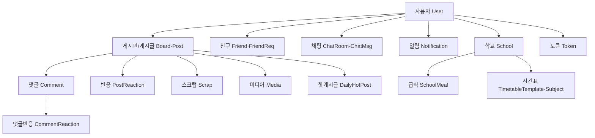

# 01. Overview — 서비스와 도메인 지도

## 이 문서가 답하는 질문

- 이 서비스는 무엇이고 누구를 위한 것인가?
- 시스템에 어떤 도메인이 있고 서로 어떻게 연결되는가?
- 코드에서 쓰는 클래스명과 기획 용어(한글)는 어떻게 대응되는가?
- 어떤 외부 시스템에 의존하는가?

## 3줄 요약

- 고등학생 대상 익명 커뮤니티. 핵심 축은 게시판(글·댓글·반응·스크랩)이고, 그 위에 핫게시글 랭킹·친구·실시간 채팅/알림·학교 정보(급식·시간표)가 얹혀 있다.
- 도메인 간 부가 작업(알림 생성, 핫스코어 갱신)은 Spring Event로 분리되어 있다.
- 외부 의존은 5개: MySQL(정본), Redis(캐시·랭킹·버퍼), AWS S3(이미지), Google OAuth2(소셜 로그인), NEIS API(급식·학교 데이터).

## 서비스 소개

하이틴데이(HighTeenDay)는 학교 단위 이슈를 익명으로 공유하는 커뮤니티다. 사용자는 익명으로 글과 반응을 남기고, 핫게시글 랭킹으로 지금 뜨거운 이슈를 확인하며, 친구를 맺어 시간표를 공유하고 1:1/그룹 채팅을 한다. 서비스 배경과 기능 상세는 저장소 루트 `README.md` 참고 (README의 코드 불일치 서술은 2026-08-11 정정됨 — [KI-09](KNOWN-ISSUES.md#ki-09-readme-실행-가이드가-현재-코드와-불일치), [KI-11](KNOWN-ISSUES.md#ki-11-readme의-핫스코어-갱신-주기-서술이-코드와-다름) 갱신 참고).

## 도메인 지도

이벤트로 연결되는 흐름 (직접 호출이 아님 — 상세는 [02-architecture.md](02-architecture.md)):

- 댓글 생성·반응·스크랩 → 핫스코어 갱신 (`eventEntities/eventListeners/HotPostEventListener.java`)
- 댓글 생성·친구 요청/수락 등 → 알림 생성 (`eventEntities/eventListeners/NotificationEventListener.java`)

## 용어집 — 기획 용어와 코드의 대응

| 한글 용어 | 코드 | 비고 |
|---|---|---|
| 게시판 | `domain/boards/Board` | 자유·수능·이과·문과·질문 등. 시드로 생성 |
| 게시글 | `domain/posts/Post` | `likeCount`·`viewCount`·`commentCount` 등을 비정규화 컬럼으로 보유 |
| 댓글 / 대댓글 | `domain/comments/Comment` | `parent` 자기참조로 대댓글 표현 |
| 반응 (좋아요/싫어요) | `domain/posts/PostReaction` + `PostReactionKind` | LIKE / DISLIKE 단일 테이블. 댓글은 `CommentReaction` |
| 스크랩 | `domain/scraps/Scrap` | 토글 방식 |
| 핫게시글 (일간) | `domain/hot/DailyHotPost` + Redis ZSET | 랭킹 산식은 `Utils/HotScoreCalculator` |
| 조회수 | Redis 버퍼 → 배치 반영 | `infrastructure/redis/RedisViewCountStore`, `schedulers/ViewCountScheduler` |
| 친구 / 친구요청 | `domain/friends/Friend`, `FriendReq` | 상태는 `enums/FriendRequestStatus`, `enums/FriendStatus` |
| 차단 | `Friend` 상태로 표현 | 차단 사실은 상대에게 비노출 정책 (`controllers/FriendController` 주석) |
| 채팅방 / 메시지 / 참가자 | `domain/chat/ChatRoom`, `ChatMsg`, `ChatParticipants` | 역할은 `enums/ChatRole` (OWNER/ADMIN/MEMBER) |
| 알림 | `domain/notification/Notification` | 분류는 `enums/NotificationCategory` |
| 학교 | `domain/schools/School` | NEIS 데이터 기반, `schoolData/schoolInfo/schools.json`에서 로드 |
| 급식 | `domain/schools/SchoolMeal` | NEIS API 수집, 월별 JSON 캐시 |
| 시간표 템플릿 / 과목 | `domain/schools/timetableTamplates/TimetableTemplate`, `subjects/Subject`, `UserTimetables/UserTimetable` | 패키지명 오타·표기는 [03-package-guide.md](03-package-guide.md) 참고 |
| 미디어 (이미지) | `domain/medias/Media` | S3 임시 업로드 후 게시글 확정 시 영구 이동 |
| 리프레시 토큰 | `domain/Token/Token` | DB 저장 + Redis 캐시 (`infrastructure/redis/RedisTokenCacheStore`) |
| 사용자 | `domain/users/User` | 이메일·닉네임·비밀번호 등은 `domain/users/vo/` 값 객체 |
| 익명 | `Post`·`Comment`의 `isAnonymous` 필드 | 익명이면 작성자 정보 비노출 규칙 |
| 삭제 | soft delete — `domain/base/BaseEntity`의 `isValid` | 물리 삭제하지 않음 |

## 외부 시스템

| 시스템 | 역할 | 진입 코드 |
|---|---|---|
| MySQL 8 | 데이터 정본 (Source of Truth) | Spring Data JPA + QueryDSL |
| Redis | 조회수 버퍼, 게시글 목록·카운트 캐시, 핫게시글 랭킹(ZSET), 리프레시 토큰 캐시 | `infrastructure/redis/`, `services/domain/redisService/` |
| AWS S3 | 이미지 저장 (tmp 업로드 → 확정 시 이동) | `services/global/S3FileStorageAdapter` (`FileStoragePort` 구현) |
| Google OAuth2 | 소셜 로그인 | `services/security/CustomOAuth2UserService`, `security/OAuth2SuccessHandler` |
| NEIS API | 학교·급식 데이터 수집 | `api/SchoolInfoService`, `api/SchoolMealService` |

장애 시 동작 원칙: Redis는 캐시 레이어이므로 장애 시 DB fallback으로 서비스가 유지되도록 설계되어 있다 (`aop/ResilientRedis` 애노테이션과 `services/domain/redisService/RedisPostsCache`의 fallback 분기). 상세는 crosscutting/redis.md (Phase 2 예정).

## 코드 좌표

| 개념 | 위치 |
|---|---|
| 애플리케이션 진입점 | `HighteendayBackendApplication.java` |
| 도메인 엔티티 전체 | `domain/` 하위 서브도메인별 패키지 |
| 이벤트 정의·리스너 | `eventEntities/events/`, `eventEntities/eventListeners/` |
| 공통 엔티티 (soft delete, audit) | `domain/base/BaseEntity` |
| 열거형 (역할·상태·분류) | `enums/` |

## 알려진 문제·미확인 사항

- README의 코드 불일치 서술은 2026-08-11 정정됐다 ([KI-09](KNOWN-ISSUES.md#ki-09-readme-실행-가이드가-현재-코드와-불일치)·[KI-11](KNOWN-ISSUES.md#ki-11-readme의-핫스코어-갱신-주기-서술이-코드와-다름)의 갱신 줄 참고)
- `domain/hot/RecentHotPost`는 미사용 엔티티로 확인된 뒤 삭제됐다 (2026-08). 게시판별 실시간 인기글 관련 서비스 메서드는 아직 코드에 남아 있으나 API에 연결되지 않았다 — 상세는 [domains/reaction-hotpost.md](domains/reaction-hotpost.md).

마지막 검증일: 2026-07-30 (2026-08-11 코드 변경 반영분은 본문의 갱신 표시 참고)
