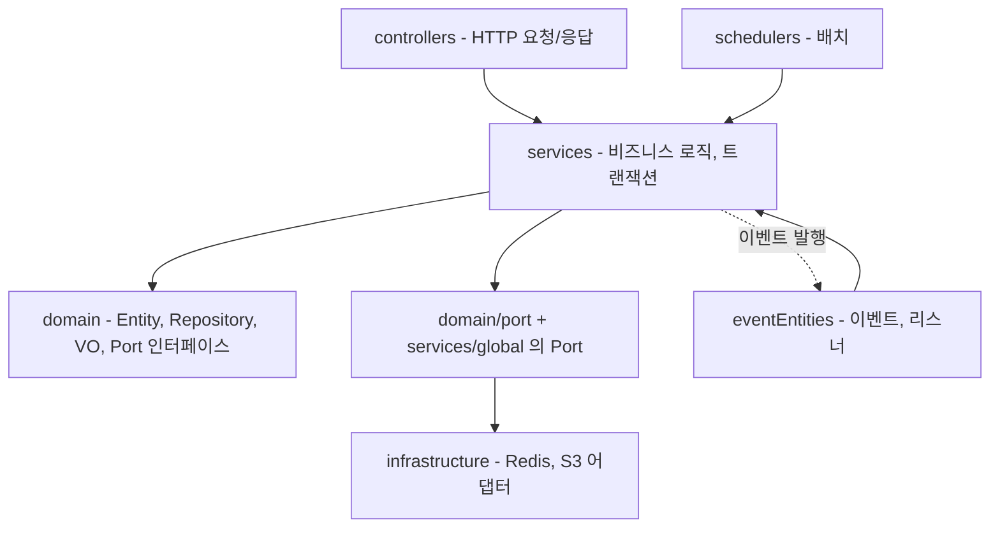
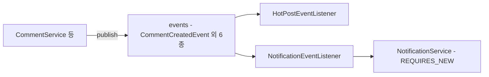
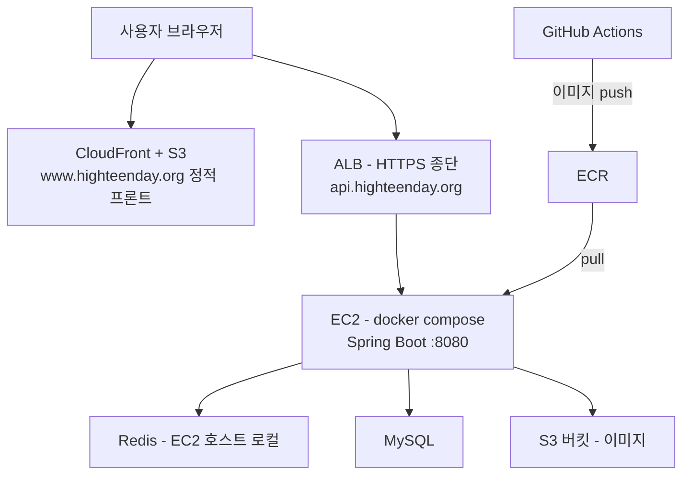

# 02. Architecture — 레이어, Port/Adapter, 이벤트, 배포

## 이 문서가 답하는 질문

- 코드가 어떤 레이어로 나뉘고, 각 레이어의 책임은 무엇인가?
- 외부 인프라(Redis, S3)와 도메인 로직은 어떻게 분리되어 있는가?
- 도메인 간 부가 작업은 왜/어떻게 이벤트로 처리되는가?
- 프로덕션은 어떤 토폴로지로 배포되어 있는가?

## 3줄 요약

- 전통적 계층형(Controller → Service → Domain/Repository)을 기본으로, 성능 민감 영역(조회수·랭킹·토큰 캐시·파일 저장)에만 Port/Adapter를 적용했다.
- 댓글·반응·스크랩의 부가 작업(알림, 핫스코어)은 `@TransactionalEventListener(AFTER_COMMIT)` 이벤트로 분리되어 원본 트랜잭션과 격리된다.
- 배포는 GitHub Actions → ECR → EC2(docker compose) 이고, 프론트는 S3+CloudFront, HTTPS는 ALB가 담당한다.

## 레이어 구조

| 레이어 | 패키지 | 책임 | 규칙 |
|---|---|---|---|
| Web | `controllers/` | 요청 파싱, 응답 조립, 서비스 위임 | 비즈니스 로직 금지 (일부 위반 존재 — Phase 3에서 도메인별로 명시) |
| Service | `services/domain/`, `services/security/`, `services/global/` | 비즈니스 로직, `@Transactional` 경계 | 엔티티를 DTO로 변환해 반환하는 것이 원칙 |
| Domain | `domain/` | 엔티티, 리포지토리, 값 객체(VO), Port 인터페이스 | 엔티티는 setter 없이 도메인 메서드로 상태 변경 (`domain/posts/Post`의 `editTitle` 등) |
| Infrastructure | `infrastructure/redis/`, `services/global/S3FileStorageAdapter` | Port 구현체 | 도메인은 이 패키지를 직접 참조하지 않음 |
| 배치 | `schedulers/` | 주기 작업 (조회수 동기화, 핫스코어 갱신 등) | `@SchedulerJob` AOP로 수명주기 로깅 (`aop/SchedulerJobAspect`) |

## Port/Adapter 목록

외부 인프라 결합을 끊기 위해 인터페이스(Port)를 도메인 쪽에, 구현(Adapter)을 infrastructure 쪽에 둔다. 테스트에서는 Port를 mock으로 대체한다 (예: `src/test/.../MediaProcessingServiceTest`가 `FileStoragePort`를 mock).

| Port (인터페이스) | Adapter (구현) | 담당 |
|---|---|---|
| `domain/port/ViewCountStorePort` | `infrastructure/redis/RedisViewCountStore` | 조회수 버퍼 |
| `domain/port/HotPostRankingPort` | `infrastructure/redis/RedisHotPostRanking` | 핫게시글 ZSET 랭킹 |
| `domain/port/TokenCachePort` | `infrastructure/redis/RedisTokenCacheStore` | 리프레시 토큰 캐시 |
| `services/global/FileStoragePort` | `services/global/S3FileStorageAdapter` | 파일 저장 (S3) |

Port를 거치지 않는 Redis 사용도 있다: `services/domain/redisService/`의 `RedisPostsCache`(게시글 목록·카운트 캐시), `PostPrevCache`, `ViewCountService`. 이쪽은 DB fallback 분기가 필요해 어댑터 대신 서비스에서 직접 다룬다는 구분이 코드 주석에 있다 (`RedisPostsCache`의 섹션 주석). Redis 장애 격리 규칙은 두 가지다:

- 단순 조작: `@ResilientRedis` 애노테이션 → `aop/ResilientRedisAspect`가 예외를 잡아 기본값 반환
- 복잡한 fallback: 서비스 코드에서 직접 try/catch 후 DB 재조회 (`RedisPostsCache.getPostPrevs`)

## 이벤트 기반 부가 작업

쓰기 작업의 부가 효과(알림 생성, 핫스코어 갱신)는 직접 호출하지 않고 Spring Event로 분리한다.

- 이벤트 정의: `eventEntities/events/` — `CommentCreatedEvent`, `PostReactedEvent`, `ScrapToggledEvent`, `FriendRequestSentEvent`, `FriendRequestAcceptedEvent`, `FriendRequestDeclinedEvent`, `FriendBlockedEvent`
- 리스너 2개: `eventEntities/eventListeners/HotPostEventListener`, `NotificationEventListener` — 둘 다 `@TransactionalEventListener(AFTER_COMMIT)`
- 핵심 설계 포인트: AFTER_COMMIT 리스너는 이미 커밋된 트랜잭션 문맥에서 실행되므로, 리스너가 DB에 써야 하면 새 트랜잭션이 필요하다. 그래서 `services/domain/NotificationService`의 알림 생성 메서드들에 `@Transactional(propagation = REQUIRES_NEW)`가 붙어 있다.
- 효과: 부가 기능 실패가 원본 트랜잭션을 롤백시키지 않고, 댓글 서비스가 알림 시스템에 직접 의존하지 않는다.

## 스케줄러 (요약)

상세는 crosscutting/schedulers.md (Phase 2 예정).

| 스케줄러 | 주기 | 하는 일 |
|---|---|---|
| `schedulers/ViewCountScheduler` | 60초 | Redis에 버퍼링된 조회수를 DB에 일괄 반영 |
| `schedulers/HotScoreScheduler` | 5분 | 리더보드 상위 게시글의 핫스코어 재계산·DB 동기화 ([KI-11](KNOWN-ISSUES.md#ki-11-readme의-핫스코어-갱신-주기-서술이-코드와-다름): README의 "1분/전체" 서술은 구버전) |
| `schedulers/TokenCleanupScheduler` | 매일 03:00 (`cron = "0 0 3 * * *"`) | 만료 리프레시 토큰 정리 |
| `schedulers/SchoolMealScheduler` | 매월 1일 00:00 (`cron = "0 0 0 1 * ?"`) | 급식 데이터 NEIS 수집. README의 "매월 말일 수집" 서술과 다름 |

## 배포 토폴로지

- CI/CD: `main` push → GitHub Actions가 Docker 이미지를 빌드해 ECR에 push → SSH로 EC2에서 pull 후 `docker-compose.prod.yml`로 재기동 (`.github/workflows/deploy.yml`). AWS 자격증명은 정적 키 없이 OIDC(`role-to-assume`)와 EC2 Instance Profile을 쓴다.
- 컨테이너: 멀티스테이지 빌드 + JRE 런타임 + non-root 사용자 (`Dockerfile`).
- prod 컨테이너는 `network_mode: host`로 EC2 호스트의 Redis에 localhost로 접근한다 (`docker-compose.prod.yml` 주석). MySQL의 위치는 `[미확인: prod compose 주석은 RDS를 언급하지만 실제 DB_URL은 배포 시크릿이라 저장소에서 확정 불가]`.
- 이 파이프라인에는 테스트 실행 단계가 없다 ([KI-12](KNOWN-ISSUES.md#ki-12-테스트가-ci에서-실행되지-않음)).

## 프로파일

| 프로파일 | 용도 | 특징 |
|---|---|---|
| local | 개발자 개인 환경 (기본값) | 프로퍼티 파일이 저장소에 없음 ([KI-02](KNOWN-ISSUES.md#ki-02-기본-프로파일-local의-프로퍼티-파일이-없음)) |
| dev | 개발 서버·로컬 실행 실질 표준 | `ddl-auto=update`, 기본값 포함 (`application-dev.properties`) |
| prod | 운영 | 전부 환경변수 주입, `ddl-auto=none`, actuator는 health만 노출 (`application-prod.properties`) |

## 코드 좌표

| 개념 | 위치 |
|---|---|
| 시큐리티 필터 체인 구성 | `security/SecurityConfig.java · filterChain()` |
| Port 인터페이스 | `domain/port/`, `services/global/FileStoragePort` |
| Redis 어댑터 | `infrastructure/redis/` |
| 이벤트·리스너 | `eventEntities/` |
| Redis 장애 격리 AOP | `aop/ResilientRedis`, `aop/ResilientRedisAspect` |
| 스케줄러 수명주기 AOP | `aop/SchedulerJob`, `aop/SchedulerJobAspect` |
| 실행시간 로깅 AOP | `aop/ExecutionLoggingAspect` (300ms 초과 시 WARN — `application.properties · app.execution-logging.slow-threshold-ms`) |
| 배포 파이프라인 | `.github/workflows/deploy.yml`, `Dockerfile`, `docker-compose.prod.yml` |

## 알려진 문제·미확인 사항

- 기존 `SYSTEM_ARCHITECTURE.md`는 구버전 서술이 많아 이 문서가 현행 기준이다 ([KI-10](KNOWN-ISSUES.md#ki-10-system_architecturemd가-구버전-상태로-방치됨))
- `[미확인]` 1건: prod MySQL 위치(RDS 여부)
- 급식 수집 주기가 README("매월 말일")와 코드(매월 1일 00:00)가 다르다 — KNOWN-ISSUES 보강 예정(Phase 2)
- 레이어 규칙 위반 사례(서비스가 `HttpServletResponse`를 받는 등)는 Phase 3 도메인 문서에서 좌표와 함께 다룬다

마지막 검증일: 2026-07-30
