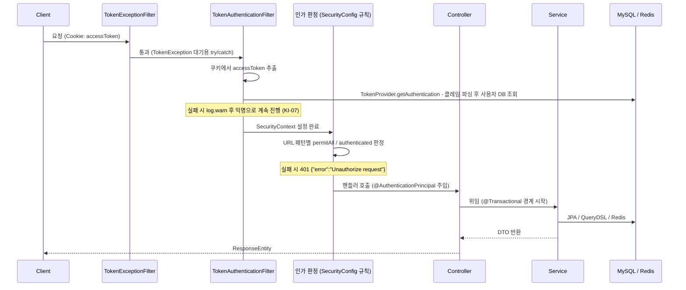
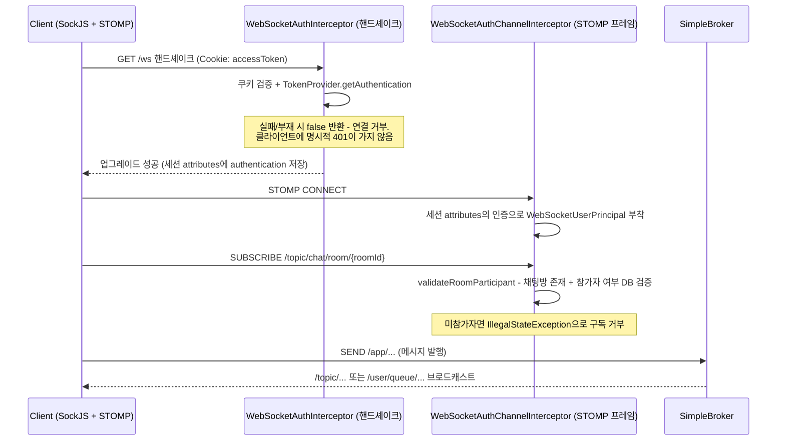

# 04. Request Flow — 요청이 시스템을 통과하는 전 구간

## 이 문서가 답하는 질문

- HTTP 요청 하나가 어떤 필터를 거쳐 컨트롤러에 도달하는가?
- 인증(누구인가)과 인가(허용되는가)는 각각 어디서 판정되는가?
- 예외는 어떤 경로로 HTTP 응답이 되는가?
- WebSocket(STOMP) 연결은 HTTP와 무엇이 다른가?

## 3줄 요약

- 인증은 `accessToken` 쿠키를 읽는 `TokenAuthenticationFilter`가, 인가는 `SecurityConfig`의 규칙이 담당한다. 토큰이 유효하지 않아도 요청은 "익명"으로 계속 진행되다가 인가 단계에서 걸린다 ([KI-07](KNOWN-ISSUES.md#ki-07-tokenauthenticationfilter가-예외를-삼켜-tokenexceptionfilter가-사실상-동작하지-않음)).
- 컨트롤러 안에서 난 예외는 `GlobalExceptionHandler`가, 필터 단계 예외와 인가 실패는 각각 별도 경로가 처리해 응답 형태가 3가지로 갈린다.
- WebSocket은 핸드셰이크(쿠키 인증) → CONNECT(principal 부착) → SUBSCRIBE(채팅방 참가자 검증)의 3단 검문을 거친다.

## HTTP 요청의 여행

### 단계별 상세

1. **필터 등록 순서** — `security/SecurityConfig.java · filterChain()`의 `addFilterBefore` 두 줄이 순서를 만든다: `TokenExceptionFilter` → `TokenAuthenticationFilter` → (Spring 기본) `ExceptionTranslationFilter` → 인가 필터 → 서블릿.
2. **인증** — `security/TokenAuthenticationFilter.java · doFilterInternal()`이 쿠키 배열에서 `accessToken`을 찾아 `TokenProvider.getAuthentication()`을 호출한다. 이 메서드는 JWT 서명·만료를 검증한 뒤 `userRepository.findByEmail()`로 사용자를 DB에서 조회해 `CustomUserPrincipal`을 만든다 — 즉 인증 성공 경로는 매 요청 DB를 1회 조회한다 ([KI-08](KNOWN-ISSUES.md#ki-08-인증-성공-경로가-요청마다-db를-조회)).
3. **인증 실패의 실제 동작** — 만료·위조 토큰이면 `TokenException`이 던져지지만 같은 메서드의 `catch (RuntimeException)`이 잡아 경고 로그만 남기고 통과시킨다. 따라서 앞단 `TokenExceptionFilter`(에러코드별 401 응답 담당, `security/TokenExceptionFilter.java`)는 실제로는 발동 기회가 없고, 클라이언트는 항상 인가 단계의 획일적 401을 받는다 ([KI-07](KNOWN-ISSUES.md#ki-07-tokenauthenticationfilter가-예외를-삼켜-tokenexceptionfilter가-사실상-동작하지-않음)).
4. **인가** — `SecurityConfig.filterChain()`의 `authorizeHttpRequests` 규칙이 위에서 아래로 첫 매칭으로 판정된다. 현재 구조는 명시된 GET 경로만 `authenticated()`이고 나머지 GET 전부가 `permitAll()`인 블랙리스트 방식이다 ([KI-04](KNOWN-ISSUES.md#ki-04-get-전체가-permitall인-블랙리스트-인가-구조)). 비인증 상태로 보호 경로에 접근하면 `authenticationEntryPoint`가 `401 {"error": "Unauthorize request"}`를 내려준다.
5. **컨트롤러 → 서비스** — 핸들러는 `@AuthenticationPrincipal CustomUserPrincipal`로 사용자에 접근하고, 비즈니스 로직과 트랜잭션은 서비스가 담당한다 (`@Transactional`). 컨트롤러 핸들러 메서드는 반드시 public이어야 한다 — private이면 CGLIB 프록시 문제로 주입 필드가 null이 되어 500이 난다. 이 규칙은 `src/test/.../controllers/HandlerMethodVisibilityTest`가 아키텍처 테스트로 강제한다.
6. **Swagger·actuator 예외 경로** — `/swagger-ui/**`, `/actuator/health` 등은 `SecurityConfig.securityCustomizer()`의 `web.ignoring()`으로 시큐리티 필터 체인 자체를 타지 않는다.

### 예외 → 응답 경로 (3갈래)

| 예외 발생 지점 | 처리자 | 응답 형태 |
|---|---|---|
| 컨트롤러/서비스의 `CustomException` | `exceptions/GlobalExceptionHandler` | `{"code": ..., "message": ...}` — ErrorCode의 HTTP 상태 |
| 인가 실패 (비인증 접근) | `SecurityConfig`의 `authenticationEntryPoint` | `401 {"error": "Unauthorize request"}` |
| 필터 단계의 `TokenException` | `TokenExceptionFilter` (설계상) | `{"error": ...}` — 단 KI-07로 현재 도달 경로 없음 |

응답 스키마가 통일되어 있지 않다는 점은 프론트엔드 에러 처리 시 주의해야 한다. 상세 규칙과 ErrorCode 목록은 crosscutting/error-handling.md (Phase 2 예정).

### 구체 예시: GET /api/posts/{postId}

1. `controllers/PostController.java · getPostByPostId` — 게시글 조회는 permitAll GET이므로 비로그인도 도달한다.
2. `services/domain/PostService · findById`로 엔티티 조회 후 DTO 변환.
3. `services/domain/PostDetailService · applyUserContext` — 로그인 사용자의 좋아요/스크랩 여부를 DTO에 채우고, 조회수 증가를 트리거한다.
4. 조회수는 DB에 바로 쓰지 않는다: `services/domain/redisService/ViewCountService`가 Redis에 중복 방지 키(SETNX)와 카운터(INCR)를 기록하고, 60초 주기 `schedulers/ViewCountScheduler`가 모아서 DB에 반영한다.

## WebSocket(STOMP) 연결의 여행

채팅·실시간 알림이 사용한다. 엔드포인트는 `/ws` (SockJS), 브로커 설정은 `configs/WebSocketConfig.java`.

### 단계별 상세

1. **핸드셰이크 인증** — `security/WebSocketAuthInterceptor.java · beforeHandshake()`가 HTTP와 동일하게 `accessToken` 쿠키를 검증한다. 실패하면 `false`를 반환해 연결이 거부되는데, 이때 **HTTP 401 같은 명시적 에러가 아니라 조용한 연결 실패**로 보인다. 그래서 프론트엔드는 axios의 401 기반 토큰 갱신 인터셉터가 이 실패를 감지하지 못하며, 연결 전에 선제적으로 토큰을 갱신하는 전략을 쓴다 (프론트 `src/contexts/WebSocketContext.jsx`의 `beforeConnect` 주석에 이 설계 배경이 기록되어 있다).
2. **CONNECT** — `security/WebSocketAuthChannelInterceptor.java · preSend()`가 핸드셰이크 때 저장해둔 인증 정보로 `WebSocketUserPrincipal`을 세션에 부착한다. 이후 `/user/queue/...` 개인 목적지 라우팅의 기준이 된다.
3. **SUBSCRIBE 검문** — 구독 목적지가 `/topic/chat/room/{roomId}` 패턴이면 `validateRoomParticipant()`가 채팅방 존재와 참가자 여부를 DB로 확인한다(구독 1회당 2쿼리). 실패 시 `IllegalStateException`으로 구독이 거부된다.
4. **목적지 규칙** (`WebSocketConfig.configureMessageBroker()`):

| 프리픽스 | 의미 | 예 |
|---|---|---|
| `/app` | 클라이언트 → 서버 (@MessageMapping 핸들러, `controllers/ChatWebSocketController`) | 메시지 전송 |
| `/topic` | 브로커 → 다수 구독자 | 채팅방 브로드캐스트 |
| `/queue` + `/user` | 브로커 → 특정 사용자 | 실시간 알림 (`/user/queue/...`) |

## 코드 좌표

| 개념 | 위치 |
|---|---|
| 필터 순서·인가 규칙·엔트리포인트 | `security/SecurityConfig.java · filterChain()` |
| 토큰 추출·인증 시도 | `security/TokenAuthenticationFilter.java · doFilterInternal() / extractToken()` |
| JWT 검증 + 사용자 조회 | `security/TokenProvider.java · getAuthentication()` |
| 필터 단계 예외 응답 (설계) | `security/TokenExceptionFilter.java` |
| 컨트롤러 예외 → 응답 | `exceptions/GlobalExceptionHandler` |
| WS 핸드셰이크 인증 | `security/WebSocketAuthInterceptor.java · beforeHandshake()` |
| WS 프레임 검문 | `security/WebSocketAuthChannelInterceptor.java · preSend() / validateRoomParticipant()` |
| WS 브로커·엔드포인트 설정 | `configs/WebSocketConfig.java` |
| 조회수 버퍼링 | `services/domain/redisService/ViewCountService`, `schedulers/ViewCountScheduler` |

## 알려진 문제·미확인 사항

- [KI-04](KNOWN-ISSUES.md#ki-04-get-전체가-permitall인-블랙리스트-인가-구조) 블랙리스트 인가 구조
- [KI-07](KNOWN-ISSUES.md#ki-07-tokenauthenticationfilter가-예외를-삼켜-tokenexceptionfilter가-사실상-동작하지-않음) 필터 예외 삼킴으로 세분화된 401 코드가 무력화
- [KI-08](KNOWN-ISSUES.md#ki-08-인증-성공-경로가-요청마다-db를-조회) 인증 경로의 요청당 DB 조회
- `[미확인]` 핸드셰이크 거부 시 클라이언트가 받는 정확한 HTTP 상태 코드 — 프론트 주석은 "빈 200"이라 기록하나 서버 측에서 실측하지 않음

마지막 검증일: 2026-07-30
