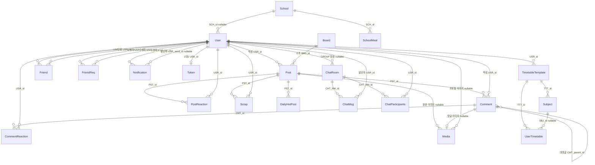

# 05. Data Model — ERD, 명명 규칙, soft delete, 스키마 관리

## 이 문서가 답하는 질문

- 주요 엔티티는 무엇이고 서로 어떻게 연결되어 있는가?
- 테이블·컬럼·FK·인덱스 이름은 어떤 규칙을 따르는가?
- soft delete와 감사(audit) 필드는 어떻게 동작하는가?
- Post의 비정규화 컬럼은 왜 있고 누가 갱신하는가?
- 스키마 변경은 지금 어떻게 관리되고 있는가?

## 3줄 요약

- 커뮤니티(게시글·댓글·반응·스크랩), 소셜(친구·채팅·알림), 학교(급식·시간표), 인증(토큰)의 4개 군집이 모두 `users`를 중심으로 연결된다.
- 대부분의 엔티티는 `BaseEntity`를 상속해 `is_valid` soft delete와 감사 필드를 공유하지만, 상속하지 않는 엔티티도 7개 있다 (아래 표).
- 스키마는 dev에서 `ddl-auto=update`, prod에서 `ddl-auto=none` + 수동 SQL(`src/main/resources/ddl/`)로 관리되며, Flyway 도입은 미병합 브랜치로만 존재한다.

## ERD (주요 엔티티)

관계는 전부 실제 엔티티의 `@ManyToOne`/`@OneToOne`/`@OneToMany` 선언을 읽고 그린 것이다. 컬럼 전체가 아니라 관계 파악에 필요한 키만 표시한다.

보조 관계 메모:

- `RecentHotPost`(게시판별 실시간 인기글의 DB 흔적)는 미사용으로 확인되어 2026-08에 삭제됐다. 현재 핵심 경로는 `DailyHotPost`이며, `daily_hot_post` 테이블은 V6 마이그레이션으로 정식 생성됐다 — 흐름은 [crosscutting/schedulers.md](crosscutting/schedulers.md) 참고.
- 일정 도메인 엔티티 `PersonalSchedule`·`SchoolSchedule`(`domain/schedule/`)은 존재하나 컨트롤러가 없다. `[미확인: 사용 여부 — 리포지토리만 있고 서비스·컨트롤러에서 참조를 찾지 못함]`
- 유니크 제약으로 중복을 막는 곳: 게시글 반응(`uk_posts_reactions_pst_usr`), 댓글 반응(`uk_comments_reactions_cmt_usr`), 1:1 채팅방(`uk_chat_rooms_pair_key`), 채팅 참가(`uk_chat_participants_room_usr`), 메시지 멱등성(`uk_chat_messages_room_client`), 일별 핫게시글(`uk_daily_hot_post_date_post`), 이메일(`uk_users_email`).

## 명명 규칙 — 실제 코드 기준

CLAUDE.md의 "컬럼은 `{DOMAIN_PREFIX}_{column}` UPPER_SNAKE" 서술은 절반만 맞다. 실제 엔티티를 대조한 결과:

| 항목 | 실제 규칙 | 근거 예 |
|---|---|---|
| 테이블명 | 소문자 복수형 (`users`, `posts`, `comments_reactions`) | 각 엔티티 `@Table(name=...)` |
| 컬럼명 | `{대문자 접두어}_{소문자 snake}` — 접두어만 대문자다 (`PST_view_count`, `USR_profile_image_url`) | `domain/posts/Post.java`, `domain/users/User.java` |
| 도메인 접두어 | USR, PST, BRD, CMT, SC, MDA, DHP, RHP, FRD, FRD_REQ, NT, CHT_RM, CHT_MSG, CHT_PT, SCH, SCH_ML, TTT, UTT, SBJ, TNK | 각 엔티티 `@Column` |
| FK 이름 | `fk_{테이블}_{참조 접두어 소문자}` (`fk_posts_usr`, `fk_users_sch`, `fk_token_usr`) | 각 `@JoinColumn(foreignKey=@ForeignKey(...))` |
| 인덱스 | `idx_{테이블}_{필드 약어}` (`idx_posts_brd_valid_id`) | `domain/posts/Post.java · @Table indexes` |
| 유니크 제약 | `uk_{테이블}_{필드 약어}` (`uk_users_email`) | 각 `@Table uniqueConstraints` |

규칙에서 벗어난 사례(테이블명 미지정, 접미어 언더스코어, 케이스 혼재 등)는 [KI-29](KNOWN-ISSUES.md#ki-29-엔티티-명명-규칙-이탈-모음)에 모아 두었다.

## BaseEntity — soft delete와 감사 필드

`domain/base/BaseEntity.java`가 `@MappedSuperclass`로 공통 컬럼을 제공한다.

| 필드 | 컬럼 | 채워지는 방식 |
|---|---|---|
| `created` | `created_at` (not null) | `@CreatedDate` — JPA Auditing 자동 |
| `updatedDate` | `UPT_Date` | `@LastModifiedDate` 자동 + `setUpdatedDate()` 수동 조정 |
| `updatedBy` | `UPT_id` | 자동이 아니다 — 서비스가 `setUpdatedBy(userId)`를 직접 호출 (예: `services/domain/PostService · deletePost`) |
| `isValid` | `is_valid` (not null, default true) | `delete()`가 false로 바꾸는 soft delete 플래그 |

- 삭제는 행을 지우지 않고 `delete()`로 `is_valid=false`를 만든다. 조회 측이 `isValid` 필터를 넣는 책임을 진다 — 필터가 빠진 조회 경로가 실제로 존재한다 ([KI-26](KNOWN-ISSUES.md#ki-26-스크랩-목록이-전량-로딩과-메모리-페이징으로-동작)).
- 반응·스크랩은 `isValid`를 "삭제"가 아니라 **토글 상태**로 재사용한다: `PostReaction.cancel()`/`applyState()`, `Scrap.cancelScrap()`/`activeScrap()`, `ChatParticipants.rejoin()`.
- **BaseEntity를 상속하지 않는 엔티티 7개**: `Media`, `School`, `SchoolMeal`, `TimetableTemplate`, `UserTimetable`, `Subject`, `Token`. 이들에는 soft delete·감사 필드가 없고 삭제는 hard delete다 (예: `TimetableTemplate`의 `cascade = REMOVE`).

## Post의 비정규화 컬럼

`domain/posts/Post.java`에 "쿼리 성능을 위한 비정규화 컬럼" 주석과 함께 `viewCount`, `likeCount`, `dislikeCount`, `commentCount`, `scrapCount`, `nickname`이 있다.

- **이유 1 — 목록 쿼리에서 조인·집계 제거**: 게시글 목록·정렬(좋아요순, 조회수순)이 `posts` 단일 테이블과 복합 인덱스(`idx_posts_brd_valid_like` 등)만으로 처리된다. 반응·댓글·스크랩 테이블을 매번 COUNT하지 않는다.
- **이유 2 — 익명 스냅샷**: `nickname`은 작성 시점에 `Post.create()`가 `isAnonymous ? "익명" : 실제 닉네임`으로 고정한다. 목록에서 `users` 조인이 필요 없고, 익명 글은 작성자 정보가 아예 행에 남지 않는다.
- 갱신 주체가 컬럼마다 다르다:

| 컬럼 | 갱신 방식 | 주체 |
|---|---|---|
| `likeCount`/`dislikeCount` | DB COUNT 결과로 동기화 (`syncReactionCounts`) | `services/domain/PostReactionService · syncCounts` |
| `scrapCount` | DB COUNT 결과로 동기화 (`syncScrapCount`) | `services/domain/ScrapService` |
| `commentCount` | 증감 (`incrementCommentCount`/`decrementCommentCount`) | `services/domain/CommentService` |
| `viewCount` | Redis 버퍼를 배치 반영 (`addViewCount`) | `schedulers/ViewCountScheduler` ([crosscutting/schedulers.md](crosscutting/schedulers.md)) |

카운트 정합성 검증용 엔드포인트가 비-prod 한정으로 있다 (`controllers/testing/PostConsistencyController`, `@Profile("!prod")`).

## Comment의 자기참조 — 대댓글

`domain/comments/Comment.java`는 `parent` 필드(`CMT_parent_id`, FK `fk_comments_parent`)로 자기 자신을 참조한다.

- 답글 생성 시 `CommentService.createComment`가 `dto.getParentId()`가 있으면 `assignParent()`로 연결한다.
- 깊이 제한 로직은 코드에 없다 — 대댓글의 대댓글도 구조상 가능하다. `[미확인: 프론트엔드가 1단계로 제한하는지]`

## 스키마 관리 현황

| 환경 | 방식 | 근거 |
|---|---|---|
| dev | `spring.jpa.hibernate.ddl-auto=update` — 엔티티 변경이 자동 반영 | `application-dev.properties` |
| prod | `ddl-auto=none` + 수동 `ALTER TABLE` | `application-prod.properties` |
| 수동 SQL | `src/main/resources/ddl/V_daily_hot_post.sql`, `V_group_chat.sql` — 애플리케이션이 실행하지 않는 참고용 스크립트 | 해당 파일 |

- 수동 SQL과 실제 스키마 사이에 불일치가 있다 (`V_daily_hot_post.sql`의 FK가 존재하지 않는 `post` 테이블을 참조 — [KI-28](KNOWN-ISSUES.md#ki-28-수동-ddl과-실제-스키마의-불일치)).
- Flyway 마이그레이션 도입 작업은 `feature/flyway-migration` 브랜치로 존재하지만 병합되지 않았다 (`git branch -a` 및 `git branch --no-merged`로 확인, 2026-07-30 기준). 현 시점의 스키마 이력 단일 출처는 없다.

## 코드 좌표

| 개념 | 위치 |
|---|---|
| 공통 컬럼·soft delete | `domain/base/BaseEntity.java` |
| 게시글·비정규화 컬럼·인덱스 | `domain/posts/Post.java` |
| 대댓글 자기참조 | `domain/comments/Comment.java · parent / assignParent()` |
| 반응 유니크 제약 | `domain/posts/PostReaction.java`, `domain/comments/CommentReaction.java` |
| 1:1 채팅 중복 방지 키 | `domain/chat/ChatRoom.java · pairKeyOf()` |
| 리프레시 토큰 저장 | `domain/Token/Token.java` |
| 사용자 값 객체 | `domain/users/vo/` (Email, Password, Nickname, UserName, PhoneNumber, BirthDate) |
| 수동 DDL | `src/main/resources/ddl/` |

## 알려진 문제·미확인 사항

- [KI-28](KNOWN-ISSUES.md#ki-28-수동-ddl과-실제-스키마의-불일치) 수동 DDL FK 오타·prod 프로퍼티 주석 불일치
- [KI-29](KNOWN-ISSUES.md#ki-29-엔티티-명명-규칙-이탈-모음) 명명 규칙 이탈 모음
- [KI-26](KNOWN-ISSUES.md#ki-26-스크랩-목록이-전량-로딩과-메모리-페이징으로-동작) soft delete 필터 누락 사례 포함
- `[미확인]` 2건: `PersonalSchedule`/`SchoolSchedule`의 실사용 여부, 대댓글 깊이 제한의 프론트 처리

마지막 검증일: 2026-07-30 (2026-08-11 코드 변경 반영분은 본문의 갱신 표시 참고)
