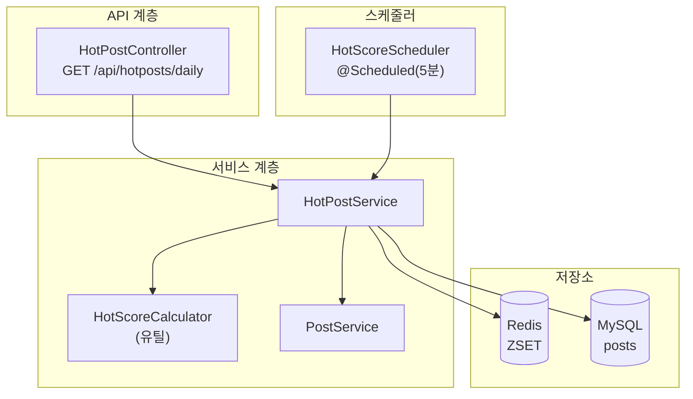
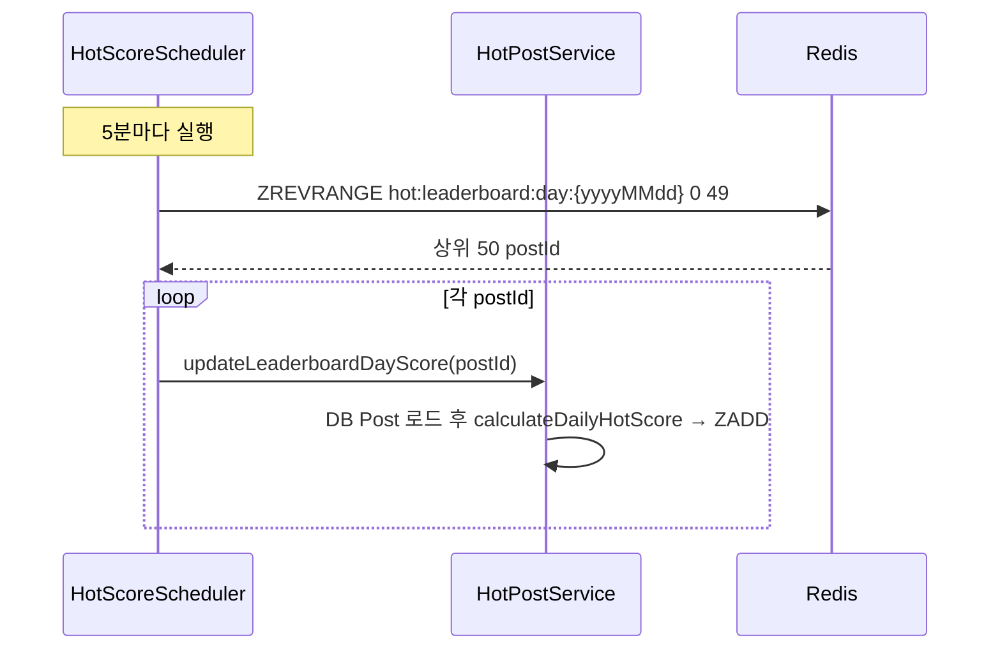
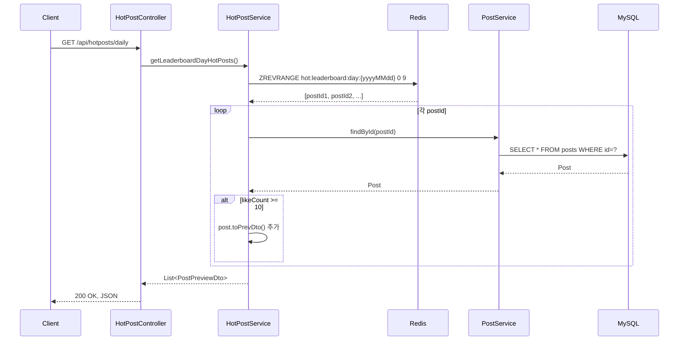
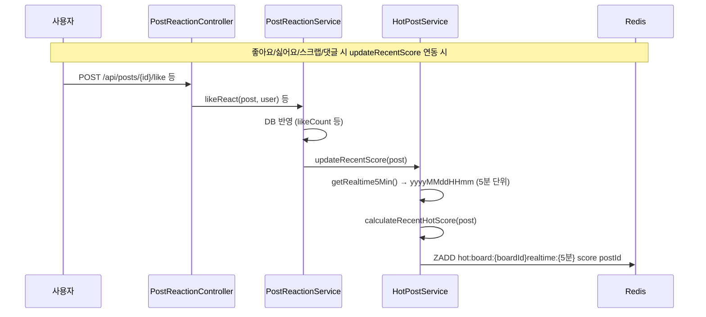
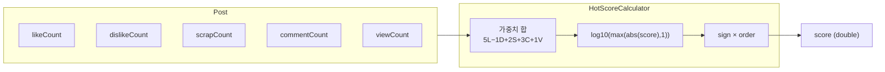

# 핫게시글 시스템 분석 및 시스템 다이어그램

---

## 1. 시스템 개요

핫게시글 시스템은 **좋아요·싫어요·스크랩·댓글·조회수**를 반영한 점수로 게시글을 순위화하고, **일간 핫게시글**과 **(설계상) 게시판별 실시간 인기글**을 제공합니다.

| 구분 | 일간 핫게시글 (Daily) | 게시판별 실시간 인기글 (Recent) |
|------|------------------------|----------------------------------|
| Redis 키 | `hot:leaderboard:day:{yyyyMMdd}` | `hot:board:{boardId}realtime:{yyyyMMddHHmm}` (5분 단위) |
| 갱신 주기 | 반응·댓글·스크랩·조회수 반영 시 `updateLeaderboardDayScore`; 5분마다 당일 ZSET **상위 50개** 재점수 | `updateRecentScore()` (현재 미연동) |
| 노출 개수 | 상위 10개, **좋아요 ≥ 10**만 응답 | 상위 3개 |
| API | `GET /api/hotposts/daily` | `getRecentHotPosts(boardId)` (API 미노출) |

---

## 2. 구성 요소

### 2.1 클래스 역할

| 클래스 | 역할 |
|--------|------|
| **HotScoreCalculator** | 순수 점수 계산 (가중치 합 → 로그 스케일 → 부호). 시간 감쇠는 Daily 전용 메서드에만 있음. |
| **HotPostService** | Redis ZSET에 점수 적재, 상위 N개 조회, 5분 단위 키 생성. |
| **HotScoreScheduler** | 5분마다 `hot:leaderboard:day:{날짜}` 상위 50개에 대해 `updateLeaderboardDayScore(postId)` 호출. |
| **HotPostController** | `GET /api/hotposts/daily` → `getLeaderboardDayHotPosts()` → `PostPreviewDto` 리스트 반환. |
| **RecentHotPost** | 엔티티/테이블 존재하나, 현재 Redis 기반 랭킹에는 미사용. |

### 2.2 점수 공식 (HotScoreCalculator)

**실시간/일간 공통 (calculateRecentHotScore)**

1. **가중치 합**  
   `score = 5×좋아요 − 1×싫어요 + 2×스크랩 + 3×댓글 + 1×조회수`
2. **로그 스케일**  
   `order = log10(max(|score|, 1))`
3. **부호**  
   `sign = score>0 ? 1 : (score<0 ? -1 : 0)`  
   **반환값**: `sign * order`

**일간 전용 (calculateDailyHotScore)**  
가중치 합·로그·부호 후, **작성 시각 기준 경과 시간(시간)**으로 감쇠 `(ageHours+2)^1.5` 로 나누어 오래된 글의 순위를 낮춤.

### 2.3 Redis 키 설계

| 키 패턴 | 타입 | member | score | 용도 |
|---------|------|--------|-------|------|
| `hot:leaderboard:day:{yyyyMMdd}` | ZSET | postId (String) | `calculateDailyHotScore` 결과 | 달력일 버킷별 전역 인기(작성일 필터 아님) |
| `hot:board:{boardId}realtime:{yyyyMMddHHmm}` | ZSET | postId (String) | 동일 | 게시판별 5분 단위 실시간 인기글 |

동일 postId가 여러 번 `ZADD`되면 **같은 키 안에서는 최신 score로 덮어쓰기**됩니다.

---

## 3. 데이터 흐름 요약

- **쓰기**  
  - **일간 리더보드**: 이벤트 경로에서 `updateLeaderboardDayScore(postId)` → DB에서 Post 로드 → `calculateDailyHotScore` → `hot:leaderboard:day:{날짜}` ZSET에 `ZADD`. 스케줄러는 5분마다 당일 키 상위 50개만 재갱신.
  - **실시간(게시판)**: `updateRecentScore(post)`가 호출되면 `hot:board:{boardId}realtime:{5분단위}` ZSET에 점수 추가. (현재 다른 서비스에서 호출되지 않음)
- **읽기**  
  - **일간**: `ZREVRANGE hot:leaderboard:day:{날짜} 0 9` → postId 10개 → DB에서 Post 조회 → `likeCount >= 10`인 것만 `PostPreviewDto`로 반환.
  - **실시간**: `ZREVRANGE hot:board:{boardId}realtime:{5분} 0 2` → postId 3개 → DB에서 Post 조회 → `toPrevDto()`로 반환.

---

## 4. 시스템 다이어그램

### 4.1 컴포넌트 다이어그램 (핫게시글 영역)

### 4.2 일간 핫게시글 갱신 흐름 (스케줄러)

### 4.3 일간 핫게시글 조회 흐름 (API)

### 4.4 게시판별 실시간 인기글 (설계상, 현재 미연동)

### 4.5 점수 계산 내부 로직

---

## 5. 요약 표

| 항목 | 내용 |
|------|------|
| **스코어 입력** | 좋아요(5), 싫어요(-1 또는 -2), 스크랩(2), 댓글(3), 조회수(1) |
| **스코어 형태** | 부호 있는 로그 스케일; 일간 전용은 경과 시간 감쇠 추가 |
| **저장소** | Redis ZSET (키별 상위 N개 조회) |
| **갱신** | 일간: 이벤트별 `updateLeaderboardDayScore` + 5분마다 당일 키 상위 50개 재갱신. 게시판 실시간: 코드는 있으나 미연동 |
| **노출** | 일간 10개, 좋아요 ≥10 필터. 실시간 3개(API 미노출) |
| **엔티티** | RecentHotPost는 DB에만 존재, 현재 Redis 랭킹과는 별개 |

이 문서와 다이어그램을 그대로 시스템 설계서/개발 문서에 활용할 수 있습니다.
