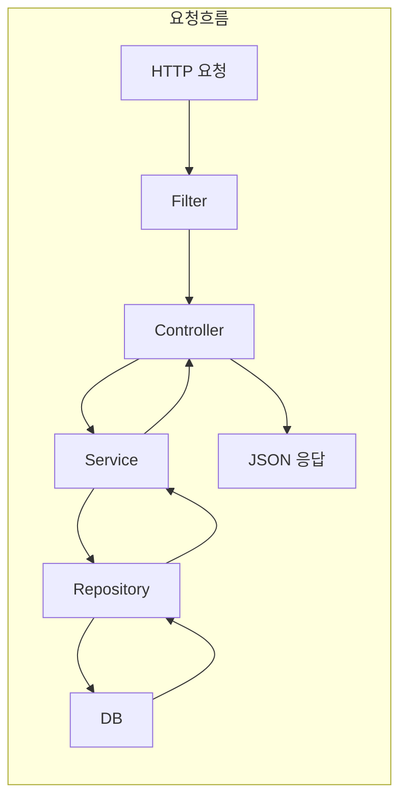
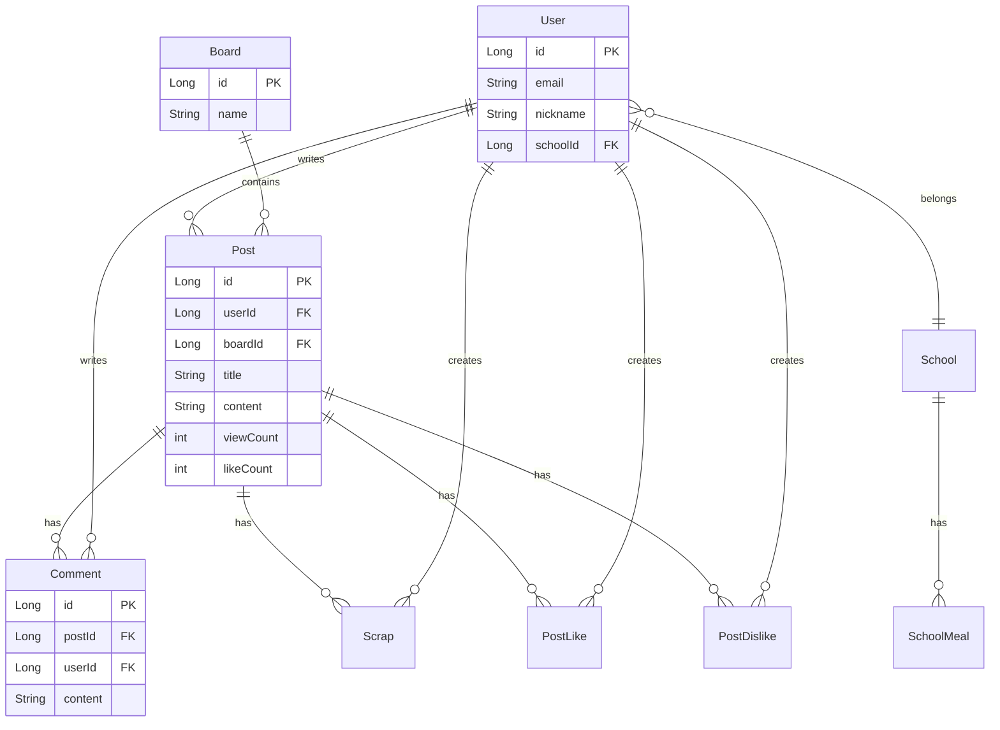

# HighTeenDay 시스템 아키텍처

---

## 1. 시스템 아키텍처 다이어그램

### 1.1 전체 구조 (Mermaid)

```mermaid
flowchart TB
    subgraph Client["클라이언트"]
        FE[프론트엔드<br/>React/Next.js<br/>localhost:3000 | highteenday.duckdns.org]
    end

    subgraph Backend["백엔드 (Spring Boot)"]
        direction TB
        subgraph Security["보안 레이어"]
            TF[TokenExceptionFilter]
            TAF[TokenAuthenticationFilter]
            OAUTH[OAuth2 (Google, Kakao, Naver)]
        end

        subgraph Controllers["Controller"]
            UC[UserController]
            PC[PostController]
            BC[BoardController]
            CC[CommentController]
        end

        subgraph Services["Service"]
            PS[PostService]
            US[UserService]
            HPS[HotPostService]
            VCS[ViewCountService]
        end

        subgraph Repos["Repository"]
            PR[PostRepository]
            UR[UserRepository]
            BR[BoardRepository]
        end
    end

    subgraph External["외부 시스템"]
        MySQL[(MySQL)]
        Redis[(Redis)]
        S3[AWS S3]
        OAuth2[OAuth2 Provider]
    end

    FE -->|HTTP/JSON + JWT Cookie| TF
    TF --> TAF
    TAF --> OAUTH
    TAF --> Controllers
    Controllers --> Services
    Services --> Repos
    Repos --> MySQL
    Services --> Redis
    Services --> S3
    OAUTH --> OAuth2
```

### 1.2 레이어별 흐름



### 1.3 엔티티 관계 (핵심)



---

## 2. 전체 구조 개요

### 2.1 프론트엔드 구조 (외부 프로젝트)

이 저장소는 **백엔드 전용**이며, 프론트엔드는 별도 프로젝트로 존재합니다.

| 항목 | 내용 |
|------|------|
| 예상 도메인 | `http://localhost:3000`, `https://highteenday.duckdns.org` |
| 통신 방식 | REST API, JSON, JWT 쿠키 인증 |
| CORS 허용 | `localhost:3000`, `localhost:8080`, `highteenday.duckdns.org` |

프론트엔드에서 `/api/*` 엔드포인트로 HTTP 요청을 보내고, 인증이 필요한 요청에는 `accessToken` 쿠키를 함께 전송합니다.

---

### 2.2 백엔드 레이어 구조

```
[ 클라이언트 요청 ]
        │
        ▼
┌──────────────────────────────────────────────────────────────────┐
│  Security Filter Chain                                            │
│  - TokenExceptionFilter → TokenAuthenticationFilter               │
│  - OAuth2Login (Google, Kakao, Naver)                             │
└──────────────────────────────────────────────────────────────────┘
        │
        ▼
┌──────────────────────────────────────────────────────────────────┐
│  Controller (API 계층)                                             │
│  HTTP 요청 수신, DTO 변환, 인증 객체(@AuthenticationPrincipal)     │
└──────────────────────────────────────────────────────────────────┘
        │
        ▼
┌──────────────────────────────────────────────────────────────────┐
│  Service (비즈니스 로직)                                           │
│  트랜잭션, 도메인 규칙, 외부 서비스 호출                           │
└──────────────────────────────────────────────────────────────────┘
        │
        ▼
┌──────────────────────────────────────────────────────────────────┐
│  Repository (데이터 접근)                                          │
│  JPA Repository, QueryDSL                                         │
└──────────────────────────────────────────────────────────────────┘
        │
        ▼
┌──────────────────┬──────────────────┬────────────────────────────┐
│  MySQL           │  Redis           │  AWS S3 / 외부 API         │
└──────────────────┴──────────────────┴────────────────────────────┘
```

---

## 3. 백엔드 패키지 구조

```
src/main/java/com/example/highteenday_backend/
│
├── HighteendayBackendApplication.java    # 엔트리포인트
│
├── api/                                   # 외부 API 연동 (예: NEIS 급식)
│   └── SchoolMealService.java
│
├── configs/                               # 설정
│   ├── AppConfig.java
│   ├── RedisConfig.java
│   ├── S3Config.java
│   └── SwaggerConfig.java
│
├── constants/
│   └── SchoolFileConstants.java
│
├── controllers/                           # REST API 엔드포인트
│   ├── BoardController.java
│   ├── BoardPostController.java
│   ├── CommentController.java
│   ├── CommentReactionController.java
│   ├── FriendsController.java
│   ├── HotPostController.java
│   ├── MediaController.java
│   ├── MypageController.java
│   ├── PostController.java
│   ├── PostReactionController.java
│   ├── SchoolController.java
│   ├── SchoolMealController.java
│   ├── ScrapController.java
│   ├── SubjectController.java
│   ├── TimetableTemplateController.java
│   ├── UserController.java
│   └── UserTimetableController.java
│
├── domain/                                # 엔티티 및 리포지토리
│   ├── base/
│   │   └── BaseEntity.java
│   ├── boards/
│   │   ├── Board.java
│   │   └── BoardRepository.java
│   ├── chat/
│   │   ├── ChatMsg.java, ChatMsgRepository.java
│   │   ├── ChatParticipants.java, ChatPTRepository.java
│   │   └── ChatRoom.java, ChatRoomRepository.java
│   ├── comments/
│   │   ├── Comment.java, CommentRepository.java
│   │   ├── CommentReaction.java, CommentReactionRepository.java
│   ├── friends/
│   │   ├── Friend.java, FriendRepository.java
│   │   └── FriendReq.java, FriendReqRepository.java
│   ├── hot/
│   │   ├── RecentHotPost.java
│   │   └── RecentHotPostRepository.java
│   ├── medias/
│   │   ├── Media.java
│   │   └── MediaRepository.java
│   ├── notification/
│   │   ├── Notification.java
│   │   └── NotificationRepository.java
│   ├── posts/
│   │   ├── Post.java, PostRepository.java
│   │   ├── PostReaction.java, PostReactionRepository.java, PostReactionKind.java
│   │   └── queryDsl/
│   │       ├── PostRepositoryCustom.java
│   │       └── PostRepositoryCustomImpl.java
│   ├── schedule/
│   │   ├── PersonalSchedule.java
│   │   ├── SchoolSchedule.java
│   │   └── SchoolScheduleRepository.java
│   ├── schools/
│   │   ├── School.java, SchoolRepository.java
│   │   ├── SchoolMeal.java, SchoolMealRepository.java
│   │   ├── subjects/
│   │   │   ├── Subject.java, SubjectRepository.java
│   │   ├── timetableTamplates/
│   │   │   ├── TimetableTemplate.java, TimetableTemplateRepository.java
│   │   └── UserTimetables/
│   │       ├── UserTimetable.java, UserTimetableRepository.java
│   ├── scraps/
│   │   ├── Scrap.java
│   │   └── ScrapRepository.java
│   ├── Token/
│   │   ├── Token.java
│   │   └── TokenRepository.java
│   └── users/
│       ├── User.java
│       └── UserRepository.java
│
├── dtos/                                  # 요청/응답 DTO
│   ├── BoardDto.java
│   ├── PostDto.java
│   ├── RequestPostDto.java
│   ├── Login/ (OAuth2UserInfo, RegisterUserDto 등)
│   └── paged/ (PagedPostsDto, PagedCommentsDto 등)
│
├── enums/                                 # 열거형
│   ├── ErrorCode.java
│   ├── PostSearchType.java
│   ├── SortType.java
│   ├── Provider.java, Role.java
│   └── ... (Grade, Semester, FriendStatus 등)
│
├── eventEntities/                         # 도메인 이벤트
│   ├── events/
│   │   └── CommentCreatedEvent.java
│   └── eventListeners/
│       ├── CommentEventHandler.java
│       └── NotificationEventListener.java
│
├── exceptions/                            # 예외 처리
│   ├── CustomException.java
│   ├── GlobalExceptionHandler.java
│   └── ResourceNotFoundException.java
│
├── initializers/                          # 앱 기동 시 초기화
│   ├── AppStartupRunner.java
│   └── DataInitializer.java
│
├── queryDsl/
│   └── QueryDslConfig.java
│
├── schedulers/                            # 스케줄러
│   ├── HotScoreScheduler.java
│   ├── SchoolMealScheduler.java
│   └── ViewCountScheduler.java
│
├── security/                              # 인증/인가
│   ├── CustomUserPrincipal.java
│   ├── OAuth2SuccessHandler.java
│   ├── SecurityConfig.java
│   ├── TokenAuthenticationFilter.java
│   ├── TokenException.java
│   ├── TokenExceptionFilter.java
│   └── TokenProvider.java
│
├── services/
│   ├── domain/                            # 도메인 서비스
│   │   ├── BoardService.java
│   │   ├── CommentService.java
│   │   ├── CommentReactionService.java
│   │   ├── FriendsService.java
│   │   ├── HotPostService.java
│   │   ├── MediaService.java
│   │   ├── PostService.java
│   │   ├── PostReactionService.java
│   │   ├── SchoolService.java
│   │   ├── ScrapService.java
│   │   ├── UserService.java
│   │   └── ViewCountService.java
│   │   └── ...
│   ├── global/                            # 공통 서비스
│   │   ├── RedisService.java
│   │   └── S3Service.java
│   └── security/                          # 인증 관련 서비스
│       ├── CustomOAuth2UserService.java
│       ├── CustomUserDetailsService.java
│       └── JwtCookieService.java
│
└── Utils/
    ├── HotScoreCalculator.java
    ├── MediaUtils.java
    └── PageUtils.java
```

---

## 4. 데이터베이스 엔티티 관계

### 4.1 핵심 엔티티

| 엔티티 | 테이블 | 설명 |
|--------|--------|------|
| User | users | 회원 (학교, 역할, OAuth 제공자) |
| Board | boards | 게시판 (이름, 설명) |
| Post | posts | 게시글 (제목, 본문, 조회수/좋아요/댓글수 등) |
| Comment | comments | 댓글 (게시글, 작성자, 부모댓글) |
| Scrap | scraps | 스크랩 (유저-게시글) |
| PostReaction | posts_reactions | 게시글 반응 (LIKE/DISLIKE, 유저당 한 행) |
| CommentReaction | comments_reactions | 댓글 반응 (LIKE/DISLIKE, 유저당 한 행) |
| Media | medias | 미디어 (이미지 URL, S3) |
| Friend / FriendReq | friends, friends_requests | 친구, 친구 요청 |
| School / SchoolMeal | schools, schools_meals | 학교, 급식 |
| TimetableTemplate / UserTimetable | timetables_templates, users_timetables | 시간표 템플릿, 유저 시간표 |
| Subject | subjects | 과목 |
| Notification | notifications | 알림 |
| ChatRoom / ChatMsg / ChatParticipants | chat_rooms, chat_messages, chat_participants | 채팅 |
| Token | tokens | JWT 리프레시 토큰 (Redis 사용) |

### 4.2 주요 관계

```
User ──(1:N)──> Post (boardId, writer)
Board ──(1:N)──> Post
Post ──(1:N)──> Comment
User ──(1:N)──> Comment
Post ──(1:N)──> Scrap ──(N:1)──> User
Post ──(1:N)──> PostLike / PostDislike ──(N:1)──> User
School ──(1:N)──> User
School ──(1:N)──> SchoolMeal
```

---

## 5. API 통신 흐름 예시

### 5.1 예시 1: 게시글 조회 (인증 포함)

**요청**: `GET /api/posts/1` (accessToken 쿠키 포함)

```
1. HTTP 요청 수신
   └── CORS 검증

2. TokenExceptionFilter
   └── JWT 예외 처리 (만료, 잘못된 서명 등)

3. TokenAuthenticationFilter
   └── 쿠키에서 accessToken 추출
   └── TokenProvider.getAuthentication(token)
   └── SecurityContext에 Authentication 설정

4. PostController.getPostByPostId(postId, userPrincipal)
   └── userPrincipal: CustomUserPrincipal (JWT에서 복원된 사용자)

5. PostService.findById(postId)
   └── PostRepository.findById(postId)
   └── MySQL에서 Post 조회 (isValid=true)

6. Controller에서 추가 처리
   └── PostReactionService.getLikeSatateDto(post, user) → PostLike/PostDislike 테이블
   └── ScrapService.isScraped(post, user) → scraps 테이블
   └── ViewCountService.increaseViewCount(postId, userId) → Redis (조회수 중복 방지 + 카운트)

7. post.toDto() → PostDto 변환
   └── liked, disliked, owner, scrapped 설정

8. ResponseEntity.ok(postDto) 반환
   └── JSON 응답
```

### 5.2 예시 2: 게시글 작성

**요청**: `POST /api/posts` (인증 필요)  
**Body**: `{ "boardId": 1, "title": "제목", "content": "<p>내용</p>", "isAnonymous": true }`

```
1. Security Chain (TokenAuthenticationFilter)
   └── JWT 검증, SecurityContext 설정

2. PostController.createPost(userPrincipal, requestPostDto)
   └── userPrincipal.getUser() → 현재 로그인 유저

3. PostService.createPost(user, dto)
   └── BoardService.findById(boardId) → Board 존재 확인
   └── Post 엔티티 생성 (user, board, title, content, isAnonymous)
   └── postRepository.save(post)
   └── PostMediaService.processCreatePostMedia() → content 내 이미지 파싱, S3 업로드

4. ResponseEntity.created(URI.create("/api/posts/" + post.getId()))
   └── 201 Created, Location 헤더
```

### 5.3 예시 3: OAuth2 로그인

**요청**: `GET /oauth2/authorization/google` (프론트 리다이렉트)

```
1. Spring Security OAuth2
   └── Google 인증 페이지로 리다이렉트

2. 사용자 로그인 후 콜백
   └── GET /login/oauth2/code/google?code=...

3. CustomOAuth2UserService.loadUser()
   └── 토큰 교환, 사용자 정보 조회
   └── 기존 유저면 ROLE_USER, 신규면 ROLE_GUEST

4. OAuth2SuccessHandler.onAuthenticationSuccess()
   └── TokenProvider.generateAccessToken()
   └── TokenProvider.generateRefreshToken() → Redis에 저장
   └── Set-Cookie: accessToken=... (HttpOnly, Secure, SameSite=None)
   └── 회원가입 필요 시 /register, 아니면 /post/view로 리다이렉트
```

---

## 6. 외부 연동

| 서비스 | 용도 |
|--------|------|
| MySQL | 주 데이터 저장소 (유저, 게시글, 댓글, 학교, 급식 등) |
| Redis | 조회수 캐시, 핫스코어 ZSET, 리프레시 토큰 |
| AWS S3 | 프로필 이미지, 게시글/댓글 이미지 |
| NEIS API | 학교 급식 정보 |
| Google / Kakao / Naver OAuth2 | 소셜 로그인 |

---

## 7. 주요 API 경로 요약

| 경로 | 용도 |
|------|------|
| /api/user/* | 회원가입, 로그인, 프로필, OAuth2 |
| /api/boards | 게시판 목록 |
| /api/boards/{boardId}/posts | 게시판별 게시글 목록 |
| /api/posts | 게시글 CRUD, 검색 |
| /api/posts/{postId}/comments | 댓글 CRUD |
| /api/posts/{postId}/like, /dislike | 게시글 반응 |
| /api/posts/{postId}/scraps | 스크랩 |
| /api/mypage/* | 내 글, 댓글, 스크랩 |
| /api/hotposts/daily | 일간 핫게시글 |
| /api/schools/* | 학교 검색, 급식 |
| /api/friends/* | 친구 목록, 요청, 차단 |
| /api/timetableTemplates/* | 시간표 템플릿 |
| /api/media | 미디어 업로드 |
