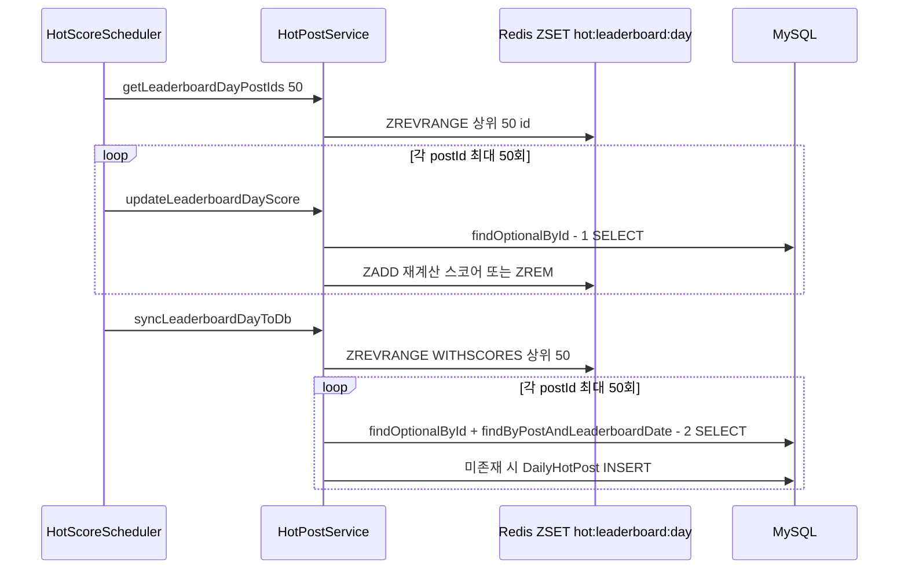

# Schedulers — 4개 배치 작업의 주기, 흐름, 실패 동작

## 이 문서가 답하는 질문

- 스케줄러 4개는 각각 언제, 무엇을, 어떤 트랜잭션 경계로 실행하는가?
- 실패하면 무슨 일이 일어나는가 — 재시도는 있는가?
- 핫스코어 top-50 갱신과 조회 경로는 쿼리를 몇 번 날리는가?

## 3줄 요약

- 4개 전부 `@Scheduled` + `@SchedulerJob` AOP 조합이다: 시작/종료/소요시간을 로깅하고, 예외는 삼키지 않고 rethrow해 APM·알림이 감지하게 한다. 재시도는 없다 — 다음 주기를 기다린다.
- `ViewCountScheduler`(60초)와 `HotScoreScheduler`(5분)가 Redis 버퍼·랭킹을 DB로 동기화하는 핵심 축이고, 나머지 둘은 일·월 단위 정리 작업이다.
- top-50 갱신은 회당 최대 약 150 쿼리, 핫게시글 조회 API는 요청당 최대 10 쿼리를 날리는 건별 조회 구조다.

## 공통: @SchedulerJob AOP의 실패 정책

`aop/SchedulerJobAspect.java`가 `@SchedulerJob`이 붙은 메서드를 감싼다 (`@Order(LOWEST_PRECEDENCE - 1)`이라 트랜잭션 어드바이저 바깥에서 commit/rollback 시간까지 측정).

실패 시 동작은 aspect 주석에 정책으로 명시되어 있다. `SchedulerJobAspect · handle()` 원문 인용:

> "Spring @Scheduled에서는 스케줄러가 예외를 이미 처리하므로, 예외를 삼키지 말고 rethrow해야 모니터링/에러 핸들러/APM으로 장애가 정상 전달된다."

그리고 `SchedulerJob` 애노테이션 javadoc:

> "Spring TaskScheduler의 기본 ErrorHandler가 예외를 안전하게 처리하므로, rethrow해도 스케줄러 스레드가 종료되지 않음"

즉 실패한 주기는 ERROR 로그(full stacktrace는 이 aspect가 단독 출력) 후 버려지고, 다음 주기에 다시 시도된다. `Error`(JVM 장애)는 catch하지 않고, void 아닌 메서드에 붙이면 기동 시 `IllegalStateException`으로 거부한다.

## 스케줄러 4개 상세

### 1. ViewCountScheduler — 조회수 동기화

| 항목 | 값 (코드 실측) |
|---|---|
| 주기 | `@Scheduled(fixedDelay = 60000)` — 이전 실행 종료 후 60초 |
| 트랜잭션 | `syncViewsToDB()`에 `@Transactional` — 배치 전체가 한 트랜잭션 |
| 흐름 | `ViewCountService.drainViewCounts()`로 Redis `post:views:*`를 KEYS+GETDEL 소비 → 게시글별 `applyViewCount()`로 `viewCount` 증가 → 각 게시글의 일별 핫스코어도 재계산 (`HotPostService.updateLeaderboardDayScore`) |
| 실패 시 | Redis 장애면 AOP 기본값(빈 Map)으로 그 주기 스킵. 게시글 단위 예외는 루프 안 try/catch로 건너뜀. 단 드레인이 선(先)삭제라 DB 반영 실패분은 유실된다 |

내부 `applyViewCount()`의 `@Transactional`은 자기호출이라 무효다. 유실·자기호출 상세는 [KI-23](../KNOWN-ISSUES.md#ki-23-viewcountscheduler의-자기호출-트랜잭션과-드레인-유실), KEYS 명령 문제는 [KI-17](../KNOWN-ISSUES.md#ki-17-조회수-드레인이-블로킹-keys-명령-사용).

### 2. HotScoreScheduler — 핫스코어 top-50 갱신

| 항목 | 값 (코드 실측) |
|---|---|
| 주기 | `@Scheduled(fixedRate = 5 * 60 * 1000)` — 5분 |
| 트랜잭션 | `updateHotScore()`에 `@Transactional` |
| 흐름 | 아래 시퀀스 참고 |
| 실패 시 | rethrow 정책. Redis 장애면 `getLeaderboardDayPostIds`가 빈 Set → 즉시 종료 (그 주기 갱신 없음) |

- **쿼리 횟수**: 갱신 루프 최대 50 SELECT + DB 동기화 루프 최대 100 SELECT(+INSERT) = 회당 최대 약 150 쿼리. 전부 id 단건 조회라 IN 절 배치화 여지가 있다.
- **조회 경로도 같은 특성이다**: `GET /api/hotposts/daily` → `HotPostService · getLeaderboardDayHotPosts()`가 ZSET 상위 10개 id를 받아 **id당 `findOptionalById` 1 SELECT씩 최대 10 쿼리**를 날리고, 좋아요 10개 미만을 걸러낸다. Redis가 비면 `DailyHotPost` 테이블 fallback을 탄다.
- 스코어 계산식 자체(`Utils/HotScoreCalculator`)와 이벤트 트리거는 [transactions-events.md](transactions-events.md)·기존 [HOT_POST_SYSTEM.md](../HOT_POST_SYSTEM.md) 참고. README의 "1분/전체 갱신" 서술은 구버전이다 ([KI-11](../KNOWN-ISSUES.md#ki-11-readme의-핫스코어-갱신-주기-서술이-코드와-다름)).

### 3. TokenCleanupScheduler — 만료 리프레시 토큰 정리

| 항목 | 값 (코드 실측) |
|---|---|
| 주기 | `@Scheduled(cron = "0 0 3 * * *")` — 매일 03:00 |
| 트랜잭션 | `@Transactional` — 삭제 쿼리 1건 |
| 흐름 | `tokenRepository.deleteAllExpired(now)` — `TNK_expires_at`이 지난 행 일괄 삭제 |
| 실패 시 | rethrow 정책. 실패해도 다음 날 재시도로 자연 수렴. Redis `RT:` 키는 자체 TTL로 소멸하므로 이 작업은 DB만 정리한다 |

### 4. SchoolMealScheduler — 급식 데이터 수집

| 항목 | 값 (코드 실측) |
|---|---|
| 주기 | `@Scheduled(cron = "0 0 0 1 * ?")` — **매월 1일 00:00** (README의 "매월 말일" 서술과 다름 — [KI-30](../KNOWN-ISSUES.md#ki-30-급식-수집-주기가-readme와-다름)) |
| 트랜잭션 | 스케줄러 메서드에 `@Transactional` 없음 — 하위 서비스 경계에 위임 |
| 흐름 | `SchoolMealService.loadAllSchoolMealsForMonth(당월)` → NEIS API 수집 → `importMealsFromJson(당월)` DB 적재 |
| 실패 시 | rethrow 정책, 재시도 없음 — 실패하면 다음 달 1일까지 해당 월 급식이 비게 된다. 수동 재실행 수단은 코드에 없다 |

## 코드 좌표

| 개념 | 위치 |
|---|---|
| 수명주기 로깅·rethrow 정책 | `aop/SchedulerJob.java`(javadoc), `aop/SchedulerJobAspect.java · handle()` |
| 조회수 동기화 | `schedulers/ViewCountScheduler.java · syncViewsToDB() / applyViewCount()` |
| 핫스코어 갱신 | `schedulers/HotScoreScheduler.java · updateHotScore()`, `services/domain/HotPostService · updateLeaderboardDayScore() / syncLeaderboardDayToDb()` |
| 핫게시글 조회 경로 | `services/domain/HotPostService · getLeaderboardDayHotPosts()`, `controllers/HotPostController` |
| 토큰 정리 | `schedulers/TokenCleanupScheduler.java · deleteExpiredTokens()` |
| 급식 수집 | `schedulers/SchoolMealScheduler.java · loadSchoolMeals()`, `api/SchoolMealService` |

## 알려진 문제·미확인 사항

- [KI-17](../KNOWN-ISSUES.md#ki-17-조회수-드레인이-블로킹-keys-명령-사용) KEYS 블로킹 명령
- [KI-23](../KNOWN-ISSUES.md#ki-23-viewcountscheduler의-자기호출-트랜잭션과-드레인-유실) 자기호출 무효 트랜잭션 + 유실 창
- [KI-20](../KNOWN-ISSUES.md#ki-20-핫랭킹-zset-키에-ttl이-없어-무기한-누적) 날짜별 랭킹 키 누적 — 정리 스케줄러가 없다
- [KI-30](../KNOWN-ISSUES.md#ki-30-급식-수집-주기가-readme와-다름) 급식 주기 문서 불일치
- [KI-11](../KNOWN-ISSUES.md#ki-11-readme의-핫스코어-갱신-주기-서술이-코드와-다름) 핫스코어 주기 문서 불일치
- [KI-44](../KNOWN-ISSUES.md#ki-44-외부-api-resttemplate에-타임아웃이-없음) 스케줄러 스레드 풀 크기 **1** — 장시간 작업이 다른 주기를 밀어낸다

### 스레드 풀 크기 — `[미확인]` 해소 (2026-08-18)

이전 판에 "기본 단일 스레드로 추정되나 확정 근거를 찾지 못함"으로 남아 있던 항목이다.
**단일 스레드가 맞다.** 근거는 두 가지이며 둘 다 부재 증명이다.

| 확인 | 명령 | 결과 |
|---|---|---|
| `TaskScheduler` 빈 정의 | `grep -rn "TaskScheduler" src/main/java` | 0건 (주석 1건 제외) |
| 풀 크기 설정 | `grep -rn "task.scheduling" src/main/resources` | 0건 (properties 4개 전부) |

`HighteendayBackendApplication`에 `@EnableScheduling`만 있고 커스터마이징이 없으므로 Spring
Boot의 `TaskSchedulingProperties` 기본값인 **풀 크기 1**이 적용된다. 즉 아래 네 작업이
스레드 하나를 공유한다.

| 작업 | 주기 | 위험 |
|---|---|---|
| `ViewCountScheduler` | 60초 | 밀리면 Redis 조회수 버퍼가 계속 쌓인다 |
| `HotScoreScheduler` | 5분 | 밀리면 시간 감쇠가 반영되지 않아 순위가 굳는다 |
| `TokenCleanupScheduler` | 매일 03:00 | 지연 허용 |
| `SchoolMealScheduler` | 매월 1일 00:00 | **외부 NEIS 호출 — 타임아웃 없음** |

마지막 항목이 [KI-44](../KNOWN-ISSUES.md#ki-44-외부-api-resttemplate에-타임아웃이-없음)와
맞물린다. `AppConfig.restTemplate()`이 `new RestTemplate()`이라 read 타임아웃이 없으므로,
NEIS가 무응답이면 그 스레드가 무기한 대기하고 **조회수 동기화와 핫스코어 갱신이 함께
멈춘다.** 위험 창은 월 1회지만 정지 시간에 상한이 없다.

조치는 KI-44에 적었다 — 타임아웃 설정과 풀 크기 확대가 **둘 다** 필요하다.

마지막 검증일: 2026-08-18 (최초 작성 2026-07-30)
