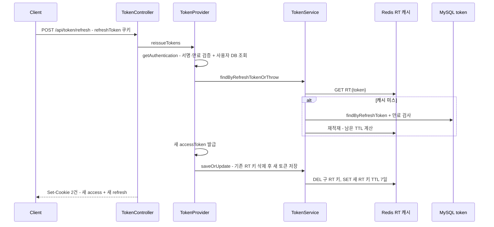

# Security — 토큰 구조, 쿠키, 리프레시 회전, 인가 규칙 전수표

## 이 문서가 답하는 질문

- 액세스/리프레시 토큰은 어떤 알고리즘·만료로 발급되는가?
- 쿠키 속성은 프로파일별로 어떻게 다른가?
- 리프레시 회전(rotation)은 어떤 순서로 일어나는가?
- 모든 HTTP 엔드포인트의 인가 상태는 각각 무엇이고 근거 규칙은 무엇인가?

## 3줄 요약

- JWT는 HS512 서명, 액세스 30분·리프레시 7일이며 리프레시는 사용자당 1행(`Token` 엔티티) + Redis 캐시(`RT:` 키)로 서버 측 폐기가 가능하다.
- 쿠키는 항상 HttpOnly이고, `Secure`/`SameSite`/`Domain`은 프로파일 프로퍼티로 갈린다 (prod만 `Secure; SameSite=None; Domain=.highteenday.org`).
- 인가는 명시된 GET 경로만 인증을 요구하는 블랙리스트 구조라서 ([KI-04](../KNOWN-ISSUES.md#ki-04-get-전체가-permitall인-블랙리스트-인가-구조)), 친구 목록 등 일부 GET이 의도와 달리 공개 상태다 — 아래 전수표 참고.

인증 필터 체인이 요청을 처리하는 순서(인증 vs 인가, 예외 3갈래)는 [04-request-flow.md](../04-request-flow.md)가 단일 출처다. 이 문서는 그 위에서 토큰·쿠키·인가 규칙의 세부만 다룬다.

## 토큰 구조

`security/TokenProvider.java` 기준:

| 항목 | 값 | 근거 |
|---|---|---|
| 서명 알고리즘 | HS512 (`SignatureAlgorithm.HS512`), 키는 `jwt.key` 프로퍼티 | `TokenProvider · generateToken()` / `setSecretKey()` |
| 액세스 토큰 만료 | 30분 (`ACCESS_TOKEN_EXPIRE_TIME = 1000*60*30`) | `TokenProvider` 상수 |
| 리프레시 토큰 만료 | 7일 (`REFRESH_TOKEN_EXPIRE_TIME`) | `TokenProvider` 상수 |
| 클레임 | `sub`(이메일), `role`, `name`, `provider`, `iat`, `exp` | `TokenProvider · generateToken()` |
| ROLE_GUEST | 리프레시 토큰을 발급하지 않는다 (null 반환) | `TokenProvider · generateRefreshToken()` |
| 서버 측 저장 | 사용자당 1행 `Token` 엔티티(`TNK_refresh`/`TNK_access`, 만료 `TNK_expires_at`) + Redis `RT:{refreshToken}` 캐시 | `services/domain/TokenService · saveOrUpdate()` |

액세스·리프레시 토큰의 클레임 구성은 동일하고 만료만 다르다 — 리프레시 토큰만의 식별 클레임은 없다.

## 쿠키 속성 — 프로파일별

발급은 `services/security/JwtCookieService.java`가 전담한다. 이름·경로·수명은 코드에 고정이고, 나머지 속성은 프로퍼티로 갈린다.

| 속성 | accessToken | refreshToken |
|---|---|---|
| Path | `/` | `/api/token/refresh` (갱신 요청에만 전송됨) |
| Max-Age | 1800초 | 604800초 |
| HttpOnly | 항상 true | 항상 true |

| 프로퍼티 | local 기본값 | dev | prod |
|---|---|---|---|
| `app.cookie-secure` | false (`application.properties`) | false (base 상속) | true |
| `app.cookie-same-site` | Lax | Lax (base 상속) | None |
| `app.cookie-domain` | 미설정 (Domain 속성 생략) | 미설정 | `.highteenday.org` |

`JwtCookieService`의 `@Value` 기본값은 `secure=true`/`SameSite=None`이지만, base `application.properties`가 항상 로드되므로 실제로는 위 표의 값이 적용된다. prod 조합(`SameSite=None` + CSRF 비활성)의 위험은 [KI-06](../KNOWN-ISSUES.md#ki-06-쿠키-인증--samesitenone--csrf-비활성-조합) 참고.

## 리프레시 회전 흐름

`POST /api/token/refresh` (`controllers/TokenController.java · refresh()`):

- 회전형이다: 갱신 때마다 리프레시 토큰 자체가 교체되고, 구 토큰의 Redis 키는 삭제, DB 행은 새 값으로 갱신된다 (`TokenService · saveOrUpdate()`).
- 쿠키가 없으면 401, 검증 실패는 `TokenException`/`RuntimeException`으로 전파된다. 이 경로의 예외가 ErrorCode 없는 raw `RuntimeException`이라는 문제는 [KI-14](../KNOWN-ISSUES.md#ki-14-tokenservice가-errorcode-없이-raw-runtimeexception을-던짐) 참고.
- 로그아웃·탈퇴 시 `TokenService · deleteByUserEmail()`이 DB 행과 Redis 키를 함께 지운다.

## 엔드포인트 × 인가 규칙 전수표

`security/SecurityConfig.java · filterChain()`의 규칙(위에서 아래로 첫 매칭)과 `controllers/` 전 파일의 매핑을 대조했다. "근거"는 매칭되는 SecurityConfig 규칙이다.

| 경로 | 메서드 | 인가 상태 | 근거 |
|---|---|---|---|
| `/ws/**` | 핸드셰이크 | 공개 (이후 STOMP 검문은 [04](../04-request-flow.md)) | `/ws/**` permitAll |
| `/api/boards` | GET | 공개 | `GET /**` permitAll |
| `/api/boards/{boardId}/posts` | GET | 공개 | `GET /**` permitAll |
| `/api/posts/{postId}`, `/api/posts/search` | GET | 공개 | `GET /**` permitAll |
| `/api/posts` | POST | 인증 | anyRequest |
| `/api/posts/{postId}` | PATCH, DELETE | 인증 (소유권 검증은 없음 — [KI-05](../KNOWN-ISSUES.md#ki-05-게시글댓글-수정삭제에-소유권-검증이-없음-idor)) | anyRequest |
| `/api/posts/{postId}/reaction` | POST | 인증 | anyRequest |
| `/api/posts/{postId}/scraps` | POST | 인증 | anyRequest |
| `/api/posts/{postId}/comments`, `.../comments/{commentId}` | GET | 공개 | `GET /**` permitAll |
| `/api/posts/{postId}/comments` | POST | 인증 | anyRequest |
| `/api/posts/{postId}/comments/{commentId}` | PATCH, DELETE | 인증 (소유권 검증 없음 — KI-05) | anyRequest |
| `/api/posts/{postId}/consistency` | GET | 공개 · 단 `@Profile("!prod")`라 운영엔 없음 | `GET /**` permitAll |
| `/api/comments/{commentId}/reaction` | POST | 인증 | anyRequest |
| `/api/hotposts/daily` | GET | 공개 | `GET /**` permitAll |
| `/api/friends/list`, `/api/friends/requests/sent`, `/api/friends/requests/received` | GET | **공개 — 의도와 다를 가능성 높음.** 비인증 호출 시 principal null로 500 | `GET /**` permitAll ([KI-04](../KNOWN-ISSUES.md#ki-04-get-전체가-permitall인-블랙리스트-인가-구조)) |
| `/api/friends/search`, `/request`, `/respond` | POST | 인증 | anyRequest |
| `/api/friends/delete` | DELETE | 인증 | anyRequest |
| `/api/friends/block`, `/unBlock` | PATCH | 인증 | anyRequest |
| `/api/chat/**` (rooms, messages, read-status, members) | GET | 인증 | `GET /api/chat/**` authenticated |
| `/api/chat/**` | POST, PATCH, DELETE | 인증 | anyRequest |
| `/api/notifications/**` | GET | 인증 | `GET /api/notifications/**` authenticated |
| `/api/notifications/**` | PATCH, DELETE | 인증 | anyRequest |
| `/api/mypage/posts`, `/comments`, `/scraps` | GET | 인증 | `GET /api/mypage/**` authenticated |
| `/api/media` | POST | 인증 | anyRequest |
| `/api/media/profile-image` | PATCH | 인증 | anyRequest |
| `/api/schools/search` | GET | 공개 (`/api/schools/meals/**`에 불포함) | `GET /**` permitAll |
| `/api/schools/meals/today`, `/date`, `/month` | GET | 인증 | `GET /api/schools/meals/**` authenticated |
| `/api/timetableTemplates/**` (템플릿·과목·시간표 전 GET) | GET | 인증 | `GET /api/timetableTemplates/**` authenticated |
| `/api/timetableTemplates/**` | POST, PATCH, DELETE | 인증 | anyRequest |
| `/api/user/check/nickname`, `/email`, `/phone` | GET | 공개 | `GET /api/user/check/**` permitAll (인증 규칙보다 먼저 선언) |
| `/api/user/OAuth2UserInfo`, `/api/user/userInfo` | GET | 인증 | `GET /api/user/**` authenticated |
| `/api/user/register`, `/api/user/login` | POST | 공개 | 명시 permitAll |
| `/api/user/logout` | POST | 인증 | 명시 authenticated |
| `/api/user/account` | DELETE | 인증 | 명시 authenticated |
| `/api/user/password/verify` | POST | 인증 | anyRequest |
| `/api/user/password`, `/nickname`, `/school`, `/phone` | PATCH | 인증 | anyRequest |
| `/api/token/refresh` | POST | 공개 (토큰 자체가 자격) | 명시 permitAll |
| `/error` | POST | 공개 | 명시 permitAll |
| `/oauth2/authorization/*`, `/oauth2/login/code/*` | GET | 공개 (OAuth2 로그인 플로우) | `oauth2Login` 설정 + `GET /**` |

새 GET 엔드포인트를 추가하면 **기본값이 "공개"** 라는 점이 이 표의 핵심 함정이다 (KI-04).

## Swagger — 전 프로파일 개방

`SecurityConfig · securityCustomizer()`의 `web.ignoring()`이 `/swagger-ui/**`, `/swagger/**`(springdoc api-docs 경로 `/swagger/api-docs` 포함), `/favicon.ico`, `/actuator/health`를 시큐리티 필터 체인에서 제외한다. 이 빈에는 `@Profile` 조건이 없어 **prod에서도 Swagger UI와 API 명세가 비인증으로 열려 있다.** ALB도 `/swagger-ui/*`를 백엔드로 라우팅한다 (CLAUDE.md 배포 절).

## 코드 좌표

| 개념 | 위치 |
|---|---|
| 토큰 발급·검증·회전 | `security/TokenProvider.java · generateToken() / reissueTokens()` |
| 쿠키 조립 | `services/security/JwtCookieService.java · build()` |
| 갱신 엔드포인트 | `controllers/TokenController.java · refresh()` |
| 리프레시 저장·회전·폐기 | `services/domain/TokenService.java · saveOrUpdate() / findByRefreshTokenOrThrow() / deleteByUserEmail()` |
| 리프레시 Redis 캐시 | `infrastructure/redis/RedisTokenCacheStore.java` |
| 인가 규칙·Swagger 제외 | `security/SecurityConfig.java · filterChain() / securityCustomizer()` |
| OAuth2 성공 후 쿠키 발급 | `security/OAuth2SuccessHandler.java` |

## 알려진 문제·미확인 사항

- [KI-03](../KNOWN-ISSUES.md#ki-03-실제-neis-api-키가-소스-주석에-커밋되어-있음) 소스 주석의 실 API 키
- [KI-04](../KNOWN-ISSUES.md#ki-04-get-전체가-permitall인-블랙리스트-인가-구조) 블랙리스트 인가 — 위 표의 공개 GET들이 그 결과다
- [KI-05](../KNOWN-ISSUES.md#ki-05-게시글댓글-수정삭제에-소유권-검증이-없음-idor) 수정·삭제 IDOR
- [KI-06](../KNOWN-ISSUES.md#ki-06-쿠키-인증--samesitenone--csrf-비활성-조합) CSRF 비활성 조합
- [KI-07](../KNOWN-ISSUES.md#ki-07-tokenauthenticationfilter가-예외를-삼켜-tokenexceptionfilter가-사실상-동작하지-않음) / [KI-08](../KNOWN-ISSUES.md#ki-08-인증-성공-경로가-요청마다-db를-조회) 필터 체인 동작
- [KI-14](../KNOWN-ISSUES.md#ki-14-tokenservice가-errorcode-없이-raw-runtimeexception을-던짐) 갱신 실패 응답이 500으로 나가는 문제
- 사소한 잔재: SecurityConfig 명시 규칙의 `/api/user/loginUser`는 컨트롤러에 실제 매핑이 없다 (상위 `/api/user/**` 규칙에 포섭되므로 동작 영향 없음)
- `[미확인]` 리프레시/액세스 토큰이 클레임으로 구분되지 않는 것이 의도인지 — 액세스 토큰을 refresh 쿠키에 넣어도 서명·만료 검증은 통과하고 DB 대조 단계에서만 걸러진다

마지막 검증일: 2026-07-30
