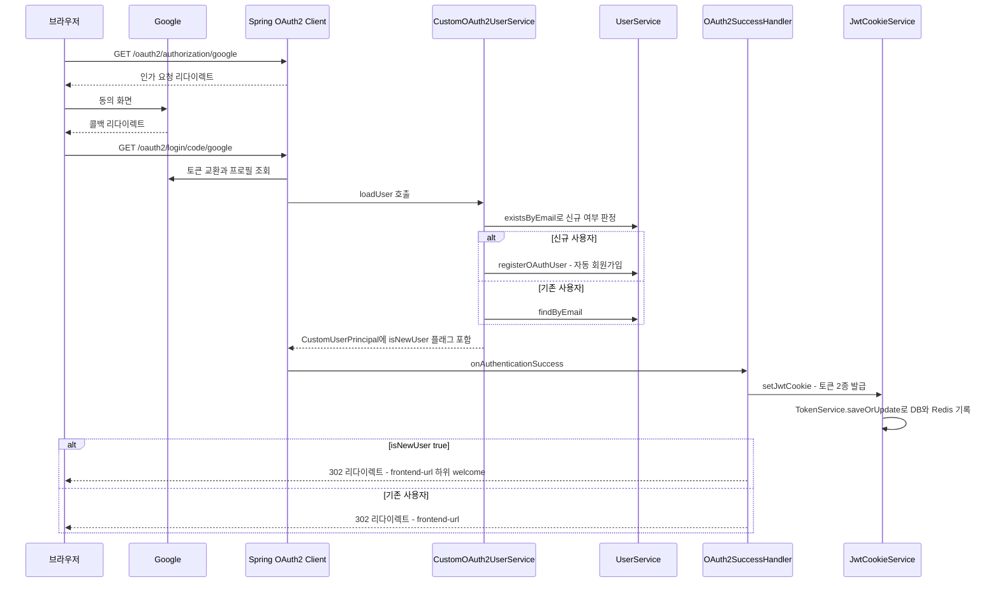
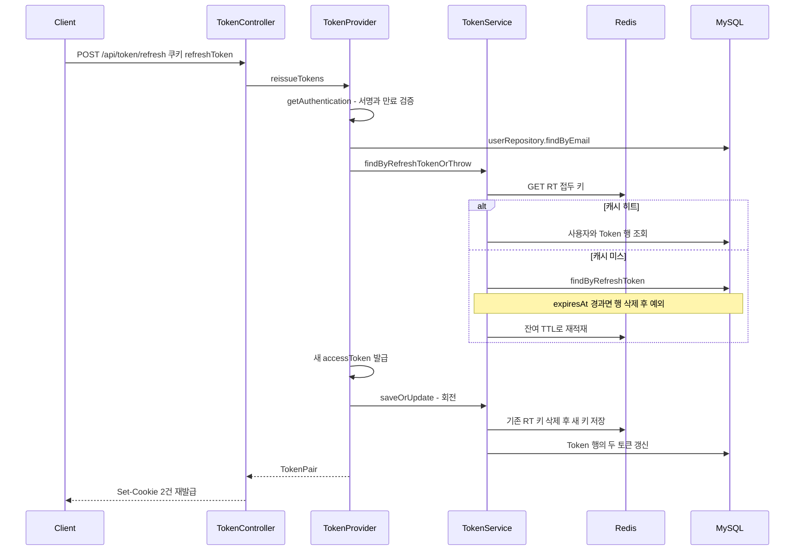

# domains/auth — 인증·토큰·회원 수명주기

## 이 문서가 답하는 질문

- 일반 로그인과 소셜 로그인은 각각 어떤 코드 경로를 지나는가?
- 액세스/리프레시 토큰은 어디에 저장되고, 리프레시 회전(rotation)은 어떻게 동작하는가?
- 쿠키는 어떤 속성·path 스코프로 발급되는가?
- 회원가입·로그아웃·탈퇴 시 서버에서 무엇이 만들어지고 지워지는가?

매 요청의 토큰 검증(필터 체인)은 이 문서가 아니라 [04-request-flow.md](../04-request-flow.md)가 다룬다.

## 3줄 요약

- 로그인 수단은 2가지 — 이메일+비밀번호(BCrypt 검증)와 Google OAuth2. 두 경로 모두 `services/security/JwtCookieService`가 HttpOnly 쿠키 2개(`accessToken` 30분, `refreshToken` 7일)를 내려주는 지점에서 합류한다.
- 액세스 토큰은 쿠키로만 검증한다. 리프레시 토큰은 쿠키 + DB `Token` 엔티티 + Redis 캐시(`RT:` 접두) 3곳에 저장되며, 리프레시 쿠키는 `path=/api/token/refresh`로 전송 범위가 제한된다.
- `POST /api/token/refresh`는 회전 방식이다 — 서명·만료·서버측 보유 여부를 검증한 뒤 액세스·리프레시를 둘 다 재발급하고 DB/Redis의 기존 리프레시 토큰을 교체한다.

## 일반 로그인

`POST /api/user/login` (permitAll) → `controllers/UserController.java · loginUser()`:

1. `services/domain/UserService · findByEmail()`로 사용자 조회 (없으면 `USER_NOT_FOUND`).
2. `BCryptPasswordEncoder.matches()`로 비밀번호 검증 (인코더 빈은 `configs/AppConfig.java · passwordEncoder()`). 실패 시 `INVALID_PASSWORD`.
3. `CustomUserPrincipal`을 만들어 `JwtCookieService.setJwtCookie()` 호출 — 여기서 토큰 2종 생성·쿠키 발급이 일어난다.

토큰 생성은 `security/TokenProvider.java`가 담당한다: HS512 서명, subject=이메일, `role`·`name`·`provider` 클레임 (`generateToken()`). 만료는 상수로 액세스 30분·리프레시 7일 (`ACCESS_TOKEN_EXPIRE_TIME` / `REFRESH_TOKEN_EXPIRE_TIME`). `generateRefreshToken()`은 발급과 동시에 `services/domain/TokenService · saveOrUpdate()`로 DB `Token` 행과 Redis 캐시에 기록한다.

## 회원가입

`POST /api/user/register` (permitAll) → `UserController · registerUser()` → `services/domain/UserService · register()`:

1. 이메일 중복이면 `ALREADY_EXISTS_USER`.
2. `domain/users/User · createDefault()`로 엔티티 생성 — 비밀번호는 `domain/users/vo/Password · fromRawPassword()`에서 BCrypt 해시.
3. `saveAndFlush` 후 기본 시간표 템플릿 1개를 자동 생성 (`createDefaultTimetableTemplate()`).
4. 곧바로 `JwtCookieService.setJwtCookie()`를 호출해 **가입 즉시 로그인 상태**가 된다.

이때 `UserService.register()`가 `HttpServletResponse`를 파라미터로 직접 받아 서비스 레이어에서 쿠키를 굽는다 — 웹 계층 관심사의 레이어 역류다. 상세는 아래 ⑤ 참고.

## 소셜 로그인 (OAuth2)

활성 provider는 **Google뿐**이다 — Kakao/Naver 설정은 `application-dev.properties`·`application-prod.properties`에 주석으로만 존재한다. 진입 URL은 `/oauth2/authorization/google`, 콜백은 `/oauth2/login/code/*`다 (`security/SecurityConfig.java · filterChain()`의 `authorizationEndpoint`/`redirectionEndpoint` 설정, `application.properties`의 `google.redirect-uri={baseUrl}/oauth2/login/code/{registrationId}`와 일치). CLAUDE.md·README가 안내하는 콜백 경로 `/login/oauth2/code/{provider}`는 코드와 다르다 (⑤).

단계별 근거:

- **신규/기존 분기** — `services/security/CustomOAuth2UserService.java · processOAuthUser()`: `super.loadUser()`로 Google 프로필을 받아 `UserService.existsByEmail()`로 판정한다. 신규면 `UserService.registerOAuthUser()`가 자동 가입시킨다 — 닉네임은 이메일 prefix 최대 12자를 기반으로, 중복 시 숫자 suffix를 붙여 생성하며 기본 시간표 템플릿도 만든다. 판정 결과는 `CustomUserPrincipal`의 `isNewUser` 필드로 전달된다.
- **리다이렉트** — `security/OAuth2SuccessHandler.java · onAuthenticationSuccess()`: 쿠키 발급 후 `isNewUser`면 `{app.frontend-url}/welcome`, 아니면 `{app.frontend-url}`로 302.
- **역할** — CLAUDE.md는 "신규 유저 → ROLE_GUEST"라 하나, `domain/users/User · createOAuth()`는 항상 `Role.USER`를 넣고 `security/CustomUserPrincipal`의 3-인자 생성자도 무조건 `Role.USER.getKey()` 권한을 부여한다. 따라서 `TokenProvider.generateRefreshToken()`의 "GUEST면 리프레시 미발급" 분기는 실제로 도달하지 않는다 (⑤).

## 토큰 저장 위치와 쿠키 스코프

| 토큰 | 클라이언트 | 서버 | 비고 |
|---|---|---|---|
| accessToken | 쿠키 `accessToken` — path=`/`, maxAge 1800초 | DB `Token.accessToken` 컬럼에도 저장되나 인증 경로에서 조회처 없음 (`TokenService.findByAccessTokenOrThrow()` 호출처 부재) | 검증은 쿠키 값만으로 수행 |
| refreshToken | 쿠키 `refreshToken` — **path=`/api/token/refresh`**, maxAge 604800초 | DB `domain/Token/Token` 엔티티 (`TNK_refresh`, `TNK_expires_at`, 사용자당 1행) + Redis `RT:{토큰값}` → 이메일, TTL 7일 (`infrastructure/redis/RedisTokenCacheStore`) | 서버측 폐기(로그아웃·회전)가 가능한 이유 |

쿠키 속성은 `services/security/JwtCookieService.java · build()`에서 일괄 결정된다: `HttpOnly`, `Secure`(`app.cookie-secure`, 기본 true), `SameSite`(`app.cookie-same-site`, 기본 None), `Domain`(`app.cookie-domain`, 빈 값이면 미설정). 리프레시 쿠키의 path 제한은 `buildRefreshCookie()`에서 확인된다 — 브라우저가 리프레시 토큰을 refresh 엔드포인트 외 요청에 실어 보내지 않게 하는 장치다.

## 토큰 refresh 회전

`POST /api/token/refresh` (permitAll) → `controllers/TokenController.java · refresh()`. 쿠키에 `refreshToken`이 없으면 즉시 401(빈 본문).

- 검증은 2중이다: JWT 자체 검증(`TokenProvider.getAuthentication()` — 만료/서명 오류 시 `TokenException`으로 401 계열 응답)과 서버측 보유 검증(`TokenService.findByRefreshTokenOrThrow()` — Redis 우선, 장애·미스 시 DB fallback).
- 회전은 `TokenService.saveOrUpdate()`가 수행한다: 기존 Redis 키 삭제 → `Token` 행의 refresh/access 갱신 → 새 Redis 키 put. 즉 이전 리프레시 토큰은 재사용 불가가 된다.
- 단, 서버측 검증 실패는 raw `RuntimeException`이라 401이 아닌 500으로 떨어진다 (⑤).

## 로그아웃 · 회원 탈퇴

- **로그아웃** — `POST /api/user/logout` (authenticated) → `UserController · logout()`: `TokenService.deleteByUserEmail()`이 Redis `RT:` 키와 DB `Token` 행을 삭제하고, `JwtCookieService.expireAccessCookie()/expireRefreshCookie()`로 두 쿠키를 maxAge 0으로 만료시킨다. 액세스 토큰 자체는 만료 전까지 유효하다(서버측 액세스 토큰 블랙리스트 없음).
- **탈퇴** — `DELETE /api/user/account` (authenticated) → `UserController · deleteAccount()`: 토큰 삭제 + 쿠키 만료는 로그아웃과 동일하고, 추가로 `UserService.deleteAccount()`가 `userRepository.delete()`로 **물리 삭제를 시도**한다. 게시글·댓글 등 FK 참조가 남아 있으면 `DATA_INTEGRITY_ERROR`로 실패한다 — soft delete 원칙(`domain/base/BaseEntity`)과 어긋나는 지점이다 (⑤).

## 코드 좌표

| 개념 | 위치 |
|---|---|
| 일반 로그인·회원가입·로그아웃·탈퇴 핸들러 | `controllers/UserController.java · loginUser() / registerUser() / logout() / deleteAccount()` |
| 토큰 재발급 핸들러 | `controllers/TokenController.java · refresh()` |
| 쿠키 생성·만료·속성 | `services/security/JwtCookieService.java · buildAccessCookie() / buildRefreshCookie() / build()` |
| JWT 생성·검증·회전 | `security/TokenProvider.java · generateAccessToken() / generateRefreshToken() / reissueTokens() / parseClaims()` |
| 리프레시 토큰 서버측 저장·검증 | `services/domain/TokenService.java · saveOrUpdate() / findByRefreshTokenOrThrow() / deleteByUserEmail()` |
| 리프레시 토큰 엔티티 / Redis 캐시 | `domain/Token/Token.java`, `infrastructure/redis/RedisTokenCacheStore.java` |
| OAuth2 사용자 로드·신규 분기 | `services/security/CustomOAuth2UserService.java · processOAuthUser()` |
| OAuth2 성공 후 쿠키·리다이렉트 | `security/OAuth2SuccessHandler.java · onAuthenticationSuccess()` |
| OAuth2 자동 가입·닉네임 생성 | `services/domain/UserService.java · registerOAuthUser()` |
| OAuth2 엔드포인트·인가 규칙 | `security/SecurityConfig.java · filterChain()` |
| 만료 토큰 정리 배치 | `schedulers/TokenCleanupScheduler.java` |

## 알려진 문제·미확인 사항

- [KI-06](../KNOWN-ISSUES.md#ki-06-쿠키-인증--samesitenone--csrf-비활성-조합) 쿠키 인증 + SameSite=None + CSRF 비활성 조합
- [KI-07](../KNOWN-ISSUES.md#ki-07-tokenauthenticationfilter가-예외를-삼켜-tokenexceptionfilter가-사실상-동작하지-않음) 만료 토큰이 코드별 401 대신 획일적 401로 응답됨
- [KI-08](../KNOWN-ISSUES.md#ki-08-인증-성공-경로가-요청마다-db를-조회) 인증 성공 경로의 요청당 DB 조회
- [KI-32](../KNOWN-ISSUES.md) — **회원가입의 레이어 역류**: `UserService.register()`가 `HttpServletResponse`를 받아 서비스 레이어에서 쿠키를 발급한다 (`UserService`가 `JwtCookieService`에 의존). 컨트롤러 없이 재사용·테스트하기 어렵다.
- [KI-33](../KNOWN-ISSUES.md) — **ROLE_GUEST 분기가 죽은 코드**: `CustomUserPrincipal`의 3-인자 생성자가 사용자 실제 역할을 무시하고 항상 `ROLE_USER`를 부여해, `TokenProvider.generateRefreshToken()`의 GUEST 시 리프레시 미발급 분기와 CLAUDE.md의 "신규 유저 ROLE_GUEST" 서술이 모두 실동작과 다르다. CLAUDE.md의 OAuth 콜백 경로 서술(`/login/oauth2/code/{provider}`)도 코드(`/oauth2/login/code/*`)와 불일치.
- [KI-34](../KNOWN-ISSUES.md) — **탈퇴가 물리 삭제**: `UserService.deleteAccount()`가 hard delete를 시도해 게시글·댓글이 있는 사용자는 `DATA_INTEGRITY_ERROR`로 탈퇴에 실패한다.
- [KI-14](../KNOWN-ISSUES.md) — **리프레시 검증 실패가 500**: `TokenService.findByRefreshTokenOrThrow()`가 `CustomException`이 아닌 raw `RuntimeException`을 던져, 위조·폐기된 리프레시 토큰 요청이 `GlobalExceptionHandler`의 `Exception.class` 핸들러로 흘러 401이 아닌 500으로 응답된다.
- `[미확인]` Google 콘솔에 등록된 실제 redirect URI가 `/oauth2/login/code/google`과 일치하는지 — 외부 설정이라 저장소만으로 검증 불가.

마지막 검증일: 2026-07-30
