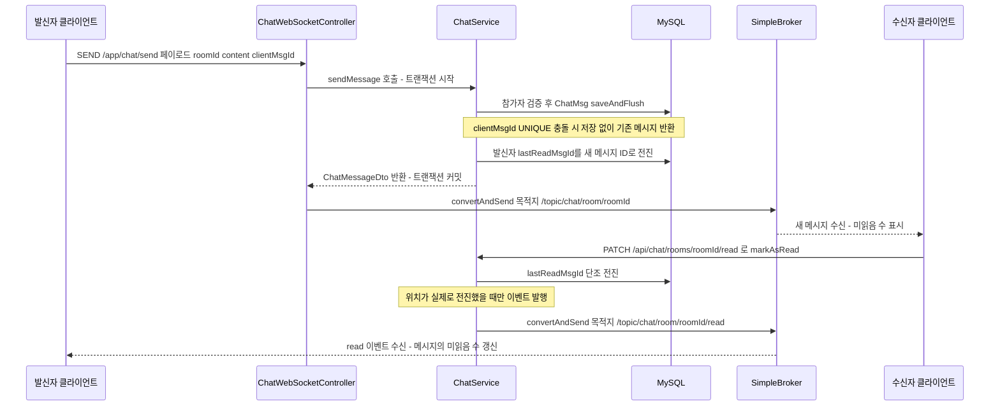

# Chat — 1:1·단체 채팅 도메인

> 이 문서는 기존 [GROUP_CHAT.md](../GROUP_CHAT.md)(단체 채팅 작업 기록)를 흡수해 현행 코드 기준으로 재검증한 결정판이다.
> WebSocket 핸드셰이크·CONNECT·SUBSCRIBE 검문은 [04-request-flow.md](../04-request-flow.md)에 있다 — 여기서는 반복하지 않는다.

## 이 문서가 답하는 질문

- 채팅방·참가자·메시지는 어떤 구조이고, 어떤 UNIQUE 제약이 동시성 문제를 막는가?
- 재연결로 같은 메시지가 두 번 올라오면 어떻게 한 번만 저장되는가?
- "안 읽은 N명"은 어떻게 계산되고, 읽음 이벤트 브로드캐스트 증폭은 어떻게 억제하는가?
- 신규 입장자에게 과거 대화가 보이지 않는 것은 어떤 메커니즘인가?
- 방장/관리자/멤버는 각각 무엇을 할 수 있고, 방장이 나가면 어떻게 되는가?

## 3줄 요약

- 동시성은 애플리케이션 로직이 아니라 DB UNIQUE 제약으로 막는다: 1:1 방 중복은 `pairKey` UNIQUE, 메시지 중복 저장은 `(방, clientMsgId)` UNIQUE — 둘 다 `DataIntegrityViolationException`을 잡아 "먼저 저장된 쪽"을 반환한다.
- 읽음 추적은 `lastReadMsgId`(단조 증가) 하나로 통일: 미읽음 수 = 이 값이 메시지 ID보다 작은 참여자 수. 발신자는 전송 시 자동 전진, 신규 입장자는 `joinedMsgId`에서 시작하므로 예외 분기가 없다.
- 읽음 이벤트는 위치가 실제로 전진했을 때만 발행해 대형 방의 인원수 제곱 브로드캐스트 증폭을 막는다.

## 도메인 모델

| 엔티티 | 테이블 | 핵심 필드·제약 |
|---|---|---|
| `domain/chat/ChatRoom` | `chat_rooms` | `category`(PRIVATE/GROUP/SCHOOL/GRADE), `pairKey`(UNIQUE `uk_chat_rooms_pair_key`, PRIVATE 전용), `owner`(GROUP 방장), `lastMessage`(목록 미리보기), `name`(PRIVATE은 null) |
| `domain/chat/ChatParticipants` | `chat_participants` | `role`(ChatRole), `lastReadMsgId`, `joinedAt`/`joinedMsgId`, `notificationEnabled`, UNIQUE `(CHT_RM_id, USR_id)`, INDEX `(USR_id, is_valid)` |
| `domain/chat/ChatMsg` | `chat_messages` | `type`(TEXT/IMAGE/SYSTEM), `clientMsgId`(멱등성 키, SYSTEM은 null), UNIQUE `(CHT_RM_id, CHT_MSG_client_id)`, INDEX `(CHT_RM_id, CHT_MSG_id DESC)` |

- 역할은 `enums/ChatRole`(OWNER/ADMIN/MEMBER, `canManageRoom()` = OWNER 또는 ADMIN), 방 분류는 `enums/ChatRoomCategory`(`isMultiParty()` = PRIVATE 아님). `SCHOOL`/`GRADE`는 enum에만 있고 생성 경로가 없다.
- 나가기·강퇴는 `ChatParticipants`의 soft delete(`isValid=false`)로 표현하고, 재입장 시 `rejoin()`이 행을 되살린다.
- prod는 `ddl-auto=none`이므로 이 스키마는 `src/main/resources/ddl/V_group_chat.sql`을 수동 실행해 반영한다 (컬럼 추가 → 백필 → 제약 순서 고정).

## 1:1 방 생성 — pairKey 동시성 처리

`services/domain/ChatService · getOrCreatePrivateRoom()`:

1. 친구 관계 검증(`requireFriendship()` — `domain/friends/FriendRepository · findFriendIdsAmong()` 한 방 쿼리).
2. `ChatRoom.pairKeyOf(a, b)`가 `"{작은USR_id}:{큰USR_id}"`를 만들고 `findByPairKey()`로 기존 방을 찾는다. 있으면 그 방을 반환하며, 한쪽이 나갔던 경우 `restoreParticipantIfLeft()`가 참가자 행을 `rejoin()`으로 되살린다.
3. 없으면 `saveAndFlush()`로 즉시 INSERT를 시도한다. 동시 요청이 겹쳐 `DataIntegrityViolationException`(UNIQUE 위반)이 나면, 조회-후-생성 사이 race에서 진 것이므로 **먼저 만들어진 방을 다시 조회해 그대로 반환**한다. 방이 두 개 생길 수 없다.

## 메시지 전송 — clientMsgId 멱등성

`services/domain/ChatService · sendMessage()`:

1. 참가자 검증(`requireParticipant()`), 본문·이미지 둘 다 없으면 `CHAT_EMPTY_MESSAGE`.
2. `clientMsgId`(클라이언트 발급 UUID)가 있으면 `findByChatRoomIdAndClientMsgId()`로 선조회 — 재연결 후 재전송이면 저장하지 않고 원본을 반환한다.
3. 선조회를 통과해도 동시 재전송이면 `saveAndFlush()`가 UNIQUE `(방, clientMsgId)` 위반으로 실패한다. 이때도 예외를 잡아 **먼저 저장된 승자를 조회해 반환**한다.
4. 저장 성공 시 방의 `lastMessage` 미리보기를 갱신하고, **발신자의 `lastReadMsgId`를 새 메시지 ID로 전진**시킨다 — 그래서 미읽음 집계에 "발신자 제외" 분기가 필요 없다.

전송의 전 구간과 읽음 이벤트까지의 흐름:

SYSTEM 메시지(입장/퇴장/강퇴/이름변경 안내)는 `writeSystemMessage()`가 같은 메시지 토픽에 실어 보낸다. 별도 채널이 없고, `clientMsgId`가 null이라 UNIQUE 제약에 걸리지 않는다.

## 읽음 추적

### lastReadMsgId — 단조 증가

`domain/chat/ChatParticipants · updateLastReadMsgId()`는 새 값이 현재 값보다 클 때만 갱신한다. 지연 도착한 오래된 읽음 요청이 상태를 되돌릴 수 없다.

### read 이벤트 — 전진했을 때만 발행

`services/domain/ChatService · markAsRead()`는 갱신 전후 값을 비교해 **실제로 전진한 경우에만** `/topic/chat/room/{roomId}/read`로 이벤트를 발행한다. 무조건 발행하면 100명 방에서 전원이 활발히 읽을 때 100 x 100 규모로 증폭되기 때문이다. `lastMsgId` 파라미터를 비우면 방의 최신 메시지(`findLastMsgIdByRoomId()`)까지 읽은 것으로 처리한다. 서버측 디바운스(일정 시간 묶음 발행)는 구현되어 있지 않다.

### joinedMsgId — 입장 이전 대화 차단

- 신규 참가자는 `newParticipant()`에서 `joinedMsgId = lastReadMsgId = 입장 시점 방의 마지막 메시지 ID`로 시작한다. 입장 이전 메시지는 `id <= joinedMsgId <= lastReadMsgId`가 되어 자동으로 "읽음"이며, 과거 메시지의 미읽음 수가 신규 입장자 때문에 늘지 않는다.
- 히스토리 조회(`getChatMessages()`)는 `joinedMsgId`를 커서 쿼리의 하한(`floor`)으로 넘겨 입장 이전 메시지를 아예 반환하지 않는다 (`domain/chat/ChatMsgRepository · findByRoomIdWithCursor()`).
- 나갔다 재입장하면 `rejoin()`이 `joinedMsgId`를 다시 찍으므로 부재 중 대화도 보이지 않는다.

### 미읽음 수 계산

- 규칙: 메시지 M의 미읽음 수 = `lastReadMsgId < M.id`인 참여자 수. SYSTEM 메시지는 항상 0 (`unreadCountOf()`).
- 메시지별 계산: 참여자들의 읽음 위치를 한 번 정렬(`readPositionsOf()`)해두고 메시지마다 이진탐색(`countLessThan()`) — 참여자 P, 메시지 M에 대해 O(P log P + M log P).
- 방 목록의 방별 미읽음 합계: `domain/chat/ChatMsgRepository · countUnreadByUserId()` native 쿼리 한 번으로 내 모든 방을 집계한다(N+1 제거). 내가 보낸 메시지와 SYSTEM 메시지는 세지 않는다.

## 역할 모델과 멤버 관리

| 동작 | 요구 권한 | 검증 위치 |
|---|---|---|
| 초대 | OWNER, ADMIN + 초대자-대상 친구 관계 | `ChatService · inviteMembers()` |
| 강퇴 | OWNER, ADMIN. 방장은 강퇴 불가, ADMIN은 OWNER만 강퇴 가능, 자기 자신 불가 | `ChatService · kickMember()` |
| 방 이름 변경 | OWNER, ADMIN. 1~30자 | `ChatService · updateRoomName()` |
| 관리자 임명/해제 | OWNER 전용. OWNER로 승격은 불가(방장 양도 미지원) | `ChatService · changeRole()` |
| 나가기 | 참여자 전원 | `ChatService · leaveRoom()` |
| 방별 알림 on/off | 참여자 본인 | `ChatService · updateNotification()` |

- 정원 100명(`MAX_MEMBERS`). 단체방 생성·초대 모두 적용.
- **방장 위임**: 방장이 나가면 남은 참여자 중 ADMIN 우선, 없으면 `findActiveMembers()` 정렬상 가장 앞(가장 오래된) 멤버가 OWNER가 된다. 마지막 1명이 나가면 방을 닫는다(`room.delete()` — soft delete).
- 멤버 변경은 `publishMemberEvent()`가 `/topic/chat/room/{roomId}/members`로 JOINED/LEFT/KICKED/ROOM_RENAMED/OWNER_CHANGED/ROLE_CHANGED 이벤트를 발행한다 (`dtos/Chat/ChatMemberEventDto`).
- `ChatParticipants.notificationEnabled`는 저장·조회만 되고 이를 소비하는 푸시 경로는 ChatService 안에 없다.

## API

### REST (`controllers/ChatController`, prefix `/api/chat`)

| 메서드 | 경로 | 설명 |
|---|---|---|
| POST | `/rooms` | 1:1 방 생성/조회 (기존 방 있으면 반환) |
| POST | `/rooms/group` | 단체방 생성. name 비우면 참여자 닉네임 이어붙여 30자 이내 자동 생성 |
| GET | `/rooms` | 내 방 목록. PRIVATE 방의 roomName은 서버가 상대 닉네임으로 채움(`resolveRoomName()`), members는 아바타용 최대 4명 |
| GET | `/rooms/{roomId}` | 방 상세 (참여자 전용) |
| PATCH | `/rooms/{roomId}` | 방 이름 변경 |
| GET | `/rooms/{roomId}/messages` | 커서 페이징. size 기본·최대 50, 응답은 오래된 것부터 |
| GET | `/rooms/{roomId}/read-status` | 참여자별 읽음 위치 |
| PATCH | `/rooms/{roomId}/read` | 읽음 처리 |
| GET | `/rooms/{roomId}/members` | 전체 멤버 목록 |
| POST | `/rooms/{roomId}/members` | 초대 |
| DELETE | `/rooms/{roomId}/members/me` | 나가기 |
| DELETE | `/rooms/{roomId}/members/{userId}` | 강퇴 |
| PATCH | `/rooms/{roomId}/members/{userId}/role` | 관리자 임명/해제 |
| PATCH | `/rooms/{roomId}/notification` | 방별 알림 on/off |

### WebSocket (STOMP) 목적지

발행·구독 검문 과정은 [04-request-flow.md](../04-request-flow.md)의 "WebSocket 연결의 여행" 참고.

| 방향 | 목적지 | 내용 |
|---|---|---|
| 클라 → 서버 | `/app/chat/send` | 메시지 전송 (`controllers/ChatWebSocketController · sendMessage()`) |
| 서버 → 방 구독자 | `/topic/chat/room/{roomId}` | 새 메시지 (SYSTEM 포함) |
| 서버 → 방 구독자 | `/topic/chat/room/{roomId}/read` | 읽음 위치 이동 (`dtos/Chat/ChatReadEventDto`) |
| 서버 → 방 구독자 | `/topic/chat/room/{roomId}/members` | 멤버 변경 이벤트 |

## 코드 좌표

| 개념 | 위치 |
|---|---|
| 채팅 비즈니스 로직 전체 | `services/domain/ChatService.java` |
| pairKey 생성·UNIQUE 제약 | `domain/chat/ChatRoom.java · pairKeyOf()` + `@Table uniqueConstraints` |
| 멱등성 승자 처리 | `ChatService · sendMessage() / getOrCreatePrivateRoom()`의 `catch (DataIntegrityViolationException)` |
| 읽음 위치 단조 증가 | `domain/chat/ChatParticipants.java · updateLastReadMsgId()` |
| 재입장 처리 | `domain/chat/ChatParticipants.java · rejoin()` |
| 커서 페이징·미읽음 배치 집계 | `domain/chat/ChatMsgRepository.java · findByRoomIdWithCursor() / countUnreadByUserId()` |
| 미읽음 이진탐색 | `ChatService · readPositionsOf() / countLessThan() / unreadCountOf()` |
| 역할·권한 판정 | `enums/ChatRole.java · canManageRoom()`, `ChatService · requireManagePermission()` |
| REST 엔드포인트 | `controllers/ChatController.java` |
| STOMP 송신 핸들러 | `controllers/ChatWebSocketController.java · sendMessage()` |
| prod 스키마 반영 스크립트 | `src/main/resources/ddl/V_group_chat.sql` |

## 알려진 문제·미확인 사항

- **트랜잭션 커밋 전 WebSocket 발행** — `ChatService`의 `writeSystemMessage()`, `publishMemberEvent()`, `markAsRead()`는 `@Transactional` 메서드 내부에서 `convertAndSend()`를 호출한다. 이후 트랜잭션이 롤백되면 클라이언트는 저장되지 않은 이벤트를 이미 받은 상태가 된다. (반면 `ChatWebSocketController · sendMessage()`의 메시지 브로드캐스트는 서비스 트랜잭션 커밋 후에 실행되므로 해당 없음.) `afterCommit` 동기화로 옮기는 것이 표준 해법 — [KI-24](../KNOWN-ISSUES.md).
- 채팅 도메인은 단위·통합 테스트가 없다. 우선순위는 `unreadCountOf()`/`countLessThan()` 경계 조건과 방장 위임 로직. 테스트가 CI에서 돌지 않는 전반 문제는 [KI-12](../KNOWN-ISSUES.md#ki-12-테스트가-ci에서-실행되지-않음).
- `ChatRoomCategory`의 `SCHOOL`/`GRADE`는 enum에만 존재하고 생성·가입 경로가 없다 (자동 가입 방은 미구현).
- `ChatParticipants.notificationEnabled`(방별 알림)는 저장만 되고 실제 푸시 경로에 연결되어 있지 않다.
- `[미확인]` 프론트엔드의 커서 페이징·per-user queue 연동 상태 — 프론트 저장소를 이번 검증에서 확인하지 않음.

마지막 검증일: 2026-07-30
