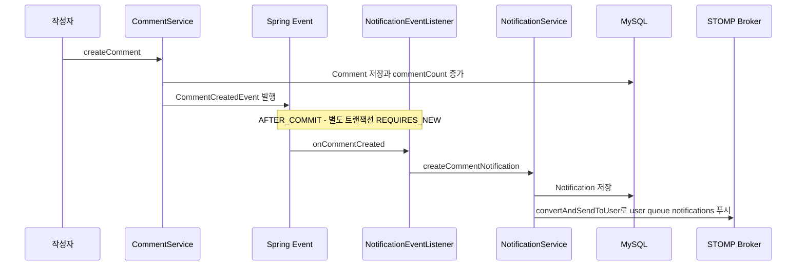

# domains/comment — 댓글·대댓글·익명 처리·댓글 반응

## 이 문서가 답하는 질문

- 댓글과 대댓글은 데이터로 어떻게 표현되는가?
- 작성·수정·삭제는 어떤 경로를 지나고 무엇이 함께 갱신되는가?
- 익명 댓글의 "익명N" 번호는 어떤 규칙으로 부여되는가?
- 댓글 좋아요/싫어요는 게시글 반응과 무엇이 같고 다른가?
- 댓글 작성이 알림으로 이어지는 경로는 무엇인가?

## 3줄 요약

- 댓글은 `domain/comments/Comment` 단일 엔티티다 — 대댓글은 `parent` 자기참조(`CMT_parent_id`)로 표현하고, 삭제는 soft delete, 이미지 1장(`s3Url`)과 반응 카운트를 비정규화 컬럼으로 가진다.
- 목록 조회 시 `CommentAnonymizationService`가 익명 댓글에 등장 순서 기반 "익명N" 라벨을 부여한다 — 같은 작성자는 같은 번호, 글쓴이는 "익명(글쓴이)"로 고정된다.
- 댓글 생성은 `CommentCreatedEvent`를 발행해 커밋 후 게시글 작성자에게 알림(DB 저장 + WebSocket 푸시)을 만들고, 핫스코어 갱신도 같은 이벤트로 트리거된다 ([reaction-hotpost.md](reaction-hotpost.md)).

## 데이터 구조

`domain/comments/Comment.java`:

- `parent` — 같은 테이블 자기참조. `CommentService.createComment()`에서 요청의 `parentId`가 있으면 `assignParent()`로 연결한다. **깊이 제한 검증은 없다** — 대댓글의 대댓글도 데이터상 만들 수 있다.
- `isAnonymous` — 기본 true. 익명 여부는 댓글 단위로 저장된다.
- `likeCount` / `dislikeCount` — 비정규화 카운트. `CommentReactionService.syncCounts()`가 재집계한다.
- `s3Url` — 댓글당 이미지 1장. 게시글과 같은 S3 tmp→확정 패턴을 쓴다 (`MediaProcessingService.processCreateCommentMedia()`, 패턴 설명은 [post-board.md](post-board.md)).
- 삭제는 `BaseEntity`의 `isValid=false` soft delete.

## 작성 · 수정 · 삭제

엔드포인트는 모두 `controllers/CommentController.java` (`/api/posts/{postId}/comments`).

- **작성** (`POST`) — `services/domain/CommentService.java · createComment()`: 엔티티 생성 → `parentId` 연결 → `post.incrementCommentCount()` → 저장 → 이미지가 있으면 확정 처리 → `CommentCreatedEvent` 발행. 커밋 후 이 이벤트를 두 리스너가 받는다 (아래 알림 절과 [reaction-hotpost.md](reaction-hotpost.md)).
- **수정** (`PATCH /{commentId}`) — `updateComment()`: 내용 교체 + `processUpdateCommentMedia()`로 이미지 교체/제거.
- **삭제** (`DELETE /{commentId}`) — `deleteComment()`: soft delete + `post.decrementCommentCount()`.
- 수정/삭제에 소유권 검증이 없는 문제는 [KI-05](../KNOWN-ISSUES.md#ki-05-게시글댓글-수정삭제에-소유권-검증이-없음-idor)만 참고.

## 목록 조회와 익명 처리

`GET /api/posts/{postId}/comments` → `CommentController · getComments()`: 게시글의 댓글 전체를 `CommentService.getCommentsByPost()`로 읽고, `CommentAnonymizationService.anonymize()`로 익명 라벨을 적용한 뒤, 로그인 사용자면 댓글마다 반응 상태·소유 여부를 채워 반환한다. 이 마지막 단계의 반복 쿼리 구조는 성능 결함이 있다 (⑤ — 본문에서는 정상 동작으로 서술하지 않는다).

익명 번호 부여 규칙 (`services/domain/CommentAnonymizationService.java · anonymize()`를 그대로 옮김):

1. 게시글이 익명이면 글쓴이의 userId를 번호 1로 선점하고 카운터를 2부터 시작한다. 게시글이 익명이 아니면 카운터는 1부터.
2. 각 댓글을 순회하며 —
   - 익명 댓글이고 작성자가 **글쓴이 본인**이면: 표시명 `익명(글쓴이)`, `userId`는 null로 마스킹. (게시글의 익명 여부와 무관하게 적용된다.)
   - 익명 댓글이고 글쓴이가 아니면: 그 userId가 처음 등장할 때 카운터 값을 배정하고 `익명N`으로 표시, `userId` null. 같은 사용자는 이후에도 같은 N을 받는다 (요청 1회 내에서 `LinkedHashMap`으로 유지 — 즉 번호는 **댓글 등장 순서** 기준이고 요청 간에도 같은 목록이면 결정적이다).
   - 익명이 아니면 실제 닉네임 유지.
3. `profileUrl`은 `dtos/CommentDto · fromEntity()`가 익명 댓글이면 null로 처리한다.

단건 조회 `GET /{commentId}`(`getCommentByIdTest()`)는 이 익명화를 거치지 않는 문제가 있다 (⑤).

## 댓글 반응

`POST /api/comments/{commentId}/reaction?type=LIKE|DISLIKE` → `controllers/CommentReactionController.java · react()` → `services/domain/CommentReactionService.java`.

- 저장 구조는 게시글 반응과 동일한 단일 테이블 패턴: `comments_reactions`, `(CMT_id, USR_id)` 유니크, kind는 `ReactionKind` enum을 재사용, 취소는 `isValid=false` soft cancel (`domain/comments/CommentReaction.java`).
- 상태 전이 규칙도 결과적으로 동일하다(같은 버튼 재클릭=취소, 반대 버튼=전환). 구현은 `cancelLikeInternal()`/`createDislikeInternal()` 등 세분화된 내부 메서드로 나뉘어 있고, 게시글 쪽과 달리 kind·isValid를 확인하고 상태를 바꾼다.
- 매 변경 후 `syncCounts()`가 count 쿼리로 `Comment`의 카운트 컬럼을 재집계한다.
- **이벤트를 발행하지 않는다** — 댓글 반응은 핫스코어·알림 어느 쪽에도 연결되지 않는다.
- 응답은 `getLikeSatateDto()`를 다시 호출해 만들므로 게시글 반응 API와 달리 토글 후 상태가 정확히 반영된다.

## 알림 이벤트 연결

- 이벤트 정의는 `eventEntities/events/CommentCreatedEvent.java` — `commentId`, `postId`, `authorId`(댓글 작성자), `postAuthorId`(게시글 작성자), `parentCommentAuthorId`, `content`.
- `eventEntities/eventListeners/NotificationEventListener.java · onCommentCreated()`가 `services/domain/NotificationService · createCommentNotification()`을 호출한다 — 수신자는 **게시글 작성자뿐**이다. 대댓글이어도 부모 댓글 작성자에게는 알림이 가지 않으며, `parentCommentAuthorId` 필드는 리스너에서 사용되지 않는다. 게다가 이 필드에 채워지는 값 자체가 잘못되어 있다 (⑤).
- 알림은 DB 저장 후 `SimpMessagingTemplate.convertAndSendToUser()`로 실시간 푸시된다. WebSocket 경로는 [04-request-flow.md](../04-request-flow.md) 참고.
- 같은 이벤트를 `HotPostEventListener`도 받아 핫스코어를 갱신한다 ([reaction-hotpost.md](reaction-hotpost.md)).

## 코드 좌표

| 개념 | 위치 |
|---|---|
| 댓글 API 전체 | `controllers/CommentController.java · getComments() / createComment() / updateComment() / deleteComment()` |
| 댓글 CRUD·이벤트 발행 | `services/domain/CommentService.java · createComment() / updateComment() / deleteComment() / getCommentsByPost()` |
| 댓글 엔티티 (parent 자기참조) | `domain/comments/Comment.java · assignParent()` |
| 익명 라벨 규칙 | `services/domain/CommentAnonymizationService.java · anonymize()` |
| 댓글 DTO 변환·프로필 마스킹 | `dtos/CommentDto.java · fromEntity()` |
| 댓글 반응 API | `controllers/CommentReactionController.java · react()` |
| 댓글 반응 토글 | `services/domain/CommentReactionService.java · likeReact() / dislikeReact() / syncCounts()` |
| 댓글 반응 엔티티 | `domain/comments/CommentReaction.java` |
| 댓글 이미지 처리 | `services/domain/MediaProcessingService.java · processCreateCommentMedia() / processUpdateCommentMedia()` |
| 알림 이벤트·리스너 | `eventEntities/events/CommentCreatedEvent.java`, `eventEntities/eventListeners/NotificationEventListener.java · onCommentCreated()` |
| 알림 생성·푸시 | `services/domain/NotificationService.java · createCommentNotification() / saveNotification()` |

## 알려진 문제·미확인 사항

- [KI-05](../KNOWN-ISSUES.md#ki-05-게시글댓글-수정삭제에-소유권-검증이-없음-idor) 댓글 수정/삭제 소유권 검증 부재
- [KI-27](../KNOWN-ISSUES.md) — **댓글 목록 N+1**: `CommentController.getComments()`가 댓글 리스트를 for 루프로 돌며 댓글마다 `commentReactionService.getLikeSatateDto()`(exists 쿼리 2회)를 호출하고, `CommentDto.fromEntity()`의 `comment.getUser()` 접근도 LAZY 로딩을 유발한다. 댓글 n개 조회가 대략 3n+α 쿼리가 된다.
- [KI-39](../KNOWN-ISSUES.md) — **삭제 댓글이 그대로 노출**: `CommentRepository.findByPost()`에 `isValid` 필터가 없고 DTO 변환도 삭제 여부를 보지 않아, soft delete된 댓글이 내용까지 포함된 채 목록에 반환된다.
- [KI-40](../KNOWN-ISSUES.md) — **단건 조회의 익명화 미적용**: `CommentController.getCommentByIdTest()`가 `CommentDto.fromEntity()`를 직접 반환해 익명 댓글의 작성자 닉네임과 `userId`가 노출된다 (GET이라 비인증으로도 접근 가능 — [KI-04](../KNOWN-ISSUES.md#ki-04-get-전체가-permitall인-블랙리스트-인가-구조) 참고).
- [KI-25](../KNOWN-ISSUES.md) — **이벤트 필드 오입력**: `CommentService.createComment()`가 `parentCommentAuthorId`에 부모 댓글 **작성자 ID가 아니라 부모 댓글의 ID**(`comment.getParent().getId()`)를 넣는다. 현재는 리스너가 이 필드를 쓰지 않아 드러나지 않지만, 대댓글 알림을 구현하는 순간 잘못된 수신자에게 발송된다. 또한 자기 게시글에 단 댓글도 본인에게 알림이 생성된다(sender=receiver 검사 없음).
- [KI-41](../KNOWN-ISSUES.md) — **이미지 없는 댓글 수정 시 NPE 가능**: `MediaProcessingService.processUpdateCommentMedia()`가 `comment.getS3Url()`이 null인 상태(이미지 없이 작성된 댓글)에서 `deleteUrl.isEmpty()`를 호출해 NPE로 500이 날 수 있다.
- `[미확인]` 대댓글 트리의 프론트엔드 렌더링 규칙(깊이 제한을 UI에서 강제하는지) — 백엔드 저장소만으로는 확인 불가.

마지막 검증일: 2026-07-30
