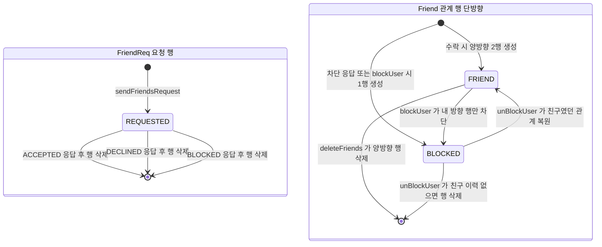

# Friend — 친구·차단 도메인

## 이 문서가 답하는 질문

- 친구 요청은 어떤 상태를 거치고, 각 응답은 DB에 무엇을 남기는가?
- 친구 관계와 차단은 어떻게 저장되는가 (단방향 2행 모델)?
- 차단의 "비가시성" 정책은 무엇이고 코드 어디에 근거가 있는가?
- 친구 이벤트는 알림과 어떻게 연결되는가?
- 친구 시간표 조회는 어디에 구현되어 있는가?

## 3줄 요약

- 요청은 `FriendReq`(requester → receiver) 한 행으로 살다가, 수락/거절/차단 어느 응답이든 **행이 삭제**되며 수락 시에만 `Friend` 두 행(양방향)이 생긴다.
- 친구·차단은 모두 `Friend` 단방향 행의 `FriendStatus`(FRIEND/BLOCKED)로 표현한다. 차단은 내 방향 행만 BLOCKED로 바꾸므로 상대는 차단 사실을 알 수 없다.
- 요청 발송·수락은 이벤트로 알림을 만들지만(FRIEND_REQUEST/FRIEND_ACCEPT), 거절·차단 이벤트는 발행만 되고 아무도 구독하지 않는다.

## 상태 머신

`enums/FriendRequestStatus`는 REQUESTED / ACCEPTED / DECLINED / BLOCKED. 단, DB에 저장되는 값은 사실상 REQUESTED뿐이다 — ACCEPTED/DECLINED/BLOCKED는 `RespondFriendRequestDto.status` 문자열로 들어오는 **응답 종류**이며, 어떤 응답이든 처리 후 `FriendReq` 행은 삭제된다 (`services/domain/FriendService · respondToFriendRequest()`).

`enums/FriendStatus`는 FRIEND / BLOCKED 두 값이며 `Friend` 행(단방향)의 상태다.

응답별 DB 효과 (`FriendService · respondToFriendRequest()` — 수신자 본인 확인은 `domain/friends/FriendReq · validateReceiver()`):

| 응답 status | Friend 테이블 효과 | 이벤트 |
|---|---|---|
| ACCEPTED | `createFriendship()` 두 번 — A→B, B→A 각각 FRIEND 행 | `FriendRequestAcceptedEvent` → FRIEND_ACCEPT 알림 |
| DECLINED | 없음 | `FriendRequestDeclinedEvent` (구독자 없음) |
| BLOCKED | `createBlock(수신자, 요청자)` — 수신자 방향 BLOCKED 1행만 | `FriendBlockedEvent` (구독자 없음) |

## 차단의 비가시성 정책

정책의 근거는 `controllers/FriendController`의 `blockUser` 핸들러 위 주석이다. 요지:

- A가 B를 차단해도 B는 그 사실을 모른다.
- B는 A에게 메시지를 보낼 수 있지만 A에게는 보이지 않는다(의도).
- A는 B의 정보를 볼 수 있지만 B는 A의 정보를 볼 수 없다.
- 친구 관계 행은 A 방향(A→B)만 삭제/차단되고 B→A 행은 남는다.

구현 (`FriendService`):

- `blockUser()` — 기존 관계가 없으면 BLOCKED 행 신규 생성, 있으면 **내 방향 행만** `Friend.block()`. 상대 방향 행은 건드리지 않으므로 상대의 친구 목록 쿼리 결과가 변하지 않는… 것이 아니라, 친구 목록(`FriendRepository · findAllFriends()`)은 양방향 UNION에 FRIEND 조건이 있어 **한쪽이 BLOCKED면 그 방향 조인만 빠진다**. 완전한 비노출은 조회 쿼리별 조건에 달려 있다.
- `unBlockUser()` — 역방향(상대→나) 행이 남아 있으면 "친구였던 관계"로 보고 내 행을 `unblock()`(FRIEND 복원), 역방향 행이 없으면 "차단만 했던 관계"로 보고 내 행을 삭제한다.
- `validateFriendship()` / `FriendRepository · existsFriendship()` — **양방향 모두 FRIEND일 때만** 친구로 인정한다. 채팅 방 생성·초대(`ChatService · requireFriendship()` → `findFriendIdsAmong()`)와 친구 시간표 조회가 이 검증을 쓴다.

## API 흐름 (`controllers/FriendController`, prefix `/api/friends`)

| 메서드 | 경로 | 서비스 메서드 | 비고 |
|---|---|---|---|
| GET | `/list` | `getFriendsList()` | 양방향 UNION native 쿼리 |
| GET | `/requests/sent` | `getSentFriendsRequestList()` | DTO의 `id`는 **상대 사용자 id** |
| GET | `/requests/received` | `getReceivedFriendsList()` | DTO의 `id`는 **FriendReq id** (응답 API에 필요) |
| POST | `/request` | `sendFriendsRequest()` | 닉네임으로 수신자 지정. 같은 방향 중복 요청만 차단 |
| POST | `/respond` | `respondToFriendRequest()` | status 문자열로 수락/거절/차단 |
| DELETE | `/delete` | `deleteFriends()` | 양방향 행 물리 삭제 |
| PATCH | `/block` | `blockUser()` | 이메일로 대상 지정 |
| PATCH | `/unBlock` | `unBlockUser()` | 경로 대소문자 주의 |
| POST | `/search` | `selectFriend()` | 닉네임 검색, 없으면 빈 리스트 |

검색 시 주의: 리포지토리 메서드명에 오타가 있다 — `FriendReqRepository · findReceivedFriendRequestsByRecieverId()` (Reciever). 올바른 철자로 검색하면 안 나온다 ([03-package-guide.md](../03-package-guide.md)의 F-3 오타 목록과 같은 성격). `FriendRequestStatus.REQUESTED`의 key 문자열도 `"REQUEST"`다.

## 친구 이벤트 → 알림

`sendFriendsRequest()`와 수락 분기가 발행한 이벤트를 `eventEntities/eventListeners/NotificationEventListener`가 AFTER_COMMIT으로 받아 FRIEND_REQUEST / FRIEND_ACCEPT 알림을 만들고 `/user/queue/notifications`로 push한다. 전체 경로와 REQUIRES_NEW 배경은 [domains/notification.md](notification.md) 참고.

## 친구 시간표 조회

`FriendController`가 아니라 **`controllers/TimetableTemplateController`** 에 있다.

- `GET /api/timetableTemplates/friends/{friendId}/default` — 친구가 기본으로 지정한 시간표 템플릿을 과목·교시까지 조회. `services/TimetableTemplateService · getFriendDefaultTemplate()`이 먼저 `FriendService · validateFriendship()`으로 서로 차단 없는 친구인지 검증한다.
- `POST /api/timetableTemplates/import` — 친구 템플릿을 내 것으로 복사. 원본 소유자가 본인이 아니면 역시 `validateFriendship()`을 거친다 (`TimetableTemplateService · importTemplate()`). 상세는 [domains/school-timetable.md](school-timetable.md).

## 코드 좌표

| 개념 | 위치 |
|---|---|
| 요청/응답/차단 비즈니스 로직 | `services/domain/FriendService.java` |
| REST 엔드포인트·차단 정책 주석 | `controllers/FriendController.java` |
| 관계 엔티티 (단방향 행 + 상태) | `domain/friends/Friend.java · createFriendship() / createBlock() / block() / unblock()` |
| 요청 엔티티 | `domain/friends/FriendReq.java · create() / validateReceiver()` |
| 친구 목록·양방향 검증 쿼리 | `domain/friends/FriendRepository.java · findAllFriends() / existsFriendship() / findFriendIdsAmong()` |
| 요청 목록 쿼리 | `domain/friends/FriendReqRepository.java` |
| 상태 enum | `enums/FriendRequestStatus.java`, `enums/FriendStatus.java` |
| 친구 이벤트 정의 | `eventEntities/events/FriendRequestSentEvent.java 외 3개` |

## 알려진 문제·미확인 사항

아래는 이번 검증에서 확인한 신규 결함으로, [KI-42](../KNOWN-ISSUES.md)(요청 검증 공백·status 오입력 시 소실), [KI-43](../KNOWN-ISSUES.md)(물리 삭제), [KI-25](../KNOWN-ISSUES.md)(리스너 없는 이벤트)로 등재되어 있다. 마지막 DTO id 항목은 경미하여 미등재.

- `sendFriendsRequest()`가 같은 방향(`existsByRequesterAndReceiver`) 중복만 막는다 — 역방향 기존 요청, 이미 친구인 상태, 심지어 상대가 나를 차단한 상태에서도 요청이 만들어지고 FRIEND_REQUEST 알림이 간다. 차단 비가시성 정책과 충돌하며, 차단 상태에서 수락되면 기존 BLOCKED 행과 신규 FRIEND 행이 공존하게 된다.
- `respondToFriendRequest()`는 status가 세 값 중 무엇과도 일치하지 않으면 아무 분기도 타지 않고 요청 행만 조용히 삭제한다 (오타 요청이 거절과 동일하게 동작하되 이벤트도 없음).
- `Friend`·`FriendReq`는 `deleteAll()`/`delete()`로 **물리 삭제**된다 — `BaseEntity.isValid` soft delete 컨벤션(CLAUDE.md·[01-overview.md](../01-overview.md) 용어집)과 불일치.
- `FriendRequestDeclinedEvent`, `FriendBlockedEvent`는 발행되지만 구독하는 리스너가 없다 — 의도된 확장 지점인지 죽은 코드인지 불명.
- sent/received 목록 DTO의 `id` 의미가 다르다(상대 user id vs FriendReq id) — API 계약 혼선 소지.
- `[미확인]` 차단 시 게시글·댓글 등 커뮤니티 영역에서의 상호 비노출 — 주석의 정책 서술과 달리 Post/Comment 조회 경로에서 차단 필터를 확인하지 못함 (친구·채팅 영역에서만 확인됨).

마지막 검증일: 2026-07-30
