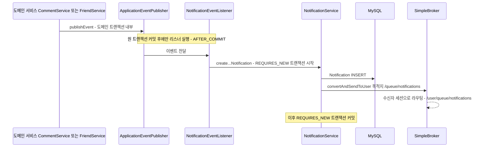

# Notification — 알림 도메인

> 알림을 실어 나르는 WebSocket 연결 자체(핸드셰이크·principal 부착)는 [04-request-flow.md](../04-request-flow.md) 참고.

## 이 문서가 답하는 질문

- 알림은 어떤 이벤트에서 어떤 경로로 만들어지는가?
- `NotificationService`의 쓰기 메서드가 왜 `REQUIRES_NEW`인가?
- 실시간 push는 정확히 어떤 목적지로 나가는가?
- 알림 조회·읽음·삭제 API와 소유권 검증은 어떻게 되어 있는가?

## 3줄 요약

- 알림 생성은 도메인 서비스가 직접 호출하지 않는다: 도메인 트랜잭션이 커밋된 뒤 `NotificationEventListener`(AFTER_COMMIT)가 받아 `NotificationService`가 새 트랜잭션(REQUIRES_NEW)으로 저장한다.
- 저장 직후 같은 메서드 안에서 `/user/queue/notifications`(사용자 목적지)로 WebSocket push가 나간다 — 단, 이 push는 REQUIRES_NEW 트랜잭션 커밋 전에 발행된다 (아래 ⑤).
- 조회·읽음·삭제는 `NotificationController`가 담당하며, 단건 조작은 `validateOwnership()`이 수신자 본인인지 검증한다.

## 알림 생성 경로

### 이벤트 → 알림 대응 (NotificationEventListener 전수)

`eventEntities/eventListeners/NotificationEventListener`의 핸들러는 3개가 전부다. 모두 `@TransactionalEventListener(phase = AFTER_COMMIT)`.

| 이벤트 | 발행처 | 리스너 메서드 | 호출 서비스 메서드 | 카테고리 | 수신자 |
|---|---|---|---|---|---|
| `CommentCreatedEvent` | `services/domain/CommentService · createComment()` | `onCommentCreated()` | `createCommentNotification()` | `POST_COMMENT` | 게시글 작성자 |
| `FriendRequestSentEvent` | `services/domain/FriendService · sendFriendsRequest()` | `onFriendRequestSent()` | `createFriendRequestNotification()` | `FRIEND_REQUEST` | 요청 수신자 |
| `FriendRequestAcceptedEvent` | `services/domain/FriendService · respondToFriendRequest()` | `onFriendRequestAccepted()` | `createFriendAcceptNotification()` | `FRIEND_ACCEPT` | 원래 요청자 |

이 리스너가 받지 않는 이벤트들:

- `PostReactedEvent`, `ScrapToggledEvent`, `CommentCreatedEvent`(핫스코어 측면)는 `eventEntities/eventListeners/HotPostEventListener`가 처리한다 — 알림과 무관.
- `FriendRequestDeclinedEvent`, `FriendBlockedEvent`는 `FriendService`가 발행하지만 **어느 리스너도 구독하지 않는다** ([domains/friend.md](friend.md) 참고).

`enums/NotificationCategory` 중 `COMMENT_REPLY`, `POST_LIKE_THRESHOLD`, `POST_TRENDING`, `FRIEND_BIRTHDAY`는 실제 생성 경로가 없다 — `initializers/DataInitializer`가 시드 데이터로만 만든다.

### 왜 REQUIRES_NEW인가

`NotificationService`의 `create...Notification()` 3개는 모두 `@Transactional(propagation = Propagation.REQUIRES_NEW)`다. AFTER_COMMIT 리스너는 **이미 커밋이 끝난 원 트랜잭션의 컨텍스트에서 실행**되기 때문에, 기본 전파(REQUIRED)로 그 컨텍스트에 참여하면 추가 쓰기가 커밋되지 않는다. 알림 INSERT를 실제로 반영하려면 새 트랜잭션이 필요하다. 부수 효과로, 알림 저장 실패가 원 도메인 작업(댓글 저장 등)을 롤백시키지도 않는다.

### DB 저장 + WebSocket push

`NotificationService · saveNotification()`이 두 가지를 연달아 한다.

1. `notificationRepository.save()` — `domain/notification/Notification` 엔티티 저장 (receiver, sender, category, entityType/entityId — 클릭 시 이동할 대상 좌표, message, contentMessage, isRead 기본 false).
2. `messagingTemplate.convertAndSendToUser(String.valueOf(receiver.getId()), "/queue/notifications", dto)` — 사용자 목적지 push.

실제 목적지 문자열: `configs/WebSocketConfig · configureMessageBroker()`가 user prefix를 `/user`로 설정하므로, 클라이언트는 **`/user/queue/notifications`** 를 구독한다. 사용자 식별은 STOMP 세션 principal의 `getName()`이 담당하며, `security/WebSocketUserPrincipal`이 이를 userId 문자열로 맞춰 둔 이유가 이 라우팅이다 (해당 클래스 상단 주석 참고).

## 조회·읽음 API (`controllers/NotificationController`, prefix `/api/notifications`)

| 메서드 | 경로 | 설명 | 소유권 검증 |
|---|---|---|---|
| GET | `` (루트) | 목록 페이징. 정렬은 `isRead ASC, created DESC` — 미읽음 우선, 최신순 (`NotificationRepository · findByReceiverAndIsValidTrueOrderByIsReadAscCreatedDesc()`) | 본인 것만 조회됨 (receiver 조건) |
| GET | `/unread-count` | 헤더 배지용 미읽음 수 | receiver 조건 |
| PATCH | `/{id}/read` | 단건 읽음 처리, 네비게이션 정보 반환 | `validateOwnership()` |
| PATCH | `/read-all` | 전체 읽음 처리 | receiver 조건 벌크 쿼리 |
| DELETE | `/read` | 읽은 알림 전체 삭제 (soft delete) | receiver 조건 벌크 쿼리 |
| DELETE | `/{id}` | 단건 삭제 (soft delete) | `validateOwnership()` |

`NotificationService · validateOwnership()`은 `notification.getReceiver().getId()`와 요청 사용자를 비교해 다르면 `CustomException(NO_ACCESS)`를 던진다. 게시글·댓글 쪽에 소유권 검증이 없는 것([KI-05](../KNOWN-ISSUES.md#ki-05-게시글댓글-수정삭제에-소유권-검증이-없음-idor))과 대조되는, 검증이 있는 쪽 사례다.

## 코드 좌표

| 개념 | 위치 |
|---|---|
| 이벤트 수신 (AFTER_COMMIT) | `eventEntities/eventListeners/NotificationEventListener.java` |
| 알림 생성·push (REQUIRES_NEW) | `services/domain/NotificationService.java · createCommentNotification() 외 2개 / saveNotification()` |
| 알림 엔티티 | `domain/notification/Notification.java` |
| 목록 정렬·벌크 읽음/삭제 쿼리 | `domain/notification/NotificationRepository.java` |
| REST 엔드포인트 | `controllers/NotificationController.java` |
| user 목적지 prefix 설정 | `configs/WebSocketConfig.java · configureMessageBroker()` |
| principal 이름 = userId 보장 | `security/WebSocketUserPrincipal.java · getName()` |
| 이벤트 정의 | `eventEntities/events/CommentCreatedEvent.java / FriendRequestSentEvent.java / FriendRequestAcceptedEvent.java` |

## 알려진 문제·미확인 사항

- **커밋 전 push 발행** — `saveNotification()`의 `convertAndSendToUser()`는 REQUIRES_NEW 트랜잭션이 커밋되기 전에 실행된다. INSERT 이후 커밋이 실패하면 클라이언트는 DB에 존재하지 않는 알림을 이미 받은 상태가 된다. `afterCommit` 동기화로 옮기는 것이 표준 해법 — [KI-24](../KNOWN-ISSUES.md).
- **자기 게시글에 단 자기 댓글도 알림 생성** — `CommentService · createComment()`와 리스너 어디에도 작성자==게시글 작성자 예외가 없어, 본인 글에 댓글을 달면 본인에게 POST_COMMENT 알림이 간다 — [KI-25](../KNOWN-ISSUES.md).
- **`CommentCreatedEvent.parentCommentAuthorId`에 부모 댓글의 "작성자 ID"가 아니라 "댓글 ID"가 담긴다** (`CommentService · createComment()`의 `comment.getParent().getId()`). 현재 이 필드를 읽는 곳이 없어 실해는 없지만, COMMENT_REPLY 알림을 구현하는 순간 버그가 된다 — [KI-25](../KNOWN-ISSUES.md).
- `COMMENT_REPLY` 등 4개 카테고리는 생성 경로 미구현 상태다 (결함이 아니라 미구현 기능).
- `[미확인]` push 실패(수신자 미접속) 시 재전송·유실 정책 — 코드상 별도 처리가 없고 SimpleBroker 특성상 미접속자에게는 유실되는 것으로 보이나 실측하지 않음.

마지막 검증일: 2026-07-30
