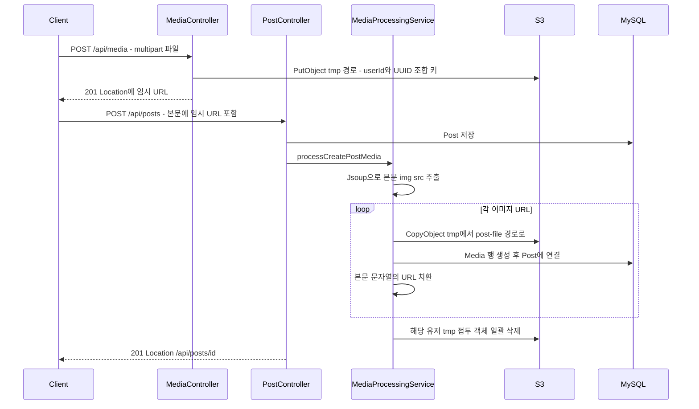
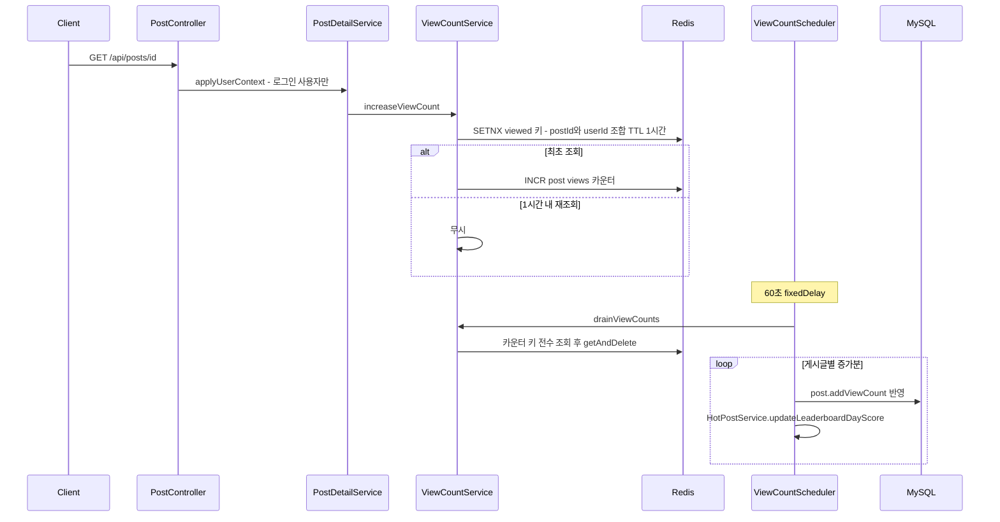

# domains/post-board — 게시판·게시글·목록 캐시·미디어·조회수

## 이 문서가 답하는 질문

- 게시판과 게시글의 API 전체 목록과 CRUD 흐름은 어떻게 되는가?
- 게시글 목록 조회는 어떤 경로로 캐시·페이징되는가? 커서와 오프셋은 언제 각각 쓰이는가?
- 이미지가 포함된 게시글은 S3에 어떻게 저장되는가?
- 조회수는 언제 어떻게 DB에 반영되는가?
- 검색은 어떻게 동작하는가?

반응(좋아요/싫어요)·스크랩·핫게시글은 [reaction-hotpost.md](reaction-hotpost.md), 댓글은 [comment.md](comment.md) 참고.

## 3줄 요약

- 게시판(`Board`)은 조회 API만 있고 시드로 생성된다. 게시글 CRUD는 `PostController`, 게시판별 목록은 `BoardPostController`가 담당하며 목록의 앞 5페이지(RECENT 정렬)는 Redis 캐시(`RedisPostsCache`)를 먼저 탄다.
- 게시글 본문의 이미지는 "S3 tmp 업로드 → 게시글 저장 시 본문 파싱 → 영구 경로 복사 → 본문 URL 치환 → tmp 삭제" 패턴이다 (`MediaProcessingService`). README의 해당 서술은 코드와 일치함을 확인했다.
- 조회수는 DB에 바로 쓰지 않는다 — Redis SETNX(중복 방지)+INCR(버퍼) 후 60초 배치(`ViewCountScheduler`)가 모아서 반영하고, 반영된 게시글의 핫스코어도 함께 갱신한다.

## 게시판

- `GET /api/boards` → `controllers/BoardController.java · getBoards()` — 전체 게시판 목록. 생성/수정/삭제 API는 없으며 게시판 데이터는 시드 스크립트 `src/main/resources/data.sql`의 `INSERT IGNORE INTO boards`로 정의된다 (dev·prod 프로파일은 `spring.sql.init.mode=never`라 실행 여부는 프로파일 설정에 따른다). 도메인 지도와 용어는 [01-overview.md](../01-overview.md) 참고.

## 게시글 CRUD

| 동작 | 엔드포인트 | 경로 |
|---|---|---|
| 단건 조회 | `GET /api/posts/{postId}` | `PostController · getPostByPostId()` → `PostService · findById()` → `PostDetailService · applyUserContext()` |
| 생성 | `POST /api/posts` | `PostController · createPost()` → `PostService · createPost()` |
| 수정 | `PATCH /api/posts/{postId}` | `PostController · updatePost()` → `PostService · updatePost()` |
| 삭제 | `DELETE /api/posts/{postId}` | `PostController · deletePost()` → `PostService · deletePost()` — soft delete (`Post.delete()`가 `isValid=false`) |
| 검색 | `GET /api/posts/search` | `PostController · searchPost()` → `PostService · searchPagedPosts()` |
| 게시판별 목록 | `GET /api/boards/{boardId}/posts` | `BoardPostController · getPostsByBoardId()` → `PostService · getPagedPosts()` |

- **생성** — `services/domain/PostService.java · createPost()`: `Post.create()` 저장 → `MediaProcessingService.processCreatePostMedia()`로 본문 이미지 확정(아래) → `PostPrevCache.evictBoard()` + `cachePostPrev()` + `incrementBoardCount()`로 캐시 갱신.
- **수정** — `updatePost()`: 제목 변경 감지 후 `editTitle()`, 본문이 바뀌면 `MediaProcessingService.processUpdatePostMedia()`가 추가/삭제된 이미지 URL을 diff해 S3를 정리한다.
- **삭제** — `deletePost()`: soft delete + 캐시 evict + 게시판 카운트 감소.
- 수정/삭제에 소유권 검증이 없는 문제는 [KI-05](../KNOWN-ISSUES.md#ki-05-게시글댓글-수정삭제에-소유권-검증이-없음-idor)만 참고 (본문에서는 다루지 않는다).

## 목록 조회 — 캐시와 커서/오프셋 하이브리드

`BoardPostController`의 파라미터: `page`(기본 0), `sortType`(기본 RECENT), `size`(1~50, 기본 10), `lastSeedId`, `isRandomPage`(기본 true).

분기 로직 (`PostService · getPagedPosts()`와 `domain/posts/queryDsl/PostRepositoryCustomImpl.java · findByBoard()`에서 확인):

1. **캐시 경로** — `page < 5` 그리고 `sortType == RECENT`면 `services/domain/redisService/RedisPostsCache · getPostPrevs()`:
   - `board:{boardId}:posts` (Redis LIST, 최근 50개 postId, TTL 60분) → `posts:{postId}` (게시글 미리보기 값 캐시, TTL 30분)를 `multiGet`.
   - 리스트가 비면 DB에서 RECENT 상위 50개를 읽어 재적재하고, 개별 miss는 `findAllDtoByIds()`로 채운 뒤 재캐시한다. Redis 예외 시 전체가 DB fallback.
   - 진입 조건이 페이지 **번호**만 보기 때문에 `page × size ≥ 50`이면(예: `page=3&size=20`) 조회 범위가 50개 리스트를 벗어나 **빈 목록이 반환된다** ([KI-57](../KNOWN-ISSUES.md#ki-57-페이지-크기가-크면-캐시-경로가-빈-목록을-반환한다)).
2. **DB 경로** — 그 외에는 `findByBoard()` QueryDSL 직행:
   - 기본은 `offset = page * size` **오프셋 페이징**.
   - `sortType == RECENT` **그리고** `isRandomPage == false` **그리고** `lastSeedId != null`일 때만 `post.id < lastSeedId` **커서 페이징**으로 전환하고 offset을 제거한다. `isRandomPage` 기본값이 true라 클라이언트가 명시적으로 끄지 않으면 커서 경로는 타지 않는다.
   - 정렬: `getOrderSec()` — LIKE→`likeCount desc`, VIEW→`viewCount desc`, 그 외→`id desc`. `isValid=true`만 조회.
3. **총 개수** — `PostPrevCache.getCount()`: `board:{boardId}:count` (TTL 5분), miss·장애 시 `countTotal()` DB 집계. 생성/삭제 시 increment/decrement로 보정한다. 이 보정이 Redis `INCRBY`라, **키가 만료된 뒤 첫 쓰기가 들어오면 값이 1(또는 −1)로 되살아난다** ([KI-56](../KNOWN-ISSUES.md#ki-56-게시판-글-개수-캐시가-만료-후-첫-쓰기에서-1로-되살아난다)).

## 검색

`GET /api/posts/search?query=&page=&searchType=` → `PostRepositoryCustomImpl · searchKeywordsAll()`. `enums/PostSearchType`은 `TITLE` / `CONTENT` / `TITLE_CONTENT` 3종. 검색어를 공백으로 분리해 각 키워드를 AND 결합하고(`TITLE_CONTENT`는 키워드별로 제목 OR 본문), `containsIgnoreCase`(LIKE %kw%)로 매칭한다. `isValid=true` 필터, 페이지 크기 10 고정. 정렬이 실제로는 적용되지 않는 문제가 있다 (⑤).

## 게시글 작성 시 S3 tmp → 확정 흐름

생성 API는 이미지 파일을 받지 않는다. 클라이언트가 먼저 `POST /api/media`(multipart)로 업로드해 임시 URL을 받고, HTML 본문의 `img src`에 넣어 `POST /api/posts`를 호출한다. README "게시글 작성" 섹션의 서술(키 규칙 `tmp/{userId}/{UUID}-{파일명}` → `post-file/{postId}/...`, CopyObject, URL 치환, tmp 일괄 삭제)은 코드와 일치함을 확인했다.

- 본문 파싱은 `Utils/MediaUtils.java · extractS3Urls()` — Jsoup으로 `img` 태그의 `src`를 전부 수집한다 (S3 URL 여부는 별도 필터링하지 않음).
- S3 조작은 `services/global/S3FileStorageAdapter.java` (`FileStoragePort` 구현): `tmpUpload()`, `copyToFinalLocation()` — 확정 키는 `{owner}-file/{entityId}` + 임시 키에서 `tmp` 접두를 제거한 나머지, `deleteUserTmp()` — `tmp/{userId}/` 전체 삭제.
- 수정 시(`processUpdatePostMedia()`)는 신구 본문의 URL을 diff해 추가분만 확정 복사하고 제거분은 S3에서 삭제한다.

## 조회수 흐름

- 중복 방지 키는 `viewed:{postId}:{userId}` TTL 1시간, 카운터는 `post:views:{postId}` (`infrastructure/redis/RedisViewCountStore.java`).
- 배치는 `schedulers/ViewCountScheduler.java · syncViewsToDB()` — `fixedDelay = 60000`. 게시글이 삭제됐으면 건너뛰고, 반영 성공 건은 핫스코어도 갱신한다.
- `applyUserContext()`는 `userPrincipal != null`일 때만 호출되므로 **비로그인 조회는 조회수에 집계되지 않는다** (`PostController · getPostByPostId()`에서 확인).

## 코드 좌표

| 개념 | 위치 |
|---|---|
| 게시판 목록 | `controllers/BoardController.java`, `services/domain/BoardService.java` |
| 게시글 CRUD·검색 핸들러 | `controllers/PostController.java` |
| 게시판별 목록 핸들러 | `controllers/BoardPostController.java · getPostsByBoardId()` |
| 목록 캐시 분기·CRUD 서비스 | `services/domain/PostService.java · getPagedPosts() / createPost() / updatePost() / deletePost()` |
| QueryDSL 목록·검색·집계 | `domain/posts/queryDsl/PostRepositoryCustomImpl.java · findByBoard() / searchKeywordsAll() / countTotal()` |
| 목록·카운트 Redis 캐시 | `services/domain/redisService/RedisPostsCache.java` (`PostPrevCache` 구현) |
| 이미지 임시 업로드 API | `controllers/MediaController.java · uploadS3()` |
| 본문 이미지 확정 처리 | `services/domain/MediaProcessingService.java · processCreatePostMedia() / processUpdatePostMedia()` |
| S3 어댑터 | `services/global/S3FileStorageAdapter.java` (`FileStoragePort` 구현) |
| 본문 img 파싱 | `Utils/MediaUtils.java · extractS3Urls()` |
| 조회수 버퍼·중복 방지 | `services/domain/redisService/ViewCountService.java`, `infrastructure/redis/RedisViewCountStore.java` |
| 조회수 배치 | `schedulers/ViewCountScheduler.java · syncViewsToDB()` |
| 정렬·검색 타입 | `enums/SortType.java`, `enums/PostSearchType.java` |

## 알려진 문제·미확인 사항

- [KI-05](../KNOWN-ISSUES.md#ki-05-게시글댓글-수정삭제에-소유권-검증이-없음-idor) 게시글 수정/삭제 소유권 검증 부재
- [KI-04](../KNOWN-ISSUES.md#ki-04-get-전체가-permitall인-블랙리스트-인가-구조) 목록·검색·단건 조회 GET이 전부 비인증 공개인 구조적 배경
- [KI-35](../KNOWN-ISSUES.md) — **검색 결과 정렬 미적용**: `PostService.searchPagedPosts()`가 `Sort.by(ASC, "createdAt").descending()`을 만들어 넘기지만(필드명 `createdAt`도 `Post`에 없음 — 실제는 `BaseEntity.created`), `searchKeywordsAll()`이 QueryDSL 쿼리에 `orderBy`를 아예 걸지 않아 검색 결과 순서가 보장되지 않는다.
- [KI-36](../KNOWN-ISSUES.md) — **tmp 일괄 삭제의 동시성**: `processCreatePostMedia()`가 마지막에 `deleteUserTmp(userId)`로 해당 유저의 tmp 폴더 전체를 지우므로, 같은 유저가 글 2개를 동시에 작성 중이면 아직 확정되지 않은 다른 글의 임시 이미지가 삭제될 수 있다.
- `[미확인]` 커서 페이징(`isRandomPage=false` + `lastSeedId`)을 실제로 사용하는 프론트엔드 호출이 있는지 — 백엔드 저장소만으로는 확인 불가. 관련 캐시 구현(`services/domain/redisService/CursorCacheService.java`)은 전체가 주석 처리된 미사용 클래스다.

마지막 검증일: 2026-07-30
