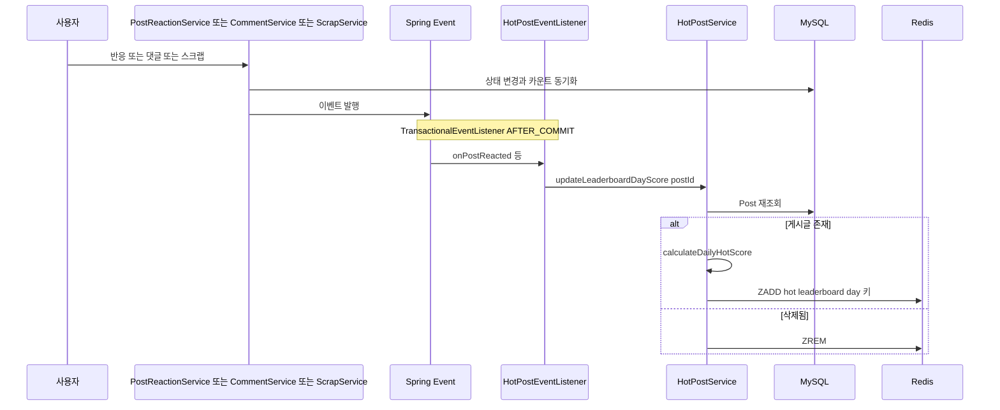

# domains/reaction-hotpost — 반응 토글과 핫게시글 랭킹

기존 [HOT_POST_SYSTEM.md](../HOT_POST_SYSTEM.md)와 [POST_REACTION_MIGRATION.md](../POST_REACTION_MIGRATION.md)의 내용을 흡수해 2026-07-30 기준 코드와 대조·현행화한 문서다. 두 원본과 이 문서가 다르면 이 문서(=코드)가 기준이다.

## 이 문서가 답하는 질문

- 좋아요/싫어요 토글은 데이터로 어떻게 표현되고 어떤 상태 전이를 하는가?
- 어떤 행동이 어떤 이벤트를 거쳐 핫스코어를 갱신하는가?
- 핫스코어 산식의 실제 가중치·로그 스케일·시간 감쇠는 무엇인가?
- Redis ZSET과 DB(`DailyHotPost`)는 어떻게 역할을 나누는가?
- `RecentHotPost`와 게시판별 실시간 인기글은 지금 동작하는가?

## 3줄 요약

- 반응은 `posts_reactions` 단일 테이블 한 행으로 관리된다 — `(PST_id, USR_id)` 유니크, `kind`(LIKE/DISLIKE), 취소는 `isValid=false` soft cancel. 과거 `posts_likes`/`posts_dislikes` 2테이블에서 통합된 구조다 (마이그레이션 SQL은 [POST_REACTION_MIGRATION.md](../POST_REACTION_MIGRATION.md) 원본 참고).
- 반응·댓글·신규 스크랩·조회수 반영이 각각 이벤트/배치를 통해 `HotPostService.updateLeaderboardDayScore()`로 모이고, `hot:leaderboard:day:{yyyyMMdd}` Redis ZSET에 `calculateDailyHotScore` 점수를 ZADD한다.
- `GET /api/hotposts/daily`는 당일 ZSET 상위 10개 중 좋아요 10개 이상만 노출하며, ZSET이 비면 `DailyHotPost` DB 테이블로 fallback한다. 게시판별 실시간 인기글(`RecentHotPost`, `hot:board:...` 키)은 코드만 있고 어디서도 연동되지 않는다.

## 반응 토글

`POST /api/posts/{postId}/reaction?type=LIKE|DISLIKE` → `controllers/PostReactionController.java · react()` → `services/domain/PostReactionService.java`.

상태 전이 (`likeReact()` / `dislikeReact()` 기준, LIKE를 예로):

| 현재 상태 | LIKE 요청 시 | 구현 |
|---|---|---|
| 무반응 (행 없음 또는 isValid=false) | LIKE 생성/재활성 | `createReaction()` — 행이 없으면 insert, 있으면 `PostReaction.applyState()`로 `kind=LIKE, isValid=true` |
| LIKE 상태 | 취소 | `cancelState()` — `PostReaction.cancel()`이 `isValid=false`만 세팅 (행 유지) |
| DISLIKE 상태 | LIKE로 전환 | `createReaction()` — 같은 행의 kind를 교체 |

- 매 변경 후 `syncCounts()`가 `countByPostAndKindAndIsValidTrue`를 LIKE/DISLIKE 각 1회씩 실행해 `Post`의 비정규화 컬럼(`likeCount`/`dislikeCount`)을 재집계한다. 카운트 컬럼을 직접 증감하지 않고 매번 count 쿼리로 동기화하는 방식이다 (동시성 판단 배경은 README "좋아요/싫어요 카운트 동시성 문제" 섹션).
- 이벤트 발행은 `createReaction()` 경로에서만 일어난다 — **취소(`cancelState()`)는 `PostReactedEvent`를 발행하지 않는다** (⑤).
- 댓글 반응(`comments_reactions`, `services/domain/CommentReactionService`)은 동일한 단일 테이블 패턴이지만 이벤트를 전혀 발행하지 않아 핫스코어와 무관하다 — 상세는 [comment.md](comment.md).

## 이벤트 → 스코어 갱신 경로



`eventEntities/eventListeners/HotPostEventListener.java`가 받는 이벤트 3종 (모두 `AFTER_COMMIT`):

| 이벤트 | 발행처 | 조건 |
|---|---|---|
| `PostReactedEvent` | `PostReactionService · createReaction()` | 반응 생성·전환 시 (취소 제외) |
| `CommentCreatedEvent` | `CommentService · createComment()` | 댓글 생성 시 |
| `ScrapToggledEvent` | `ScrapService · toggleScrap()` | 리스너가 `isNewScrap()`일 때만 갱신 — 스크랩 취소·재활성은 즉시 반영 안 됨 |

이벤트 외 경로 2개도 같은 메서드로 합류한다:

- `schedulers/ViewCountScheduler.java · syncViewsToDB()` — 60초마다 조회수 반영된 게시글의 스코어 갱신 ([post-board.md](post-board.md) 조회수 흐름).
- `schedulers/HotScoreScheduler.java · updateHotScore()` — 당일 리더보드 상위 50개 재계산(시간 감쇠 반영용). 주기·범위가 README 서술과 다른 점은 [KI-11](../KNOWN-ISSUES.md#ki-11-readme의-핫스코어-갱신-주기-서술이-코드와-다름) 참고.

즉시 갱신 이벤트가 없는 행동(반응/스크랩 취소, 댓글 삭제)의 점수는 다음 5분 주기 스케줄러 재계산 때 보정된다 — 단 상위 50위 밖 게시글은 보정 대상이 아니다.

## 핫스코어 산식 — 코드 기준

`Utils/HotScoreCalculator.java`. 실제 랭킹에 쓰이는 것은 `calculateDailyHotScore()` **하나뿐**이다.

```
가중합 s  = 5×likeCount − 2×dislikeCount + 2×scrapCount + 3×commentCount + 1×viewCount
로그 스케일 order = log10(max(|s|, 1))
부호 sign = s>0 → 1, s<0 → −1, s=0 → 0
경과 시간 ageHours = 작성 시각부터 현재까지 분 단위 ÷ 60
감쇠 decay = (ageHours + 2)^1.5
최종 score = round6(sign × order ÷ decay)     — 소수점 6자리 반올림
```

- 같은 파일의 `calculateRecentHotScore()`(싫어요 가중치 −1, 감쇠 없음)와 `calculateRecentHotScoreTest()`는 **프로덕션 호출처가 없다**. 기존 HOT_POST_SYSTEM.md가 "실시간/일간 공통 산식"으로 소개했던 함수다.
- 클래스 상단의 `DAILY_TIME_DIVISOR`(45000.0)와 `epoch` 상수는 선언만 있고 사용되지 않는다.
- README "핫게시글 시스템" 섹션의 산식 수치(일간: 싫어요 −2, 감쇠 `(경과시간+2)^1.5`)는 코드와 일치한다. 갱신 주기 서술만 다르다 ([KI-11](../KNOWN-ISSUES.md#ki-11-readme의-핫스코어-갱신-주기-서술이-코드와-다름)).

## Redis ZSET 구조

접근은 전부 `infrastructure/redis/RedisHotPostRanking.java` (`HotPostRankingPort` 구현, 전 메서드 `@ResilientRedis`)를 거친다: `addScore`(ZADD — 같은 키의 같은 postId는 최신 점수로 덮어씀), `topPostIds`/`topPostsWithScores`(ZREVRANGE), `remove`(ZREM).

| 키 패턴 | member / score | 쓰는 곳 | 상태 |
|---|---|---|---|
| `hot:leaderboard:day:{yyyyMMdd}` | postId / `calculateDailyHotScore` 결과 | `HotPostService · updateLeaderboardDayScore()` — 키는 `leaderboardDayRedisKey()` | **사용 중.** 달력일 버킷이며 게시글 작성일 필터가 아님 — 어제 글도 오늘 반응이 달리면 오늘 키에 들어간다 |
| `hot:board:{boardId}realtime:{yyyyMMddHHmm}` (5분 버킷) | postId / 동일 산식 | `HotPostService · updateRecentScore()` — 키는 `getKey()`/`getRealtime5Min()` | **미연동.** 호출처 없음 (아래 참고) |

만료(EXPIRE/TTL) 설정이 없어 날짜별 ZSET 키는 자동 삭제되지 않는다.

## 조회 API와 DailyHotPost DB 동기화

`GET /api/hotposts/daily` → `controllers/HotPostController.java` → `services/domain/HotPostService.java · getLeaderboardDayHotPosts()`:

1. 당일 키 `ZREVRANGE 0..9` → postId별 DB 재조회 → **`likeCount >= 10`인 것만** `PostPreviewDto`로 반환 (필터 때문에 10개 미만이 응답될 수 있다).
2. ZSET이 비어 있으면(Redis 초기화·장애 직후) `getLeaderboardDayHotPostsFromDb()` — `DailyHotPostRepository.findTop10ByLeaderboardDateOrderByCreatedDesc(오늘)`로 fallback. 정렬 기준이 **score가 아니라 created desc**라는 점에 유의.

DB 동기화는 `HotScoreScheduler`가 5분마다 `HotPostService.syncLeaderboardDayToDb()`를 호출해 수행한다: 당일 ZSET 상위 50개를 `domain/hot/DailyHotPost`(`(DHP_leaderboard_date, PST_id)` 유니크, score·날짜 보관)로 저장한다. **이미 있는 (게시글, 날짜) 행은 건너뛰고 score를 갱신하지 않으므로**, DB에 남는 score는 그 게시글이 처음 동기화된 시점의 값이다. 오래된 날짜의 행을 지우는 로직은 없어 테이블은 계속 누적된다 (`schedulers/` 4개 클래스 전수 확인).

## 미사용 코드 현황 — RecentHotPost와 게시판별 실시간 인기글

- `domain/hot/RecentHotPost` 엔티티와 `RecentHotPostRepository`는 선언만 있고 주입·호출처가 전혀 없다 (전체 소스 grep으로 확인). 테이블만 생성되는 상태.
- `HotPostService.updateRecentScore()`/`getRecentHotPosts()`(게시판별 5분 버킷 랭킹)도 호출처가 없고 API로 노출되지 않는다. 기존 HOT_POST_SYSTEM.md의 4.4절 시퀀스는 "연동 시"의 설계 스케치였다.
- 참고: `updateRecentScore()`는 이름과 달리 내부에서 `calculateDailyHotScore()`를 쓴다 — 기존 문서의 "실시간은 `calculateRecentHotScore` 사용" 서술은 현재 코드와 다르다.

## 코드 좌표

| 개념 | 위치 |
|---|---|
| 반응 API | `controllers/PostReactionController.java · react()` |
| 반응 토글·카운트 동기화·이벤트 발행 | `services/domain/PostReactionService.java · likeReact() / dislikeReact() / createReaction() / cancelState() / syncCounts()` |
| 반응 엔티티·enum | `domain/posts/PostReaction.java`, `domain/posts/PostReactionKind.java` |
| 스크랩 토글·이벤트 발행 | `services/domain/ScrapService.java · toggleScrap()` |
| 핫스코어 이벤트 리스너 | `eventEntities/eventListeners/HotPostEventListener.java` |
| 이벤트 정의 | `eventEntities/events/PostReactedEvent.java / CommentCreatedEvent.java / ScrapToggledEvent.java` |
| 스코어 산식 | `Utils/HotScoreCalculator.java · calculateDailyHotScore()` |
| 랭킹 서비스·키 규칙·DB fallback | `services/domain/HotPostService.java · updateLeaderboardDayScore() / getLeaderboardDayHotPosts() / syncLeaderboardDayToDb() / leaderboardDayRedisKey()` |
| Redis ZSET 어댑터 | `infrastructure/redis/RedisHotPostRanking.java` (`HotPostRankingPort` 구현) |
| 재계산·DB 동기화 스케줄러 | `schedulers/HotScoreScheduler.java · updateHotScore()` |
| DB fallback 엔티티 | `domain/hot/DailyHotPost.java`, `domain/hot/DailyHotPostRepository.java` |
| 미사용 엔티티 | `domain/hot/RecentHotPost.java`, `domain/hot/RecentHotPostRepository.java` |
| 조회 API | `controllers/HotPostController.java · getLeaderboardDayHotPosts()` |

## 알려진 문제·미확인 사항

- [KI-11](../KNOWN-ISSUES.md#ki-11-readme의-핫스코어-갱신-주기-서술이-코드와-다름) 스케줄러 주기(5분)·범위(상위 50개)가 README 서술과 다름
- [KI-37](../KNOWN-ISSUES.md) — **반응 취소 시 이벤트 미발행**: `PostReactionService.cancelState()`가 `PostReactedEvent`를 발행하지 않아 취소가 핫스코어에 즉시 반영되지 않고, 상위 50위 밖 게시글은 스케줄러 보정도 받지 못한다. 스크랩도 신규 생성 시에만 갱신된다 (`ScrapToggledEvent.isNewScrap`).
- [KI-38](../KNOWN-ISSUES.md) — **반응 API 응답의 상태 누락**: `PostReactionController.react()`가 반환하는 `LikeStateDto`에 `isLiked`/`isDisliked`를 세팅하지 않아 항상 false로 응답된다. 클라이언트는 토글 결과 상태를 응답으로 알 수 없다.
- [KI-20](../KNOWN-ISSUES.md) — **핫 랭킹 Redis 키에 TTL이 없음**: 날짜별 `hot:leaderboard:day:*` ZSET이 만료 설정 없이 무한 누적된다. `DailyHotPost` 테이블도 정리 배치가 없다.
- `[미확인]` `DailyHotPost` fallback이 실제 장애 상황에서 의도대로 노출되는지 — Redis 비운 상태의 통합 테스트가 저장소에 없다.

마지막 검증일: 2026-07-30
