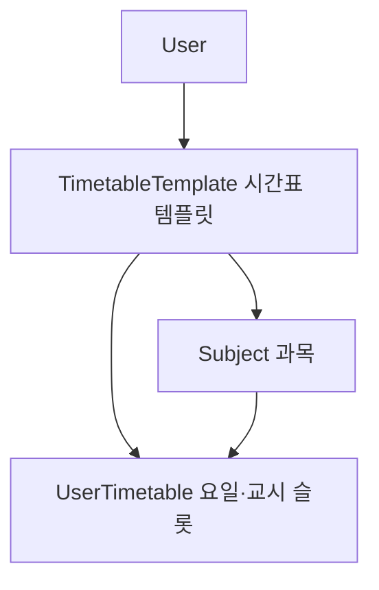

# School · Timetable — 학교 데이터, 급식, 시간표 도메인

## 이 문서가 답하는 질문

- 학교 목록은 어디서 와서 어떻게 DB에 들어가는가 (NEIS ↔ schools.json)?
- 급식 데이터는 언제, 어떤 주기로 수집·적재되는가?
- 시간표는 어떤 엔티티 구조이고, 템플릿 CRUD와 친구 템플릿 가져오기는 어떻게 동작하는가?
- NEIS 연동 코드는 어디에 있고 무엇을 주의해야 하는가?

## 3줄 요약

- 학교·급식 데이터는 "NEIS API 수집 → 로컬 JSON 파일 → DB 적재"의 2단 파이프라인이다. 파일 경로는 `constants/SchoolFileConstants`가 정의한다.
- 급식은 매월 1일 00:00 스케줄러(`cron = "0 0 0 1 * ?"`)가 한 달치를 전량 재수집하고, 부팅 시 initializer가 빈 DB를 채운다.
- 시간표는 사용자당 여러 `TimetableTemplate`(기본 1개 지정), 템플릿 아래 `Subject`(과목)와 `UserTimetable`(요일·교시 슬롯)이 달리는 구조다. 패키지명 `timetableTamplates`는 오타가 고착된 것이다 ([03-package-guide.md](../03-package-guide.md) F-3).

## 학교 데이터 — NEIS와 schools.json

수집·적재 로직은 `api/` 패키지에 있다 (REST 레이어가 아니라 외부 API 클라이언트 — [03-package-guide.md](../03-package-guide.md) F-5).

1. **수집** — `api/SchoolInfoService · loadAllSchools()`: NEIS `schoolInfo` 엔드포인트를 1,000건 단위로 전 페이지 순회하며 학교 목록을 받아 `./schoolData/schoolInfo/schools.json`으로 저장한다 (`constants/SchoolFileConstants.SCHOOL_JSON_PATH`). `neis.api.key` 프로퍼티를 쓰는데, 이 필드 위 주석에 실제 키가 남아 있다 — [KI-03](../KNOWN-ISSUES.md#ki-03-실제-neis-api-키가-소스-주석에-커밋되어-있음).
2. **적재** — `api/SchoolInfoService · importSchoolsFromJson()`: schools.json을 역직렬화해 `existsByCode()`로 중복을 건너뛰며 `domain/schools/School`로 저장한다.

부팅 시 실행 주체가 프로파일별로 다르다.

| 컴포넌트 | 프로파일 | 조건 |
|---|---|---|
| `initializers/AppStartupRunner · onApplicationReady()` | `!prod` | `schoolRepository.count() == 0`일 때만 수집+적재 |
| `api/SchoolInfoInitializer · schoolInit()` | `!prod` | **조건 없이 매 부팅 수집+적재** (아래 ⑤) |
| `initializers/SchoolDataProdInitializer · importSchoolsIfEmpty()` | `prod` | `count == 0`일 때만 수집+적재 |

학교 검색 API는 `controllers/SchoolController · searchSchools()` — `GET /api/schools/search?name=`.

## 급식 — 수집 파이프라인과 조회 API

### 수집·적재

- `api/SchoolMealService · loadAllSchoolMealsForMonth(year, month)` — 전체 학교를 순회하며 NEIS `mealServiceDietInfo`에서 한 달치를 받아 `./schoolData/meals/meals-{yyyy}-{MM}.json` 단일 파일로 저장한다.
- `api/SchoolMealService · importMealsFromJson(year, month)` — JSON을 읽어 **`schoolMealRepository.deleteAll()`로 기존 급식을 전부 지운 뒤** `domain/schools/SchoolMeal`로 재적재한다.
- `schedulers/SchoolMealScheduler · loadSchoolMeals()` — `@Scheduled(cron = "0 0 0 1 * ?")`, 즉 **매월 1일 00:00:00**에 위 두 단계를 실행한다 (`@SchedulerJob(name = "SchoolMealLoad")` 부착).
- 부팅 시: `api/SchoolMealInitializer`를 `AppStartupRunner`(!prod)와 `SchoolDataProdInitializer`(prod)가 호출한다 — 급식 테이블이 비어 있으면 JSON 파일이 있을 때 파일에서 적재하고, (!prod에서는) 파일이 없으면 NEIS 수집부터 한다.

### 조회 API (`controllers/SchoolMealController`, prefix `/api/schools/meals`)

| 메서드 | 경로 | 설명 |
|---|---|---|
| GET | `/today` | 로그인 사용자 학교의 오늘 급식 |
| GET | `/date?date=` | 특정 일자 급식 |
| GET | `/month` | 이번 달 전체 (`SchoolMealService · getMealsByMonth()`) |

세 핸들러 모두 사용자에게 학교가 배정되어 있는지 검증한다(`validateSchoolAssigned()` → `SCHOOL_NOT_ASSIGNED`). 주 단위 조회(`/week`)는 서비스 메서드(`getMealsByWeek()`)만 있고 컨트롤러 핸들러는 주석 처리되어 있다.

## 시간표 — 엔티티 구조

화살표는 1:N 소유 관계다. 실측한 매핑:

- `domain/schools/timetableTamplates/TimetableTemplate` — `user` ManyToOne, `grade`/`semester`/`templateName`/`isDefault`. `subjects`·`timetables` 양쪽에 `cascade = REMOVE`가 걸려 템플릿 삭제 시 과목·슬롯이 함께 지워진다.
- `domain/schools/subjects/Subject` — `timetableTemplate` ManyToOne, `hoursPerWeek`(슬롯 추가/삭제 시 증감), `userTimetables`에 `cascade = REMOVE`.
- `domain/schools/UserTimetables/UserTimetable` — `subject` ManyToOne + `timetableTemplate` ManyToOne, `day`(DayOfWeek)·`period`(교시). "한 시간 분량의 수업 한 칸"이다.

패키지 표기 주의: `timetableTamplates`(오타 고착), `UserTimetables`(대문자) — [03-package-guide.md](../03-package-guide.md) F-2·F-3. 또한 `TimetableTemplateService`·`UserTimetableService`는 `services/` 직속이라 실행시간 로깅 AOP 범위 밖이다 (같은 문서 F-1).

## 시간표 — API 흐름

### 템플릿 CRUD (`controllers/TimetableTemplateController`, prefix `/api/timetableTemplates`)

| 메서드 | 경로 | 설명 |
|---|---|---|
| GET | `` (루트) | 내 템플릿 목록 |
| POST | `` (루트) | 템플릿 생성. `isDefault=true`면 `selectDefaultTemplate()`이 기존 기본을 모두 해제하고 단일 기본을 보장 |
| PATCH | `/{id}` | 부분 수정 (소유자 검증은 컨트롤러에서 id 비교) |
| DELETE | `/{id}` | 삭제 — cascade로 과목·슬롯 동반 삭제 |
| GET | `/friends/{friendId}/default` | 친구의 기본 템플릿 상세 조회 ([domains/friend.md](friend.md) 참고) |
| POST | `/import` | 친구 템플릿 가져오기 |

**친구 템플릿 import** (`services/TimetableTemplateService · importTemplate()`): 원본 템플릿 소유자가 본인이 아니면 `FriendService · validateFriendship()`(양방향 FRIEND 요구)을 통과해야 한다. 이후 템플릿 → 과목 → 슬롯 순으로 깊은 복사를 하며, 원본 과목 id → 복사본 과목 매핑으로 슬롯의 과목 참조를 다시 연결한다. `isDefault` 요청 시 복사본을 기본으로 지정한다.

### 과목·슬롯 (`controllers/SubjectController`, `controllers/UserTimetableController`)

- 과목: `GET/POST /api/timetableTemplates/{id}/subjects`, `PATCH/DELETE .../subjects/{subjectId}` — 템플릿 소유자 검증 후 CRUD.
- 슬롯: `GET .../userTimetables`(전체), `GET /api/timetableTemplates/userTimetables/today`(기본 템플릿에서 오늘 요일만), `POST .../userTimetables`(추가 — `services/domain/TimetableSubjectService · createTimetableAndIncHours()`가 슬롯 저장과 과목 `hoursPerWeek` 증가를 묶음), `DELETE .../userTimetables/{id}`(삭제 — `deleteTimetableAndDecHours()`).
- 이 컨트롤러들의 소유자 불일치 응답은 예외가 아니라 `400 badRequest` 빈 응답이다 — `CustomException(ErrorCode)` 관례와 다른 스타일이니 프론트 에러 처리 시 주의.

## 코드 좌표

| 개념 | 위치 |
|---|---|
| NEIS 학교 수집·JSON 적재 | `api/SchoolInfoService.java · loadAllSchools() / importSchoolsFromJson()` |
| NEIS 급식 수집·JSON 적재 | `api/SchoolMealService.java · loadAllSchoolMealsForMonth() / importMealsFromJson()` |
| 급식 월 배치 (cron 실측) | `schedulers/SchoolMealScheduler.java · loadSchoolMeals()` |
| 부팅 시 데이터 시드 | `initializers/AppStartupRunner.java`, `initializers/SchoolDataProdInitializer.java`, `api/SchoolInfoInitializer.java`, `api/SchoolMealInitializer.java` |
| JSON 파일 경로 상수 | `constants/SchoolFileConstants.java` |
| 급식 조회 API | `controllers/SchoolMealController.java` |
| 학교 검색 API | `controllers/SchoolController.java · searchSchools()` |
| 시간표 엔티티 3종 | `domain/schools/timetableTamplates/TimetableTemplate.java`, `domain/schools/subjects/Subject.java`, `domain/schools/UserTimetables/UserTimetable.java` |
| 템플릿 CRUD·import·기본 지정 | `services/TimetableTemplateService.java · importTemplate() / selectDefaultTemplate()` |
| 슬롯-과목 시수 동기화 | `services/domain/TimetableSubjectService.java · createTimetableAndIncHours() / deleteTimetableAndDecHours()` |
| RestTemplate 빈 | `configs/AppConfig.java · restTemplate()` |

## 알려진 문제·미확인 사항

기존 등재 항목: 소스 주석의 실 NEIS 키 — [KI-03](../KNOWN-ISSUES.md#ki-03-실제-neis-api-키가-소스-주석에-커밋되어-있음).

아래는 이번 검증에서 확인한 신규 결함으로, [KI-44](../KNOWN-ISSUES.md)(타임아웃), [KI-45](../KNOWN-ISSUES.md)(초기화 중복·유실), [KI-46](../KNOWN-ISSUES.md)(NPE), [KI-47](../KNOWN-ISSUES.md)(엔티티 노출)로 등재되어 있다.

- **RestTemplate 타임아웃 미설정** — `configs/AppConfig · restTemplate()`이 `new RestTemplate()` 기본 생성이라 연결·읽기 타임아웃이 없다. NEIS 응답이 멈추면 부팅 이벤트(ApplicationReady)와 월 배치 스레드가 무기한 대기한다.
- **`SchoolInfoInitializer`가 !prod 부팅마다 조건 없이 NEIS 전량 크롤 실행** — 같은 프로파일의 `AppStartupRunner`(count==0 조건)와 중복 등록이라, dev 부팅이 매번 전국 학교 전 페이지를 호출하고 schools.json을 다시 쓴다. 부팅 지연과 API 쿼터 소모의 원인.
- **`SchoolDataProdInitializer`의 최초 수집 분기가 도달 불가** — 바깥 조건이 `count == 0 && file.exists()`인데 내부에서 다시 `file.exists()`를 분기하므로, JSON 파일이 없는 prod 최초 기동에서는 `loadDataAndSaveToDb()`가 절대 실행되지 않는다. 다음 달 1일 스케줄러까지 급식이 비어 있게 된다.
- **`importMealsFromJson()`이 `deleteAll()` 후 재적재** — 수집이 실패해 JSON이 비었어도 기존 데이터를 먼저 지우므로 급식 전체가 사라질 수 있다 (물리 삭제라 복구도 안 됨).
- **`TimetableTemplateService · update()`의 NPE** — `if(changedName != null || !changedName.isEmpty())`는 `templateName`이 null이면 우변 평가에서 NPE가 난다. 컨트롤러 문서("바꾸지 않을 값은 null 전달")대로 호출하면 500.
- `SchoolController · searchSchools()`가 `School` 엔티티를 DTO 없이 직접 반환한다 — 엔티티 비노출 컨벤션 위배 (경미).
- `[미확인]` NEIS 전량 크롤의 실제 소요 시간·호출량 — 실행 측정하지 않음.
- `[미확인]` `enums/Grade`·`enums/Semester`의 값별 화면 표기 — 프론트 매핑을 확인하지 않음.

마지막 검증일: 2026-07-30
