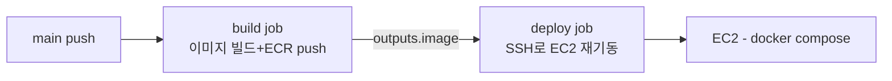

# operations/deploy — 배포 파이프라인 해설

## 이 문서가 답하는 질문

- `main`에 push하면 정확히 어떤 단계로 배포되는가?
- AWS 자격증명은 어떻게 처리되는가 (시크릿 전략)?
- 워크플로의 환경변수 11개는 각각 어디로 흘러가는가?
- 프론트엔드는 어떻게 배포되는가?

## 3줄 요약

- `main` push → build job(GitHub 러너에서 Docker 이미지 빌드 → ECR push) → deploy job(SSH로 EC2 접속 → `.env` 생성 → `docker-compose.prod.yml` 재기동).
- AWS 정적 키가 없다 — GitHub 쪽은 OIDC(`role-to-assume`), EC2 쪽은 Instance Profile로 ECR/S3에 접근한다.
- 배포 후 헬스체크·자동 롤백 단계가 없고 테스트도 실행되지 않는다 ([KI-12](../KNOWN-ISSUES.md#ki-12-테스트가-ci에서-실행되지-않음), 아래 ⑤).

## 트리거와 전체 흐름

`.github/workflows/deploy.yml` — `on: push: branches: [main]`. 잡 2개가 `needs`로 직렬 연결된다.

## build job 스텝별 해설

| 스텝 | 하는 일 |
|---|---|
| `actions/checkout@v4` | 소스 체크아웃 |
| `configure-aws-credentials@v4` | **OIDC**로 `github-actions-ecr-role` IAM 롤 assume — 저장소에 AWS 키를 저장하지 않는다 (`permissions: id-token: write`가 이를 위한 설정) |
| `amazon-ecr-login@v2` | ECR 로그인 |
| Create ECR repository if not exists | `aws ecr describe-repositories \|\| create-repository` — 최초 배포 대비 |
| Build and push | `docker build`로 커밋 SHA 태그와 `latest` 태그를 모두 빌드·push. SHA 태그 이미지 URI를 `outputs.image`로 deploy job에 전달 |

이미지 빌드는 `Dockerfile` 멀티스테이지다: JDK 스테이지에서 `./gradlew build -x test`(테스트 생략 — [KI-12](../KNOWN-ISSUES.md#ki-12-테스트가-ci에서-실행되지-않음)), JRE 스테이지에서 non-root `spring` 사용자로 실행, `ENTRYPOINT`에 `--spring.profiles.active=prod` 고정.

## deploy job 스텝별 해설

`appleboy/ssh-action@v1.0.3`으로 EC2에 접속해 스크립트를 실행한다. 접속 정보는 GitHub Secrets(`EC2_HOST`, `EC2_USER`, `EC2_SSH_KEY`), 애플리케이션 시크릿 10개는 `env:`로 정의 후 `envs:` 목록으로 SSH 세션에 전달된다.

EC2에서 실행되는 스크립트 순서:

1. `~/app`이 없으면 저장소 clone, 있으면 `git fetch` + `git reset --hard origin/main` — compose 파일 등 저장소 파일을 EC2에 동기화.
2. `rm -f docker-compose.yml` — 로컬용 compose 파일이 prod compose와 병합되는 사고 방지.
3. `aws ecr get-login-password | docker login` — **EC2 Instance Profile** 자격으로 ECR 로그인 (여기서도 정적 키 없음).
4. `printf ... > .env` — 전달받은 시크릿 11개를 EC2의 `.env` 파일로 기록.
5. `docker compose -f docker-compose.prod.yml --env-file .env pull` → `up -d --force-recreate` — ECR에서 이미지 pull 후 컨테이너 재생성. EC2에서 빌드하지 않는다.

`docker-compose.prod.yml`: 서비스는 `app` 하나뿐이고 `network_mode: host`(EC2 호스트의 Redis에 localhost로 접근), `restart: unless-stopped`, `container_name: highteenday-app`. MySQL·Redis는 compose가 관리하지 않는다 (주석은 RDS·호스트 Redis를 전제 — [02-architecture.md](../02-architecture.md)의 `[미확인]` 참고).

## 환경변수 전체 표 (워크플로 envs 11개)

`envs: IMAGE,DB_URL,DB_USERNAME,DB_PASSWORD,REDIS_HOST,REDIS_PORT,JWT_KEY,S3_BUCKET,GOOGLE_CLIENT_ID,GOOGLE_CLIENT_SECRET,NEIS_API_KEY` 기준. 경로: GitHub Secrets → SSH env → `.env` → `docker-compose.prod.yml`의 `environment:` → `application-prod.properties`의 `${...}` 플레이스홀더.

| 워크플로 env | 용도 | 소비처 (application-prod.properties 키) |
|---|---|---|
| `IMAGE` | 배포할 ECR 이미지 URI (커밋 SHA 태그) | Spring이 아니라 `docker-compose.prod.yml · image: ${ECR_IMAGE}` (.env에는 `ECR_IMAGE=`로 기록됨) |
| `DB_URL` | MySQL JDBC URL | `spring.datasource.url` |
| `DB_USERNAME` | DB 계정 | `spring.datasource.username` |
| `DB_PASSWORD` | DB 비밀번호 | `spring.datasource.password` |
| `REDIS_HOST` | Redis 호스트 | `spring.data.redis.host` |
| `REDIS_PORT` | Redis 포트 | `spring.data.redis.port` (compose·프로퍼티 모두 기본값 6379) |
| `JWT_KEY` | JWT HMAC 서명 키 | `jwt.key` |
| `S3_BUCKET` | 이미지 버킷명 | `cloud.aws.s3.bucket` (자격증명은 Instance Profile — 프로퍼티 주석) |
| `GOOGLE_CLIENT_ID` | OAuth2 클라이언트 ID | `spring.security.oauth2.client.registration.google.client-id` |
| `GOOGLE_CLIENT_SECRET` | OAuth2 클라이언트 시크릿 | `...google.client-secret` |
| `NEIS_API_KEY` | 급식 API 키 | `neis.api.key` |

## 프론트엔드 배포 (요약)

`highteenday-frontend/.github/workflows/deploy.yml` — 백엔드와 별개 저장소·별개 파이프라인. `main` push 시 단일 `deploy` job이: Node 18 설치 → `npm ci --legacy-peer-deps` → `CI=false npm run build` → OIDC로 `ec2-s3-role` assume → `aws s3 sync build/ s3://highteenday-frontend-bucket --delete` → css/js/index.html의 Content-Type 메타데이터 보정(`aws s3 cp --metadata-directive REPLACE`) → CloudFront 배포(`E7CJKNIM1V1OC`) 전체 경로 `/*` 무효화. 백엔드와 마찬가지로 정적 AWS 키 없이 OIDC를 쓴다.

## 코드 좌표

| 개념 | 위치 |
|---|---|
| 백엔드 파이프라인 | `.github/workflows/deploy.yml` (build job / deploy job) |
| 이미지 정의 | `Dockerfile` (멀티스테이지, `-x test`, non-root, prod 프로파일 고정) |
| prod 컨테이너 구성 | `docker-compose.prod.yml · app` |
| prod 프로퍼티 매핑 | `src/main/resources/application-prod.properties` |
| 프론트 파이프라인 | `highteenday-frontend/.github/workflows/deploy.yml` |

## 알려진 문제·미확인 사항

- [KI-12](../KNOWN-ISSUES.md#ki-12-테스트가-ci에서-실행되지-않음) 파이프라인에 테스트 단계 없음
- [KI-48](../KNOWN-ISSUES.md) **배포 후 검증·롤백 부재** — deploy job이 `up -d`로 끝나며 헬스체크·스모크 테스트·실패 시 이전 이미지 복귀 단계가 없다. 기동 실패 시 파이프라인은 성공으로 표시된 채 서비스만 죽는다. 수동 롤백 절차는 [runbook.md](runbook.md) 참고.
- `[미확인]` 1건: prod MySQL 위치(RDS 여부 — [02-architecture.md](../02-architecture.md)와 동일 항목)

마지막 검증일: 2026-07-30
