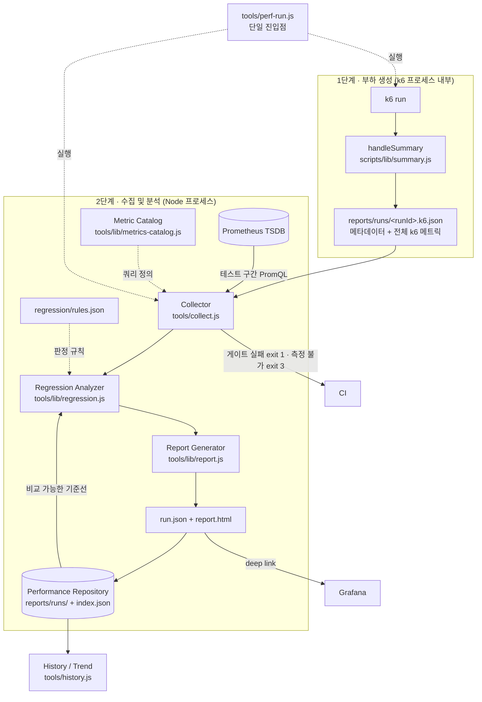

# Performance Management System

k6 실행 결과와 운영 지표를 하나의 이력으로 묶어, **성능 회귀를 자동으로 판정하고
추세를 추적하는** 체계. 이 문서는 구조와 그 구조를 선택한 이유를 설명한다.

---

## 1. 왜 바꿨나 — 이전 구조의 한계

기존에는 두 개의 세계가 따로 있었다.

| | 무엇을 아는가 | 무엇을 모르는가 |
|---|---|---|
| k6 HTML Summary | 응답시간, 처리량, 오류율 | 서버가 왜 그랬는지 |
| Prometheus / Grafana | CPU, GC, DB, Redis | 어느 테스트의 어느 구간인지 |

둘이 연결돼 있지 않아서 다음 질문에 답할 수 없었다.

- **"P95가 300ms 늘었다. 원인이 뭔가?"** → Grafana를 열어 시간대를 손으로 맞춰야 알 수 있고,
  대부분은 그 수고를 들이지 않는다.
- **"지난주보다 느려졌나?"** → 파일명으로 정렬해 HTML을 두 개 열어 눈으로 비교해야 한다.
- **"3개월 동안 어떤 방향으로 가고 있나?"** → 답할 방법이 없었다.

성능 저하는 대개 한 번의 사고가 아니라 매 배포 3~5%씩의 누적으로 온다.
개별 판정은 계속 통과하는데 반년 뒤 2배가 되는 식이다. **이력 없이는 이걸 볼 수 없다.**

---

## 2. 아키텍처



### 2.1 왜 2단계로 나눴나 (가장 중요한 설계 결정)

"k6 안에서 Prometheus까지 조회해 리포트를 완성"하는 1단계 구조가 더 단순해 보인다.
그렇게 하지 않은 이유는 세 가지다.

**① 스크레이프 지연**
테스트가 `t=end`에 끝나면 마지막 5초 구간은 아직 Prometheus에 들어와 있지 않다.
`handleSummary` 안에서 즉시 조회하면 **부하가 가장 높았던 종료 직전 구간이 통째로 누락**된다.
수집기는 스크레이프 지연만큼 기다린 뒤(`--wait`, 기본 20초) 조회한다.

**② k6 런타임 제약**
`handleSummary`는 동기 함수다. 재시도·백오프가 필요한 네트워크 호출을 제대로 감쌀 수 없고,
조회가 실패하면 20분짜리 테스트 결과를 통째로 잃는다.

**③ 재현성**
원본(`k6.json`)이 남아 있으면 수집 로직이 바뀌어도 과거 실행을 다시 계산할 수 있다.
실제로 이번에 과거 56회 실행을 소급 처리해 운영 지표까지 채워 넣었다 —
1단계 구조였다면 불가능했을 일이다.

### 2.2 왜 파일 저장소인가 (DB 아님)

성능 이력은 ⓐ 쓰기가 테스트당 1회로 극히 드물고 ⓑ 읽기는 "최근 N개"가 사실상 전부이며
ⓒ 코드와 함께 Git으로 관리될 때 가치가 가장 크다. 이 조건에서 RDB는 순수 비용이다 —
스키마 마이그레이션, 접속 정보, 백업, CI에서의 기동이 전부 새 운영 부담이 된다.

대신 **나중에 DB로 옮길 수 있는 모양**은 유지했다.

- `run.json` 하나가 곧 한 행(row)이다 — 자기완결적, 조인 불필요
- `index.json`은 파생 캐시일 뿐 — `tools/history.js --rebuild`로 언제든 재생성

팀이 커져 동시 조회가 필요해지면 `index.json` 생성부만 DB 적재로 바꾸면 된다.

---

## 3. 사용법

```bash
# 표준 실행 — k6 실행 → 지표 수집 → 회귀 판정 → 리포트 생성까지 한 번에
node tools/perf-run.js scenarios/normal-day.js

# 옵션
node tools/perf-run.js scripts/posts.js \
  --vus 50 --duration 5m \
  --warmup 60 \                 # k6 ramp-up 단계 자체를 60초로 만든다(T-03/S-08).
                                 # 수집기가 사후에 자르는 옵션이 아니다 — k6 threshold와
                                 # Prometheus 조회 창이 둘 다 이 값을 기준으로 measure
                                 # 구간을 판정한다. 미지정 시 시나리오 기본값 유지.
  --note "게시글 목록 인덱스 추가 후"

# 이력 / 추세
node tools/history.js            # reports/history.html 생성
node tools/history.js --print    # 터미널 표
node tools/history.js --scenario normal-day

# 개별 재처리 (리포트만 다시 만들기)
node tools/collect.js <runId> --force --no-wait

# 과거 raw 리포트 이관
node tools/migrate-raw.js && node tools/collect.js --all --no-wait

# 데이터셋 스냅샷
node tools/snapshot.js create large    # 검증 직후 상태를 불변 사본으로 보존
node tools/snapshot.js list
node tools/snapshot.js verify large    # 지금 DB 가 스냅샷과 같은가
node tools/snapshot.js restore large   # 되돌린다 (Redis FLUSHALL 포함)
```

### 데이터셋 상태 강제 (`--guard`)

실행마다 **시작 시점의 DB 상태를 지문으로 남긴다.** 프로파일 이름(`large`)과 생성
지문(`meta.json`)은 "어떻게 만들었나"에만 답하므로, write-heavy 가 데이터를 바꿔 놓아도
값이 그대로여서 다음 실행이 비교 가능으로 판정되던 구멍이 있었다.

| 모드 | 동작 |
|---|---|
| `off` | 상태 지문을 **기록만** 한다. 판정·복원 없음 |
| `warn` | 스냅샷과 다르면 경고하고 그 실행의 기준선 자격을 뺏는다. 복원은 안 함 |
| `strict` | 다르면 **볼륨을 복원**하고 재확인한다. 그래도 다르면 실행을 거부 |

우선순위는 **`--guard` > `PERF_DATASET_GUARD` > `perf.config.json` > 기본값 `off`** 다.
이 저장소는 `perf.config.json` 으로 `strict` 를 쓴다 — large 는 재현이 안 되는 일회성
자산이라(시더의 난수 소비 순서) 오염되면 되돌릴 방법이 스냅샷뿐이기 때문이다.

```bash
node tools/perf-run.js scenarios/write-heavy.js --dataset large   # perf.config.json → strict
node tools/perf-run.js scenarios/deep-paging.js --guard off       # 이번만 끈다
PERF_DATASET_GUARD=warn node tools/perf-run.js ...                # 이 셸에서만
```

**측정은 항상, 판정만 스위치다.** `off` 여도 지문은 계산해 `run.json` 에 남긴다(실측
0.4초). 안 재 두면 나중에 켰을 때 과거 실행 전부가 비교 불가가 되지만, 항상 재 두면
모드를 바꿔도 `history.js --rebuild` 로 소급 적용된다 — **모드 변경이 재실행이 아니라
재계산으로 복구된다.**

지문에서 **제외**하는 값이 있다. `tokens`(VU 가 로그인할 때마다 회전),
`posts.view_count` 합(Redis 버퍼를 스케줄러가 flush), hot post 테이블(스케줄러가 씀).
넣으면 아무 일도 안 했는데 매번 불일치가 나서 복원이 무한히 반복된다. 버리지 않고
`volatile` 로 따로 기록해 "쓰기가 있었나"와 "조회수만 올랐나"를 구분한다.

실측(large, 2.72GB 볼륨): 지문 계산 **0.41~0.44초**, 스냅샷 생성 **0.50GB / 109.5초**,
복원 **26~30초**(압축 해제) · 앱 부팅까지 **82초**.

무엇을 세고 무엇을 빼는지, 왜 그렇게 정했는지, 어떻게 판정에 반영되는지는 별도 문서에
정리했다: **[`DATASET-STATE.md`](DATASET-STATE.md)**

### 부하 발생기 계측 (`--loadgen`)

```bash
node tools/perf-run.js scenarios/normal-day.js --loadgen docker   # k6를 perf-k6 컨테이너로
node tools/perf-run.js scenarios/normal-day.js                    # 기본값 local
```

`local`(기본)은 Windows 네이티브 `k6.exe`다. **아무도 그것을 측정하지 못한다** — cAdvisor는
컨테이너만 보고, node-exporter가 보는 "호스트"는 WSL2 VM이라 그 밖의 프로세스가 잡히지
않는다. 그래서 "이 실행의 지연이 서버 탓인지 부하 발생기가 CPU를 뺏은 탓인지" 판별할 수
없다.

`docker`면 k6가 `perf-k6` 컨테이너로 뜨고 cAdvisor가 CPU·throttling·메모리를 따로 잰다
(`loadgen` 지표 그룹). `K6_CPUS`(기본 4)로 상한도 걸린다. **`loadgen.throttledPct`가 0이
아니면 그 실행의 지연은 발생기가 만든 것일 수 있다** — 회귀 규칙에 경고로 걸려 있다
(warn 1% / fail 5%, `gate:false`).

컨테이너 k6 버전(`K6_IMAGE`, 기본 `grafana/k6:2.1.0`)은 **로컬 바이너리와 같아야 한다.**
다르면 비교가 무효가 되고, 낮은 버전은 스크립트 문법 자체를 못 읽는다.

실측(large, 10 VU · 45초): 발생기 CPU 최대 **0.026코어** · throttled **0.194%** · 메모리
**145.5MB**. 같은 구간 앱은 **1.239코어** — 발생기가 앱의 1/48이다.

### 왜 `perf-run.js` 래퍼가 필요한가

k6를 직접 치면 사람이 매번 세 가지를 챙겨야 한다.

1. `--summary-trend-stats` — **빼먹으면 P99가 아예 계산되지 않는다.** k6 기본값은
   `avg/min/med/max/p(90)/p(95)`뿐이다. 조용히 누락되므로 알아채기 어렵다.
2. 브랜치·커밋·실행자 메타데이터 주입
3. 실행 후 수집기 기동

사람이 매번 기억해야 하는 절차는 결국 지켜지지 않는다. 그래서 한 명령으로 묶었다.

---

## 4. 저장되는 것

### 4.1 실행 메타데이터 (`run`)

Test ID · Scenario · Environment · Branch · Commit SHA · Build Number · 실행자 ·
시작/종료 시각 · Duration · VU · Ramp-up · **Script Version** · Dataset · Note

`scriptVersion`은 **진입 스크립트 + 부하의 성격을 결정하는 공용 모듈들**의 SHA-256 앞 12자다.
"같은 성격의 부하로 잰 결과인가"를 나중에 판별하기 위한 지문이다. 대상 목록은
`tools/perf-run.js`의 `TRAFFIC_SHAPING_FILES`에 있다 — 현재 `scenarios/lib/workload.js`(여정
구성과 가중치), `scripts/lib/data.js`(대상 선택), `scripts/lib/sampling.js`(인기·페이지 분포).

> 예전에는 진입 파일 **하나만** 해싱했다. 그래서 `sampling.js`의 인기 분포를 완전히 바꿔도
> `scenarios/normal-day.js`는 한 글자도 안 바뀌어 지문이 그대로였고, 트래픽 형태가 달라진
> 실행이 옛 실행과 `exact` 비교 가능으로 판정됐다.
>
> `scripts/lib/` 전체를 넣지 않는 이유: `config.js`·`session.js`·`summary.js`처럼 부하 형태와
> 무관한 이유로 자주 바뀌는 파일이 섞여 있다. 전부 넣으면 거의 모든 실행이 `degraded`가 되어
> 경고가 상시 켜지고, 결국 아무도 안 본다. 지문이 답할 질문은 "코드가 바뀌었나"가 아니라
> **"부하의 성격이 바뀌었나"**다. 목록이 실제 파일과 어긋나면
> `tools/test/fingerprint.test.js`가 실패한다.

`datasetFingerprint`는 시드 데이터의 지문이다. `datasets/seed.js`가 생성 시점에
`generated/<profile>/meta.json`으로 남기고, `perf-run.js`가 읽어 레코드에 싣는다.
생성기 코드(`seed.js` + `sampling.js`) · 프로파일 파라미터 · **실제 생성 개수**를 해싱한다.
생성 시각은 넣지 않는다 — 같은 생성기·같은 프로파일로 다시 시드하면 LCG 시드가 고정이라
통계적으로 동일한 데이터셋이 나오고, 그걸 매번 다른 데이터셋으로 취급하면 재시드할 때마다
기준선이 전부 무효가 되기 때문이다. 이 장치가 없던 시절의 데이터셋에는 `meta.json`이 없어
값이 `null`이 되며, 지문이 있는 실행과는 비교되지 않는다.

`datasetFingerprint`가 "어떻게 만들었나"에 답한다면, **아래 필드들은 "실행이 시작될 때
실제로 무엇이 들어 있었나"에 답한다.** `perf-run.js`가 실행 전후로 DB를 세어
`reports/runs/<runId>.dbstate.json`에 쓰고 `collect.js`가 `run`에 합친다.

| 필드 | 뜻 |
|---|---|
| `datasetGuard` · `datasetGuardSource` | `off`\|`warn`\|`strict` 와 그 값이 어디서 왔는지 |
| `stateBefore` · `stateAfter` | 실행 전후의 상태 지문 (`sha256:` 앞 12자) |
| `stateCoreBefore/After` · `stateVolatileBefore/After` | 지문을 만든 원자료 |
| `stateChanged` · `stateDelta` | core 가 변했는가, 무엇이 얼마나 |
| `snapshotId` · `stateMatchedSnapshot` | 어느 스냅샷을 기준으로 삼았고 일치했는가 |
| `restored` · `restoreMs` · `cacheState` | 복원했는가, 얼마나 걸렸는가, 캐시 상태 |

`stateBefore`는 **`guard`가 `off`가 아닐 때만 비교 조건에 들어간다.** 값 자체는 모드와
무관하게 항상 기록되므로, 나중에 모드를 켜고 `history.js --rebuild`를 돌리면 소급 적용된다.
자세한 설계와 실측값: **[`DATASET-STATE.md`](DATASET-STATE.md)**

커밋에 uncommitted 변경이 있으면 `commit`에 `+dirty`가 붙는다.

### 4.2 k6 지표 (`k6`)

**`all` / `phases` 로 나뉜다(T-03/S-08/S-17).** `all`은 ramp-up + hold + ramp-down을 전부
합친 전체 구간 집계 — 참고용이지 판정 기준이 아니다. `phases.warmup` / `phases.measure` /
`phases.rampdown`이 phase 태그로 실제 분리된 구간별 집계이며, **회귀 게이트와 k6 threshold
판정은 `phases.measure`만 본다.** `all`은 이름 그대로 이전의 `overall`을 대체한 것으로,
"판정 기준이 아니라 전체 참고용"임을 명확히 하려고 개명했다.

각 구간(`all`, `phases.*`)은 avg/min/med/max/P90/P95/P99, RPS, **TPS**, Error Rate,
HTTP Request Count, Check Success Rate까지 담는다. Iterations, 송수신 바이트,
waiting/blocked 분해는 `all`에만 있다 — 이들은 요청 자체보다 실행 환경 진단용이라
phase별로 쪼갤 실익이 적다.

> **RPS와 TPS를 구분하는 이유**
> RPS는 초당 HTTP 요청 수, TPS는 초당 완료된 iteration(= 사용자 여정 1회)이다.
> 용량 산정과 경영 보고에 쓰이는 건 RPS가 아니라 TPS다. "동시 사용자 200명을 받을 수 있나"는
> 요청 수가 아니라 여정 완료 수로 답해야 한다.
>
> **phase별 TPS는 k6 builtin `iterations`가 아니라 커스텀 Counter에서 나온다.** k6의
> `iterations`는 엔진이 iteration 완료 시점에 직접 기록하므로 요청 시점 기준 동적 phase
> 태그를 실을 수 없다(그건 스크립트가 아니라 k6가 만든다). 그래서 `workload.js`가 매
> iteration 끝에 `phase_iterations` Counter를 phase 태그와 함께 직접 증가시키고,
> `phases.<phase>.tps`는 `phase_iterations{phase:X}.count / plan.<X>Sec`로 계산한다.
>
> **단, 정적 executor 태그를 쓰는 시나리오는 builtin `iterations`로 폴백한다.**
> `cache-warm`은 warmup/measure를 두 개의 executor로 나누고 `scenarios.<name>.tags`로
> 정적 태깅하므로 동적 phase 계산(`setActivePhasePlan`)을 켜지 않는다. 그러면 위의 커스텀
> Counter는 한 번도 증가하지 않는다(`workload.js`가 `currentPhase()`가 null이면 세지 않는다).
> 대신 정적 태그는 builtin 메트릭에도 붙으므로 `iterations{phase:X}`에 값이 남는다.
> 그래서 `metricsByPhase()`는 ① `phase_iterations{phase:X}` → ② `iterations{phase:X}`
> 순으로 확인하고, 둘 다 비어 있으면 0이 아니라 `null`(미집계)을 기록한다. 0으로 확정하면
> 리포트에 "TPS 0.00"이라는 거짓 값이 찍힌다 — 실제로 cache-warm이 그랬다.

`breakdown`은 기능별/오퍼레이션별 분해이며, `all`과 마찬가지로 phase 구분이 없는
전체 구간 값이다(기능별로 phase까지 쪼개면 threshold 축이 조합 폭발한다 — 의도적 범위
제한). k6는 threshold에 태그 필터가 걸린 항목에만 서브메트릭을 만들어 주므로,
`config.js`의 `BREAKDOWN_THRESHOLDS`에 판정에 영향 없는 느슨한 상한(`p(99)<600000`)으로
축을 선언해 둔다. `phases.*`도 같은 메커니즘이다 — `PHASE_DIAGNOSTIC_THRESHOLDS`가
`http_req_duration{phase:X}` 같은 bare per-phase 축을 강제로 만든다.

### k6 threshold의 평가 범위

판정 기준값은 `COMMON_SLO_THRESHOLDS` 한 곳에만 있고(읽기 P95 300ms, 쓰기 P95 500ms,
오류율 1%, 체크 성공률 99%), **적용 범위는 실행 종류에 따라 갈린다.**

| 실행 종류 | 쓰는 상수 | 실제 SLO가 평가되는 범위 |
|---|---|---|
| 단독 스크립트(`scripts/*.js`), 진단 시나리오(stress·spike·breakpoint·chaos·failover) | `DEFAULT_THRESHOLDS` | 실행 전체 구간 |
| phase 시나리오(normal-day·soak·peak-hour·cache-warm·cold-start 등) | `PHASED_THRESHOLDS` | `{phase:measure}` 구간만 |

주의할 점은 "모든 threshold가 measure만 본다"가 **아니라는** 것이다. 범위가 갈리는 것은
**실제 SLO**뿐이다.

- `PHASED_THRESHOLDS`에는 태그 없는 SLO가 들어 있지 않다. 넣으면 같은 기준이 전체 구간과
  measure 구간에 이중으로 걸려서, warmup의 JIT 컴파일·커넥션 풀 확장·캐시 미스로 생긴
  느린 응답이 measure 결과와 무관하게 실행 전체를 FAIL로 만든다. warmup을 선언한 이유가
  그 구간을 판정에서 빼려는 것이므로 이중 적용은 그 선언을 무효로 만든다.
- `BREAKDOWN_THRESHOLDS`·`PHASE_DIAGNOSTIC_THRESHOLDS`는 **전체 구간에 그대로 남는다.**
  이들은 판정 장치가 아니라 집계 축 생성 장치다 — k6는 threshold가 참조한 태그 조합에만
  서브메트릭을 만들어 주므로, 기능별 분해와 phase별 p95·오류율·checks·RPS·TPS 요약이
  이 축에서 나온다. 값은 어떤 결과에도 통과하도록 잡혀 있다(`p(99)<600000`, `rate<=1`,
  `rate>=0`, `count>=0`). 오류율 축이 `rate<1`이 아니라 `rate<=1`인 것은 warmup 요청이
  전부 실패하면 rate가 정확히 1이 되어 실행이 FAIL 되기 때문이다(k6 실측).
- phase를 쓰지 않는 단독 스크립트는 예나 지금이나 전체 실행을 판정한다. 이 문서의
  measure 관련 서술은 그쪽에는 적용되지 않는다.

시나리오가 자기 기준을 얹을 때는 `measureOnly()`를 통과시킨다. 이 헬퍼는 threshold 키에
`phase:measure` 태그를 병합하므로, `http_req_duration{name:login}`은
`http_req_duration{name:login,phase:measure}`가 된다. 값 배열은 그대로 전달되어
`abortOnFail`·`delayAbortEval`도 유지된다.

> **덮어쓰기가 성립하는 이유** `measureOnly()`가 만드는 키는 태그 이름을 정렬해
> 직렬화하므로, `peak-hour`가 선언한 `http_req_failed{phase:measure}`는
> `PHASED_THRESHOLDS`의 공통 오류율 게이트와 **같은 키**다. 따라서 시나리오 값이 공통
> 값을 대체하며, 하나의 대상에 1%와 2% 두 기준이 동시에 걸리지 않는다. 키 문자열을 손으로
> 조합하면 태그 순서가 어긋나 중복 게이트가 생기므로 반드시 이 헬퍼를 쓴다.

**조기 중단(abortOnFail)의 평가 시작 시점.** k6의 `delayAbortEval`은 threshold의 스코프와
무관하게 **테스트 시작**부터 센다. measure로 스코프해도 이 지연이 warmup보다 짧으면
표본이 몇 건뿐인 상태에서 평가가 시작돼 이상치 하나로 실행이 중단될 수 있다. 그래서 phase
시나리오는 `abortDelayAfterMeasure(PLAN, N)`으로 "measure 시작 + N초"를 계산해 넘긴다.
N은 원래 의도했던 관측 시간 그대로이며 기준 수치는 바뀌지 않는다. 예를 들어 soak는
warmup 300초 + 관측 600초 = 900초부터 오류율 2% 중단 조건을 평가한다.

진단 전용 시나리오(stress·spike·breakpoint·chaos·failover)의 중단 정책은 손대지 않았다.
한계 탐색이 목적이라 램프업 구간의 붕괴 자체가 관찰 대상이고, phase 태깅도 켜지 않는다.

**cold-start는 예외처럼 보이지만 같은 규칙이다.** `warmupSec: 0`으로 선언해 30초 ramp를
포함한 전 구간이 `phase:measure`로 태깅되므로, measure 게이트가 곧 전체 실행 게이트다.
재기동 직후의 콜드 상태 자체가 측정 대상이라, 앞부분을 판정에서 빼면 이 시나리오의 존재
이유가 사라진다.

**전제 조건.** `PHASED_THRESHOLDS`는 `phase_iterations` 축을 선언하므로, 이 상수를 쓰는
시나리오는 그 Counter를 등록하는 `scenarios/lib/workload.js`를 반드시 로드해야 한다.
k6는 등록되지 않은 메트릭의 threshold를 만나면 실행을 시작하지 못하고 중단한다.

`rawMetrics`에 k6 원본 전체를 보관한다 — 나중에 새 지표가 필요해져도 과거 실행을
다시 계산할 수 있어야 하므로.

### 4.3 운영 지표 (`infra`)

Prometheus 원본을 복사하지 않는다. **테스트 시간 구간에 해당하는 값만 PromQL로 집계해
스칼라로 저장**한다. 원본은 Prometheus에 있고(30일 보관), 여기 필요한 건 "그 구간의 요약"이다.

**그 "구간"이 무엇인지 — k6와 완전히 같은 정의를 쓴다(T-03/S-08).** `collect.js`의
`measureWindow()`가 `run.phasePlan`(k6가 기록한 계획)만으로 이 구간을 계산한다.
`from = startedAt + measureStartOffsetSec`, `to = from + measureSec` — `k6.phases.measure`가
집계된 바로 그 구간이다. `to`는 더 이상 무조건 실행 종료 시각이 아니다 — rampdown/
`gracefulRampDown` 구간은 여기서도 제외된다. `run.phasePlan`이 없는 과거 실행이나
`gatePhase`가 없는 진단 시나리오는 전체 구간으로 폴백하고, `infra.window.mode`에
`'legacy-no-phase-plan'` / `'diagnostic-full-run'`으로 그 사실을 남긴다 — 조용히
"이것도 measure다"라고 우기지 않는다. 계획된 measure 구간이 끝나기 전에 실행이
조기 종료됐으면 실제 가용 구간으로 잘라내고 `infra.window.incomplete: true`를 남긴다.

warmup은 `--warmup` CLI 옵션이 `collect.js`에 독립적으로 전달돼 사후에 Prometheus 창만
미루던 예전 구조(T-03)를 대체한다 — 이제 `--warmup`은 `perf-run.js`가 k6에 `-e WARMUP`으로
직접 넘겨 **k6 실행 계획 자체**(ramp-up stage 길이)를 바꾸고, k6가 기록한 `phasePlan`을
`collect.js`가 그대로 읽기만 한다. 두 파이프라인이 서로 다른 계산식으로 "같은 값이길
바라는" 게 아니라, 애초에 같은 값을 공유한다.

| 그룹 | 저장 항목 |
|---|---|
| CPU | 프로세스/컨테이너 사용량 avg·max·p95, 한계 코어, **throttled 비율·누적 시간** |
| Memory | working set avg·max·p95, RSS, cgroup 한계 |
| Heap | used avg·max·p95, `-Xmx`, committed, **live data**(누수 지표), non-heap |
| GC | pause avg·max·p95, 횟수, 총 정지시간, 오버헤드%, 할당률, **Old 승격률** |
| MySQL | threads running/connected avg·max·p95, max_connections, slow query, QPS, **buffer pool 적중률**, rows read, aborted connects, row lock 대기 |
| Redis | ops/sec avg·max, connected clients, hit ratio, **evicted keys**, expired keys, 메모리, maxmemory, blocked clients |
| Pool | HikariCP active/pending avg·max, max, **획득 p95**, 타임아웃, Tomcat busy/max |
| Network | rx/tx 대역폭, 에러, 드롭 |
| Disk | DB 읽기/쓰기 대역폭, I/O 시간 |

**avg·max·p95를 모두 저장하는 이유**: 평균만 보면 병목을 놓친다. CPU 평균 40%인데
max 100%면 "여유 있음"이 아니라 "주기적으로 포화됨"이다. 반대로 max만 보면 순간
스파이크에 과잉 반응한다. p95가 그 사이에서 "지속적으로 높았는가"를 가른다.

**파생 지표 — 포화도**

절대값(CPU 1.4코어)은 환경이 바뀌면 의미가 없지만, 포화도(한계의 70%)는 그대로 비교된다.
회귀 판정과 병목 지목은 포화도로 해야 이식성이 생긴다.

```
saturation.cpuPct · memoryPct · heapPct · hikariPct · tomcatPct · mysqlConnPct · redisMemPct
```

**CPU throttling을 1급 지표로 승격한 이유**: 컨테이너 부하 테스트에서 가장 자주 놓치는
병목이다. CPU 사용률이 한계에 안 닿아도 cgroup 주기마다 강제 정지되면 p99가 튄다.
"CPU 여유 있는데 왜 느리지?"의 답이 대개 여기 있다.

---

## 5. 회귀 판정

`regression/rules.json`이 유일한 기준이다. 코드 수정 없이 이 파일만 고쳐 기준을 바꾼다.

```json
{
  "key": "k6.phases.measure.p95",
  "label": "P95 응답시간",
  "direction": "lower_is_better",
  "warn": { "changePct": 10 },
  "fail": { "changePct": 20 },
  "absolute": { "fail": { "gt": 500 } },
  "noiseFloor": 5,
  "minBaseline": 10,
  "gate": true
}
```

### 오탐을 줄이는 다섯 가지 장치

부하 테스트 수치는 본질적으로 노이즈가 있다. JIT 워밍업, 페이지 캐시, 호스트의 다른
프로세스, 컨테이너 스케줄링이 전부 영향을 준다. "직전보다 나빠졌다"를 그대로 회귀로 부르면
오탐이 쏟아지고 **결국 아무도 결과를 보지 않게 된다(경보 피로).**

| 장치 | 하는 일 | 없으면 생기는 일 |
|---|---|---|
| **방향성** | 지표마다 어느 쪽이 나쁜지 명시 | TPS 상승이 회귀로 잡힌다 |
| **노이즈 플로어** | 절대 변화가 작으면 무시 | 2ms→3ms(+50%)가 매번 회귀로 잡힌다 |
| **기준선 하한** | 기준값이 너무 작으면 비율 비교 생략 | 0에 가까운 분모로 무한대 변화율이 나온다 |
| **절대 게이트** | 직전 대비 개선돼도 SLO 초과면 실패 | 매번 9%씩 나빠지며 영원히 통과하는 "삶은 개구리" |
| **비교 가능성** | 두 수치가 애초에 같은 실험인지 확인 | large/200VU 실행이 small/15VU 실행과 비교된다 |

앞의 넷은 전부 값의 **크기**를 보지만, 다섯 번째는 두 수치가 **애초에 비교 가능한가**를 본다.

### 기준선 선택 — "직전 실행"이 아니라 "비교 가능한 가장 최근 실행"

시간축에서 바로 앞이라는 것과 대조군으로 유효하다는 것은 다른 조건이다. 후자를 판정하는
책임은 `tools/lib/comparability.js`가 단독으로 갖는다.

**실행 조건(conditions)** — 이게 같아야 비교가 성립한다:

| 조건 | 등급 | 불일치 시 |
|---|---|---|
| 시나리오 | blocking | 기준선 자격 박탈 |
| 환경 | blocking | 기준선 자격 박탈 |
| 데이터셋 (프로파일 이름 + 생성 지문 + **실행 시작 시점의 DB 상태**) | blocking | 기준선 자격 박탈 |
| **부하 발생기** (`local` \| `docker`) | blocking | 기준선 자격 박탈 |
| 부하 프로파일 | blocking | 기준선 자격 박탈 |
| 측정 구간 설계 | blocking | 기준선 자격 박탈 |
| 부하 스크립트 지문 | degrading | 비교하되 경고 + FAIL→WARN 강등 |

- **blocking** — 수치가 *무의미*해진다. 데이터셋이 다른 두 실행의 P95를 나란히 놓는 건
  "믿을 수 없는 비교"가 아니라 애초에 비교가 아니다. 상대 비교를 생략하고 절대 게이트만 남긴다.
- **degrading** — 수치가 *의심스럽다*. 스크립트 지문 변화는 대개 주석 한 줄이므로 이력을
  끊지 않는다. 비교는 하되 게이트를 열고 리포트에 사유를 띄운다.

**데이터셋 조건은 이름이 아니라 `{프로파일, 생성 지문, 상태 지문}` 이다.** 이름만 보면
생성기의 인기 편중 샘플러를 고쳐 데이터를 다시 만들어도 값이 그대로 `large`라, 인기 분포가
완전히 달라진 데이터셋으로 잰 결과가 옛 실행과 같은 조건으로 비교된다. 시드를 재생성하면
지문이 바뀌고, 그러면 재생성 이전 실행이 전부 후보에서 탈락한다. 이때 `hadPriorCandidates`가
`true`이므로 리포트는 "첫 실행입니다"가 아니라 **`incomparable`과 탈락 사유**를 보여준다(S-10).

**생성 지문만으로는 부족하다.** 그 값은 생성 시점에 고정되므로, write-heavy 가 게시글을
수만 건 더 만들어 놓아도 그대로다. 그래서 실행 직전에 DB 를 직접 세는 **상태 지문**을 축으로
추가했다(`SCHEMA_VERSION` v3). `guard`가 `off`인 실행에는 이 축이 들어가지 않으며, 그 사실이
리포트에 `상태 미판정(guard off)`으로 표시된다 — 아무 말도 안 하면 사람은 상태까지 확인된
실행으로 읽는다. 설계와 실측: [`DATASET-STATE.md`](DATASET-STATE.md)

**부하 발생기 실행 방식도 조건이다.** k6 를 `local`(Windows 네이티브 프로세스 → 포트 포워딩
→ `localhost:18080`)로 돌린 것과 `docker`(WSL2 VM 안 컨테이너 → 컨테이너 네트워크 →
`app:8080`)로 돌린 것은 **왕복 경로가 다르다.** 실측된 경로 오버헤드가 전체 평균 200ms 중
179ms(서버측은 21ms)나 되므로, 경로가 바뀐 두 실행을 비교하면 그 차이가 성능 변화로 읽힌다.
값이 없는 과거 실행은 `local` 로 본다 — 추측이 아니라 사실이다. 컨테이너 옵션이 생기기
전에는 다른 방식이 존재하지 않았다.

기준선 자격 사유에도 `dataset-state-drift`가 추가됐다. `warn` 모드에서 데이터셋이 스냅샷
상태가 아닌 채로 잰 실행이다. **성능이 나빴다는 뜻이 아니라 무엇을 잰 것인지 확정할 수
없다는 뜻**이라, 기준선으로 쓰면 뒤따르는 모든 비교가 오염된다.

두 지문의 역할은 서로 다르다. 데이터셋 지문(blocking)은 **시드를 재생성하는 순간**에만
작동해 비교를 끊고, 스크립트 지문(degrading)은 **그 이후의 일상적인 부하 코드 변경**을
계속 감시하며 경고만 붙인다. 둘 다 어긋나면 `compare()`가 blocking을 우선해
`incomparable`로 판정하되, 사유 목록에는 두 불일치가 모두 기록된다 — 나중에 그 실행을
다시 볼 때 무엇이 바뀐 시점인지 재구성할 수 있어야 하기 때문이다.

**부하 프로파일과 측정 구간 설계는 책임이 다르다(T-03/S-08).** `loadProfile`은 "어떤 부하를
발생시켰는가"(VU·executor·stage 형태), `measurementProfile`은 "어느 시간대를 판정했는가"
(warmup/measure/rampdown 초 수·mode·gatePhase)다. `stagesFor()`가 phase-plan 초 수로
k6 stages를 생성하므로 실제로는 대개 같이 바뀐다 — 그때 리포트에 두 mismatch가 따로
뜨면 같은 변경이 두 번 보이는 것처럼 읽히므로, `report.js`가 한 줄로 합쳐 보여준다.

조건 값은 전부 **선언된 의도**여야 하고 측정 결과가 섞이면 안 된다. k6 요약의 `vusMax`는
관측값이라 arrival-rate 시나리오에서 서버가 느려질수록 올라간다 — 조건으로 쓰면 회귀가
심할수록 기준선이 탈락해 게이트가 열리는 역전이 생긴다. 그래서 부하는
`exec.test.options.scenarios`(k6가 해석을 끝낸 선언 값)로 식별한다.

### 기준선 자격 — 측정 무결성이지 성능 결과가 아니다 (S-10)

"기준선으로 쓸 수 있는가"와 "그 실행이 당시 성능 threshold를 통과했는가"는 다른 질문이다.
**threshold 결과는 기준선 자격 조건이 아니다.** 느린 실행은 나쁜 *결과*지 잘못된 *측정*이
아니고, 개선 전후를 비교하려면 바로 그 느린 Before가 기준선이어야 한다. 예전에는
`thresholdsPassed !== false`로 후보를 걸렀는데, 그러면 개선 전이 SLO를 넘긴 순간 개선 후와
영원히 비교할 수 없었다(EXP-000: 같은 조건 12회 실행, 기준선 선택 0회).

자격 판정은 `tools/lib/repository.js`의 `eligibilityOf()` 한 곳에 있다:

| 후보의 측정 상태 | 기준선 자격 | 이유 |
|---|---|---|
| `MEASURED` | 허용 | — |
| `PARTIAL` (참고 지표만 결측) | 허용 | k6 지연·오류율이 온전하면 핵심 비교는 성립한다 |
| `PARTIAL` + measure 구간 미완(`windowIncomplete`) | 제외 | 계획한 구간을 다 못 채운 실행은 시간 조건 자체가 다르다 |
| `UNMEASURED` | 제외 | 필수 지표가 없어 그 실행의 수치 자체가 무의미하다 |
| 기록 없음(과거 레코드) | 허용 | 소급 탈락시키지 않는다. 조건이 부족하면 비교 가능성 단계에서 정확한 사유로 걸린다 |
| `thresholdsPassed: false` | **영향 없음** | 성능 상태일 뿐이다. 리포트에 표시만 한다 |

느린 기준선을 쓴다고 현재 실행이 거짓 PASS가 되지는 않는다. 절대 게이트는 기준선과 무관하게
평가되기 때문이다 — 기준선 3,800ms, 현재 2,200ms, SLO 500ms라면 **42% 개선인 동시에 FAIL**이고,
리포트는 두 사실을 함께 보여준다. 기준선이 당시 threshold를 넘지 못했다면 리포트와 콘솔에
경고가 붙는다. 이때 "SLO 실패"라고 단정하지 않고 "당시 k6 threshold 미통과"라고만 쓴다 —
`thresholdsPassed`는 measure SLO 하나가 아니라 전체 구간·시나리오별·abort threshold까지 묶은
AND 값이라 어느 것이 걸렸는지 그 값만으로는 알 수 없다.

**비교하지 않았다면 그 사실을 말한다.** 조건이 엄격해질수록 기준선 없는 실행이 흔해지는데,
그게 조용한 PASS로 새면 고치기 전보다 나쁘다. `baselineStatus`가 항상 함께 기록된다:

| 값 | 뜻 |
|---|---|
| `compared` | 유효한 대조군과 비교했다 |
| `incomparable` | 과거 후보는 있었으나 자격 또는 조건 때문에 쓰지 못했다 (탈락 사유를 리포트에 표시) |
| `first-run` | 이 시나리오의 과거 실행이 아예 없다 |

자격·조건 판정을 후보 순회 **안에서** 하는 이유가 여기 있다(S-10). 사전 필터로 지운 후보는
탈락 사유가 남지 않아 리포트가 "첫 실행입니다"라고 말해 버린다. 그래서 `findBaseline()`이
`hadPriorCandidates`(같은 시나리오의 과거 실행이 하나라도 있었는가)를 함께 돌려주고,
`first-run` 여부는 탈락 목록의 길이가 아니라 이 값으로만 판단한다. 탈락 사유는 세 가지
`reasonCode`로 구조화되어 콘솔과 HTML 리포트가 같은 문장을 쓴다:

| `reasonCode` | 리포트 문장 |
|---|---|
| `unmeasured` | 필수 지표가 없어(측정 불가) 기준선에서 제외 |
| `window-incomplete` | measure 구간이 계획보다 짧게 끝나 기준선에서 제외 |
| `conditions` | 무엇이 달랐는지 그대로 (`데이터셋: small → large`) |

`incomparable`/`first-run` 에서도 **절대 게이트(SLO)는 계속 돈다.** 상대 비교가 꺼져도
SLO 강제라는 바닥이 남는 것이 이 설계가 안전한 이유다.

추세 그래프도 같은 계열 해시로 분리한다 — 시나리오 이름만으로 묶으면 데이터셋을 바꾼
지점이 성능 급락으로 보인다.

### PASS / WARN / FAIL

- **FAIL** — `gate: true`인 규칙 위반. CI를 멈춘다.
- **WARN** — 기록하고 리포트에 띄우되 빌드는 통과. 관찰 대상.
- **SKIP** — 노이즈 하한 미만이거나 기준값이 너무 작아 판정을 생략.

`gate: true`는 신중하게 배분했다. 응답시간·오류율·TPS·슬로우쿼리·커넥션 타임아웃·
CPU throttling만 게이트다. 나머지(힙, GC, 포화도 등)는 정보 제공용 — 게이트를 남발하면
빌드가 상시 빨간색이 되고, 그러면 아무도 안 본다.

---

## 6. 병목 가설 자동 지목

리포트에 30개 지표가 빨간색으로 뜨면 사람은 어디부터 봐야 할지 모른다.
실무 성능 분석은 대개 **"포화된 자원 찾기"**로 시작하므로, 포화도가 높은 순서로 후보를
제시해 조사 시작점을 만들어 준다.

지목 규칙(`tools/lib/regression.js` `bottleneckHints`):

| 조건 | 가설 |
|---|---|
| `cpu.throttledPct > 1` | CPU throttling — cgroup 한계가 p99에 직접 영향 |
| `hikariPending.max > 0` | DB 커넥션 풀 대기 |
| `mysql.qps / rps > 10` | 요청당 쿼리 과다 → **N+1 패턴** |
| `gc.overheadPct > 5` | GC 오버헤드 과다 |
| `bufferPoolHitPct < 99` | InnoDB 버퍼풀 미스 → 디스크 I/O |
| `redis.evictedKeys > 0` | 캐시가 조용히 무력화되는 중 |
| 각 포화도 > 임계 | 해당 자원 포화 |

**이건 가설이지 확정된 원인이 아니다.** 리포트에도 그렇게 명시한다 — 자동 판정을
결론처럼 제시하면 잘못된 방향으로 몇 시간을 낭비하게 만든다.

---

## 7. 리포트

### 개별 실행 보고서 (`reports/runs/<runId>/report.html`)

```
판정 배지 (PASS/WARN/FAIL) + 실행 메타데이터
  ↓ 병목 가설            ← 결론이 맨 위
  ↓ Performance Summary  (KPI 타일 + 직전 대비 증감)
  ↓ Regression           (직전 → 현재 → 증감률 → 판정 → 사유)
  ↓ Infrastructure       (포화도 막대 + 그룹별 상세)
  ↓ Breakdown            (기능별/오퍼레이션별 P95 내림차순)
  ↓ Trend                (최근 20회 스파크라인)
  ↓ SLO Thresholds
  ↓ Grafana 딥링크
```

설계 원칙:

- **자기완결** — 외부 CDN/폰트/스크립트 없음. 슬랙에 올리거나 CI 아티팩트로 받아 열어도
  인터넷 없이 동일하게 보인다. 성능 보고서는 사고 분석 중에 열리는 일이 많고,
  그때 외부 의존은 그냥 깨진 화면이다.
- **결론이 맨 위** — 보고서를 여는 사람의 첫 질문은 "배포해도 되나?"다.
- **색만으로 의미를 전달하지 않음** — 판정은 아이콘 + 텍스트 + 색 3중 표기.
- **포화도는 막대, 추세는 스파크라인** — "CPU 1.4코어"는 판단이 안 되지만
  "한계의 70%" 막대는 즉시 판단된다.

### Grafana 딥링크

보고서에서 이상을 발견한 사람이 다음에 하는 행동은 항상 같다 — "그 시간대 그래프를 보고 싶다".
Grafana를 열고 대시보드를 찾고 시간 범위를 맞추는 3단계가 끼면 대부분은 그냥 안 본다.

링크에는 `from`/`to`가 **앞뒤 2분 여유와 함께** 이미 박혀 있다. 여유를 두는 이유는
"부하 직전 상태"와 비교해야 이번 부하로 올라간 값인지 원래 높았던 값인지 구분되기 때문이다.
패널별 링크(`viewPanel=<id>`)도 함께 생성하며, 패널 ID는 대시보드 JSON에서 제목으로 찾으므로
대시보드를 수정해도 링크가 깨지지 않는다.

### 이력 대시보드 (`reports/history.html`)

시나리오별 추세 스파크라인 + 전체 실행 표. **누적 저하 감지**가 핵심 기능이다.

최근 N회를 전반/후반으로 나눠 **중앙값**을 비교한다. 양 끝점 두 개만 쓰면 하필 그 두 번이
이상치였을 때 완전히 틀린 결론이 나오지만, 절반씩 묶은 중앙값은 이상치 하나에 흔들리지
않으면서 방향성은 그대로 드러낸다. 10% 이상 나빠지는 방향이면 경고를 띄운다.

### GitHub Pages 게시

보고서를 저장소에 커밋해도 GitHub 웹에서는 렌더링되지 않고 raw 다운로드만 된다.
즉 커밋해 둔 보고서를 링크 하나로 볼 방법이 없다. `.github/workflows/perf-reports-pages.yml`이
`performance/reports/` 전체를 Pages로 올려 이 문제를 해결한다.

- `history.html`이 `index.html`로 복사돼 **랜딩 페이지**가 된다
- 디렉터리 구조를 그대로 올리므로 `history.html → runs/<runId>/report.html` 상대 링크가 살아 있다
- 게시 시점에 `index.json`으로부터 `history.html`을 **재생성**한다 — 실행을 커밋하면서
  대시보드 갱신을 깜빡해도 조용히 낡지 않도록

활성화는 저장소 설정에서 1회: `Settings → Pages → Source: GitHub Actions`.

---

## 8. 개선 우선순위

### 반드시 필요 (Must)

| 순위 | 항목 | 이유 |
|---|---|---|
| 1 | **실행 메타데이터 저장** | 커밋을 모르면 "언제 느려졌나"에 영원히 답할 수 없다. 다른 모든 기능의 전제 |
| 2 | **k6 지표 완전 저장 + P99** | 기존 6개 지표로는 분석이 불가능. P99는 플래그 없이는 아예 계산조차 안 된다 |
| 3 | **운영 지표 연결** | "왜 느린가"에 답하는 유일한 경로. 이게 없으면 부하 테스트는 숫자 놀이다 |
| 4 | **이력 저장소** | 회귀 판정과 추세 분석 둘 다의 전제 |
| 5 | **회귀 자동 판정 + 게이트** | 사람이 매번 눈으로 비교하는 절차는 지켜지지 않는다 |

### 있으면 좋음 (Should)

| 순위 | 항목 | 이유 |
|---|---|---|
| 6 | **보고서 개선** | 데이터가 있어도 안 읽히면 없는 것과 같다. 다만 데이터가 먼저다 |
| 7 | **Grafana 딥링크** | 심층 분석의 마찰을 없앤다. 비용 대비 효과가 매우 크다 |
| 8 | **추세 분석** | 누적 저하는 개별 판정으로 못 잡는다. 단 이력이 20회 이상 쌓여야 의미가 생긴다 |
| 9 | **병목 자동 지목** | 분석 시작점 제공. 숙련자에겐 불필요할 수 있다 |
| 10 | **기능별 분해** | 최적화 대상 좁히기 |

### 나중에 (Could)

- **Slack/PR 알림** — 회귀 시 자동 통보. 현재는 CI Job Summary로 대체
- **동일 조건 반복 실행 후 통계 처리** — 노이즈를 근본적으로 줄이는 정석.
  3회 실행 후 중앙값을 쓰면 오탐이 크게 줄지만 CI 시간이 3배가 된다
- **다중 baseline** — 릴리스 태그별 기준선 보관
- **DB 적재 + 웹 대시보드** — 팀 규모가 커지고 동시 조회가 필요해지면

### 지금은 하지 말 것

- **모든 지표에 게이트 걸기** — 빌드가 상시 빨간색이 되면 게이트는 무력화된다
- **PR마다 전체 시나리오 실행** — 20분 × N개는 개발 속도를 죽인다.
  develop 머지 + 주간 스케줄이 현실적인 타협점이다
- **자동 판정을 결론으로 취급** — 가설은 가설이다

---

## 9. 알려진 한계

| 한계 | 영향 | 대응 |
|---|---|---|
| 단일 실행 비교라 노이즈에 취약 | 짧은 테스트(<2분)에서 오탐 가능 | 노이즈 플로어로 완화. 근본 해결은 반복 실행 통계 |
| Prometheus 30일 보관 | 그보다 오래된 실행은 운영 지표 소급 불가 | 요약값은 `run.json`에 영구 보존되므로 이력 자체는 유지됨 |
| 이관된 과거 실행은 커밋 정보 없음 | `migrated`로 표시 | 추측해 채우지 않고 명시적으로 미상 처리 |
| cAdvisor 컨테이너명 하드코딩 | 컨테이너명이 바뀌면 지표가 빈다 | `PERF_APP_CONTAINER` 환경변수로 재정의 가능 |
| 로컬 실행과 CI 실행의 절대값이 다름 | 서로 비교하면 항상 회귀 | 환경(`--env`)으로 기준선을 분리 |
| 저장소 증가 | 실행당 약 120KB (`run.json` 51KB · `report.html` 50KB · `k6.json` 9KB) | 500회 ≈ 60MB. 그 규모가 되면 DB 이전을 검토할 시점이다 |

`report.html`은 `run.json`으로부터 언제든 재생성된다(`collect.js --force`).
용량이 부담되면 오래된 실행의 HTML만 지워도 이력과 추세는 그대로 유지된다.

---

## 10. 파일 지도

```
performance/
├─ scripts/lib/summary.js        1단계: k6 결과 + 메타데이터 기록 (all/phases 분리)
├─ scripts/lib/config.js         환경 주입 + phase 태깅(tags/check) + thresholds 재수출
├─ scripts/lib/thresholds.js     SLO·분해축·phase 축 정의 — 평가 범위(전체/measure)가 갈리는 곳
├─ scripts/lib/phases.js         phase plan 순수 로직 — warmup/measure/rampdown 정의는 여기 한 곳
├─ tools/
│  ├─ perf-run.js                단일 진입점 (실행 → 수집 → 판정)
│  ├─ collect.js                 2단계: 지표 수집 + 회귀 분석 + 리포트 생성
│  ├─ history.js                 이력/추세 대시보드
│  ├─ migrate-raw.js             과거 raw 리포트 이관
│  └─ lib/
│     ├─ promql.js               Prometheus 클라이언트 (재시도 포함)
│     ├─ metrics-catalog.js      운영 지표 정의 — 지표 추가는 여기 한 줄
│     ├─ regression.js           회귀 판정 엔진 + 병목 가설
│     ├─ comparability.js        비교 가능성 판정 알고리즘
│     ├─ conditions.js           비교 조건 정의 — 조건 추가는 여기 한 줄
│     ├─ repository.js           이력 저장/조회
│     ├─ report.js               HTML 보고서 생성
│     ├─ grafana.js              딥링크 생성
│     └─ format.js               표시 포맷 (콘솔/HTML 공용)
├─ regression/
│  ├─ rules.json                 회귀 판정 규칙 ← 기준 변경은 여기만
│  └─ perf-regression.yml        GitHub Actions 워크플로
└─ reports/
   ├─ runs/<runId>/              run.json · k6.json · report.html · summary.txt
   ├─ index.json                 이력 인덱스 (파생 — rebuild 가능)
   └─ history.html               이력/추세 대시보드
```

### 지표를 하나 추가하려면

`tools/lib/metrics-catalog.js`의 해당 그룹에 한 줄 추가한다. 수집기·리포트·회귀 분석이
전부 카탈로그를 순회하므로 다른 파일은 건드릴 필요가 없다.

```js
{
  key: 'mysql.tmpDiskTables', label: '디스크 임시 테이블',
  query: 'increase(mysql_global_status_created_tmp_disk_tables[$RANGE])',
  reduce: 'sum', unit: 'count',
  desc: '디스크에 만들어진 임시 테이블. 정렬/그룹핑이 메모리를 넘쳤다는 신호.',
}
```

`$RANGE`는 실행 시점에 실제 테스트 길이로 치환된다 — 3분 스모크든 2시간 soak든
같은 정의가 그대로 맞는다.
