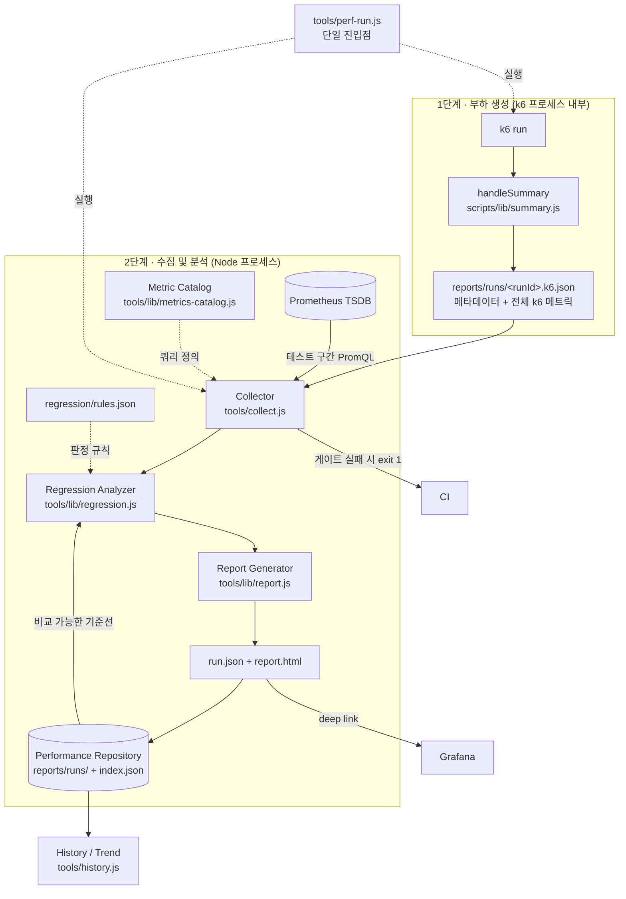

# Performance Management System

k6 실행 결과와 운영 지표를 하나의 이력으로 묶어, **성능 회귀를 자동으로 판정하고
추세를 추적하는** 체계. 이 문서는 구조와 그 구조를 선택한 이유를 설명한다.

---

## 1. 왜 바꿨나 — 이전 구조의 한계

기존에는 두 개의 세계가 따로 있었다.

| | 무엇을 아는가 | 무엇을 모르는가 |
|---|---|---|
| k6 HTML Summary | 응답시간, 처리량, 오류율 | 서버가 왜 그랬는지 |
| Prometheus / Grafana | CPU, GC, DB, Redis | 어느 테스트의 어느 구간인지 |

둘이 연결돼 있지 않아서 다음 질문에 답할 수 없었다.

- **"P95가 300ms 늘었다. 원인이 뭔가?"** → Grafana를 열어 시간대를 손으로 맞춰야 알 수 있고,
  대부분은 그 수고를 들이지 않는다.
- **"지난주보다 느려졌나?"** → 파일명으로 정렬해 HTML을 두 개 열어 눈으로 비교해야 한다.
- **"3개월 동안 어떤 방향으로 가고 있나?"** → 답할 방법이 없었다.

성능 저하는 대개 한 번의 사고가 아니라 매 배포 3~5%씩의 누적으로 온다.
개별 판정은 계속 통과하는데 반년 뒤 2배가 되는 식이다. **이력 없이는 이걸 볼 수 없다.**

---

## 2. 아키텍처



### 2.1 왜 2단계로 나눴나 (가장 중요한 설계 결정)

"k6 안에서 Prometheus까지 조회해 리포트를 완성"하는 1단계 구조가 더 단순해 보인다.
그렇게 하지 않은 이유는 세 가지다.

**① 스크레이프 지연**
테스트가 `t=end`에 끝나면 마지막 5초 구간은 아직 Prometheus에 들어와 있지 않다.
`handleSummary` 안에서 즉시 조회하면 **부하가 가장 높았던 종료 직전 구간이 통째로 누락**된다.
수집기는 스크레이프 지연만큼 기다린 뒤(`--wait`, 기본 20초) 조회한다.

**② k6 런타임 제약**
`handleSummary`는 동기 함수다. 재시도·백오프가 필요한 네트워크 호출을 제대로 감쌀 수 없고,
조회가 실패하면 20분짜리 테스트 결과를 통째로 잃는다.

**③ 재현성**
원본(`k6.json`)이 남아 있으면 수집 로직이 바뀌어도 과거 실행을 다시 계산할 수 있다.
실제로 이번에 과거 56회 실행을 소급 처리해 운영 지표까지 채워 넣었다 —
1단계 구조였다면 불가능했을 일이다.

### 2.2 왜 파일 저장소인가 (DB 아님)

성능 이력은 ⓐ 쓰기가 테스트당 1회로 극히 드물고 ⓑ 읽기는 "최근 N개"가 사실상 전부이며
ⓒ 코드와 함께 Git으로 관리될 때 가치가 가장 크다. 이 조건에서 RDB는 순수 비용이다 —
스키마 마이그레이션, 접속 정보, 백업, CI에서의 기동이 전부 새 운영 부담이 된다.

대신 **나중에 DB로 옮길 수 있는 모양**은 유지했다.

- `run.json` 하나가 곧 한 행(row)이다 — 자기완결적, 조인 불필요
- `index.json`은 파생 캐시일 뿐 — `tools/history.js --rebuild`로 언제든 재생성

팀이 커져 동시 조회가 필요해지면 `index.json` 생성부만 DB 적재로 바꾸면 된다.

---

## 3. 사용법

```bash
# 표준 실행 — k6 실행 → 지표 수집 → 회귀 판정 → 리포트 생성까지 한 번에
node tools/perf-run.js scenarios/normal-day.js

# 옵션
node tools/perf-run.js scripts/posts.js \
  --vus 50 --duration 5m \
  --warmup 60 \                 # 앞 60초를 자원 통계에서 제외 (ramp-up 배제)
  --note "게시글 목록 인덱스 추가 후"

# 이력 / 추세
node tools/history.js            # reports/history.html 생성
node tools/history.js --print    # 터미널 표
node tools/history.js --scenario normal-day

# 개별 재처리 (리포트만 다시 만들기)
node tools/collect.js <runId> --force --no-wait

# 과거 raw 리포트 이관
node tools/migrate-raw.js && node tools/collect.js --all --no-wait
```

### 왜 `perf-run.js` 래퍼가 필요한가

k6를 직접 치면 사람이 매번 세 가지를 챙겨야 한다.

1. `--summary-trend-stats` — **빼먹으면 P99가 아예 계산되지 않는다.** k6 기본값은
   `avg/min/med/max/p(90)/p(95)`뿐이다. 조용히 누락되므로 알아채기 어렵다.
2. 브랜치·커밋·실행자 메타데이터 주입
3. 실행 후 수집기 기동

사람이 매번 기억해야 하는 절차는 결국 지켜지지 않는다. 그래서 한 명령으로 묶었다.

---

## 4. 저장되는 것

### 4.1 실행 메타데이터 (`run`)

Test ID · Scenario · Environment · Branch · Commit SHA · Build Number · 실행자 ·
시작/종료 시각 · Duration · VU · Ramp-up · **Script Version** · Dataset · Note

`scriptVersion`은 스크립트 파일 내용의 SHA-256 앞 12자다. "같은 스크립트로 잰 결과인가"를
나중에 판별하기 위한 지문 — 스크립트가 바뀌었는데 수치만 비교하면 잘못된 결론이 난다.
커밋에 uncommitted 변경이 있으면 `+dirty`가 붙는다.

### 4.2 k6 지표 (`k6`)

`overall`에 avg/min/med/max/P90/P95/P99, RPS, **TPS**, Error Rate, Iterations,
HTTP Request Count, Check Success Rate, 송수신 바이트, waiting/blocked 분해까지.

> **RPS와 TPS를 구분하는 이유**
> RPS는 초당 HTTP 요청 수, TPS는 초당 완료된 iteration(= 사용자 여정 1회)이다.
> 용량 산정과 경영 보고에 쓰이는 건 RPS가 아니라 TPS다. "동시 사용자 200명을 받을 수 있나"는
> 요청 수가 아니라 여정 완료 수로 답해야 한다.

`breakdown`은 기능별/오퍼레이션별 분해다. k6는 threshold에 태그 필터가 걸린 항목에만
서브메트릭을 만들어 주므로, `config.js`의 `DEFAULT_THRESHOLDS`에 판정에 영향 없는
느슨한 상한(`p(99)<600000`)으로 축을 선언해 둔다.

`rawMetrics`에 k6 원본 전체를 보관한다 — 나중에 새 지표가 필요해져도 과거 실행을
다시 계산할 수 있어야 하므로.

### 4.3 운영 지표 (`infra`)

Prometheus 원본을 복사하지 않는다. **테스트 시간 구간에 해당하는 값만 PromQL로 집계해
스칼라로 저장**한다. 원본은 Prometheus에 있고(30일 보관), 여기 필요한 건 "그 구간의 요약"이다.

| 그룹 | 저장 항목 |
|---|---|
| CPU | 프로세스/컨테이너 사용량 avg·max·p95, 한계 코어, **throttled 비율·누적 시간** |
| Memory | working set avg·max·p95, RSS, cgroup 한계 |
| Heap | used avg·max·p95, `-Xmx`, committed, **live data**(누수 지표), non-heap |
| GC | pause avg·max·p95, 횟수, 총 정지시간, 오버헤드%, 할당률, **Old 승격률** |
| MySQL | threads running/connected avg·max·p95, max_connections, slow query, QPS, **buffer pool 적중률**, rows read, aborted connects, row lock 대기 |
| Redis | ops/sec avg·max, connected clients, hit ratio, **evicted keys**, expired keys, 메모리, maxmemory, blocked clients |
| Pool | HikariCP active/pending avg·max, max, **획득 p95**, 타임아웃, Tomcat busy/max |
| Network | rx/tx 대역폭, 에러, 드롭 |
| Disk | DB 읽기/쓰기 대역폭, I/O 시간 |

**avg·max·p95를 모두 저장하는 이유**: 평균만 보면 병목을 놓친다. CPU 평균 40%인데
max 100%면 "여유 있음"이 아니라 "주기적으로 포화됨"이다. 반대로 max만 보면 순간
스파이크에 과잉 반응한다. p95가 그 사이에서 "지속적으로 높았는가"를 가른다.

**파생 지표 — 포화도**

절대값(CPU 1.4코어)은 환경이 바뀌면 의미가 없지만, 포화도(한계의 70%)는 그대로 비교된다.
회귀 판정과 병목 지목은 포화도로 해야 이식성이 생긴다.

```
saturation.cpuPct · memoryPct · heapPct · hikariPct · tomcatPct · mysqlConnPct · redisMemPct
```

**CPU throttling을 1급 지표로 승격한 이유**: 컨테이너 부하 테스트에서 가장 자주 놓치는
병목이다. CPU 사용률이 한계에 안 닿아도 cgroup 주기마다 강제 정지되면 p99가 튄다.
"CPU 여유 있는데 왜 느리지?"의 답이 대개 여기 있다.

---

## 5. 회귀 판정

`regression/rules.json`이 유일한 기준이다. 코드 수정 없이 이 파일만 고쳐 기준을 바꾼다.

```json
{
  "key": "k6.overall.p95",
  "label": "P95 응답시간",
  "direction": "lower_is_better",
  "warn": { "changePct": 10 },
  "fail": { "changePct": 20 },
  "absolute": { "fail": { "gt": 500 } },
  "noiseFloor": 5,
  "minBaseline": 10,
  "gate": true
}
```

### 오탐을 줄이는 다섯 가지 장치

부하 테스트 수치는 본질적으로 노이즈가 있다. JIT 워밍업, 페이지 캐시, 호스트의 다른
프로세스, 컨테이너 스케줄링이 전부 영향을 준다. "직전보다 나빠졌다"를 그대로 회귀로 부르면
오탐이 쏟아지고 **결국 아무도 결과를 보지 않게 된다(경보 피로).**

| 장치 | 하는 일 | 없으면 생기는 일 |
|---|---|---|
| **방향성** | 지표마다 어느 쪽이 나쁜지 명시 | TPS 상승이 회귀로 잡힌다 |
| **노이즈 플로어** | 절대 변화가 작으면 무시 | 2ms→3ms(+50%)가 매번 회귀로 잡힌다 |
| **기준선 하한** | 기준값이 너무 작으면 비율 비교 생략 | 0에 가까운 분모로 무한대 변화율이 나온다 |
| **절대 게이트** | 직전 대비 개선돼도 SLO 초과면 실패 | 매번 9%씩 나빠지며 영원히 통과하는 "삶은 개구리" |
| **비교 가능성** | 두 수치가 애초에 같은 실험인지 확인 | large/200VU 실행이 small/15VU 실행과 비교된다 |

앞의 넷은 전부 값의 **크기**를 보지만, 다섯 번째는 두 수치가 **애초에 비교 가능한가**를 본다.

### 기준선 선택 — "직전 실행"이 아니라 "비교 가능한 가장 최근 실행"

시간축에서 바로 앞이라는 것과 대조군으로 유효하다는 것은 다른 조건이다. 후자를 판정하는
책임은 `tools/lib/comparability.js`가 단독으로 갖는다.

**실행 조건(conditions)** — 이게 같아야 비교가 성립한다:

| 조건 | 등급 | 불일치 시 |
|---|---|---|
| 시나리오 | blocking | 기준선 자격 박탈 |
| 환경 | blocking | 기준선 자격 박탈 |
| 데이터셋 | blocking | 기준선 자격 박탈 |
| 부하 프로파일 | blocking | 기준선 자격 박탈 |
| 부하 스크립트 지문 | degrading | 비교하되 경고 + FAIL→WARN 강등 |

- **blocking** — 수치가 *무의미*해진다. 데이터셋이 다른 두 실행의 P95를 나란히 놓는 건
  "믿을 수 없는 비교"가 아니라 애초에 비교가 아니다. 상대 비교를 생략하고 절대 게이트만 남긴다.
- **degrading** — 수치가 *의심스럽다*. 스크립트 지문 변화는 대개 주석 한 줄이므로 이력을
  끊지 않는다. 비교는 하되 게이트를 열고 리포트에 사유를 띄운다.

조건 값은 전부 **선언된 의도**여야 하고 측정 결과가 섞이면 안 된다. k6 요약의 `vusMax`는
관측값이라 arrival-rate 시나리오에서 서버가 느려질수록 올라간다 — 조건으로 쓰면 회귀가
심할수록 기준선이 탈락해 게이트가 열리는 역전이 생긴다. 그래서 부하는
`exec.test.options.scenarios`(k6가 해석을 끝낸 선언 값)로 식별한다.

threshold 미달 실행도 기준에서 제외한다 — 망가진 실행을 기준으로 삼으면 그 다음이
"개선"으로 보이는 착시가 생긴다.

**비교하지 않았다면 그 사실을 말한다.** 조건이 엄격해질수록 기준선 없는 실행이 흔해지는데,
그게 조용한 PASS로 새면 고치기 전보다 나쁘다. `baselineStatus`가 항상 함께 기록된다:

| 값 | 뜻 |
|---|---|
| `compared` | 유효한 대조군과 비교했다 |
| `incomparable` | 이전 실행은 있으나 조건이 달라 상대 비교를 생략했다 (탈락 사유를 리포트에 표시) |
| `first-run` | 이 조건의 첫 실행이다 |

`incomparable`/`first-run` 에서도 **절대 게이트(SLO)는 계속 돈다.** 상대 비교가 꺼져도
SLO 강제라는 바닥이 남는 것이 이 설계가 안전한 이유다.

추세 그래프도 같은 계열 해시로 분리한다 — 시나리오 이름만으로 묶으면 데이터셋을 바꾼
지점이 성능 급락으로 보인다.

### PASS / WARN / FAIL

- **FAIL** — `gate: true`인 규칙 위반. CI를 멈춘다.
- **WARN** — 기록하고 리포트에 띄우되 빌드는 통과. 관찰 대상.
- **SKIP** — 노이즈 하한 미만이거나 기준값이 너무 작아 판정을 생략.

`gate: true`는 신중하게 배분했다. 응답시간·오류율·TPS·슬로우쿼리·커넥션 타임아웃·
CPU throttling만 게이트다. 나머지(힙, GC, 포화도 등)는 정보 제공용 — 게이트를 남발하면
빌드가 상시 빨간색이 되고, 그러면 아무도 안 본다.

---

## 6. 병목 가설 자동 지목

리포트에 30개 지표가 빨간색으로 뜨면 사람은 어디부터 봐야 할지 모른다.
실무 성능 분석은 대개 **"포화된 자원 찾기"**로 시작하므로, 포화도가 높은 순서로 후보를
제시해 조사 시작점을 만들어 준다.

지목 규칙(`tools/lib/regression.js` `bottleneckHints`):

| 조건 | 가설 |
|---|---|
| `cpu.throttledPct > 1` | CPU throttling — cgroup 한계가 p99에 직접 영향 |
| `hikariPending.max > 0` | DB 커넥션 풀 대기 |
| `mysql.qps / rps > 10` | 요청당 쿼리 과다 → **N+1 패턴** |
| `gc.overheadPct > 5` | GC 오버헤드 과다 |
| `bufferPoolHitPct < 99` | InnoDB 버퍼풀 미스 → 디스크 I/O |
| `redis.evictedKeys > 0` | 캐시가 조용히 무력화되는 중 |
| 각 포화도 > 임계 | 해당 자원 포화 |

**이건 가설이지 확정된 원인이 아니다.** 리포트에도 그렇게 명시한다 — 자동 판정을
결론처럼 제시하면 잘못된 방향으로 몇 시간을 낭비하게 만든다.

---

## 7. 리포트

### 개별 실행 보고서 (`reports/runs/<runId>/report.html`)

```
판정 배지 (PASS/WARN/FAIL) + 실행 메타데이터
  ↓ 병목 가설            ← 결론이 맨 위
  ↓ Performance Summary  (KPI 타일 + 직전 대비 증감)
  ↓ Regression           (직전 → 현재 → 증감률 → 판정 → 사유)
  ↓ Infrastructure       (포화도 막대 + 그룹별 상세)
  ↓ Breakdown            (기능별/오퍼레이션별 P95 내림차순)
  ↓ Trend                (최근 20회 스파크라인)
  ↓ SLO Thresholds
  ↓ Grafana 딥링크
```

설계 원칙:

- **자기완결** — 외부 CDN/폰트/스크립트 없음. 슬랙에 올리거나 CI 아티팩트로 받아 열어도
  인터넷 없이 동일하게 보인다. 성능 보고서는 사고 분석 중에 열리는 일이 많고,
  그때 외부 의존은 그냥 깨진 화면이다.
- **결론이 맨 위** — 보고서를 여는 사람의 첫 질문은 "배포해도 되나?"다.
- **색만으로 의미를 전달하지 않음** — 판정은 아이콘 + 텍스트 + 색 3중 표기.
- **포화도는 막대, 추세는 스파크라인** — "CPU 1.4코어"는 판단이 안 되지만
  "한계의 70%" 막대는 즉시 판단된다.

### Grafana 딥링크

보고서에서 이상을 발견한 사람이 다음에 하는 행동은 항상 같다 — "그 시간대 그래프를 보고 싶다".
Grafana를 열고 대시보드를 찾고 시간 범위를 맞추는 3단계가 끼면 대부분은 그냥 안 본다.

링크에는 `from`/`to`가 **앞뒤 2분 여유와 함께** 이미 박혀 있다. 여유를 두는 이유는
"부하 직전 상태"와 비교해야 이번 부하로 올라간 값인지 원래 높았던 값인지 구분되기 때문이다.
패널별 링크(`viewPanel=<id>`)도 함께 생성하며, 패널 ID는 대시보드 JSON에서 제목으로 찾으므로
대시보드를 수정해도 링크가 깨지지 않는다.

### 이력 대시보드 (`reports/history.html`)

시나리오별 추세 스파크라인 + 전체 실행 표. **누적 저하 감지**가 핵심 기능이다.

최근 N회를 전반/후반으로 나눠 **중앙값**을 비교한다. 양 끝점 두 개만 쓰면 하필 그 두 번이
이상치였을 때 완전히 틀린 결론이 나오지만, 절반씩 묶은 중앙값은 이상치 하나에 흔들리지
않으면서 방향성은 그대로 드러낸다. 10% 이상 나빠지는 방향이면 경고를 띄운다.

### GitHub Pages 게시

보고서를 저장소에 커밋해도 GitHub 웹에서는 렌더링되지 않고 raw 다운로드만 된다.
즉 커밋해 둔 보고서를 링크 하나로 볼 방법이 없다. `.github/workflows/perf-reports-pages.yml`이
`performance/reports/` 전체를 Pages로 올려 이 문제를 해결한다.

- `history.html`이 `index.html`로 복사돼 **랜딩 페이지**가 된다
- 디렉터리 구조를 그대로 올리므로 `history.html → runs/<runId>/report.html` 상대 링크가 살아 있다
- 게시 시점에 `index.json`으로부터 `history.html`을 **재생성**한다 — 실행을 커밋하면서
  대시보드 갱신을 깜빡해도 조용히 낡지 않도록

활성화는 저장소 설정에서 1회: `Settings → Pages → Source: GitHub Actions`.

---

## 8. 개선 우선순위

### 반드시 필요 (Must)

| 순위 | 항목 | 이유 |
|---|---|---|
| 1 | **실행 메타데이터 저장** | 커밋을 모르면 "언제 느려졌나"에 영원히 답할 수 없다. 다른 모든 기능의 전제 |
| 2 | **k6 지표 완전 저장 + P99** | 기존 6개 지표로는 분석이 불가능. P99는 플래그 없이는 아예 계산조차 안 된다 |
| 3 | **운영 지표 연결** | "왜 느린가"에 답하는 유일한 경로. 이게 없으면 부하 테스트는 숫자 놀이다 |
| 4 | **이력 저장소** | 회귀 판정과 추세 분석 둘 다의 전제 |
| 5 | **회귀 자동 판정 + 게이트** | 사람이 매번 눈으로 비교하는 절차는 지켜지지 않는다 |

### 있으면 좋음 (Should)

| 순위 | 항목 | 이유 |
|---|---|---|
| 6 | **보고서 개선** | 데이터가 있어도 안 읽히면 없는 것과 같다. 다만 데이터가 먼저다 |
| 7 | **Grafana 딥링크** | 심층 분석의 마찰을 없앤다. 비용 대비 효과가 매우 크다 |
| 8 | **추세 분석** | 누적 저하는 개별 판정으로 못 잡는다. 단 이력이 20회 이상 쌓여야 의미가 생긴다 |
| 9 | **병목 자동 지목** | 분석 시작점 제공. 숙련자에겐 불필요할 수 있다 |
| 10 | **기능별 분해** | 최적화 대상 좁히기 |

### 나중에 (Could)

- **Slack/PR 알림** — 회귀 시 자동 통보. 현재는 CI Job Summary로 대체
- **동일 조건 반복 실행 후 통계 처리** — 노이즈를 근본적으로 줄이는 정석.
  3회 실행 후 중앙값을 쓰면 오탐이 크게 줄지만 CI 시간이 3배가 된다
- **다중 baseline** — 릴리스 태그별 기준선 보관
- **DB 적재 + 웹 대시보드** — 팀 규모가 커지고 동시 조회가 필요해지면

### 지금은 하지 말 것

- **모든 지표에 게이트 걸기** — 빌드가 상시 빨간색이 되면 게이트는 무력화된다
- **PR마다 전체 시나리오 실행** — 20분 × N개는 개발 속도를 죽인다.
  develop 머지 + 주간 스케줄이 현실적인 타협점이다
- **자동 판정을 결론으로 취급** — 가설은 가설이다

---

## 9. 알려진 한계

| 한계 | 영향 | 대응 |
|---|---|---|
| 단일 실행 비교라 노이즈에 취약 | 짧은 테스트(<2분)에서 오탐 가능 | 노이즈 플로어로 완화. 근본 해결은 반복 실행 통계 |
| Prometheus 30일 보관 | 그보다 오래된 실행은 운영 지표 소급 불가 | 요약값은 `run.json`에 영구 보존되므로 이력 자체는 유지됨 |
| 이관된 과거 실행은 커밋 정보 없음 | `migrated`로 표시 | 추측해 채우지 않고 명시적으로 미상 처리 |
| cAdvisor 컨테이너명 하드코딩 | 컨테이너명이 바뀌면 지표가 빈다 | `PERF_APP_CONTAINER` 환경변수로 재정의 가능 |
| 로컬 실행과 CI 실행의 절대값이 다름 | 서로 비교하면 항상 회귀 | 환경(`--env`)으로 기준선을 분리 |
| 저장소 증가 | 실행당 약 120KB (`run.json` 51KB · `report.html` 50KB · `k6.json` 9KB) | 500회 ≈ 60MB. 그 규모가 되면 DB 이전을 검토할 시점이다 |

`report.html`은 `run.json`으로부터 언제든 재생성된다(`collect.js --force`).
용량이 부담되면 오래된 실행의 HTML만 지워도 이력과 추세는 그대로 유지된다.

---

## 10. 파일 지도

```
performance/
├─ scripts/lib/summary.js        1단계: k6 결과 + 메타데이터 기록
├─ scripts/lib/config.js         SLO + 분해축 threshold 정의
├─ tools/
│  ├─ perf-run.js                단일 진입점 (실행 → 수집 → 판정)
│  ├─ collect.js                 2단계: 지표 수집 + 회귀 분석 + 리포트 생성
│  ├─ history.js                 이력/추세 대시보드
│  ├─ migrate-raw.js             과거 raw 리포트 이관
│  └─ lib/
│     ├─ promql.js               Prometheus 클라이언트 (재시도 포함)
│     ├─ metrics-catalog.js      운영 지표 정의 — 지표 추가는 여기 한 줄
│     ├─ regression.js           회귀 판정 엔진 + 병목 가설
│     ├─ repository.js           이력 저장/조회
│     ├─ report.js               HTML 보고서 생성
│     ├─ grafana.js              딥링크 생성
│     └─ format.js               표시 포맷 (콘솔/HTML 공용)
├─ regression/
│  ├─ rules.json                 회귀 판정 규칙 ← 기준 변경은 여기만
│  └─ perf-regression.yml        GitHub Actions 워크플로
└─ reports/
   ├─ runs/<runId>/              run.json · k6.json · report.html · summary.txt
   ├─ index.json                 이력 인덱스 (파생 — rebuild 가능)
   └─ history.html               이력/추세 대시보드
```

### 지표를 하나 추가하려면

`tools/lib/metrics-catalog.js`의 해당 그룹에 한 줄 추가한다. 수집기·리포트·회귀 분석이
전부 카탈로그를 순회하므로 다른 파일은 건드릴 필요가 없다.

```js
{
  key: 'mysql.tmpDiskTables', label: '디스크 임시 테이블',
  query: 'increase(mysql_global_status_created_tmp_disk_tables[$RANGE])',
  reduce: 'sum', unit: 'count',
  desc: '디스크에 만들어진 임시 테이블. 정렬/그룹핑이 메모리를 넘쳤다는 신호.',
}
```

`$RANGE`는 실행 시점에 실제 테스트 길이로 치환된다 — 3분 스모크든 2시간 soak든
같은 정의가 그대로 맞는다.
