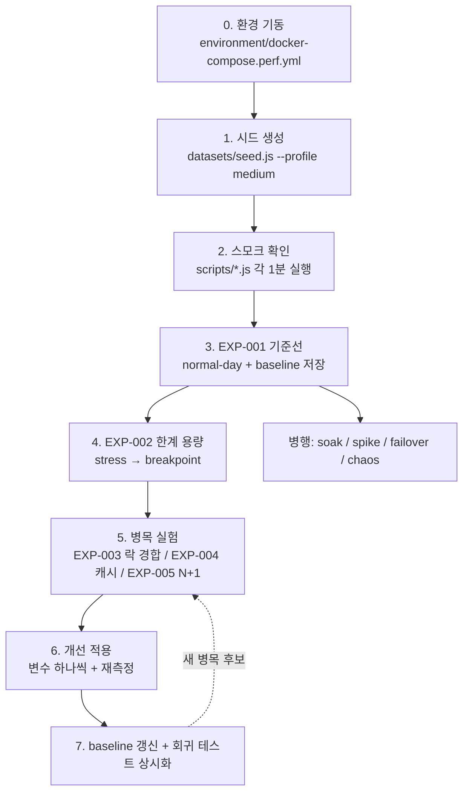

# HighTeenDay Performance Engineering

HighTeenDay 백엔드(Spring Boot 3.4.5 · MySQL 8 · Redis 7)의 **성능 엔지니어링 프로젝트**.
단순 부하 테스트 모음이 아니라, 가설 수립 → 측정 → 원인 분석 → 개선 → 재측정의
전 사이클을 재현 가능하게 운영하기 위한 체계다.

## 1. 목적

1. **성능 개선** — 실제 병목을 계측으로 찾아내고, 수치로 증명된 개선만 적용한다.
2. **역량 증명** — 성능을 감이 아니라 체계로 다루는 과정을 문서로 남긴다.

## 2. 철학

| 원칙 | 실행 장치 |
|------|-----------|
| 모든 테스트는 가설 기반이다 | `experiments/TEMPLATE.md` — 가설·반증 조건 없이는 실행하지 않음 |
| 모든 테스트는 재현 가능해야 한다 | 환경 고정(`environment/`), 결정론적 시드(`datasets/`), 명령 기록 |
| 모든 결과는 Before/After 비교가 가능해야 한다 | 동일 환경·데이터셋·명령 원칙 + `tools/compare.js` |
| 모든 개선은 수치로 증명한다 | `optimizations/` — 수치 없는 최적화는 기록 불가 |
| 모든 병목은 원인까지 판다 | `bottlenecks/` — 증상이 아니라 코드/구조 수준 원인 명시 |
| 측정 안 된 것은 존재하지 않는다 | `metrics/` — 지표 정의와 수집 경로 사전 확정 |
| 한 번에 변수 하나 | 실험/최적화 규칙에 명문화 |

참고 기준: Google SRE(SLO 중심), AWS Well-Architected(성능 효율), Netflix(카오스),
Microsoft Performance Testing Guidance(테스트 유형 분류).

## 3. 테스트 종류

| 유형 | 시나리오 | 질문 |
|------|----------|------|
| Baseline | normal-day | 지금 SLO를 지키는가? 기준 수치는? |
| Load (현실 워크로드) | peak-hour, read/write/chat/notification-heavy, exam-week, registration-day | 각 트래픽 성격에서 어디가 약한가? |
| Cache 대조 | cold-start ↔ cache-warm | 캐시가 실제로 얼마나 기여하는가? |
| Spike | spike | 순간 폭증을 버티고 회복하는가? |
| Stress / Breakpoint | stress, breakpoint | 한계 용량은? 무엇이 먼저 무너지는가? |
| Soak (Endurance) | soak | 오래 돌리면 새는 것이 있는가? |
| Failover / Chaos | failover, chaos | 의존성 장애 시 어떻게 무너지고 회복하는가? |
| Regression | regression/ + CI | 어제보다 느려졌는가? |

## 4. 실행 순서



```bash
# 0. 환경 (Docker)
cp environment/.env.perf.example environment/.env.perf
docker compose -f environment/docker-compose.perf.yml --env-file environment/.env.perf up -d --build

# 1. 시드
node datasets/seed.js --profile medium

# 2~3. 스모크 → 기준선  (모든 k6 명령은 performance/ 루트에서)
k6 run scripts/posts.js -e DATASET=medium -e VUS=5 -e DURATION=1m
K6_PROMETHEUS_RW_SERVER_URL=http://localhost:9090/api/v1/write \
K6_PROMETHEUS_RW_TREND_STATS="p(50),p(95),p(99),avg,max" \
k6 run -o experimental-prometheus-rw scenarios/normal-day.js -e DATASET=medium

# 기준선 저장
node tools/compare.js --save-baseline reports/raw/normal-day-<ts>.summary.json
```

## 5. 디렉터리 구조

```
performance/
├── README.md          # 이 문서
├── scripts/           # 기능별 k6 스크립트 (독립 실행 + 시나리오에서 import)
│   └── lib/           # 설정·세션·Zipf 샘플러·summary 공통 모듈
├── scenarios/         # 워크로드 시나리오 16종 (가중치 프로파일 기반)
├── datasets/          # Zipf 분포 시드 생성기 + 스케일 프로파일 (100~100,000명)
├── environment/       # 컴포즈 스택 + MySQL/Redis/JVM 고정 설정 + 환경 명세
├── metrics/           # 지표 정의(PromQL) + Grafana 대시보드
├── experiments/       # 가설 기반 실험 대장 (EXP-001~) + 템플릿
├── reports/           # raw(자동 산출) + summary(실험 요약)
├── bottlenecks/       # 병목 카탈로그 (BTL-001~007) — 원인/영향/재현/해결
├── optimizations/     # 개선 기록 (Before/After 수치 필수)
├── regression/        # baseline + 판정 규칙 + CI 워크플로
└── tools/             # compare.js, 카오스 주입 스크립트, 도구 카탈로그
```

## 6. 사용 도구

부하: **k6** · 관측: **Prometheus + Grafana**(+ mysqld/redis-exporter, cAdvisor) ·
JVM: **JFR, GC 로그**(상시 기록), async-profiler, Arthas ·
DB: slow log(100ms), performance_schema, p6spy, EXPLAIN · 상세: `tools/README.md`

## 7. 측정 지표 (요약)

- **판정**: P95/P99 (평균 사용 금지), Error Rate, TPS
- **SLO**: 읽기 P95 < 300ms · 쓰기 P95 < 500ms · 오류율 < 1% · WS RTT P95 < 500ms
- **원인 추적**: heap/GC pause → Tomcat busy → HikariCP pending → MySQL lock/slow →
  Redis hit ratio (Grafana 대시보드가 이 순서로 배치됨)
- 전체 정의와 PromQL: `metrics/README.md`

## 8. 테스트 환경 (요약)

Docker 고정 스택 — app 2vCPU/1.5GB(힙 1G 고정, G1GC), MySQL 8.0.36 2vCPU/2GB(buffer pool 1G),
Redis 7.2 384MB(allkeys-lru). 부하기와 서버 분리 원칙. 상세와 재현 체크리스트: `environment/README.md`.

> **사전 준비 1회**: 앱에 `micrometer-registry-prometheus` 의존성 추가 필요 — `environment/README.md` 참고.

## 9. 결과 보는 방법

| 무엇을 | 어디서 |
|--------|--------|
| 실시간 그래프 | Grafana http://localhost:3001 → "HighTeenDay Performance Overview" |
| 실행 요약 | k6 종료 화면 + `reports/raw/*.summary.{json,csv,html}` |
| 실험 결론 | `experiments/EXP-*/README.md` §7~12 (원자료 링크 포함) |
| 병목 지식 | `bottlenecks/` — 상태(의심/확정/해소)와 재현 명령 |
| 개선 증거 | `optimizations/OPT-*.md` Before/After 표 |
| 회귀 여부 | `node tools/compare.js <summary.json>` / CI perf-regression |

## 부록: 트래픽 모델

모든 시나리오는 `scenarios/lib/workload.js`의 **사용자 여정 12종**(눈팅·참여·작성·검색·
채팅 REST/WS·알림·아침 루틴·소셜·마이페이지·토큰 갱신·재로그인)을 가중치로 조합한다.
데이터와 접근 모두 **Zipf 분포**(핫 데이터 편중)를 따르며 이는 `datasets/README.md`에 근거를 명시했다.
