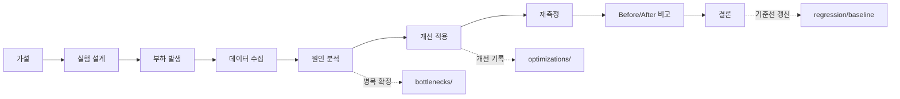

# Experiments — 가설 기반 실험 대장

모든 성능 작업은 실험 단위로 수행한다. **가설 → 측정 → 분석 → 개선 → 재측정**의
사이클을 거치지 않은 수치는 이 프로젝트에서 성능 개선으로 인정하지 않는다.

## 규칙

1. 실험마다 디렉터리 하나 (`EXP-###-슬러그/README.md`). 양식은 실험의 종류를 따른다 —
   성능 개선은 `TEMPLATE.md`, **장애 관측은 `TEMPLATE-FAULT.md`**. 둘은 질문이 달라
   판정 체계를 공유하지 않는다(`resilience/README.md`).
2. 실행 명령을 그대로 기록한다 — 명령이 재현의 최소 단위다.
3. Before/After는 **동일 환경 + 동일 데이터셋 + 동일 명령**에서만 유효.
4. 원자료(`reports/runs/<runId>/`, 반복 세트는 `reports/repeatability/`)를 반드시 링크한다. 원자료 없는 결과는 무효.

5. 실패한 실험(가설 기각)도 완료로 기록한다 — 기각도 지식이다.

## 실험 목록

| ID | 제목 | 상태 | 가설 요지 | 관련 |
|----|------|------|-----------|------|
| [EXP-000](EXP-000-measurement-integrity/README.md) | 부하 발생기 이주 (측정 신뢰도) | **부분 실행** — M1 Before 측정 완료, After 미실행 | k6를 Docker로 옮기면 측정이 더 안정적일 것 | 측정 시스템 |
| [EXP-001](EXP-001-baseline-normal-day/README.md) | 기준선 측정 (Normal Day) | **완료** (2026-08-16) — H1 **기각**, 병목은 앱 CPU 2코어 한계 | 현재 시스템의 SLO 충족 여부와 기준 수치 확보 | — |
| [EXP-002](EXP-002-capacity-limit/README.md) | 한계 용량 탐색 | 계획 (미착수) | 400 VU 부근에서 HikariCP 고갈이 최초 병목일 것 | BTL-002 |
| [EXP-003](EXP-003-hot-row-contention/README.md) | 인기글 카운터 락 경합 | 계획 (미착수) | Zipf 반응 부하에서 P99가 row lock wait에 지배될 것 | BTL-003 |
| [EXP-004](EXP-004-cache-contribution/README.md) | 캐시 기여도 (cold vs warm) | 계획 (미착수) | 웜 캐시가 읽기 P95를 60% 이상 낮출 것 | BTL-004 |
| [EXP-005](EXP-005-comment-nplus1/README.md) | 댓글 조회 쿼리 폭발 | **완료** (2026-09-04) — H1 채택, 요청당 쿼리 1,507 → 3.9 | 댓글 100개 글 조회 시 쿼리 수가 O(N)일 것 | BTL-005 · OPT-001 · OPT-002 |
| [EXP-006](EXP-006-pool-sizing/README.md) | HikariCP 풀 10 → 20 | **부분 완료** (2026-08-29) — 대기 경고는 사라졌으나 p95 불변, 자원 비교는 무효 | 리포트가 지목한 커넥션 대기를 없애도 응답은 변하지 않을 것 | BTL-002 |
| [EXP-007](EXP-007-redis-crash/README.md) | Redis 프로세스 정지·재시작 | **해석 중** (2026-09-09) — 수치 수집 완료, 가설 5건 판단 대기 | 연결 거부라 폴백이 즉시 기본값을 반환할 것 | 장애 관측 · [TEMPLATE-FAULT](TEMPLATE-FAULT.md) |

번호는 실행 순서다: **기준선(001) 없이는 어떤 실험도 시작하지 않는다.**

**EXP-002~004가 미착수인 이유**는 우선순위다. EXP-001이 앱 CPU 2코어를 먼저 만나는 것을
확인했으므로, 커넥션 풀(002)·락 경합(003)·캐시(004)를 포화 운용점에서 재면 원인을 분리할 수
없었다. 그래서 포화 이하 운용점(`RATE=4`)을 먼저 확보하고 개선 폭이 가장 크고 코드 경로가
명확한 댓글 N+1(005)을 끝냈다. 다음 대상은 시간 비중 1위가 된 `post` 계열이다
(OPT-002 §5-6)과 검색 `LIKE` 전체 스캔(BTL-013)이다.

**EXP-000의 After가 미실행인 이유**도 같다. 부하 발생기 이주는 측정 인프라 변경이라
지문이 갈려 기존 기준선과의 자동 비교가 끊긴다. 개선 실험(005)이 끝난 뒤에 한다.
