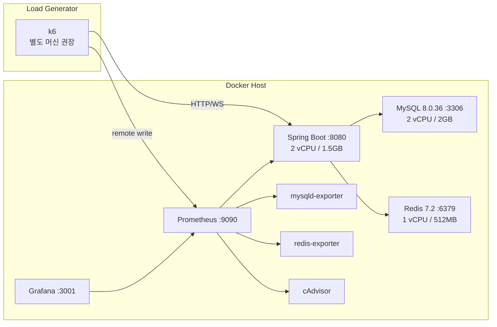

# Environment — 테스트 환경 명세

**모든 실험은 이 문서에 기록된 환경에서만 유효하다.** 환경이 하나라도 다르면
Before/After 비교는 무효이며, 실험 문서에는 항상 이 파일의 커밋 해시를 병기한다.

## 토폴로지



## 하드웨어 / OS 기준 명세

실측 후 실제 값으로 갱신할 것. **부하 발생기(k6)와 대상 서버는 분리**가 원칙 —
같은 호스트에서 돌리면 k6의 CPU 소비가 결과를 오염시킨다 (로컬 실험 시 이 한계를 실험 문서에 명시).

| 항목 | 값 |
|------|-----|
| CPU | (실측 기입: 모델/코어/스레드, 예: Ryzen 5 5600X 6C12T) |
| RAM | (실측 기입, 예: 32GB DDR4-3200) |
| Disk | (실측 기입: NVMe 여부 — InnoDB fsync 지연에 직결) |
| OS | Windows 11 + Docker Desktop(WSL2) 또는 Ubuntu 22.04 |
| Docker | (docker version 출력 기입) |
| Network | 로컬 루프백 / 1GbE (k6 분리 시) |

> WSL2 주의: Docker Desktop은 기본적으로 호스트 RAM의 50%만 쓴다.
> `.wslconfig`에서 `memory=8GB` 이상을 명시하고 실험 문서에 기록할 것.

## 소프트웨어 버전 (컴포즈로 고정)

| 컴포넌트 | 버전 | 고정 위치 |
|----------|------|-----------|
| Spring Boot | 3.4.5 | build.gradle |
| Java | 17 (Temurin, Dockerfile 기준) | Dockerfile |
| MySQL | 8.0.36 | docker-compose.perf.yml |
| Redis | 7.2 | docker-compose.perf.yml |
| Prometheus | 2.51.0 | docker-compose.perf.yml |
| Grafana | 10.4.0 | docker-compose.perf.yml |
| k6 | ≥ 0.50 (`k6 version` 기입) | 로컬 설치 |

## JVM 설정 (docker-compose.perf.yml의 JAVA_TOOL_OPTIONS)

| 플래그 | 값 | 이유 |
|--------|-----|------|
| -Xms / -Xmx | 1g / 1g | 힙 고정 — 동적 확장으로 인한 측정 노이즈 제거 |
| GC | G1GC, MaxGCPauseMillis=200 | Java 17 기본. pause 목표를 명시해 실험 간 동일 조건 |
| GC 로그 | /tmp/gc.log (rotate 5×20MB) | GC 병목 분석 원자료 |
| JFR | 상시 기록, maxsize 200MB | 프로파일링 원자료 (도구: JDK Mission Control) |

## 스레드 풀 / 커넥션 풀 (application.properties 기준)

| 풀 | 설정 | 값 |
|----|------|-----|
| Tomcat | server.tomcat.threads.max | 400 |
| Tomcat | accept-count / max-connections | 200 / 10000 |
| HikariCP | maximumPoolSize | 프로파일 확인 후 기입 (기본 10) |
| Redis(Lettuce) | 기본 커넥션 | 프로파일 확인 후 기입 |

> **Tomcat 400 스레드 vs HikariCP 10 커넥션**: 쓰기 부하에서 스레드 390개가
> 커넥션을 기다리는 구조적 병목 후보다. → `bottlenecks/BTL-002` 참고.

## MySQL / Redis / 커널

- MySQL: buffer pool 1G, slow log 100ms, **내구성 설정은 운영과 동일**(완화 금지).
  실제 값은 `docker-compose.perf.yml`의 mysql `command:` 블록(CLI 플래그)에 있다.
  `mysql/perf.cnf`는 값을 사람이 읽기 위한 참고 문서일 뿐 마운트되지 않는다 —
  Windows 호스트의 바인드 마운트는 world-writable 권한이 되어 mysqld가 설정 파일
  자체를 조용히 무시하기 때문(실측 확인됨, 경고만 뜨고 기동은 성공해 알아채기 어렵다).
- Redis: `redis/redis-perf.conf` — maxmemory 384MB + allkeys-lru (eviction 거동 포함 실험)
- 커널(Linux 호스트일 때): `somaxconn=1024`, `tcp_tw_reuse=1`, `nofile=65536` 권장 —
  적용했다면 값과 함께 실험 문서에 기록. WSL2에서는 기본값 사용을 명시.

## 사전 준비: 앱에 Prometheus 노출 추가 (완료됨)

`build.gradle`에 `io.micrometer:micrometer-registry-prometheus`가 추가되어 있다.
노출 설정은 컴포즈가 환경변수로 주입한다
(`MANAGEMENT_ENDPOINTS_WEB_EXPOSURE_INCLUDE=health,prometheus,metrics`). 운영 프로파일에는 영향 없음.

## 스키마: Flyway가 소유한다

`build.gradle`에 `flyway-core` + `flyway-mysql`이 있고, `spring.jpa.hibernate.ddl-auto=none` +
`spring.sql.init.mode=never`다. 즉 **빈 MySQL 컨테이너에 앱이 처음 붙는 순간
`src/main/resources/db/migration/V1~V3` 마이그레이션이 자동 적용**된다 — 별도 조치 불필요.

> `src/main/resources/ddl/V_daily_hot_post.sql`, `V_group_chat.sql`은 **적용하지 않는다.**
> `V1__baseline.sql`이 이미 그 변경사항(`chat_rooms.CHT_RM_pair_key`, HOT 게시글용
> `DailyHotPost` 테이블 등)을 포함해 만들어진 새 베이스라인이다 — 두 ddl 스크립트는
> Flyway 도입 이전 운영 DB에 적용했던 1회성 레거시 스크립트이며, 새 DB에 다시 적용하면
> 컬럼/테이블 중복 에러가 난다 (`V1__baseline.sql` 15번째 줄 주석 참고:
> `daily_hot_post`(레거시, 소문자)와 엔티티가 실제 매핑하는 `DailyHotPost`(Flyway 관리)는
> 서로 다른 테이블).

**`data.sql`(게시판 초기 데이터)은 `spring.sql.init.mode=never`라 자동 실행되지 않는다** —
시드 스크립트(`datasets/seed.js`)가 `/api/boards`로 게시판 목록을 조회하므로 반드시 필요:

```bash
# 컨테이너가 healthy 해진 뒤(= Flyway 마이그레이션 완료 후) 게시판만 삽입
# --default-character-set=utf8mb4 필수 — 없으면 한글이 mojibake로 저장된다(실측 확인됨).
docker exec -i perf-mysql mysql --default-character-set=utf8mb4 -uroot -p${MYSQL_ROOT_PASSWORD:-perfroot} ${MYSQL_DATABASE:-highteenday} <<'SQL'
INSERT INTO boards (BRD_name, created_at) VALUES
  ('자유게시판', NOW()), ('수능게시판', NOW()), ('이과게시판', NOW()),
  ('문과게시판', NOW()), ('질문게시판', NOW());
SQL
```

(`data.sql` 전체를 실행하면 자체 내장된 10만 건 더미 게시글 INSERT까지 함께 실행되니,
성능 테스트용 데이터는 `datasets/seed.js`로 별도 생성하는 것이 원칙과 맞다 — 위처럼
게시판 행만 옮겨 심는다.)

**HOT 게시글 테이블(`daily_hot_post`)도 마이그레이션이 만들지 않는다** — `DailyHotPost`
엔티티가 실제로 쿼리하는 테이블 이름과 `V1__baseline.sql`이 만드는 테이블 이름이 서로
달라(`BTL-009` 참고) `GET /api/hotposts/daily`가 항상 500이 된다. 게시판 삽입과 함께
아래도 실행할 것 (레거시 스크립트 `ddl/V_daily_hot_post.sql`은 FK 대상 테이블명이
`post`로 오타가 나 있어 그대로 쓰면 실패한다 — 아래는 `posts`로 고치고 제약명도
baseline의 고아 테이블과 충돌하지 않게 바꾼 버전):

```bash
docker exec -i perf-mysql mysql -uroot -p${MYSQL_ROOT_PASSWORD:-perfroot} ${MYSQL_DATABASE:-highteenday} <<'SQL'
CREATE TABLE IF NOT EXISTS daily_hot_post (
    DHP_id               BIGINT AUTO_INCREMENT PRIMARY KEY,
    PST_id               BIGINT       NOT NULL,
    DHP_score            DOUBLE       NOT NULL,
    DHP_leaderboard_date DATE         NOT NULL,
    created_at           DATETIME(6)  NOT NULL,
    UPT_Date             DATETIME(6),
    UPT_id               BIGINT,
    is_valid             BOOLEAN      NOT NULL DEFAULT TRUE,
    CONSTRAINT fk_daily_hot_post_pst_v2 FOREIGN KEY (PST_id) REFERENCES posts(PST_id),
    UNIQUE INDEX uk_daily_hot_post_date_post_v2 (DHP_leaderboard_date, PST_id),
    INDEX idx_daily_hot_post_date_created_v2 (DHP_leaderboard_date, created_at DESC)
);
SQL
```

## 실측으로 확인한 문제: `dev`/`local` 프로파일은 빈 DB에서 무한 크래시 루프

**반드시 `SPRING_PROFILE=prod`로 띄운다.** `AppStartupRunner`(`@Profile("!prod")`)는
`dev`/`local`에서 앱이 뜰 때마다 `DataInitializer.dataInit()`으로 테스트 계정/글/댓글을
심으려 시도하는데, `postDataInit()`이 `boardId=1~5`가 이미 존재한다고 가정한다.
**빈 MySQL에 처음 붙는 성능 테스트 환경에서는 board가 아직 없으므로 여기서
`ResourceNotFoundException`이 터지고, `SpringApplication.run()` 전체가 실패해 JVM이
종료된다** — `restart: unless-stopped` 때문에 도커가 계속 재시작을 반복하는
크래시 루프로 이어진다(직접 재현·확인함). 이 상태에서는 `/actuator/health`가
Tomcat이 잠깐 떠 있는 찰나에만 `200 UP`을 반환하는 것처럼 보일 수 있어 착시를
일으킨다 — 컨테이너 재시작 여부(`docker ps` STATUS의 "Up N seconds"가 계속
초기화되는지)까지 함께 확인할 것.

`prod` 프로파일은 이 러너 자체가 비활성이라 안전하다. `prod`도 `ddl-auto=none` +
`sql.init.mode=never`라 위의 게시판 수동 삽입 절차는 동일하게 필요하다.

## 실측으로 확인한 문제: `prod` 프로파일 단독으로는 로그인 이후 전부 401

`prod`로 크래시 루프는 피했지만, `application-prod.properties`가 쿠키 속성을
운영 값으로 하드코딩한다:

```properties
app.cookie-domain=.highteenday.org
app.cookie-secure=true
app.cookie-same-site=None
```

**이 상태로 `localhost`(또는 사설 IP) + 평문 HTTP로 부하 테스트를 하면, 로그인 자체는
200이 나오지만 그 이후 인증이 필요한 모든 요청이 401로 실패한다.** RFC 6265를
준수하는 모든 쿠키 저장소(k6의 `http.cookieJar()`, 실제 브라우저)는 다음 두 가지
이유로 `Set-Cookie`를 절대 재전송하지 않는다:

1. **Domain 불일치** — 쿠키의 `Domain=.highteenday.org`는 `localhost`/`host.docker.internal`
   요청에 매칭되지 않는다.
2. **Secure 속성** — 쿠키에 `Secure`가 붙어 있으면 TLS 연결에서만 전송되는데,
   로컬 부하 테스트는 평문 HTTP다.

(참고: Node.js의 `fetch`가 이 문제를 우회해 보이는 이유는 이 저장소의
`datasets/seed.js`가 자체 구현한 단순 쿠키 저장소[`Session` 클래스]가 Domain/Secure
속성을 아예 검사하지 않고 이름=값만 그대로 재전송하기 때문이다 — 스펙을 지키지
않아서 우연히 동작한 것이며, k6나 실제 브라우저에서는 재현되지 않는다.)

**해결**: `application-perf.properties`를 추가해 쿠키 속성만 로컬 테스트용으로
되돌리고, `--spring.profiles.active=prod,perf`로 두 프로파일을 함께 활성화한다
(뒤에 오는 프로파일이 겹치는 키를 덮어쓴다). `docker-compose.perf.yml`과
`.env.perf.example`의 기본값은 이미 `SPRING_PROFILE=prod,perf`로 맞춰져 있다.
`AppStartupRunner`의 `@Profile("!prod")`는 활성 프로파일 목록에 `prod`가
포함되어 있으면 여전히 비활성 상태를 유지하므로 크래시 루프 문제도 그대로 회피된다.

## 필수 더미 값 (OAuth2 / NEIS)

`GOOGLE_CLIENT_ID`, `GOOGLE_CLIENT_SECRET`, `NEIS_API_KEY`, `S3_BUCKET` 프로퍼티는
`dev`/`prod` 양쪽 다 기본값이 없다 (`${VAR}` 형태). 값이 없으면 Spring이
`PlaceholderResolutionException`으로 컨텍스트 로딩 자체를 실패시킨다.
부하 테스트 경로(로그인/게시글/댓글/채팅 등)는 이 값들을 실제로 소비하지 않으므로
`.env.perf.example`의 더미 값으로 충분하다 — 실제 OAuth 로그인이나 NEIS 급식 연동을
테스트하려는 게 아니라면 그대로 둔다.

## 기동 / 확인 / 리셋

```bash
cp environment/.env.perf.example environment/.env.perf

docker compose -f environment/docker-compose.perf.yml --env-file environment/.env.perf up -d --build

# 기본 호스트 포트 (로컬 MySQL/Redis/다른 서버와 충돌 방지용으로 표준 포트에서 옮겨둠):
#   앱 18080 → 8080 / MySQL 13316 → 3306 / Redis 16389 → 6379 / Prometheus 9090 / Grafana 3001
# 이미 다른 값을 쓰고 있다면 .env.perf에 APP_HOST_PORT / MYSQL_HOST_PORT / REDIS_HOST_PORT 로 override

# 확인
curl -s localhost:18080/actuator/health          # {"status":"UP"}
curl -s localhost:18080/actuator/prometheus | head  # 메트릭 노출 확인
open http://localhost:3001                      # Grafana (admin/perf)

# 실험 간 상태 리셋 (데이터 유지, 캐시/JIT만 초기화)
docker restart perf-app && docker exec perf-redis redis-cli FLUSHALL

# 완전 초기화 (데이터까지 삭제 — 시드 재생성 필요)
docker compose -f environment/docker-compose.perf.yml down -v
```

## 재현성 체크리스트 (실험 전 매번)

- [ ] `git rev-parse HEAD` — 앱 코드 커밋 기록
- [ ] `docker compose ps` — 전 컨테이너 healthy
- [ ] 데이터셋 프로파일과 생성 시각 기록
- [ ] 직전 실험의 캐시 상태 리셋 여부 기록 (cold/warm 명시)
- [ ] 백그라운드 프로세스(브라우저, IDE 인덱싱) 정리 — 로컬 실험일 때
