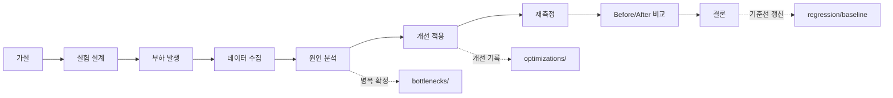

# Experiments — 가설 기반 실험 대장

모든 성능 작업은 실험 단위로 수행한다. **가설 → 측정 → 분석 → 개선 → 재측정**의
사이클을 거치지 않은 수치는 이 프로젝트에서 성능 개선으로 인정하지 않는다.

## 규칙

1. 실험마다 디렉터리 하나 (`EXP-###-슬러그/README.md`), `TEMPLATE.md` 양식 준수.
2. 실행 명령을 그대로 기록한다 — 명령이 재현의 최소 단위다.
3. Before/After는 **동일 환경 + 동일 데이터셋 + 동일 명령**에서만 유효.
4. 원자료(`reports/raw/`)를 반드시 링크한다. 원자료 없는 결과는 무효.
5. 실패한 실험(가설 기각)도 완료로 기록한다 — 기각도 지식이다.

## 실험 목록

| ID | 제목 | 상태 | 가설 요지 | 관련 |
|----|------|------|-----------|------|
| [EXP-001](EXP-001-baseline-normal-day/README.md) | 기준선 측정 (Normal Day) | 계획 | 현재 시스템의 SLO 충족 여부와 기준 수치 확보 | — |
| [EXP-002](EXP-002-capacity-limit/README.md) | 한계 용량 탐색 | 계획 | 400 VU 부근에서 HikariCP 고갈이 최초 병목일 것 | BTL-002 |
| [EXP-003](EXP-003-hot-row-contention/README.md) | 인기글 카운터 락 경합 | 계획 | Zipf 반응 부하에서 P99가 row lock wait에 지배될 것 | BTL-003 |
| [EXP-004](EXP-004-cache-contribution/README.md) | 캐시 기여도 (cold vs warm) | 계획 | 웜 캐시가 읽기 P95를 60% 이상 낮출 것 | BTL-004 |
| [EXP-005](EXP-005-comment-nplus1/README.md) | 댓글 조회 쿼리 폭발 | 계획 | 댓글 100개 글 조회 시 쿼리 수가 O(N)일 것 | BTL-005 |

번호는 실행 순서다: **기준선(001) 없이는 어떤 실험도 시작하지 않는다.**
