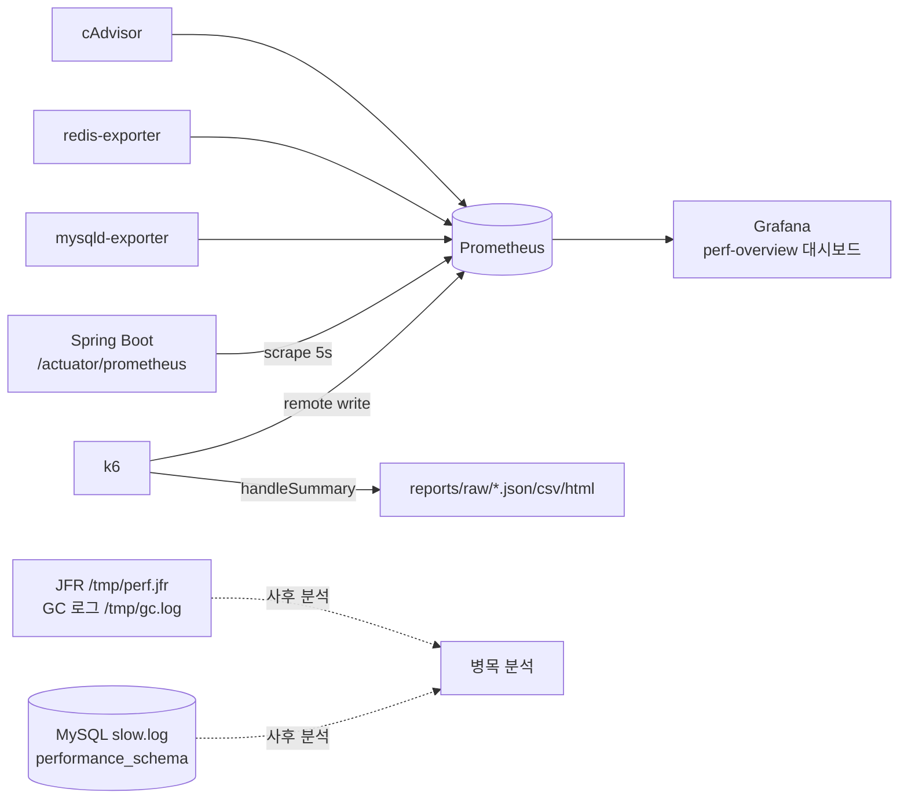

# Metrics — 측정 지표 정의

**측정하지 않은 것은 개선할 수 없고, 정의하지 않은 지표는 신뢰할 수 없다.**
모든 실험은 아래 지표를 동일한 방법으로 수집한다.

## 수집 경로 총람



k6 → Prometheus 전송 시 트렌드 통계를 명시해야 P50/P95/P99가 게이지로 노출된다:

```bash
K6_PROMETHEUS_RW_SERVER_URL=http://localhost:9090/api/v1/write \
K6_PROMETHEUS_RW_TREND_STATS="p(50),p(95),p(99),avg,max" \
k6 run -o experimental-prometheus-rw scenarios/normal-day.js
```

## 1. 클라이언트 관점 (k6) — SLO 판정의 기준

| 지표 | 소스 | 정의/판정 |
|------|------|-----------|
| TPS/RPS | `rate(k6_http_reqs_total[15s])` | 처리율. breakpoint 테스트의 산출물 |
| Latency P50/P90/P95/P99 | `k6_http_req_duration_p*` | **P95가 1차 SLO** (읽기<300ms, 쓰기<500ms). 평균은 판정에 쓰지 않는다 |
| Error Rate | `k6_http_req_failed_rate` | HTTP 실패율 <1%. `check` 실패는 별도(`k6_checks_rate`) |
| Timeout | http_req_duration 상한 도달 + failed | k6 기본 60s. 타임아웃은 오류율에 합산됨 |
| WS RTT | `chat_ws_rtt` (커스텀 Trend) | 메시지 전송→브로드캐스트 수신 왕복. P95<500ms |
| VUs / dropped_iterations | `k6_vus`, `k6_dropped_iterations_total` | arrival-rate 실행 시 dropped 증가 시점 = 포화점 |

## 2. 애플리케이션 (Micrometer /actuator/prometheus)

| 영역 | 지표 | PromQL | 경보 기준 |
|------|------|--------|-----------|
| CPU | 프로세스 CPU | `process_cpu_usage` | 지속 >0.85 |
| Memory/Heap | 힙 사용률 | `sum(jvm_memory_used_bytes{area="heap"}) / sum(jvm_memory_max_bytes{area="heap"})` | soak에서 우상향 추세 = 누수 |
| GC | pause p99 | `histogram_quantile(0.99, sum(rate(jvm_gc_pause_seconds_bucket[1m])) by (le))` | >200ms (MaxGCPauseMillis 목표) |
| GC | 빈도 | `rate(jvm_gc_pause_seconds_count[1m])` | Full GC 발생 여부는 GC 로그로 교차 확인 |
| Thread | 라이브 스레드 | `jvm_threads_live_threads` | soak 우상향 = 스레드 누수 |
| Tomcat | busy/max | `tomcat_threads_busy_threads` vs 400 | busy≈max → 큐잉 시작 |
| HikariCP | active/pending | `hikaricp_connections_active`, `hikaricp_connections_pending` | **pending>0 지속 = 풀 고갈** |
| HikariCP | 획득 대기 | `hikaricp_connections_acquire_seconds` p99 | >10ms 지속이면 풀 확대/쿼리 단축 검토 |
| 서버 관점 지연 | URI별 p95 | `http_server_requests_seconds_bucket` by uri | 클라이언트 P95와 격차 = 네트워크/큐잉 |
| WebSocket | 세션 수 | 커스텀 게이지 필요(개선 항목) — 임시로 `jvm_threads` + k6 `k6_ws_sessions` | — |
| Event/Scheduler | @Scheduled 실행 시간 | JFR/로그 타임스탬프로 사후 분석 | flush 주기 초과 = 적체 |

## 3. MySQL (mysqld-exporter + performance_schema)

| 지표 | PromQL / SQL | 의미 |
|------|--------------|------|
| threads_running | `mysql_global_status_threads_running` | 동시 실행 쿼리. 코어 수 2~3배 초과 지속 = 포화 |
| slow queries | `rate(mysql_global_status_slow_queries[1m])` | perf.cnf 기준 100ms 초과 쿼리 |
| row lock wait | `mysql_global_status_innodb_row_lock_waits`, `..._row_lock_time` | 반응 편중 실험의 핵심 지표 |
| buffer pool 히트 | `1 - (rate(mysql_global_status_innodb_buffer_pool_reads[1m]) / rate(mysql_global_status_innodb_buffer_pool_read_requests[1m]))` | <0.99면 buffer pool 부족 |
| Top 쿼리 | `SELECT ... FROM performance_schema.events_statements_summary_by_digest ORDER BY SUM_TIMER_WAIT DESC LIMIT 10;` | 실험 후 사후 분석 (tools/README 참고) |
| slow log | `/var/lib/mysql/slow.log` → `pt-query-digest` 또는 직접 열람 | 쿼리 단위 원인 규명 |

## 4. Redis (redis-exporter)

| 지표 | PromQL | 의미 |
|------|--------|------|
| Cache Hit Ratio | `rate(redis_keyspace_hits_total[1m]) / (rate(hits)+rate(misses))` | 읽기 시나리오에서 <0.9면 캐시 설계 점검 |
| ops/s | `rate(redis_commands_processed_total[1m])` | — |
| 메모리/evicted | `redis_memory_used_bytes`, `rate(redis_evicted_keys_total[1m])` | eviction 발생 = maxmemory 도달 (캐시 유효기간 재설계) |
| 명령 지연 | `redis_commands_duration_seconds_total` / slowlog | Redis는 보통 원인이 아니라 증상 — 1ms 초과 명령만 추적 |
| Pub/Sub | `redis_pubsub_channels` | 채팅 브로커 전환(OPT 후보) 시 사용 |

## 5. 컨테이너 (cAdvisor)

| 지표 | PromQL |
|------|--------|
| CPU | `rate(container_cpu_usage_seconds_total{name=~"perf-.*"}[1m])` |
| 메모리 | `container_memory_working_set_bytes{name=~"perf-.*"}` |
| 네트워크 | `rate(container_network_transmit_bytes_total[1m])` |
| CPU 스로틀링 | `rate(container_cpu_cfs_throttled_seconds_total[1m])` — 리소스 상한 도달 신호 |

## 대시보드

`dashboards/perf-overview.json` — Grafana에 자동 프로비저닝됨 (http://localhost:3001).
배치: 1행 k6(부하 관점) → 2행 JVM → 3행 풀/DB → 4행 Redis/컨테이너.
**읽는 순서 = 병목 추적 순서**: 지연 상승 확인(1행) → GC/스레드 원인인지(2행) →
풀 대기인지(3행) → 데이터 계층인지(3~4행).

## 지표 해석 규칙

1. **평균 금지** — 판정은 P95/P99. 평균은 스파이크를 숨긴다.
2. **클라이언트 P95 vs 서버 P95 격차** — 격차가 크면 병목은 앱 내부가 아니라 큐(Tomcat accept, 커널 백로그).
3. **처리율-지연 곡선** — RPS가 멈추고 지연만 오르기 시작하는 지점(knee)이 실질 용량.
4. **단일 지표로 결론 금지** — 예: P95 상승 + hikaricp_pending>0 + threads_running 정상 → DB가 아니라 풀 크기 문제.
