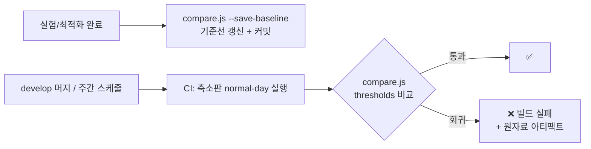

# Regression — 성능 회귀 테스트

기능 회귀에 단위 테스트가 있듯, 성능 회귀에는 baseline 비교가 있다.
**"어제보다 느려졌는가"에 자동으로 답하는 장치.**

## 구성

```
regression/
├── baseline.json        # 공인 기준선 (로컬 기준 환경에서 확정된 수치만 커밋)
├── thresholds.json      # 허용 변화폭 (P95 +10%, RPS -10%, 오류율 1% ...)
├── perf-regression.yml  # GitHub Actions 워크플로 (→ .github/workflows/로 복사)
└── README.md
```

## 흐름



## 사용법

```bash
# 기준선 저장 (EXP-001 완료 후, 이후엔 개선 확정 시마다)
node tools/compare.js --save-baseline reports/raw/normal-day-<ts>.summary.json --note "EXP-001 baseline"

# 수동 비교
node tools/compare.js reports/raw/normal-day-<ts>.summary.json
# → 회귀 발견 시 exit 1
```

## 판정 규칙 (thresholds.json)

| 지표 | 규칙 | 이유 |
|------|------|------|
| P95 | baseline +10% 이내 | 1차 SLO 지표. 10%는 실행 간 노이즈 상한 실측 후 조정 |
| P99 | baseline +15% 이내 | 꼬리는 분산이 커서 완화 |
| RPS | baseline -10% 이내 | 처리율 하락 = 회귀 |
| Error Rate | 절대값 1% 미만 | 상대 비교 부적합 (baseline이 0이면 무한대) |

## 원칙

1. **baseline 갱신은 의도적 행위** — 자동 갱신 금지. 개선을 확인하고 수동 커밋.
2. **CI baseline과 로컬 baseline 분리** — CI 러너 성능은 로컬 기준 환경과 다르다.
   워크플로는 CI 자체 baseline을 캐시로 유지한다.
3. CI는 **큰 회귀 탐지용** (축소 시나리오 3분). 정밀 비교는 로컬 기준 환경에서.
4. 회귀 발생 시: 원자료 아티팩트 확인 → 로컬 재현(`normal-day` 풀버전) →
   원인 커밋 이등분 탐색(git bisect + 스크립트 실행).
