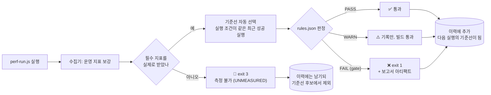

# Regression — 성능 회귀 판정

기능 회귀에 단위 테스트가 있듯, 성능 회귀에는 이력 비교가 있다.
**"어제보다 느려졌는가"에 자동으로 답하는 장치.**

## 구성

```
regression/
├── rules.json           # 회귀 판정 규칙 ← 기준 변경은 여기만 고친다
├── perf-regression.yml  # GitHub Actions 워크플로 (→ .github/workflows/로 복사)
└── README.md
```

판정 엔진은 `tools/lib/regression.js`, 전체 설계는
[`../PERFORMANCE-MANAGEMENT.md`](../PERFORMANCE-MANAGEMENT.md) §5 참고.

## 흐름



**판정과 측정 상태는 다른 축이다(T-08).** `verdict`(PASS/WARN/FAIL)는 "서버가 괜찮은가"를
말하고, `measurementStatus`(MEASURED/PARTIAL/UNMEASURED)는 "그 판단을 내릴 데이터가
있었는가"를 말한다. 게이트 지표를 하나라도 못 받으면 UNMEASURED이며 종료 코드는 3이다 —
서버가 느린 것이 아니라 채점할 답안지가 없다는 뜻이라, 대응해야 할 사람이 다르다.
자세한 규칙은 아래 [측정 상태](#측정-상태-t-08) 절 참고.

**기준선을 손으로 저장하지 않는다.** 이력에 쌓인 "실행 조건이 같은 최근 성공 실행"이
자동으로 기준이 된다. 조건은 시나리오·환경·데이터셋·부하 프로파일·측정 구간 설계
(warmup/measure/rampdown 길이·mode·gatePhase, T-03/S-08)이며, 하나라도 다르면 그건 다른
실험이라 상대 비교를 생략한다(절대 게이트는 계속 적용). 부하 스크립트 지문만 다른 경우는
비교하되 게이트를 연다. threshold 미달 실행과 측정 불가 실행도 기준에서 제외한다 —
망가진 실행을 기준 삼으면 다음 실행이 "개선"으로 보이는 착시가 생긴다.

조건 정의는 `tools/lib/conditions.js` 한 곳에 선언적으로 모여 있다. 새 차원을
추가하려면 그 표에 한 줄을 더하면 기준선 선택·리포트·추세 계열 분리가 함께 따라온다
(비교 알고리즘은 `tools/lib/comparability.js`).

## 사용법

```bash
node tools/perf-run.js scenarios/normal-day.js     # 실행하면 판정까지 자동
node tools/collect.js <runId> --force --no-wait    # 판정만 다시 (규칙 수정 후)
node tools/history.js --print                      # 이력 표로 확인
```

## 판정 규칙 (`rules.json`)

```json
{
  "key": "k6.phases.measure.p95",
  "direction": "lower_is_better",
  "warn": { "changePct": 10 },
  "fail": { "changePct": 20 },
  "absolute": { "fail": { "gt": 500 } },
  "noiseFloor": 5,
  "minBaseline": 10,
  "gate": true
}
```

| 필드 | 역할 |
|------|------|
| `key` | run 레코드에서 값을 꺼낼 경로 (`k6.phases.measure.*` — warmup/rampdown 제외한 게이트 구간 / `k6.all.*` — 전체 구간 참고용 / `infra.flat.*`) |
| `direction` | `lower_is_better` \| `higher_is_better` — 어느 쪽 변화가 나쁜지 |
| `warn` / `fail` | 직전 대비 **나쁜 방향** 변화율 임계 |
| `absolute` | 기준선과 무관한 절대 상·하한 (SLO 게이트) |
| `noiseFloor` | 이 값보다 작은 절대 변화는 회귀로 안 봄 |
| `minBaseline` | 기준값이 이보다 작으면 비율 비교 생략 |
| `gate` | `true`면 CI 중단 대상, `false`면 참고용. 동시에 **필수 지표 선언**이기도 하다(아래 참고) |

`rules` 바깥의 `requirements` 블록은 인프라 게이트를 필수로 볼 환경을 지정한다.

```json
"requirements": { "infraRequiredEnvironmentPrefixes": ["perf"] }
```

`environment` 값이 이 목록의 항목으로 시작하면 인프라 게이트 지표가 필수가 된다.
정확히 일치가 아니라 prefix인 이유는 실제 이력에 `perf-mi-smoke`처럼 목적을 덧붙인
이름이 쓰이기 때문이다.

### 오탐을 줄이는 네 가지 장치

| 장치 | 없으면 |
|------|--------|
| 방향성 | TPS 상승이 회귀로 잡힌다 |
| 노이즈 플로어 | 2ms→3ms(+50%)가 매번 회귀로 잡힌다 |
| 기준선 하한 | 0에 가까운 분모로 무한대 변화율이 나온다 |
| 절대 게이트 | 매번 9%씩 나빠지며 영원히 통과하는 "삶은 개구리" |

부하 테스트 수치는 본질적으로 노이즈가 있다. "직전보다 나빠졌다"를 그대로 회귀로 부르면
오탐이 쏟아지고 **결국 아무도 결과를 보지 않게 된다(경보 피로).**

### 게이트 대상 (CI를 멈추는 항목)

응답시간(P95/P99/평균) · 오류율 · TPS/RPS · Check 성공률 · MySQL slow query ·
커넥션 타임아웃 · **CPU throttling**.

나머지(힙·GC·각종 포화도)는 `gate: false`로 정보 제공만 한다.
게이트를 남발하면 빌드가 상시 빨간색이 되고, 그러면 아무도 안 본다.

## 측정 상태 (T-08)

`gate: true`는 "이 지표가 나쁘면 빌드를 세운다"는 선언이다. 그러면 **그 지표가 없을 때는
빌드를 세울 수 없다** — 즉 게이트 지표는 정의상 필수 지표다. 그래서 별도의 `required`
필드를 두지 않고 `gate`를 그대로 필수 판정에 쓴다.

값이 없다는 사실은 세 가지 뜻으로 갈린다.

| 분류 | 뜻 | 결과 |
|------|-----|------|
| 해당 없음 | 이 실행에 그 지표라는 개념이 없다 (진단 시나리오의 measure 규칙) | 무시 |
| 참고 결측 | 잴 수 있었어야 하는데 안 들어왔다 | `PARTIAL` — 판정은 유효 |
| 필수 결측 | 게이트 지표가 없어 판정이 무의미하다 | `UNMEASURED` — exit 3 |

면제 조건이 둘 있다. **measure 구간 게이트**는 그 실행이 measure 구간을 선언했을 때만
(`phasePlan.gatePhase === 'measure'`) 필수다. **인프라 게이트**는 위 `requirements`에
해당하는 환경에서만 필수다 — 익스포터가 없는 로컬 환경까지 강제하면 모든 실행이 막힌다.

측정 구간이 계획보다 짧게 끝난 실행(조기 종료)은 필수 지표가 다 있어도 `PARTIAL`이다.

### 왜 값이 아니라 표본 수로 판정하는가

k6는 threshold가 참조한 서브메트릭을 **표본이 한 건도 없어도 0으로 채워** 요약에 실어
준다(v2.1.0 실측: `p(95)=0`, `rate=0`, 그리고 `checks: rate>0.99` 조차 PASS로 보고된다).
그래서 조기 종료로 measure 구간이 비면 "P95 0ms, 오류율 0%"라는 완벽해 보이는 실행이
만들어진다. 값만 보면 이걸 가려낼 수 없으므로, `scripts/lib/phases.js`가
`http_reqs{phase:X}`의 표본 수를 먼저 보고 0건인 구간의 통계를 `null`로 되돌린다.

### 종료 코드

| 코드 | 뜻 | 대응 주체 |
|---:|---|---|
| 0 | 통과 | — |
| 1 | 게이트 회귀 (서버가 느려짐) | 애플리케이션 개발자 |
| 2 | 수집 도구 오류 | 도구 담당 |
| 3 | 측정 불가 | 측정 인프라 담당 |

게이트 회귀와 측정 불가가 동시에 성립하면 **3이 이긴다.** 게이트 회귀는 측정을 고치면
다음 실행에서 다시 잡히지만, 측정 파이프라인이 깨진 상태를 방치하면 이후 모든 실행의
판정이 계속 무의미해지기 때문이다. 두 사실 모두 콘솔에는 항상 출력된다.
`--no-gate`에서는 지금까지와 같이 종료 코드 0이며, 상태는 그대로 저장된다.

## 원칙

1. **기준선은 이력에서 자동 선택** — 손으로 갈아끼우지 않는다.
   비교 대상은 "직전 실행"이 아니라 "실행 조건이 같은 최근 실행"이다.
2. **환경별로 기준선 분리** — CI 러너 성능은 로컬 기준 환경과 다르다.
   워크플로는 `--env ci`로 실행해 로컬 이력과 섞이지 않게 한다.
3. CI는 **큰 회귀 탐지용** (축소 시나리오 3분). 정밀 비교는 로컬 기준 환경에서.
4. 회귀 발생 시: 보고서의 병목 가설 확인 → Grafana 딥링크로 해당 구간 검증 →
   로컬 재현(풀버전 시나리오) → 원인 커밋 이등분 탐색(git bisect).
5. **개별 판정이 통과해도 `history.html`의 누적 저하 경고를 본다.**
   매 배포 3~5%씩의 누적은 개별 판정으로 절대 안 잡힌다.
