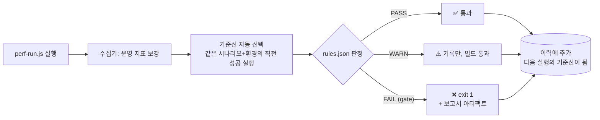

# Regression — 성능 회귀 판정

기능 회귀에 단위 테스트가 있듯, 성능 회귀에는 이력 비교가 있다.
**"어제보다 느려졌는가"에 자동으로 답하는 장치.**

## 구성

```
regression/
├── rules.json           # 회귀 판정 규칙 ← 기준 변경은 여기만 고친다
├── perf-regression.yml  # GitHub Actions 워크플로 (→ .github/workflows/로 복사)
├── thresholds.json      # (구버전) tools/compare.js 전용
├── baseline.json        # (구버전) tools/compare.js 전용 — 없어도 무방
└── README.md
```

판정 엔진은 `tools/lib/regression.js`, 전체 설계는
[`../PERFORMANCE-MANAGEMENT.md`](../PERFORMANCE-MANAGEMENT.md) §5 참고.

## 흐름



**기준선을 손으로 저장하지 않는다.** 이력에 쌓인 "같은 시나리오 + 같은 환경의 직전 성공
실행"이 자동으로 기준이 된다. 시나리오가 다르면 비교가 무의미하고(normal-day vs spike),
환경이 다르면 절대값이 안 맞으며(로컬 vs CI), threshold 미달 실행을 기준 삼으면 다음 실행이
"개선"으로 보이는 착시가 생기기 때문이다.

## 사용법

```bash
node tools/perf-run.js scenarios/normal-day.js     # 실행하면 판정까지 자동
node tools/collect.js <runId> --force --no-wait    # 판정만 다시 (규칙 수정 후)
node tools/history.js --print                      # 이력 표로 확인
```

## 판정 규칙 (`rules.json`)

```json
{
  "key": "k6.overall.p95",
  "direction": "lower_is_better",
  "warn": { "changePct": 10 },
  "fail": { "changePct": 20 },
  "absolute": { "fail": { "gt": 500 } },
  "noiseFloor": 5,
  "minBaseline": 10,
  "gate": true
}
```

| 필드 | 역할 |
|------|------|
| `key` | run 레코드에서 값을 꺼낼 경로 (`k6.overall.*` / `infra.flat.*`) |
| `direction` | `lower_is_better` \| `higher_is_better` — 어느 쪽 변화가 나쁜지 |
| `warn` / `fail` | 직전 대비 **나쁜 방향** 변화율 임계 |
| `absolute` | 기준선과 무관한 절대 상·하한 (SLO 게이트) |
| `noiseFloor` | 이 값보다 작은 절대 변화는 회귀로 안 봄 |
| `minBaseline` | 기준값이 이보다 작으면 비율 비교 생략 |
| `gate` | `true`면 CI 중단 대상, `false`면 참고용 |

### 오탐을 줄이는 네 가지 장치

| 장치 | 없으면 |
|------|--------|
| 방향성 | TPS 상승이 회귀로 잡힌다 |
| 노이즈 플로어 | 2ms→3ms(+50%)가 매번 회귀로 잡힌다 |
| 기준선 하한 | 0에 가까운 분모로 무한대 변화율이 나온다 |
| 절대 게이트 | 매번 9%씩 나빠지며 영원히 통과하는 "삶은 개구리" |

부하 테스트 수치는 본질적으로 노이즈가 있다. "직전보다 나빠졌다"를 그대로 회귀로 부르면
오탐이 쏟아지고 **결국 아무도 결과를 보지 않게 된다(경보 피로).**

### 게이트 대상 (CI를 멈추는 항목)

응답시간(P95/P99/평균) · 오류율 · TPS/RPS · Check 성공률 · MySQL slow query ·
커넥션 타임아웃 · **CPU throttling**.

나머지(힙·GC·각종 포화도)는 `gate: false`로 정보 제공만 한다.
게이트를 남발하면 빌드가 상시 빨간색이 되고, 그러면 아무도 안 본다.

## 원칙

1. **기준선은 이력에서 자동 선택** — 손으로 갈아끼우지 않는다.
2. **환경별로 기준선 분리** — CI 러너 성능은 로컬 기준 환경과 다르다.
   워크플로는 `--env ci`로 실행해 로컬 이력과 섞이지 않게 한다.
3. CI는 **큰 회귀 탐지용** (축소 시나리오 3분). 정밀 비교는 로컬 기준 환경에서.
4. 회귀 발생 시: 보고서의 병목 가설 확인 → Grafana 딥링크로 해당 구간 검증 →
   로컬 재현(풀버전 시나리오) → 원인 커밋 이등분 탐색(git bisect).
5. **개별 판정이 통과해도 `history.html`의 누적 저하 경고를 본다.**
   매 배포 3~5%씩의 누적은 개별 판정으로 절대 안 잡힌다.
