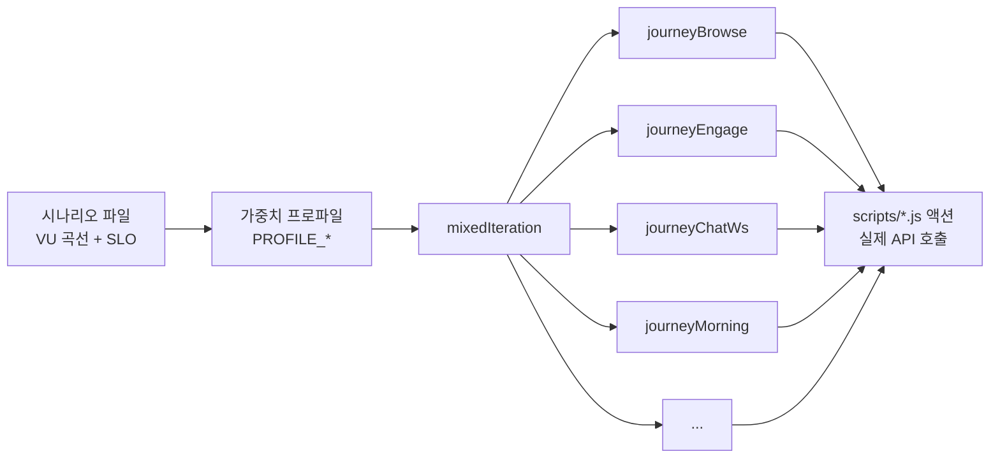
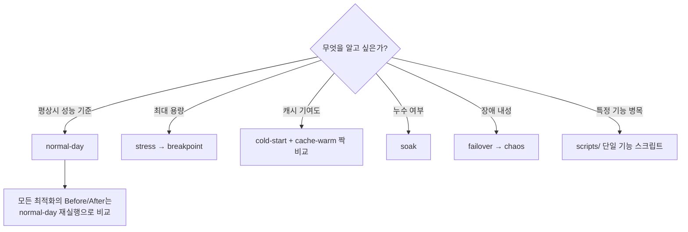

# Scenarios — 워크로드 시나리오 카탈로그

모든 시나리오는 **동일한 여정(journey) 풀**을 공유하고 **가중치 프로파일**만 바꿔서
트래픽의 성격을 정의한다. 구조는 `lib/workload.js` 참고.



> 조회·쓰기·좋아요·댓글·채팅(REST+WS)·알림·로그인·토큰 재발급이 **한 테스트 안에서
> 동시에** 발생한다. 스케줄러(조회수 flush, HOT 점수 재계산)는 서버에서 자동으로 돌므로,
> 어떤 시나리오든 "스케줄러 + 유저 트래픽" 간섭까지 포함된 측정이다.

## 실행 방법

```bash
cd performance                       # 반드시 performance/ 루트에서
k6 run scenarios/normal-day.js       # 기본 설정
k6 run scenarios/normal-day.js -e VUS=100 -e HOLD=5m -e BASE_URL=http://localhost:18080
# Prometheus로 실시간 메트릭 전송 시:
k6 run -o experimental-prometheus-rw scenarios/normal-day.js
```

## 카탈로그

| # | 시나리오 | 목적 | VU | Ramp-up | 유지 | 프로파일 | 예상 TPS | 종료 조건 |
|---|---------|------|----|---------|------|---------|----------|-----------|
| 01 | `normal-day` | 기준선(baseline) 확보 | 200 | 5m | 20m | NORMAL | 45~55 | 시간 만료 |
| 02 | `peak-hour` | 등교 피크 SLO 검증 | 500 | 3m | 15m | PEAK | 120~150 | 오류율>2% 중단 |
| 03 | `read-heavy` | 캐시 효율 기준 | 300 | 3m | 15m | READ_HEAVY | 90~110 | 시간 만료 |
| 04 | `write-heavy` | 풀 고갈/락 경합 | 200 | 3m | 15m | WRITE_HEAVY | 50~70 | 쓰기 P99>3s 중단 |
| 05 | `chat-heavy` | WS 세션/브로드캐스트 한계 | 400 | 4m | 15m | CHAT_HEAVY | 40 + 30~50msg/s | RTT P95>1s 중단 |
| 06 | `notification-heavy` | 배지 폴링 + 대량 UPDATE | 300 | 3m | 12m | NOTIF_HEAVY | 80~100 | 시간 만료 |
| 07 | `exam-week` | 검색 급증(LIKE 쿼리) | 150 | 5m | 40m | EXAM_WEEK | 35~45 | 시간 만료 |
| 08 | `registration-day` | BCrypt 로그인 폭주 | 300 | 2m | 10m | REGISTRATION | 60~80 | 로그인 P95>2s 중단 |
| 09 | `cold-start` | 캐시 미스 폭풍 | 100 | 30s | 10m | READ_HEAVY | 30~40 | 시간 만료 |
| 10 | `cache-warm` | cold-start 대조군 | 50→100 | 워밍업 5m 내장 | 10m | READ_HEAVY | 30~40 | 시간 만료 |
| 11 | `spike` | 순간 6배 폭증 + 회복 | 100→600→100 | 10s | 2m 폭증 | NORMAL | 폭증 시 200+ | 시간 만료(중단 없음) |
| 12 | `stress` | 한계점 탐색(계단식) | 100→1000 | 단계당 1m | 단계당 3m | NORMAL | 한계까지 | 오류율>10% 또는 P95>5s |
| 13 | `soak` | 누수 탐지(장시간) | 150 | 5m | 2h | NORMAL | 35~45 | 오류율>2% 중단 |
| 14 | `breakpoint` | 도달률 기반 정밀 용량 측정 | rate 10→300/s | 20m 선형 | — | NORMAL | 실측 | 오류율>15% 중단 |
| 15 | `failover` | Redis 장애 중 연속성 | 150 고정 | — | 15m | NORMAL | 35~45 | 중단 없음 |
| 16 | `chaos` | 복합 장애 주입 생존성 | 100 고정 | — | 30m | NORMAL | 25~35 | 중단 없음 |

예상 TPS는 Think Time 1~4초, 여정당 평균 4~8 요청 기준의 산술 추정치이며,
첫 실측 후 각 파일 헤더의 수치를 실측값으로 갱신한다.

## 프로파일 비율 (여정별 상대 가중치)

| 여정 | NORMAL | PEAK | READ | WRITE | CHAT | NOTIF | EXAM | REG |
|------|-------:|-----:|-----:|------:|-----:|------:|-----:|----:|
| browse (눈팅) | 40 | 25 | 62 | 15 | 10 | 20 | 45 | 15 |
| engage (좋아요/댓글) | 15 | 10 | 5 | 30 | 5 | 15 | 12 | 5 |
| write (글 작성) | 5 | 4 | 1 | 25 | 2 | 5 | 8 | 3 |
| search (검색) | 4 | 2 | 7 | 2 | 1 | 2 | 15 | 3 |
| chatRest | 8 | 10 | 5 | 5 | 25 | 5 | 3 | 3 |
| chatWs (실시간) | 5 | 8 | 2 | 5 | 40 | 5 | 2 | 2 |
| notification | 10 | 15 | 10 | 8 | 10 | 40 | 8 | 5 |
| morning (급식/시간표) | 3 | 18 | 3 | 0 | 0 | 0 | 2 | 5 |
| social (친구) | 5 | 4 | 3 | 5 | 5 | 5 | 2 | 30 |
| mypage | 3 | 2 | 2 | 3 | 2 | 3 | 3 | 4 |
| tokenRefresh | 1 | 1 | 0 | 1 | 0 | 0 | 0 | 5 |
| relogin | 1 | 1 | 0 | 1 | 0 | 0 | 0 | 20 |

## 시나리오 선택 가이드



## 페어 실험 규칙

- **cold-start vs cache-warm**: 같은 날, 같은 데이터셋, 같은 VU로 연속 실행한다.
- **failover / chaos**: 장애 주입 시각을 초 단위로 기록해 Grafana annotation과 맞춘다.
- 모든 실행 전 `datasets/` 시드 상태와 `environment/` 문서의 환경이 일치하는지 확인한다.
